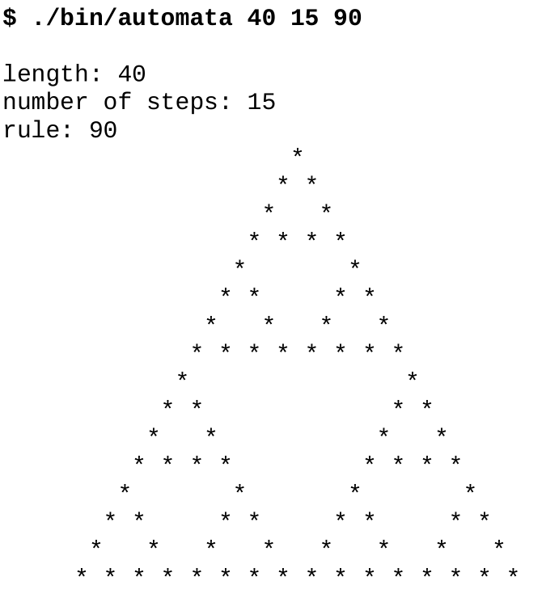

# 7.7 add_subdirectory的限定範圍

**NOTE**:*此示例代碼可以在 https://github.com/dev-cafe/cmake-cookbook/tree/v1.0/chapter-7/recipe-07 中找到，其中有一個C++示例。該示例在CMake 3.5版(或更高版本)中是有效的，並且已經在GNU/Linux、macOS和Windows上進行過測試。*

本章剩下的示例中，我們將討論構建項目的策略，並限制變量的範圍和副作用，目的是降低代碼的複雜性和簡化項目的維護。這個示例中，我們將把一個項目分割成幾個範圍有限的CMakeLists.txt文件，這些文件將使用`add_subdirectory`命令進行處理。

## 準備工作

由於我們希望展示和討論如何構造一個複雜的項目，所以需要一個比“hello world”項目更復雜的例子:

* https://en.wikipedia.org/wiki/Cellular_automaton#Elementary_cellular_automata
* http://mathworld.wolfram.com/ElementaryCellularAutomaton.html

我們的代碼將能夠計算任何256個基本細胞自動機，例如：規則90 (Wolfram代碼):



我們示例代碼項目的結構如下:

```shell
.
├── CMakeLists.txt
├── external
│    ├── CMakeLists.txt
│    ├── conversion.cpp
│    ├── conversion.hpp
│    └── README.md
├── src
│    ├── CMakeLists.txt
│    ├── evolution
│    │    ├── CMakeLists.txt
│    │    ├── evolution.cpp
│    │    └── evolution.hpp
│    ├── initial
│    │    ├── CMakeLists.txt
│    │    ├── initial.cpp
│    │    └── initial.hpp
│    ├── io
│    │    ├── CMakeLists.txt
│    │    ├── io.cpp
│    │    └── io.hpp
│    ├── main.cpp
│    └── parser
│        ├── CMakeLists.txt
│        ├── parser.cpp
│        └── parser.hpp
└── tests
    ├── catch.hpp
    ├── CMakeLists.txt
    └── test.cpp
```

我們將代碼分成許多庫來模擬真實的大中型項目，可以將源代碼組織到庫中，然後將庫鏈接到可執行文件中。

主要功能在`src/main.cpp`中:

```c++
#include "conversion.hpp"
#include "evolution.hpp"
#include "initial.hpp"
#include "io.hpp"
#include "parser.hpp"

#include <iostream>

int main(int argc, char *argv[]) {
  // parse arguments
  int length, num_steps, rule_decimal;
  std::tie(length, num_steps, rule_decimal) = parse_arguments(argc, argv);
  
  // print information about parameters
  std::cout << "length: " << length << std::endl;
  std::cout << "number of steps: " << num_steps << std::endl;
  std::cout << "rule: " << rule_decimal << std::endl;
  
  // obtain binary representation for the rule
  std::string rule_binary = binary_representation(rule_decimal);
  
  // create initial distribution
  std::vector<int> row = initial_distribution(length);
  
  // print initial configuration
  print_row(row);
  
  // the system evolves, print each step
  for (int step = 0; step < num_steps; step++) {
    row = evolve(row, rule_binary);
    print_row(row);
  }
}
```

`external/conversion.cpp`文件包含要從十進制轉換為二進制的代碼。

我們在這裡模擬這段代碼是由`src`外部的“外部”庫提供的:

```cmake
#include "conversion.hpp"
#include <bitset>
#include <string>
std::string binary_representation(const int decimal) {
	return std::bitset<8>(decimal).to_string();
}
```

`src/evolution/evolution.cpp`文件為一個時限傳播系統:

```c++
#include "evolution.hpp"

#include <string>
#include <vector>

std::vector<int> evolve(const std::vector<int> row, const std::string rule_binary) {
  std::vector<int> result;

  for (auto i = 0; i < row.size(); ++i) {
    auto left = (i == 0 ? row.size() : i) - 1;
    auto center = i;
    auto right = (i + 1) % row.size();
    auto ancestors = 4 * row[left] + 2 * row[center] + 1 * row[right];
    ancestors = 7 - ancestors;
    auto new_state = std::stoi(rule_binary.substr(ancestors, 1));
    result.push_back(new_state);
  }
  return result;
}
```

`src/initial/initial.cpp`文件，對出進行初始化:

```cmake
#include "initial.hpp"

#include <vector>

std::vector<int> initial_distribution(const int length) {

  // we start with a vector which is zeroed out
  std::vector<int> result(length, 0);
  
  // more or less in the middle we place a living cell
  result[length / 2] = 1;
  
  return result;
}
```

`src/io/io.cpp`文件包含一個函數輸出打印行:

```c++
#include "io.hpp"
#include <algorithm>
#include <iostream>
#include <vector>
void print_row(const std::vector<int> row) {
  std::for_each(row.begin(), row.end(), [](int const &value) {
  	std::cout << (value == 1 ? '*' : ' ');
  });
  std::cout << std::endl;
}
```

`src/parser/parser.cpp`文件解析命令行輸入:

```c++
#include "parser.hpp"

#include <cassert>
#include <string>
#include <tuple>

std::tuple<int, int, int> parse_arguments(int argc, char *argv[]) {
  assert(argc == 4 && "program called with wrong number of arguments");
  
  auto length = std::stoi(argv[1]);
  auto num_steps = std::stoi(argv[2]);
  auto rule_decimal = std::stoi(argv[3]);
  
  return std::make_tuple(length, num_steps, rule_decimal);
}
```

最後，`tests/test.cpp`包含兩個使用Catch2庫的單元測試:

```c++
#include "evolution.hpp"

// this tells catch to provide a main()
// only do this in one cpp file
#define CATCH_CONFIG_MAIN
#include "catch.hpp"

#include <string>
#include <vector>

TEST_CASE("Apply rule 90", "[rule-90]") {
  std::vector<int> row = {0, 1, 0, 1, 0, 1, 0, 1, 0};
  std::string rule = "01011010";
  std::vector<int> expected_result = {1, 0, 0, 0, 0, 0, 0, 0, 1};
  REQUIRE(evolve(row, rule) == expected_result);
}

TEST_CASE("Apply rule 222", "[rule-222]") {
  std::vector<int> row = {0, 0, 0, 0, 1, 0, 0, 0, 0};
  std::string rule = "11011110";
  std::vector<int> expected_result = {0, 0, 0, 1, 1, 1, 0, 0, 0};
  REQUIRE(evolve(row, rule) == expected_result);
}
```

相應的頭文件包含函數聲明。有人可能會說，對於這個小代碼示例，項目包含了太多子目錄。請注意，這只是一個項目的簡化示例，通常包含每個庫的許多源文件，理想情況下，這些文件被放在到單獨的目錄中。

## 具體實施

讓我們來詳細解釋一下CMake所需的功能:

1. `CMakeLists.txt`頂部非常類似於第1節，代碼重用與函數和宏:

   ```cmake
   cmake_minimum_required(VERSION 3.5 FATAL_ERROR)
   
   project(recipe-07 LANGUAGES CXX)
   
   set(CMAKE_CXX_STANDARD 11)
   set(CMAKE_CXX_EXTENSIONS OFF)
   set(CMAKE_CXX_STANDARD_REQUIRED ON)
   
   include(GNUInstallDirs)
   set(CMAKE_ARCHIVE_OUTPUT_DIRECTORY
   ${CMAKE_BINARY_DIR}/${CMAKE_INSTALL_LIBDIR})
   set(CMAKE_LIBRARY_OUTPUT_DIRECTORY
   ${CMAKE_BINARY_DIR}/${CMAKE_INSTALL_LIBDIR})
   set(CMAKE_RUNTIME_OUTPUT_DIRECTORY
   ${CMAKE_BINARY_DIR}/${CMAKE_INSTALL_BINDIR})
   
   # defines targets and sources
   add_subdirectory(src)
   
   # contains an "external" library we will link to
   add_subdirectory(external)
   
   # enable testing and define tests
   enable_testing()
   add_subdirectory(tests)
   ```

2. 目標和源在`src/CMakeLists.txt`中定義(轉換目標除外):

   ```cmake
   add_executable(automata main.cpp)
   
   add_subdirectory(evolution)
   add_subdirectory(initial)
   add_subdirectory(io)
   add_subdirectory(parser)
   
   target_link_libraries(automata
     PRIVATE
       conversion
       evolution
       initial
       io
       parser
     )
   ```

3. 轉換庫在`external/CMakeLists.txt`中定義:

   ```cmake
   add_library(conversion "")
   
   target_sources(conversion
     PRIVATE
       ${CMAKE_CURRENT_LIST_DIR}/conversion.cpp
     PUBLIC
       ${CMAKE_CURRENT_LIST_DIR}/conversion.hpp
     )
   
   target_include_directories(conversion
     PUBLIC
     	${CMAKE_CURRENT_LIST_DIR}
     )
   ```

4. `src/CMakeLists.txt`文件添加了更多的子目錄，這些子目錄又包含`CMakeLists.txt`文件。`src/evolution/CMakeLists.txt`包含以下內容:

   ```cmake
   add_library(evolution "")
   
   target_sources(evolution
     PRIVATE
     	evolution.cpp
     PUBLIC
     	${CMAKE_CURRENT_LIST_DIR}/evolution.hpp
     )
     
   target_include_directories(evolution
     PUBLIC
     	${CMAKE_CURRENT_LIST_DIR}
     )
   ```

5. 單元測試在`tests/CMakeLists.txt`中註冊:

   ```cmake
   add_executable(cpp_test test.cpp)
   
   target_link_libraries(cpp_test evolution)
   
   add_test(
     NAME
     	test_evolution
     COMMAND
     	$<TARGET_FILE:cpp_test>
     )
   ```

6. 配置和構建項目產生以下輸出:

   ```shell
   $ mkdir -p build
   $ cd build
   $ cmake ..
   $ cmake --build .
   
   Scanning dependencies of target conversion
   [ 7%] Building CXX object external/CMakeFiles/conversion.dir/conversion.cpp.o
   [ 14%] Linking CXX static library ../lib64/libconversion.a
   [ 14%] Built target conversion
   Scanning dependencies of target evolution
   [ 21%] Building CXX object src/evolution/CMakeFiles/evolution.dir/evolution.cpp.o
   [ 28%] Linking CXX static library ../../lib64/libevolution.a
   [ 28%] Built target evolution
   Scanning dependencies of target initial
   [ 35%] Building CXX object src/initial/CMakeFiles/initial.dir/initial.cpp.o
   [ 42%] Linking CXX static library ../../lib64/libinitial.a
   [ 42%] Built target initial
   Scanning dependencies of target io
   [ 50%] Building CXX object src/io/CMakeFiles/io.dir/io.cpp.o
   [ 57%] Linking CXX static library ../../lib64/libio.a
   [ 57%] Built target io
   Scanning dependencies of target parser
   [ 64%] Building CXX object src/parser/CMakeFiles/parser.dir/parser.cpp.o
   [ 71%] Linking CXX static library ../../lib64/libparser.a
   [ 71%] Built target parser
   Scanning dependencies of target automata
   [ 78%] Building CXX object src/CMakeFiles/automata.dir/main.cpp.o
   [ 85%] Linking CXX executable ../bin/automata
   [ 85%] Built target automata
   Scanning dependencies of target cpp_test
   [ 92%] Building CXX object tests/CMakeFiles/cpp_test.dir/test.cpp.o
   [100%] Linking CXX executable ../bin/cpp_test
   [100%] Built target cpp_test
   ```

7. 最後，運行單元測試:

   ```shell
   $ ctest
   
   Running tests...
   Start 1: test_evolution
   1/1 Test #1: test_evolution ................... Passed 0.00 sec
   100% tests passed, 0 tests failed out of 1
   ```

## 工作原理

我們可以將所有代碼放到一個源文件中。不過，每次編輯都需要重新編譯。將源文件分割成更小、更易於管理的單元是有意義的。可以將所有源代碼都編譯成一個庫或可執行文件。實際上，項目更喜歡將源代碼編譯分成更小的、定義良好的庫。這樣做既是為了本地化和簡化依賴項，也是為了簡化代碼維護。這意味著如在這裡所做的那樣，由許多庫構建一個項目是一種常見的情況。

為了討論CMake結構，我們可以從定義每個庫的單個CMakeLists.txt文件開始，自底向上進行，例如`src/evolution/CMakeLists.txt`:

```cmake
add_library(evolution "")

target_sources(evolution
  PRIVATE
  	evolution.cpp
  PUBLIC
  	${CMAKE_CURRENT_LIST_DIR}/evolution.hpp
  )
  
target_include_directories(evolution
  PUBLIC
  	${CMAKE_CURRENT_LIST_DIR}
  )
```

這些單獨的`CMakeLists.txt`文件定義了庫。本例中，我們首先使用`add_library`定義庫名，然後定義它的源和包含目錄，以及它們的目標可見性：實現文件(`evolution.cpp`:`PRIVATE`)，而接口頭文件` evolution.hpp `定義為`PUBLIC`，因為我們將在`main.cpp`和`test.cpp`中訪問它。定義儘可能接近代碼目標的好處是，對於該庫的修改，只需要變更該目錄中的文件即可；換句話說，也就是庫依賴項被封裝。

向上移動一層，庫在`src/CMakeLists.txt`中封裝:

```cmake
add_executable(automata main.cpp)

add_subdirectory(evolution)
add_subdirectory(initial)
add_subdirectory(io)
add_subdirectory(parser)

target_link_libraries(automata
  PRIVATE
    conversion
    evolution
    initial
    io
    parser
  )
```

文件在主`CMakeLists.txt`中被引用。這意味著使用`CMakeLists.txt`文件，構建我們的項目。這種方法對於許多項目來說是可用的，並且它可以擴展到更大型的項目，而不需要在目錄間的全局變量中包含源文件列表。`add_subdirectory`方法的另一個好處是它隔離了作用範圍，因為子目錄中定義的變量在父範圍中不能訪問。

## 更多信息

使用`add_subdirectory`調用樹構建項目的一個限制是，CMake不允許將`target_link_libraries`與定義在當前目錄範圍之外的目標一起使用。對於本示例來說，這不是問題。在下一個示例中，我們將演示另一種方法，我們不使用`add_subdirectory`，而是使用`module include`來組裝不同的`CMakeLists.txt`文件，它允許我們鏈接到當前目錄之外定義的目標。

CMake可以使用Graphviz圖形可視化軟件(http://www.graphviz.org )生成項目的依賴關係圖:

```shell
$ cd build
$ cmake --graphviz=example.dot ..
$ dot -T png example.dot -o example.png
```

生成的圖表將顯示不同目錄下的目標之間的依賴關係:


本書中，我們一直在構建源代碼之外的代碼，以保持源代碼樹和構建樹是分開的。這是推薦的方式，允許我們使用相同的源代碼配置不同的構建(順序的或並行的，Debug或Release)，而不需要複製源代碼，也不需要在源代碼樹中生成目標文件。使用以下代碼片段，可以保護您的項目免受內部構建的影響:

```cmake
if(${PROJECT_SOURCE_DIR} STREQUAL ${PROJECT_BINARY_DIR})
	message(FATAL_ERROR "In-source builds not allowed. Please make a new directory (called a build directory) and run CMake from there.")
endif()
```

認識到構建結構與源結構類似很有用。示例中，將`message`打印輸出插入到`src/CMakeLists.txt`中:

```cmake
message("current binary dir is ${CMAKE_CURRENT_BINARY_DIR}")
```

在`build`下構建項目時，我們將看到`build/src`的打印輸出。

在CMake的3.12版本中，`OBJECT`庫是組織大型項目的另一種可行方法。對我們的示例的惟一修改是在庫的`CMakeLists.tx`t中。源文件將被編譯成目標文件：既不存檔到靜態庫中，也不鏈接到動態庫中。例如：

```cmake
add_library(io OBJECT "")

target_sources(io
  PRIVATE
  	io.cpp
  PUBLIC
  	${CMAKE_CURRENT_LIST_DIR}/io.hpp
  )
  
target_include_directories(io
  PUBLIC
  	${CMAKE_CURRENT_LIST_DIR}
  )
```

主`CMakeLists.txt`保持不變:`automata`可執行目標將這些目標文件鏈接到最終的可執行文件。使用也有要求需求，例如：在對象庫上設置的目錄、編譯標誌和鏈接庫，將被正確地繼承。有關CMake 3.12中引入的對象庫新特性的更多細節，請參考官方文檔:  https://cmake.org/cmake/help/v3.12/manual/cmake-buildsystem.7.html#object-libraries