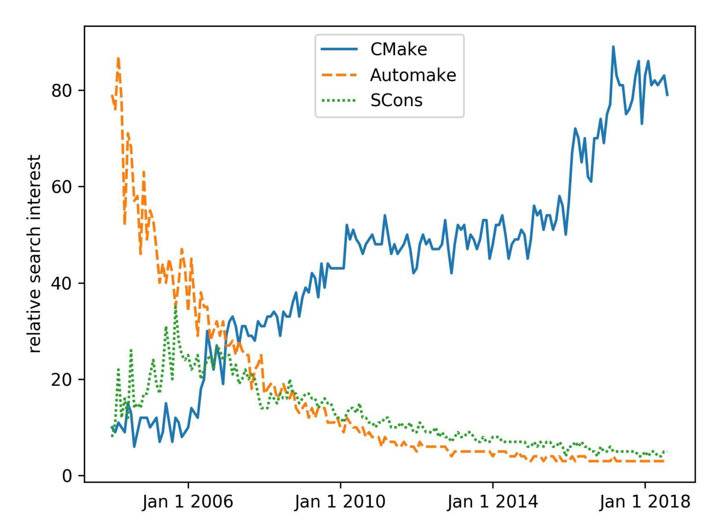
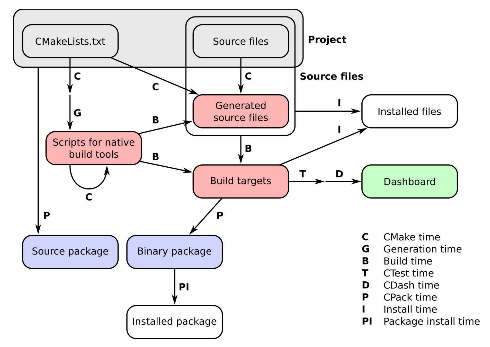

# 前言

我們日常生活的每一個方面都有計算機軟件的存在：它可以為我們觸發的鬧鐘，並每時每刻的為我們提供通信、銀行、天氣、公交、日曆、會議、旅行、相冊、電視、音樂流、社交媒體、晚餐和電影預定等服務信息。

軟件內部具有一定的層次結構：應用程序是基於框架構建，框架基於開發庫，開發庫使用更小的庫或可執行文件，當然還有更小的組件。開發庫和可執行文件通常需要使用源代碼進行構建。我們通常只看到最外層，但軟件內部需要仔細組織和構建。本書就是使用CMake，對使用源代碼構建開發庫和可執行文件的項目進行組織。

CMake及其姊妹CTest、CPack和CDash已經成為源碼構建的主要工具集，在使用和流行性方面超過了許多類似工具，例如備受推崇的GNU自動工具和最新的基於Python的[SCons](https://www.scons.org/)構建系統。




*隨著時間的推移，搜索三個流行的構建系統：CMake、Automake和SCons。對比標準是通過搜索相關術語的次數來衡量的，其中數據由谷歌提供。*

CMake項目的始於1999年，當時開發公司Kitware被委託設計一套新的工具來簡化研究人員的日常工作軟件。目標很明確：提供一組工具，可以在不同平臺上配置、構建、測試和部署項目。有關CMake項目中設計的精彩敘述，請訪問 https://www.aosabook.org/en/cmake.html 。

CMake是一個構建生成器，提供了強大的領域特定語言(DSL)來描述構建系統應該實現的功能。這是CMake的主要優勢之一，它允許使用相同的CMake腳本集生成平臺原生構建系統。CMake軟件工具集，使開發人員可以完全控制給定項目的生命週期：

* **CMake**是描述如何在所有主要硬件和操作系統上配置、構建和安裝項目，無論是構建可執行文件、庫，還是兩者都要構建。
* **CTest**定義測試、測試套件，並設置應該如何執行。
* **CPack**為打包需求提供了DSL。
* **CDash**將項目的測試結果在面板中展示。

俗話說得好：挖得越深，發現的石頭(阻礙，困難)越多。為了編寫這本書，我們仔細地對軟件層進行了深入挖掘，這也是CMake的目標。不同的平臺上構建不同的軟件組件和庫時，我們遇到的阻礙和承受的工作量有時令人畏懼，且每個組件和庫都有自己的特點。不過，我們已經清除了許多阻礙，也很高興與讀者分享我們的成果和技巧。En... 總會留下一些石頭，但每一塊石頭都會帶來新的理解，社區歡迎你分享這些理解。

## 適讀人群

編寫能夠在許多不同平臺上本地、可靠並高效地運行的軟件，對於工業和社會的所有部門都至關重要。軟件構建系統就是這項任務的中心。它們是軟件開發生命週期管理的關鍵部分：從孵化和原型開發到測試，一直到打包、部署和發佈。

CMake旨在幫助您管理這些操作：如果希望使用CMake管理構建系統的軟件開發人員，或者希望能夠理解，並能修改其他人編寫的CMake代碼，那麼這本書非常合適您。

## 覆蓋內容

本書中有一系列循序漸進的任務。每一任務中，我們都介紹了相關的CMake信息，從而展示如何實現目標，而不是用細節來折磨讀者。本書的最後，您將能夠自信地處理日益複雜的操作，並在自己的實際項目中利用書中的技巧。

我們將討論以下內容：

* 使用CMake配置、構建、測試和安裝代碼項目
* 檢測用於條件編譯的操作系統、處理器、庫、文件和程序
* 提高代碼的可移植性
* CMake幫助下，將大型代碼庫重構為模塊
* 構建多語言項目
* 知道如何調整他人編寫的CMake配置文件
* 打包項目進行發佈
* 將項目遷移為CMake構建

CMake管理的項目的工作流發生在許多階段(time)，我們稱之為*時序*。可以簡潔地總結如下圖：



* **CMake time**或**configure time**，是CMake運行時的情況。這個階段中，CMake將處理項目中的CMakeLists.txt文件並配置它。
* **Generation time**配置成功後，CMake將生成本地構建工具所需的腳本，以執行項目中的後續步驟。
* **Build time**這是在平臺和工具原生構建腳本上調用原生構建工具的時候，這些腳本以前是由CMake生成的。此時，將調用編譯器，並在特定的構建目錄中構建目標(可執行文件和庫)。注意遞歸的CMake time箭頭：這看起來令人困惑，但是我們將在本書中多次使用它，用來實現平臺無關的構建。
* **CTest time**或 **test time**，運行項目的測試套件，以檢查目標是否按預期執行。
* **CDash time**或**report time**，將測試結果上傳到面板，與其他開發人員共享。
* **Install time**，將項目的目標、源文件、可執行文件和庫從構建目錄安裝到安裝位置。
* **CPack time**或**packaging time**，將項目打包以便發佈，可以是源代碼，也可以是二進制代碼。
* **Package install time**，在系統範圍內安裝新生成的包。

本書的路線圖如下：

第1章，從簡單的可執行文件到庫，如何配置和使用CMake構建簡單的可執行文件和庫。

第2章，檢測環境，如何使用簡單的CMake命令與操作系統和處理器體系結構交互。

第3章，檢測外部庫和程序，如何簡化對項目依賴項的檢測。

第4章，創建和運行測試，解釋如何利用CMake和CTest的功能來定義和運行測試。

第5章，配置時操作和構建時操作，如何使用CMake在構建過程的不同階段執行定製化操作。

第6章，生成源碼，CMake命令可自動生成源碼。

第7章，結構化項目，用於組織您的項目，使它們更易於維護。

第8章，超級構建，解釋了CMake超級構建模式，用於管理關鍵項目的依賴關係。

第9章，混合語言項目，構建不同編程語言混合的項目。

第10章，編寫一個安裝程序，使用CMake安裝項目。

第11章，打包項目，如何使用CPack生成源文件，並將源文件打包，以及構建用於發佈的Python和Conda包。

第12章，生成文檔，如何使用CMake也生成代碼的文檔。

第13章，選擇生成器和交叉編譯，如何使用CMake交叉編譯項目。

第14章，測試面板，如何將測試結果報告到在面板上。

第15章，將項目移植到CMake中，將展示實踐示例、注意事項和一些技巧，這些將幫助您將項目移植到基於CMake的構建系統中。


## 預備知識

這是一本為程序員寫的書，我們假設您以具備一定的基本知識，並熟悉以下內容：

* 熟悉命令行方式
* 熟悉本地開發軟件的環境
* 熟悉編譯語言C++、C或Fortran，以及您使用的編譯器
* 熟悉Python


##示例源碼

您可以從 https://github.com/dev-cafe/cmake-cookbook 下載本書的示例代碼示例。有關詳細信息，請參見設置系統部分。


## 彩圖下載

我們還提供了一個PDF文件，其中包含本書中使用的屏幕截圖/圖表的彩色圖像。您可以在這裡下載: http://www.packtpub.com/sites/default/files/downloads/CMakeCookbook_ColorImages.pdf 


##使用慣例

本書中使用了許多文本約定。

CodeInText：表示文本、文件夾名稱、文件名、模塊名稱和目標名稱中的代碼命令。

代碼塊設置如下:

> cmake_minimum_required(VERSION 3.5 FATAL_ERROR)
>
> project(recipe-01 LANGUAGES CXX)
>
> add_executable(hello-world hello-world.cpp)

任何命令行輸入都是粗體的，並在命令前面包含一個$提示符來輸入:

```shell
$ mkdir -p build
$ cd build
$ cmake ..
```

為了區分命令行輸入和輸出，我們將輸出設置為非粗體：(當前譯本不支持)

```shell
$ ./hello-world
Hello World!
```

**NOTE** 重要的提示會出現該標識。

**TIPS** 提示和技巧會出現該標識。

(PS:原始標識由於在線上觀看會使內容錯位，觀看體驗下降，從而換成文字)

## 額外讀物

CMake的在線文檔非常全面，我們將在書中引用它: https://cmake.org/documentation/

編寫這本書的過程中，我們還受到了其他文章的啟發：

* Daniel Pfeifer在GitHub上的介紹:
  https://github.com/boostcon/cppnow_presentations_2017/blob/master/05-192017_friday/effective_cmake__daniel_pfeifer__cppnow_05-19-2017.pdf
* Eric Noulard編寫的CMake教程，可以在GitHub上找到: https://github.com/TheErk/CMake-tutorial
* Craig Scott的“cmake相關”博文: https://crascit.com/tag/cmake/

我們還推薦瀏覽Viktor Kirilov收集的CMake資源、腳本、模塊和示例的列表: https://github.com/onqtam/awesome-cmake

我們的書並不是唯一一本涉及CMake的書：

* 2015年，由Ken Martin和Bill Hoffman合著的《精通CMake》，Kitware Inc.出版。
*  Craig Scott的《Professional CMake》 https://crascit.com/professional-cmake/

## 聯繫方式

我們歡迎讀者的反饋。

**源代碼改進和問題**：請直接向 https://github.com/dev-cafe/cmake-cookbook 提出，並通過創建 https://github.com/dev-cafe/cmake-cookbook/issues 進行討論

**內容反饋**：電子郵件 feedback@packtpub.com ，並在郵件主題中提到書名。如果你對本書的任何方面有任何疑問，請發郵件至 questions@packtpub.com

**勘誤表**：雖然我們已經盡了一切努力確保我們的內容的準確性，但錯誤還是會有。如果您在這本書中發現了錯誤，務必告訴我們，不勝感激。可以訪問 www.packtpub.com/submit-errata ，選擇您的圖書，單擊Errata提交表單鏈接，並輸入詳細信息。

**盜版**：如果您在互聯網上發現我們作品的任何形式的非法拷貝，希望提供相應地址或網站名稱，我們將不勝感激。請通過 copyright@packtpub.com 聯繫我們，並提供該材料的鏈接。

**如果你對寫作感興趣**：如果有一個你擅長的主題，並且你對寫作或為一本書做貢獻感興趣，請訪問 authors.packtpub.com
