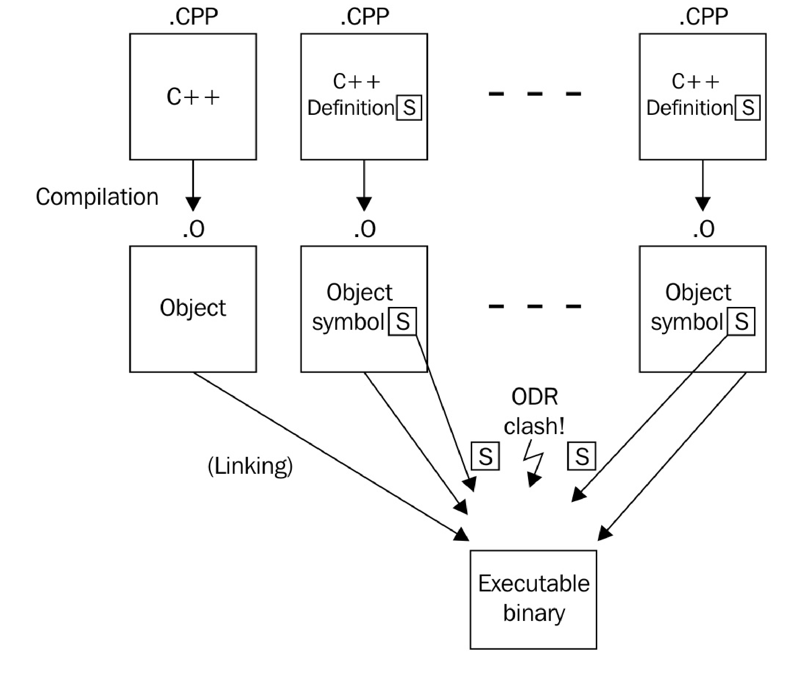

# 只有頭文件的庫中啟用內聯變量

這種庫在聲明函數時，始終是內聯的，C++17中允許聲明內聯變量。C++17之前只能使用其他變通的方法實現內聯變量，新標準的支持讓實現只有頭文件的庫更加的容易。

## How  it's done...

本節中，我們創建一個類，可以作為典型頭文件庫的成員。其目的就是給定一個靜態成員，然後使用`inline`關鍵字對其進行修飾，使得其實例在全局範圍內都能訪問到，在C++17之前這樣做是不可能的。

1. `process_monitor`類必須包含一個靜態成員，並且能全局訪問。當該單元被重複包含時，會產生符號重定義的問題。

   ```c++
   // foo_lib.hpp
   class process_monitor {
   public:
   static const std::string standard_string{
       "some static globally available string"};
   };
   process_monitor global_process_monitor;
   ```

2. 多個`.cpp`文件中包含這個頭文件時，鏈接階段會出錯。為了修復這個問題，添加了`inline`關鍵字：

   ```c++
   // foo_lib.hpp
   class process_monitor {
   public:
   static const inline std::string standard_string{
       "some static globally available string"};
   };
   inline process_monitor global_process_monitor;
   ```

 瞧，就是這樣！

## How it works...

C++程序通常都有多個C++源文件組成(其以`.cpp`或`.cc`結尾)。這些文件會單獨編譯成模塊/二進制文件(通常以`.o`結尾)。鏈接所有模塊/二進制文件形成一個單獨的可執行文件，或是動態庫/靜態庫則是編譯的最後一步。

當鏈接器發現一個特定的符號，被定義了多次時就會報錯。舉個栗子，現在我們有一個函數聲明`int foo();`，當我們在兩個模塊中定義了同一個函數，那麼哪一個才是正確的呢？鏈接器自己不能做主。這樣沒錯，但是這也可能不是開發者想看到的。

為了能提供全局可以使用的方法，通常會在頭文件中定義函數，這可以讓C++的所有模塊都調用頭文件中函數的實現(C++中，頭文件中實現的函數，編譯器會隱式的使用inline來進行修飾，從而避免符號重複定義的問題)。這樣就可以將函數的定義單獨的放入模塊中。之後，就可以安全的將這些模塊文件鏈接在一起了。這種方式也被稱為[**定義與單一定義規則**](http://zh.cppreference.com/w/cpp/language/definition)(ODR，One Definition Rule)。看了下圖或許能更好的理解這個規則：



如果這是唯一的方法，就不需要只有頭文件的庫了。只有頭文件的庫非常方便，因為只需要使用`#include`語句將對應的頭文件包含入C++源文件/頭文件中後，就可以使用這個庫了。當提供普通庫時，開發者需要編寫相應的編譯腳本，以便連接器將庫模塊鏈接在一起，形成對應的可執行文件。這種方式對於很小的庫來說是不必要的。

對於這樣例子，`inline`關鍵字就能解決不同的模塊中使用同一符號採用不同實現的方式。當連接器找到多個具有相同簽名的符號時，這些函數定義使用`inline`進行聲明，鏈接器就會選擇首先找到的那個實現，然後認為其他符號使用的是相同的定義。所有使用`inline`定義的符號都是完全相同的，對於開發者來說這應該是常識。

我們的例子中，連接器將會在每個模塊中找到`process_monitor::standard_string`符號，因為這些模塊包含了`foo_lib.hpp`。如果沒有了`inline`關鍵字，連接器將不知道選擇哪個實現，所以其會將編譯過程中斷並報錯。同樣的原理也適用於`global_process_monitor`符號。

使用`inline`聲明所有符號之後，連接器只會接受其找到的第一個符號，而將後續該符號的不同實現丟棄。

C++17之前，解決的方法是通過額外的C++模塊文件提供相應的符號，這將迫使我們的庫用戶強制在鏈接階段包含該文件。

傳統的`inline`關鍵字還有另外一種功能。其會告訴編譯器，可以通過實現直接放在調用它的地方來消除函數調用的過程。這樣的話，代碼中的函數調用會減少，這樣我們會認為程序會運行的更快。如果函數非常短，那麼生成的程序段也會很短(假設函數調用也需要若干個指令，保護現場等操作，其耗時會高於實際工作的代碼)。當內聯函數非常長，那麼二進制文件的大小就會變得很大，有時並無法讓代碼運行的更快。因此，編譯器會將`inline`關鍵字作為一個提示，可能會對內聯函數消除函數調用。當然，編譯器也會將一些函數進行內聯，儘管開發者沒有使用`inline`進行提示。

## There's more...

C++17之前的解決方法就是將對應函數聲明為靜態函數，這個函數會返回某個靜態對象的引用：

```c++
class foo{
public:
    static std::string& standard_string(){
        static std::string s{"some standard string"};
        return s;
    }    
};
```

通過這種方式，將頭文件包含在多個模塊中是完全合法的，但仍然可以訪問相同的實例。不過，對象並沒有在程序開始時立即構造，而是在第一次調用這個獲取函數時才進行構造。對於一些特定的情況來說，這也個問題。假設我們想要在程序開始時就構造靜態和全局函數，從而完成一些比較重要的事情(就和我們的例程庫一樣)，不過當程序運行後，在調用時去構造這些對象，就會帶來比較大的性能開銷。

另一個解決方法是將非模板類看做一個模板類，因此非模板類也適用於這項規則。

不過，以上的兩種策略在C++17中不太適用了，C++17已經使用新的`inline`完美解決。

