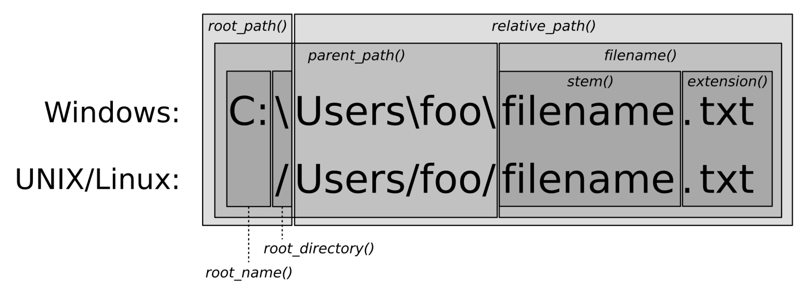

# 使用相對路徑獲取規範的文件路徑

上一節中，我們對路徑進行了標準化輸出。使用了`filesystem::path`類，並且瞭解瞭如何獲取路徑，並進行檢查，以及其他一些原理性的東西。也能幫助我們將字符串組成路徑，從而對路徑進行再次解析。

`path`已經將操作系統的一些細節為我們進行了封裝，不過我們還是需要了解一些細節。

本節我們也將瞭解到，如何將絕對路徑和相對路徑進行合併和分解。

## How to do it...

本節中，我們將圍繞著相對路徑和絕對路徑進行，從而瞭解`path`類的有時，以及其對應的輔助函數。

1. 包含必要的頭文件，並聲明所使用的命名空間：

   ```c++
   #include <iostream>
   #include <filesystem>
   
   using namespace std;
   using namespace filesystem;
   ```

2. 然後，我們實例化一個`path`對象。不過這次，路徑中的文件是否存在就沒有那麼重要了。這裡有些函數，在文件不存在的時候會拋出異常。

   ```c++
   int main()
   {
   	path p {"testdir/foobar.txt"};
   ```

3. 現在我們來瞭解一下不同的文件系統庫函數。`current_path`將返回我們執行程序的路徑，也就是工作目錄。`absolute`能接受一個相對地址，就像我們定義的`p`一樣。`system_complete`在Linux，MacOS和類UNIX操作系統上與`absolute`的功能相同。在Windows下我們將獲取一個帶有盤符(比如`c:`)的絕對地址。`canonical`與`absolute`的功能相同，不過其刪除了所有的`.`和`..`。我們可以使用如下的方式使用這些函數：

   ```c++
       cout << "current_path : " << current_path()
            << "\nabsolute_path : " << absolute(p)
            << "\nsystem_complete : " << system_complete(p)
            << "\ncanonical(p) : " << canonical(p)
            << '\n';
   ```

4. `path`另一個優勢在於，其對`/`操作符進行了重載。通過這種方式我們可以連接文件夾和文件。讓我們組合一個，然後進行打印：

   ```c++
   	cout << path{"testdir"} / "foobar.txt" << '\n';
   ```

5. 我們將`canonical`與合併的路徑一起使用。通過給定`canonical`一個相對地址，比如`"foobar.txt"`，和一個合併的絕對地址`current_path() / "testdir"`，其將會返回給我們一個絕對地址。在另一個調用中，我們給定我麼的路徑為`p`(假設為`  "testdir/foobar.txt"`)，並且通過`current_path()`獲取當前位置的絕對路徑，我們這裡就使用`"testdir" `好了。其結果與` current_path()`相同，因為間接獲得了絕對地址。在這兩次調用中，`canonical`將會返回給我們相同的絕對地址：

   ```c++
   cout << "canonical testdir : "
        << canonical("foobar.txt",
       			 current_path() / "testdir")
        << "\ncanonical testdir 2 : "
        << canonical(p, current_path() / "testdir/..")
        << '\n';
   ```

6. 我們也可以對兩個非標準化的路徑進行比較。`equivalence`能接受兩個路徑，並在內部將兩個路徑進行標準化，如果這兩個路徑相同，就會返回true，否則會返回false。這個例子中，相應的路徑必須存在，否則就會拋出一個異常：

   ```c++
       cout << "equivalence: "
            << equivalent("testdir/foobar.txt",
                          "testdir/../testdir/foobar.txt")
            << '\n';
   }
   ```

7. 編譯並運行代碼，將會得到如下的輸出。`current_path()`會返回我筆記本上的HOME目錄，因為我在這個路徑下執行的程序。相對路徑`p`會通過 `absolute_path`，`system_complete`和`canonical`預先進行準備。我們能看到`absolute_path`和`system_complete`的結果都一樣，因為我使用的是Mac系統。在使用Windows操作系統的機器上，`system_complete`將會前置一個`C:`，或者是工作路徑的磁盤盤符：

   ```c++
   $ ./canonical_filepath
   current_path: "/Users/tfc"
   absolute_path : "/Users/tfc/testdir/foobar.txt"
   system_complete : "/Users/tfc/testdir/foobar.txt"
   canonical(p): "/Users/tfc/testdir/foobar.txt"
   "testdir/foobar.txt"
   canonical testdir : "/Users/tfc/testdir/foobar.txt"
   canonical testdir 2 : "/Users/tfc/testdir/foobar.txt"
   equivalence: 1
   ```

8. 這個簡單的程序中，就不對異常進行處理了。當從`testdir`文件夾中將`foobar.txt`文件刪除時，程序將因為拋出異常的原因而終止。`canonical`函數需要路徑真實存在。還有一個`weakly_canonical`，但其不符合我們的要求。

   ```c++
   $ ./canonial_filepath
   current_path: "/Users/tfc"
   absolute_path : "/Users/tfc/testdir/foobar.txt"
   system_complete : "/Users/tfc/testdir/foobar.txt"
   terminate called after throwing an instance of
   'std::filesystem::v1::__cxx11::filesystem_error'
   what():filesystem error: cannot canonicalize:
   No such file or directory [testdir/foobar.txt] [/Users/tfc]
   ```

## How it works...

本節的目的就是如何快速的組成新的路徑。其主要還有通過`path`類重載的`/`操作符來完成。另外，文件系統函數的相對路徑和絕對路徑是一致的，並且路徑中包含`.`和`..`。

很多函數會返回一個轉換或未轉換的`path`實例。我們不會將所有函數都列在這裡，如果想要了解它們，去看下C++手冊是個不錯的選擇。

`path`類中有很多的成員函數，很值得一看。讓我們來瞭解一下，對於一個路徑來說，成員函數返回的是哪一部分。下面的圖就為我們描述了在Windows和UNIX/Linux下，對應函數所返回的路徑：



這樣我們就能很容易的瞭解到，`path`的那個函數返回的是絕對地址。相對地址中，`root_path`，`root_name` 和 `root_directory`部分都空的。`relative_path`將會返回一個相對地址。


