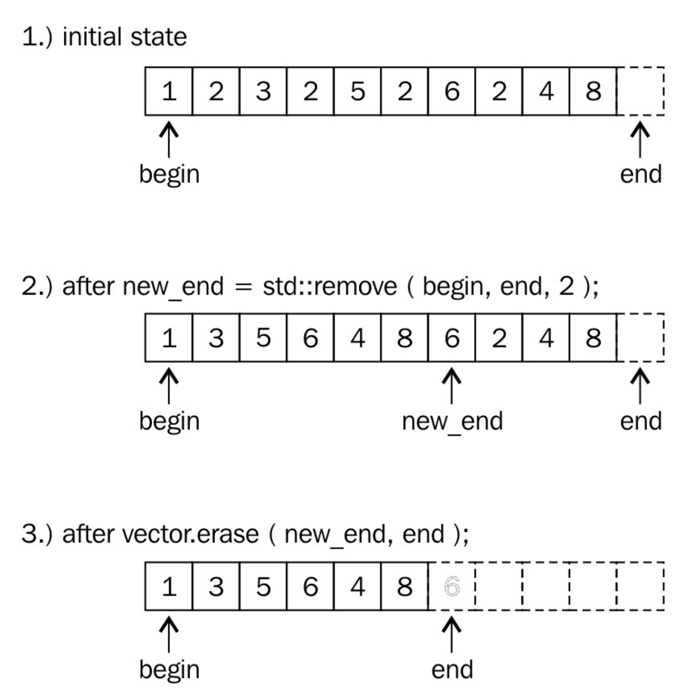

# 擦除/移除std::vector元素

由於`std::vector`能自動增長，並且使用方式簡單，很受C++開發新手的喜愛。可以通過查閱手冊，來了解這個容器該如何使用，比如刪除元素。這樣使用STL容器，只是瞭解容器的皮毛，容器應該幫助我們寫出更簡潔、維護性好和更快的代碼。

本節的全部內容都是在一個`vector`實例中刪除元素。當`vector`中部的一個元素消失了，那麼位於消失元素右邊的所有元素都要往左移(這種操作的時間複雜度為O(n)。新手們會用循環來做這件事，因為循環的確好用。不過，循環會降低代碼的優化空間。最後，比起STL的方法，循環是既不快，也不美，

 ## How to do it...

首先，我們使用整數來填充一個`std::vector`實例，之後剔除一些特定元素。我們演示的從`vector`實例中刪除元素正確的方法。

1. 包含文件是首要任務。

   ```c++
   #include <iostream>
   #include <vector>
   #include <algorithm>
   ```

2. 聲明我們所要使用的命名空間。

   ```c++
   using namespace std;
   ```

3. 現在我們來創建一個`vector`實例，並用整數填滿它。

   ```c++
   int main(){
       vector<int> v{1, 2, 3, 2, 5, 2, 6, 2, 4, 8};
   ```

4. 然後移除一些元素。需要我們移除哪些呢？2出現的太多次了，就選擇2吧。讓我們移除它們吧。

   ```c++
   	const auto new_end(remove(begin(v), end(v), 2)); 
   ```

5. 已經完成了兩步中的一步。`vector`在刪除這些元素之後，長度並沒有發生變化。那麼下一步就讓這個`vector`變得短一些。

   ```c++
   	v.erase(new_end, end(v));
   ```

6. 我們在這裡暫停一下，輸出一下當前`vector`實例中所包含的元素。

   ```c++
       for(auto i : v){
           cout << i << ", "; 
       }
       cout << '\n';
   ```

7. 現在，讓我們來移除一組指定的數據。為了完成這項工作，我們先定義了一個謂詞函數，其可接受一個數作為參數，當這個數是奇數時，返回true。

   ```c++
   	const auto odd([](int i){return i % 2 != 0;});
   ```

8. 這裡我們使用`remove_if`函數，使用上面定義的謂詞函數，來刪除特定的元素。這裡我們將上面刪除元素的步驟合二為一。

   ```c++
   	v.erase(remove_if(begin(v), end(v), odd), end(v));
   ```

9. 所有的奇數都被刪除，不過`vector`實例的容量依舊是10。最後一步中，我們將其容量修改為正確的大小。需要注意的是，這個操作會讓`vector`重新分配一段內存，以匹配相應元素長度，`vector`中已存的元素會移動到新的內存塊中。

   ```c++
   	v.shrink_to_fit();
   ```

10. 打印一下現在`vector`實例中的元素。

    ```c++
    	for (auto i : v) {
    		cout << i << ", ";
    	}
    	cout << '\n';
    }
    ```

11. 編譯完成後，運行程序，就可以了看到兩次刪除元素後`vector`實例中所存在的元素。

    ```txt
    $ ./main
    1, 3, 5, 6, 4, 8,
    6, 4, 8,
    ```

## How it works...

我們可以清楚的看到，要從一個`vector`實例中移除一個元素，首先要進行刪除，然後進行擦除，這樣才算真正的移除。這會讓人感到困惑，那就讓我們近距離觀察一下這些步驟是如何工作的。

從`vector`中移除2的代碼如下所示：

```c++
const auto new_end (remove(begin(v), end(v), 2));
v.erase(new_end, end(v));
```

`std::begin`和`std::end`函數都以一個`vector`實例作為參數，並且返回其迭代器，迭代器分別指向第一個元素和最後一個元素，就如下圖所示。



`std::remove`在刪除2的時候，會先將非2元素進行移動，然後修改end迭代器的指向。該算法將嚴格保留所有非2個值的順序。

在2步中，2的值仍然存在，並且`vector`應該變短。並且4和8在現有的`vector`中重複了。這是怎麼回事？

讓我們再來看一下所有的元素，目前`vector`的範圍並不是原來那樣了，其是從`begin`迭代器，到`new_end`迭代器。`new_end`之後的值其實就不屬於`vector`實例了。我們會注意到，在這個範圍內的數值，就是我們想要的正確結果，也就是所有的2都被移除了。

最後，也就是為什麼要調用`erase`函數：我們需要告訴`vector`實例，`new_end`到`end`之間的元素我們不需要了。我們僅需要保留`begin`到`new_end`間的元素就好了。`erase`函數會將`end`指向`new_end`。這裡需要注意的是`std::remove`會直接返回`new_end`迭代器，所以我們可以直接使用它。

> Note:
>
> `vector`在這裡不僅僅移動了內部指針。如果`vector`中元素比較複雜，那麼在移除的時候，會使用其析構函數來銷燬相應的對象。

最後，這個向量就如步驟3所示：的確變短了。那些舊的元素已經不在`vector`的訪問範圍內了，不過其仍存儲在內存中。

為了不讓`vector`浪費太多的內存，我們在最後調用了`shrink_to_fit`。該函數會為元素分配足夠的空間，將剩餘的元素移到該空間內，並且刪除之前那個比較大的內存空間。

在上面的第8步中，我們定義了一個謂詞函數，並在`std::remove_if`中使用了它。因為不論刪除函數返回怎麼樣的迭代器，在對`vector`實例使用擦除函數都是安全的。如果`vector`中全是偶數，那麼`std::remove_if`不會做任何事情，並且返回`end`迭代器。之後的調用就為`v.erase(end, end); `，同樣沒有做任何事情。

## There's more...

`std::remove`函數對其他容器同樣有效。當使用`std::array`時，其不支持`erase`操作，因為其內存空間固定，無法進行自動化處理。因為`std::remove`只是將要刪除的元素移動到容器末尾，而不是將其真正刪除，所以這個函數也可以用於不支持空間大小變化的數據類型。當然也有其他類似的方法，例如字符串中，可以用哨兵值`\0`來覆蓋原始的`end`迭代所指向的值。
