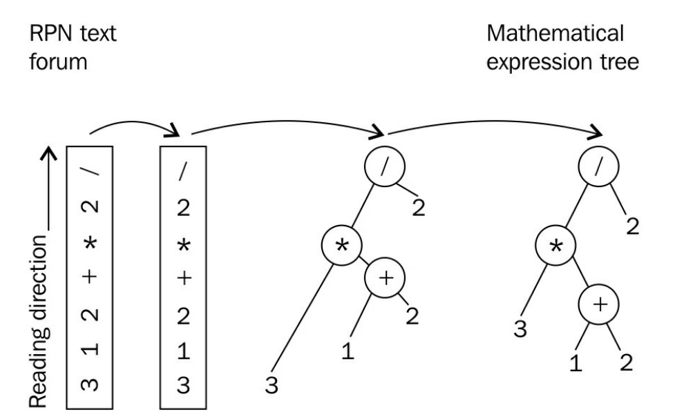

# 實現簡單的逆波蘭表示法計算器——std::stack

`std::stack`是一個適配類，其能讓用戶使用自己定義的類型作為棧中的元素。本節中，我們會使用`std::stack`構造一個逆波蘭(RPN，reverse polish notation)計算器，為了展示如何使用`std::stack`。

RPN是一種記號法，可以用一種非常簡單的解析方式來表達數學表達式。在RPN中，`1+2`解析為`1 2 +`。操作數優先，然後是操作符。另一個例子：`(1+2)*3`表示為`1 2 + 3 * `。這兩個例子已經展示了RPN可以很容易的進行解析，並且不需要小括號來定義子表達式。



## How to do it...

本節中，我們將從標準輸入中讀取一個RPN表達式，然後根據表達式解析出正確的計算順序，並得到結果。最後，我們將輸出得到的結果。

1. 包含必要的頭文件。

   ```c++
   #include <iostream>
   #include <stack>
   #include <iterator>
   #include <map>
   #include <sstream>
   #include <cassert>
   #include <vector>
   #include <stdexcept>
   #include <cmath>
   ```

2. 聲明所使用的命名空間。

   ```c++
   using namespace std;
   ```

3. 然後，就來實現我們的RPN解析器。其能接受一對迭代器，兩個迭代器分別指定了數學表達式的開始和結尾。

   ```c++
   template <typename IT>
   double evaluate_rpn(IT it, IT end)
   {
   ```

4. 在遍歷輸入時，需要記住所經過的所有操作數，直到我們看到一個操作符為止。這也就是使用棧的原因。所有數字將會被解析出來，然後以雙精度浮點類型進行保存，所以保存到棧中的數據類型為`double`。

   ```c++
   	stack<double> val_stack;
   ```

5. 為了能更方便的訪問棧中的元素，我們實現了一個輔助函數。其會修改棧中內容，彈出最頂端的元素，並返回這個元素。

   ```c++
       auto pop_stack ([&](){
           auto r (val_stack.top());
           val_stack.pop();
           return r;
       });
   ```

6. 另一項準備工作，就是定義所支持的數學操作符。我們使用`map`保存相關數學操作符的作用。每個操作符的實現我們使用Lambda函數實現。

   ```c++
       map<string, double (*)(double, double)> ops {
           {"+", [](double a, double b) { return a + b; }},
           {"-", [](double a, double b) { return a - b; }},
           {"*", [](double a, double b) { return a * b; }},
           {"/", [](double a, double b) { return a / b; }},
           {"^", [](double a, double b) { return pow(a, b); }},
           {"%", [](double a, double b) { return fmod(a, b); }},
       };
   ```

7. 現在就可以對輸入進行遍歷了。假設我們的輸入是字符串，我們使用全新的`std::stringstream`獲取每個單詞，這樣就可以將操作數解析為數字了。

   ```c++
       for (; it != end; ++it) {
       	stringstream ss {*it};
   ```

8. 我們獲得的每個操作數，都要轉換成`double`類型。如果當前解析的字符是操作數，那麼我們將轉換類型後，推入棧中。

   ```c++
           if (double val; ss >> val) {
           	val_stack.push(val);
           }
   ```

9. 如果不是操作數，那麼就必定為一個操作符。我們支持的操作符都是二元的，所以當遇到操作符時，我們需要從棧中彈出兩個操作數。

   ```c++
           else {
               const auto r {pop_stack()};
               const auto l {pop_stack()};
   ```

10. 現在我們可以從解引用迭代器`it`獲取操作數。通過查詢ops`map`表，我們可以獲得參與Lambda計算的l和r值。

    ```c++
                try {
                    const auto & op (ops.at(*it));
                    const double result {op(l, r)};
                    val_stack.push(result);
                }
    ```

11. 我們使用`try`代碼塊將計算代碼包圍，因為我們的計算可能會出錯。在調用`map`的成員函數`at`時，可能會拋出一個`out_of_range`異常，由於用戶具體會輸入什麼樣的表達式，並不是我們能控制的。所以，我們將會重新拋出一個不同的異常，我們稱之為`invalid argument`異常，並且攜帶著程序未知的操作符。

    ```c++
                catch (const out_of_range &) {
                    throw invalid_argument(*it);
                }
    ```

12. 這就是遍歷循環的全部，我們會將棧中的操作數用完，然後得到對應的結果，並將結果保存在棧頂。所以我們要返回棧頂的元素。(我們對棧的大小進行斷言，如果大小不是1，那麼就有缺失的操作符)

    ```c++
    		}
    	}
    	return val_stack.top();
    }
    ```

13. 現在我們可以使用這個RPN解析器了。為了使用這個解析器，我們需要將標準輸入包裝成一個`std::istream_iterator`迭代器對，並且傳入RPN解析器函數。最後，我們將輸出結果：

    ```c++
    int main()
    {
        try {
            cout << evaluate_rpn(istream_iterator<string>{cin}, {})
            	 << '\n';
        }
    ```

14. 這裡我們再次使用了`try`代碼塊，因為用戶輸入的表達式可能會存在錯誤，所以當解析器拋出異常時，需要在這裡獲取。我們需要獲取對應的異常，並且打印出一條錯誤信息：

    ```c++
        catch (const invalid_argument &e) {
        	cout << "Invalid operator: " << e.what() << '\n';
        }
    }	
    ```

15. 完成編譯步驟後，我們就可以使用這個解析器了。輸入`3 1 2 + * 2 /`，其為`(3*(1+2))/2`數學表達式的RPN表達式，然後我們獲得相應的結果：

    ```c++
    $ echo "3 1 2 + * 2 /" | ./rpn_calculator
    4.5
    ```

## How it works...

整個例子通過解析我們的輸入，持續向棧中壓入操作數的方式完成相應的數學計算。本例中，我們會從棧中彈出最後兩個操作數，然後使用操作符對這兩個操作數進行計算，然後將其結果保存在棧中。為了理解本節中的所有代碼，最重要的就是要理解，我們如何區分了輸入中的操作數和操作符，如何管理我們的棧，以及如何選擇正確的計算操作符。

**棧管理**

我們使用`std::stack`中的成員函數`push`將元素推入棧中：

```c++
val_stack.push(val);
```

出站元素的獲取看起來有些複雜，因為我們使用了一個Lambda表達式完成這項操作，其能夠引用`val_stack`對象。這裡我們為代碼添加了一些註釋，可能會更好理解一些：

```c++
auto pop_stack ([&](){
    auto r (val_stack.top()); // 獲取棧頂元素副本
    val_stack.pop(); // 從棧中移除頂部元素
    return r; // 返回頂部元素副本
});
```

這個Lambda表達式能夠一鍵式獲取棧頂元素，並且能刪除頂部元素。在`std::stack`的設計當中，無法使用一步完成這些操作。不過，定義一個Lambda函數也是十分快捷和簡介，所以我們可以使用這種方式獲取值：

```c++
double top_value {pop_stack()};
```

**從輸入中區別操作數和操作符**

主循環中執行`evaluate_rpn`時，我們會根據迭代器遍歷標準輸入，然後判斷字符是一個操作數，還是一個操作符。如果字符可以被解析成`double`變量，那這就是一個數，也就是操作數。我們需要考慮有些比較難以解析的數值(比如，+1和-1)，這種數值可能會被解析成操作符(尤其是+1這種)。

用於區分操作數和操作符的代碼如下所示：

```c++
stringstream ss {*it};
if (double val; ss >> val) {
	// It's a number!
} else {
	// It's something else than a number - an operation!
}
```

如果字符是一個數字，流操作符`>>`會告訴我們。首先，我們將字符串包裝成一個`std::stringstream`。然後使用`stringstream`對象的能力，將流中`std::string`類型解析並轉換成一個`double`變量。解析失敗時也能知道是為什麼，因為只解析器需要解析數字出來；否則，需要解析的就不是一個數字。

**選擇和應用正確的數學操作符**

判斷完當前用戶的輸入是否為一個數後，我們先假設輸入了一個操作符，比如`+`或`*`。然後，查詢`map`表ops，找到對應的操作，並返回相應的函數，其函數可以接受兩個操作數，然後返回對應操作後的結果。

`map`表本身的類型看起來會相對複雜：

```c++
map<string, double (*)(double, double)> ops { ... };
```

其將`string`映射到` double (*)(double, double)`。後者是什麼意思呢？這個類型是一個函數指針的聲明，說明這個函數接受兩個double類型的變量作為輸入，並且返回值也是`double`類型。可以將`(*)`部分理解成函數的名字，例如` double sum(double, double`，這樣就好理解多了吧。這裡的重點在於我們的Lambda函數`[](double, double) {return /* some double */ } `，其可轉換為實際匹配指針聲明的函數。這裡Lambda不獲取任何東西，所以可以轉化為函數指針。

這樣，我們就可以方便的在`map`表中查詢操作符是否支持：

```c++
const auto & op (ops.at(*it));
const double result {op(l, r)};
```

`map`會為我們隱式的做另一件事：當我們執行` ops.at("foo") `時，如果`"foo"`是一個合法鍵(實際中我們不會用這個名字存任何操作)，那麼在這個例子中，`map`表將會拋出一個異常，例子中可以捕獲這個異常。當我們捕獲這個異常時，我們會重新拋出一個不同的異常，為了描述我們遇到了什麼樣的錯誤。相較於`out of range`，用戶也能更好的瞭解`invalid argument`異常的含義，因此我們在使用的時候，程序的`map`表到底支持哪些操作，我們是不知道的。

## There's more...

`evaluate_rpn`函數可以傳入迭代器，感覺這樣傳遞的方式要比傳入標準輸入更加容易理解。這讓程序更容易測試，或適應來自於用戶的不同類型的輸入。

使用字符串流或字符串數組的迭代器作為輸入，例如下面的代碼，`evaluate_rpn`不用做任何修改：

```c++
int main()
{
    stringstream s {"3 2 1 + * 2 /"};
    cout << evaluate_rpn(istream_iterator<string>{s}, {}) << '\n';
    vector<string> v {"3", "2", "1", "+", "*", "2", "/"};
    cout << evaluate_rpn(begin(v), end(v)) << '\n';
}
```

> Note:
>
> 在有意義的地方使用迭代器，會使得代碼可重複利用度高，模塊化好。

