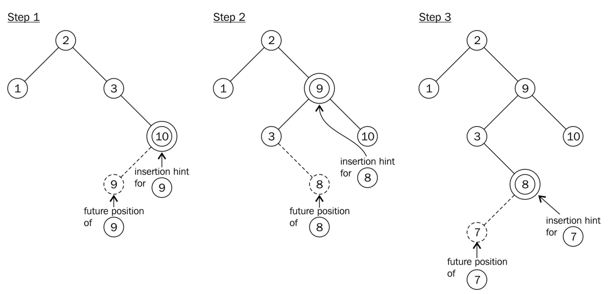

# 瞭解std::map::insert新的插入提示語義

`std::map`中查找元素的時間複雜度為O\(log\(n\)\)，與插入元素的時間複雜相同，因為要在對應位置上插入元素，那麼就先要找到這個位置。通常，插入M個新元素的時間複雜度為O\(M\*log\(n\)\)。

為了讓插入更加高效，`std::map`插入函數接受一個迭代器參數`hint`。自C++11起，該參數為指向將插入新元素到其前的位置的迭代器。如果這個迭代器給定正確，那麼插入的時間複雜度就為O\(1\)。

## How to do it...

本節會是用傳入迭代器的方式向`std::map`實例中插入多個新元素，從而減少耗時：

1. 包含必要的頭文件。

   ```c++
   #include <iostream>
   #include <map>
   #include <string>
   ```

2. 創建一個`map`實例，並填充一些內容。

   ```c++
   int main()
   {
       std::map<std::string, size_t> m { {"b", 1}, {"c", 2}, {"d", 3} };
   ```

3. 我們將插入多個元素，對於每次插入，我們都會傳入一個hint迭代器。第一次插入我們不指定其開始位置，只將插入位置指向`map`的`end`迭代器之前。

   ```c++
       auto insert_it (std::end(m));
   ```

4. 我們將以字母表的反序進行元素的插入，然後使用hint迭代器，然後使用`insert`函數的返回值重新初始化迭代器的值。下一個元素將在`hint`迭代器前插入。

   ```c++
       for (const auto &s : {"z", "y", "x", "w"}) {
           insert_it = m.insert(insert_it, {s, 1});
       }
   ```

5. 為了展示在什麼情況下`insert`函數不工作，我們將要插入最左側位置的元素插入到最右側。

   ```c++
       m.insert(std::end(m), {"a", 1});
   ```

6. 最後我們打印當前的`map`。

   ```c++
       for (const auto & [key, value] : m) {
           std::cout << "\"" << key << "\": " << value << ", ";
       }
       std::cout << '\n';
   }
   ```

7. 編譯運行程序，錯誤的插入並沒有對結果又什麼影響，`map`實例中對象的順序仍然是對的。

   ```
   "a": 1, "b": 1, "c": 2, "d": 3, "w": 1, "x": 1, "y": 1, "z": 1,
   ```

## How it works...

本例與常用的方式不同，多了一個迭代器。並且我們提到了這個迭代器的正確與否。

正確的迭代器將會指向一個已存在的元素，其值要比要插入元素的鍵大，所以新元素會插在這個迭代器之前。如果用戶提供的迭代器位置有誤，那麼插入函數會退化成未優化的版本，其時間複雜度恢復O\(log\(n\)\)。

對於第一次插入，我們選擇了`map`實例的`end`迭代器，因為沒有其他更好的選擇。在插入“z”之後，函數會返回相應的迭代器，這樣我們就知道了要插入“y”的位置。“x”也同理，後面的元素依次類推。

> Note:
>
> 在C++11之前，hint迭代器只是建議作為搜索開始位置的迭代器。

## There's more...

其中，比較有趣的事情是，在給定錯誤的迭代器，`map`實例依舊能保持其排序。那麼他是如何工作的呢？還有插入的時間複雜度為O\(1\)意味著什麼？

`std::map`通常使用二叉搜索樹實現。當在搜索樹中插入一個新鍵時，該鍵要和其他鍵進行比較，從末端到頂端。如果鍵小於或大於其他節點的鍵，搜索樹的左側或右側分支則會成為更深的節點。不過，搜索算法會阻止節點達到當前搜索樹的底端。否則會打破搜索樹的平衡，所以為了保證正確性，需要使用一個平衡算法用來管理節點。

當我們將元素插入到樹中時，這些鍵值就會成為鄰居\(就如整數1和2互鄰一樣\)。如果有`hint`傳入，那麼很容易檢查鍵是否正確。如果這種情況出現，則可以省去搜索的時間。而後，平衡算法會可能還要運行。雖然優化並不是總能成功，不過平均下來，性能上還是會有提升。可以使用多次插入的方式，來統計運行的耗時，這被稱之為[**攤銷複雜度**](http://programming.guide/amortized-time-complexity-analysis.html)。



如果插入的`hint`是錯的，那麼插入函數會放棄使用`hint`，轉而使用搜索算法進行查找。雖然程序不會出什麼問題，但這樣做會讓程序變慢。

