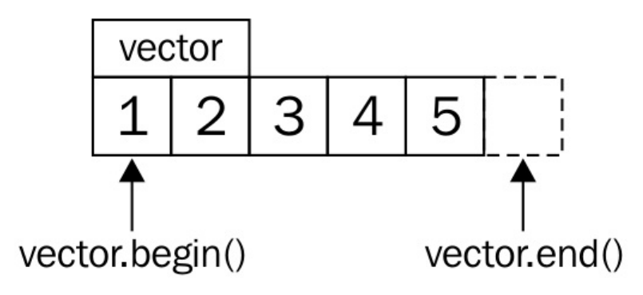
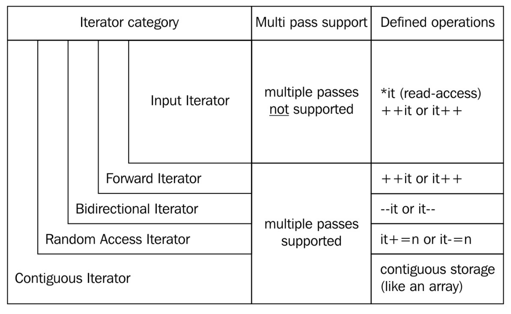

# 第3章 迭代器

迭代器是C++中非常重要的概念。STL旨在打造一組靈活和通用的工具集，迭代器是工具集中重要的一環。不過，有時候迭代器使用起來比較繁瑣，所以很多編程人員還是喜歡用C的指針來完成相應的功能。一半的編程人員基本上會放棄使用STL中的迭代器。本章介紹了迭代器，並展示如何讓它們很快的工作起來。快速地介紹是不能完全覆蓋迭代器強大的功能，但是這種小例子能讓你增加對迭代器的好感度。

大多數容器類(除了類似C風格的數組)，可包含一系列的數據項。許多日常任務會處理超大的數據量，這裡先不關心如何獲得這些數據。不過，如果我們考慮數組和鏈表，並且想要計算這兩種結構所有項的和，那麼將如下使用兩種不同的算法：

- 通過查詢數組的大小，來進行加和計算：

  ```c++
  int sum {0};
  for (size_t i {0}; i < array_size; ++i) { sum += array[i]; }
  ```

- 使用迭代器進行循環，直到數組的末尾：

  ```c++
  int sum {0};
  while (list_node != nullptr) {
  	sum += list_node->value; list_node = list_node->next;
  }
  ```

兩種方法都能計算出所有項的加和，不過我們鍵入的代碼，有多少用在實際加和任務中了呢？如果說要使用其他結構體來存儲這些數據，例如`std::map`，難道我們還要在重新實現一個函數？使用迭代器是最佳的選擇。

使用迭代器的代碼才更加的通用：

```c++
int sum {0};
for (int i : array_or_vector_or_map_or_list) { sum += i; }
```

這段代碼很簡潔，只是使用C++11添加的for循環範圍特性就完成了整體的疊加。其就像是個語法糖，將其擴展後類似如下代碼：

```c++
{
    auto && __range = array_or_vector_or_map_or_list ;
    auto __begin = std::begin(__range);
    auto __end = std::end(__range);
    for ( ; __begin != __end; ++__begin) {
        int i = *__begin;
        sum += i;
    }
}
```

這段代碼對於使用迭代器的老手來說並沒有什麼，不過對於剛接觸迭代器的新手來說就像是在變魔術。

假設我們的`vector`內容如下所示：



`std::begin(vector)`和`vector.begin()`等價，並且返回`vector`中指向第一個元素的迭代器(指向1)。`std::end(vector)`與`vector.end()`等價，並返回指向`vector`末尾元素的迭代器(指向5的後方)。

每一次迭代，循環都會檢查開始迭代器是否與末尾迭代器不同。如果是，那麼可以對開始迭代器進行解引用，並獲取其指向的值。然後，推動迭代器指向下一個元素，再與末尾迭代器進行比較，以此類推。這也能提升代碼的可讀性，這樣的迭代器就類似於C風格的指針。實際上，C風格的指針也是一種迭代器。

## 迭代器的類型

C++中很多迭代器類型，都有各自的侷限性。不用去死記這些限制，只要記住一種類型的能力是從更強大的類型繼承過來的即可。當知道算法是使用何種迭代器實現時，編譯器就可以以更好的方式優化這個算法。所以，開發者只要表達清楚自己想要實現的算法，那麼編譯器將選擇優化後的實現來完成對應的任務。

讓我們來看下這些迭代器吧(從左往右)：



### 輸入迭代器

只能用來讀取指向的值。當該迭代器自加時，之前指向的值就不可訪問。也就是說，不能使用這個迭代器在一個範圍內遍歷多次。`std::istream_iterator`就是這樣的迭代器。

### 前向迭代器

類似於輸入迭代器，不過其可以在指示範圍內迭代多次。`std::forward_list`就是這樣的迭代器。就像一個單向鏈表一樣，只能向前遍歷，不能向後遍歷，但可以反覆迭代。

### 雙向迭代器

從名字就能看出來，這個迭代器可以自增，也可以自減，迭代器可以向前或向後迭代。`std::list`，`std::set`和`std::map`都支持雙向迭代器。

### 隨機訪問迭代器

與其他迭代器不同，隨機訪問迭代器一次可以跳轉到任何容器中的元素上，而非之前的迭代器，一次只能移動一格。`std::vector`和`std::deque`的迭代器就是這種類型。

### 連續迭代器

這種迭代器具有前述幾種迭代器的所有特性，不過需要容器內容在內存上是連續的，類似一個數組或`std::vector`。

### 輸出迭代器

該迭代器與其他迭代器不同。因為這是一個單純用於寫出的迭代器，其只能增加，並且將對應內容寫入文件當中。如果要讀取這個迭代中的數據，那麼讀取到的值就是未定義的。

### 可變迭代器

如果一個迭代器既有輸出迭代器的特性，又有其他迭代器的特性，那麼這個迭代器就是可變迭代器。該迭代器可讀可寫。如果我們從一個非常量容器的實例中獲取一個迭代器，那麼這個迭代器通常都是可變迭代器。


