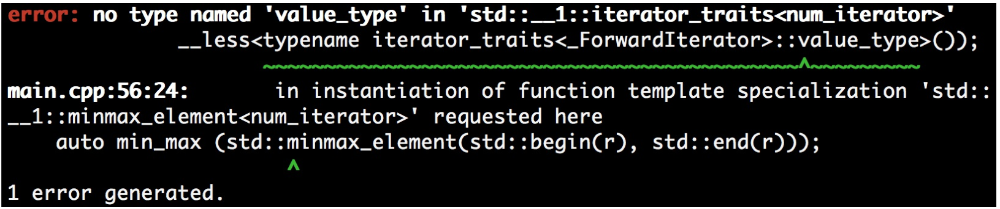

# 讓自己的迭代器與STL的迭代器兼容

上一節中，我們實現了自己的迭代器，不過為了融合STL提供的迭代器的優點，我們需要提供一些迭代器接口。後面我們會來學習如果實現這些接口，不過將我們自定義的迭代器與STL的標準迭代器放在一起時，有時會發現有編譯不通過的問題。這是為什麼呢？

STL算法嘗試尋找更多有關於我們所使用迭代器的信息。不同迭代器的能力是不同的，不大可能用同樣的算法實現不同的迭代器。例如，我們只是簡單的從一個`std::vector`將其中的數字拷貝到另一個時，我們的實現中可以直接調用`memcpy`快速實現這個功能。如果容器是`std::list`的話，`memcpy`的方式就不好用了，只能一個個的單獨拷貝。實現者將大量的自動優化思想注入STL算法實現當中。為了能更好的使用，我們也會為我們的迭代器裝備這些思想。

## How to do it...

本節中，我們將實現一個簡單的計數迭代器(與STL算法一起使用)，一開始這個實現是無法編譯通過的。我們需要做一些兼容性操作，使得程序通過編譯。

1. 包含必要的頭文件。

   ```c++ 
   #include <iostream>
   #include <algorithm>
   ```

2. 實現一個計數迭代器，作為基礎版本。當我們使用其進行遍歷時，我們只需要增加計數器即可。`num_range`用來處理`begin`和`end`迭代器。

   ```c++
   class num_iterator
   {
   	int i;
   public:
       explicit num_iterator(int position = 0) : i{position} {}
       int operator*() const { return i; }
       num_iterator& operator++() {
           ++i;
           return *this;
       }
       bool operator!=(const num_iterator &other) const {
       	return i != other.i;
       }
       bool operator==(const num_iterator &other) const {
       	return !(*this != other);
       }
   };

   class num_range {
       int a;
       int b;
   public:	
       num_range(int from, int to)
       	: a{from}, b{to}
       {}
       num_iterator begin() const { return num_iterator{a}; }
       num_iterator end() const { return num_iterator{b}; }
   };
   ```

3. 聲明所使用的命名空間。

   ```c++ 
   using namespace std;
   ```

4. 現在讓我們來遍歷100到109間的數字。這裡需要注意的是，110這裡是開區間，所以值無法遍歷到110。

   ```c++
   int main()
   {
   	num_range r {100, 110};
   ```

5. 現在，我們使用一個STL算法`std::minmax_element`。這個算法會返回一個`std::pair`，其具有兩個迭代器：一個指向最小值的迭代器和一個指向最大值的迭代器。在這個範圍中100和109即為這兩個迭代器所指向的位置。

   ```c++
       auto min_max(minmax_element(r.begin(), r.end()));
   	cout << *min_max.first << " - " << *min_max.second << '\n';
   }
   ```

6. 我們在編譯的時候遇倒如下的錯誤信息。這個錯誤與`std::iterator_traits`有關。這個錯誤可能在使用其他編譯器時，錯誤信息的格式不同，或者就沒有錯誤。這個錯誤在clang 5.0.0 (trunk 299766)版本出現。

   

7.  為了修正這個錯誤，我們需要激活迭代器的迭代功能。之後定義一個`num_iterator`結構體，我們會對`std::iterator_traits`進行特化。這個特化就是告訴STL我們的`num_iterator`是一種前向迭代器，並且指向的對象是`int`類型的值。

   ```c++
   namespace std {
   template <>
   struct iterator_traits<num_iterator> {
       using iterator_category = std::forward_iterator_tag;
       using value_type = int;
   };
   }
   ```

8. 讓我們再對程序進行編譯，之前的錯誤應該不存在了。輸出了範圍內的最大值和最小值:

   ```c++
   100 - 109
   ```

## How it works...

一些STL算法需要知道其處理容器的迭代器類型，有些還需要知道迭代器所指向的類型。這就是要有不同實現的原因。

不過，所有STL算法將會通過`std::iterator_traits<my_iterator>`訪問對應類型的迭代器(這裡假設迭代器類型為my_iterator)。這個特性類需要包含五種不同類型的成員定義：

- difference_type: `it1- it2`結果的類型
- value_type: 迭代器解引用的數據的類型(這裡需要注意void類型)
- pointer: 指向元素指針的類型
- reference: 引用元素的類型
- iterator_category: 迭代器屬於哪種類型

pointer、reference和difference_type並沒有在num_iterator中定義，因為其實際的內存值不重複(我們只是返回int值，不想數組一樣是連續的)。因此num_iterator並不需要定義這些類型，因為算法是依賴於解引用後指定內存上的值。如果我們的迭代器定義了這些類型，就可能會出現問題。

## There's more...

C++17標準之前，C++都鼓勵自定義迭代器繼承於`std::iterator<...>`，這樣所有主流的類型都會自動定義。C++17中這條建議仍然能工作，但是不再推薦從`std::iterator<...>`繼承了。

