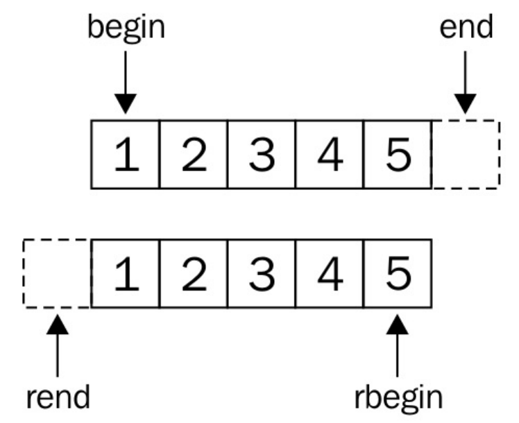

# 使用反向迭代適配器進行迭代

有時我們需要反向迭代一個範圍內的內容。基於範圍的for循環中，STL迭代通常都使用前向累加的方式進行迭代，那麼當需要反向時，就需要對其進行遞減。當然，這裡可以將迭代器進行包裝，將調用累加操作改為遞減的操作。聽起來要寫好多冗餘的代碼，來對反向迭代進行支持。

STL中提供了反向迭代適配器，其能幫助我們對迭代器進行包裝。

## How to do it...

本節中，我們將用另一種方式使用反向迭代器，只為了展示如何使用它們：

1. 包含必要的頭文件：

   ```c++
   #include <iostream>
   #include <list>
   #include <iterator>
   ```

2. 聲明所使用的命名空間：

   ```c++
   using namespace std;
   ```

3. 為了有東西可以迭代，我們實例化一個整數列表：

   ```c++
   int main()
   {
   	list<int> l {1, 2, 3, 4, 5};
   ```

4. 現在，讓我們來反向打印這些數字。為了完成反向打印，我們調用`std::list`的成員函數`rbegin`和`rend`獲得反向迭代器，並且將數字推入輸出流`ostream_iterator`適配器中:

   ```c++
       copy(l.rbegin(), l.rend(), ostream_iterator<int>{cout, ", "});
       cout << '\n';
   ```

5. 如果容器不提供`rbegin`和`rend`函數的話，就需要使用雙向迭代器來幫忙了，這裡可以使用工廠函數`std::make_reverse_iterator`創建雙向迭代器。其能接受普通迭代器，然後將其轉換為反向迭代器：

   ```c++
       copy(make_reverse_iterator(end(l)),
           make_reverse_iterator(begin(l)),
           ostream_iterator<int>{cout, ", "});
       cout << '\n';
   }
   ```

6. 編譯並運行該程序，就能得到如下的輸出：

   ```c++
   5, 4, 3, 2, 1,
   5, 4, 3, 2, 1,
   ```

## How it works...

為了將一個普通迭代器轉換為一個反向迭代器，容器至少要支持雙向迭代。這就需要雙向類別或更高級的迭代器才能滿足條件。

反向迭代器是普通迭代器的一種，並且連接口和普通迭代器都一樣，不過其累加操作會被當做遞減操作來進行。

下面就來聊一下`begin`和`end`迭代器的位置。先來看一下圖，迭代器區域裡面是一串標準的數字序列。



如果序列是從1到5，`begin`迭代器將指向元素1所在的位置，並且`end`迭代器將指向元素5後面的位置。當定義了反向迭代器，`rbegin`迭代器就指向了元素5，並且`rend`迭代器指向元素1之前的位置。可以將書反過來看，可以發現這兩個中方式是鏡像的。

當我們想讓我們自定義的容器類支持反向迭代，我們不用將所有細節一一實現；我們只需使用`std::make_reverse_iterator`工廠函數，將普通的迭代器包裝成反向迭代器即可，背後的操作STL會幫我們完成。