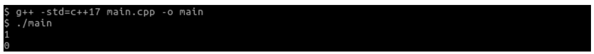
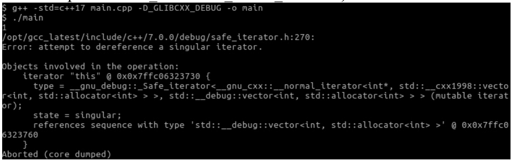
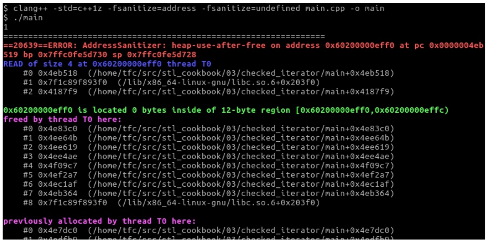

# 使用檢查過的迭代器自動化檢查迭代器代碼

迭代器很有用，能提供一般化的接口供用戶使用。不過，迭代器經常被當做指針誤用。當指針指向一個非法的內存位置時，不能進行解引用。這對迭代器也適用，不過有大量的條件來界定迭代器指向的位置是否合法。這些可以通過看一下STL文檔就能瞭解到，但是還會寫出很容易出現bug的代碼。

最好的情況是，這些問題沒有在客戶的機器上出現，而是開發者測試這些程序時就能暴露出來。不過，通常即使是解引用了懸垂指針和錯誤的迭代器，代碼也不會報錯。這種情況是最糟的，因為這種未定義行為的代碼，沒法確定會發生什麼。

幸運的是，有工具可以幫助我們。GUN STL有調試模式可選，GUN C++編譯器和LLVM clang C++編譯器都提供這樣的庫，其會為我們生成具有調試信息的二進制程序，可以讓錯誤更容易暴露出來。這種庫非常容易使用，並且特別有用，我們將在本節展示。Microsoft Visual C++標準庫還提供了更多的檢查項。

## How to do it...

本節我們將使用迭代器故意訪問一個非法位置：

1. 包含頭文件。

   ```c++
   #include <iostream>
   #include <vector>
   ```

2. 首先實例化一個整型類`vector`，並且讓指針指向值1。我們使用`shrink_to_fit()`將`vector`的容積設置為3，多分配的內存是不必要的，小一點的存儲空間會讓迭代速度更快：

   ```c++
   int main()
   {
       std::vector<int> v {1, 2, 3};
       v.shrink_to_fit();
       const auto it (std::begin(v));
   ```

3. 然後解引用迭代器，打印相應的內容：

   ```c++
   	std::cout << *it << '\n';
   ```

4. 接下來，讓我們向`vector`中增加一個新數。這樣`vector`的長度就不夠再放下另外一個數，這裡`vector`會自動增加其長度。通過分配一個新的更大的內存塊來實現長度的增加，會將所有現存的項移到新的塊，然後刪除舊的內存塊。

   ```c++
   	v.push_back(123);
   ```

5. 現在，讓我們再次通過迭代器從1開始打印`vector`。這就壞了。為什麼呢？因為在`vector`自增的過程中，會分配新的內存，刪除舊的內存，但是迭代器卻不知道這個改變。這就意味著，迭代器將會指向舊地址，並且我們不知道這樣做會怎樣。

   ```c++
   	std::cout << *it << '\n'; // bad bad bad!
   }
   ```

6.  編譯變這個程序並運行，我們不會看到任何錯誤，不過迭代器解引用所打印出來的數字看上去像是隨機數。看上去沒有問題，反而最有問題。如果不指出來，可能沒人會發現問題。

   

7. 這時調試工具就派上了用場。GUN STL支持一種預處理宏`_GLIBCXX_DEBUG`，其會激活STL中對健壯性檢查的代碼。這會讓程序變慢，不過更容易找到Bug。我們可以通過`-D_GLIBCXX_DEBUG`編譯選項來啟用這些代碼，或者在代碼的最開始加上這個宏。如你所見，其輸出相關的錯誤信息，並關閉了應用的進程。Microsoft Visual C++ 編譯器可以通過`/D_ITERATOR_DEBUG_LEVEL=1 `啟用檢查。

   

8.  LLVM/clang實現的STL也有調試標識，其目的是為了調試STL代碼，而非用戶的代碼。對於用戶的代碼的調試，我們會使用不同的選項來調試。向clang編譯器傳入`-fsanitize=address -fsanitize=undefined`，可以看看會發生什麼：

   

WOW！clang編譯器對於運行錯誤的描述非常詳細。由於信息非常的多，這裡只截取其中一部分。當然，這個選項並不是clang獨有的特性，對於GCC同樣適用。

> Note:
>
> 一些運行時的問題是因為一些庫的丟失，編譯器不會將libasan和libubsan( AddressSanitizer內存檢測工具)自動添加到程序中，需要通過包管理器或類似的工具進行安裝。

## How it works...

如我們之前所見，我們不需要通過修改任何代碼，只需要通過為編譯器添加一些編譯器特性就能容易的找到代碼中的Bug。

這些特性由調試器實現。一個調試器通常由一個編譯器模塊和一個運行時庫組成。當調試器被激活時，編譯器將會添加額外的信息到我們的代碼中，然後形成二進制可執行文件。在運行時，調試器庫由二進制文件自己去鏈接，例如：對應庫實現會代替`malloc`和`free`函數，來分析程序到底想要多少內存。

調試器可以檢測不同類型的Bug。這裡只列舉出一些常用的類型：

- **越界訪問**: 當我們訪問類似數組和`vector`類型的數據結構時，判別我們訪問的位置是否在合法範圍內。
- **釋放後使用**: 當我們釋放了堆上分配的指針後，再使用這個指針，則會出發這個Bug。
- **整數溢出**: 不同的機器上整數表達的範圍可能是不同的，所以就會出現一些值使用整型無法進行表示。對於有符號整型，算法通常會出發一個未定義的行為。
- **指針對齊**: 一些架構中，需要指針以某種形式進行對齊，否則無法訪問對應的地址。

當然，我們還能檢測到更多類型的Bug。

不過，激活所有的調試器不太可行，因為這樣會導致程序運行的非常緩慢。不過，在單元測試和集成測試中，激活調試器是一個很好的方式。

## There's more...

對於不同類型的Bug，調試器的種類也是多種多樣，並且還有很多調試器還在開發中。我們可以上網瞭解更多的信息，以便我們自己去調試程序。GCC和LLVM網站首頁就列舉了很多調試器，可以從在線文檔中瞭解其調試能力：

- https://gcc.gnu.org/onlinedocs/gcc/Instrumentation-Options.html
- http://clang.llvm.org/docs/index.html 可在目錄中尋找調試器

使用調試器對程序進行整體測試是每個開發者都應該具有的意識。不過，在大多數公司中，開發者並沒有這樣的意識，即便是我們知道所有惡意軟件和計算機病毒最重要的入口就是程序的Bug。

當時是一個開發新手時，看一下你的團隊中是否有使用調試器的可能。如果沒有，那你上班的第一天就有機會修復那些重大的Bug，並發現隱藏的Bug。

