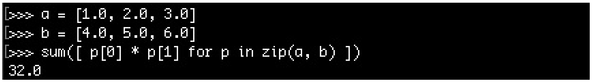

# 構建zip迭代適配器

不同的編程語言引領了不同的編程方式。不同語言有各自的受眾群體，因為表達方式的不同，所以對於優雅地定義也不同。

純函數式編程算是編程風格中一種比較特別的方式。其與C和C++命令方式編程的風格大相徑庭。雖然風格迥異，但是純函數式編程卻能在大多數情況下產生非常優雅地代碼。

這裡用向量點乘為例，使用函數式方法優雅地實現這個功能。給定兩個向量，然後讓對應位置上的兩個數字相乘，然後將所有數字加在一起。也就是`(a, b, c) * (d, e, f)`的結果為`(a * e + b * e + c * f) `。我們在C和C++也能完成這樣的操作。代碼可能類似如下的方式：

```c++
std::vector<double> a {1.0, 2.0, 3.0};
std::vector<double> b {4.0, 5.0, 6.0};
double sum {0};
for (size_t i {0}; i < a.size(); ++i) {
	sum += a[i] * b[i];
}
// sum = 32.0
```

如何使用其他語言讓這段代碼更優雅呢？

Haskell是一種純函數式語言，其使用一行代碼就能計算兩個向量的點積：


Python雖然不是純函數式編程語言，但是也會提供類似功能：



STL提供了相應的函數實現`std::inner_product`，也能在一行之內完成向量點積。不過，其他語言中在沒有相應的庫對某種操作進行支持的情況下，也能做到在一行之內完成。

不需要對兩種語言的語法進行詳細瞭解的情況下，大家都應該能看的出，兩個例子中最重要的就是zip函數。這個函數做了什麼？假設我們有兩個向量a和b，變換後將兩個向量混合在一起。例如：`[a1, a2, a3]`和`[b1, b2, b3]`，使用zip函數處理的結果為`[(a1, b1), (a2, b2), (a3, b3)]`。讓我們仔細觀察這個例子，就是將兩個向量連接在了一起。

現在，關聯的數字可以直接進行加法，然後累加在一起。在Haskell和Python的例子中我們看到，這個過程不需要任何循環或索引變量。[譯者注：Python中是有循環的……]

這裡沒法讓C++代碼如同Haskell或Python那樣優雅和通用，不過本節的內容就是為了實現一個類似的迭代器——zip迭代器——然後使用這個迭代器。向量點積有特定的庫支持，至於是哪些庫，以及這些庫如何使用，並不在本書的描述範圍內。不過，本節的內容將嘗試展示一種基於迭代器的方式，來幫助你使用通用的模塊另外完成編程。

## How to do it...

本節中，我們會實現一個類似Haskell和Python中的zip函數。為了不對迭代器的機制產生影響，`vector`中的變量這裡寫死為`double`：

1. 包含頭文件

   ```c++
   #include <iostream>
   #include <vector>
   #include <numeric>
   ```

2. 定義`zip_iterator`類。同時也要實現一個範圍類`zip_iterator`，這樣我們在每次迭代時就能獲得兩個值。這也意味著我們同時遍歷兩個迭代器：

   ```c++
   class zip_iterator {
   ```

3. zip迭代器的容器中需要保存兩個迭代器：

   ```c++
   	using it_type = std::vector<double>::iterator;

   	it_type it1;
   	it_type it2;
   ```

4. 構造函數會將傳入的兩個容器的迭代器進行保存，以便進行迭代：

   ```c++
   public:
       zip_iterator(it_type iterator1, it_type iterator2)
       	: it1{iterator1}, it2{iterator2}
       {}
   ```

5. 增加zip迭代器就意味著增加兩個成員迭代器：

   ```c++
       zip_iterator& operator++() {
           ++it1;
           ++it2;
           return *this;
       }
   ```

6. 如果zip中的兩個迭代器來自不同的容器，那麼他們一定不相等。通常，這裡會用邏輯或(||)替換邏輯與(&&)，但是這裡我們需要考慮兩個容器長度不一樣的情況。這樣的話，我們需要在比較的時候同時匹配兩個容器。這樣，我們就能遍歷完其中一個容器時，及時停下循環：

   ```c++
   	bool operator!=(const zip_iterator& o) const {
       	return it1 != o.it1 && it2 != o.it2;
       }
   ```

7. 邏輯等操作符可以使用邏輯不等的操作符的實現，是需要將結果取反即可：

   ```c++
       bool operator==(const zip_iterator& o) const {
       	return !operator!=(o);
       }
   ```

8. 解引用操作符用來訪問兩個迭代器指向的值：

   ```c++
       std::pair<double, double> operator*() const {
       	return {*it1, *it2};
       }
   };
   ```

9. 迭代器算是實現完了。我們需要讓迭代器兼容STL算法，所以我們對標準模板進行了特化。這裡講迭代器定義為一個前向迭代器，並且解引用後返回的是一對`double`值。雖然，本節我們沒有使用`difference_type`，但是對於不同編譯器實現的STL可能就需要這個類型：

   ```c++
   namespace std {
   template <>
   struct iterator_traits<zip_iterator> {
       using iterator_category = std::forward_iterator_tag;
       using value_type = std::pair<double, double>;
       using difference_type = long int;
   };
   }
   ```

10. 現在來定義範圍類，其`begin`和`end`函數返回`zip`迭代器：

    ```c++
    class zipper {
        using vec_type = std::vector<double>;
        vec_type &vec1;
        vec_type &vec2; 
    ```

11. 這裡需要從zip迭代器中解引用兩個容器中的值：

    ```c++
    public:
        zipper(vec_type &va, vec_type &vb)
        	: vec1{va}, vec2{vb}
        {}
    ```

12. `begin`和`end`函數將返回指向兩容器開始的位置和結束位置的迭代器對：

    ```c++
        zip_iterator begin() const {
        	return {std::begin(vec1), std::begin(vec2)};
        }
        zip_iterator end() const {
       		return {std::end(vec1), std::end(vec2)};
        }
    };
    ```

13. 如Haskell和Python的例子一樣，我們定義了兩個`double`為內置類型的`vector`。這裡我們也聲明瞭所使用的命名空間。

    ```c++
    int main()
    {
        using namespace std;
        vector<double> a {1.0, 2.0, 3.0};
        vector<double> b {4.0, 5.0, 6.0};
    ```

14. 可以直接使用兩個`vector`對`zipper`類進行構造：

    ```c++
    	zipper zipped {a, b};
    ```

15. 我們將使用`std::accumulate`將所有值累加在一起。這裡我們不能直接對`std::pair<double, double>`實例的結果進行累加，因為這裡沒有定義`sum`變量。因此，我們需要定義一個輔助Lambda函數來對這個組對進行操作，將兩個數相乘，然後進行累加。Lambda函數指針可以作為`std::accumulate`的一個參數傳入：

    ```c++
        const auto add_product ([](double sum, const auto &p) {
        	return sum + p.first * p.second;
        });
    ```

16. 現在，讓我們來調用`std::accumulate`將所有點積的值累加起來：

    ```c++
        const auto dot_product (accumulate(
        	begin(zipped), end(zipped), 0.0, add_product));
    ```

17. 最後，讓我們來打印結果：

    ```c++
    	cout << dot_product << '\n';
    }
    ```

18. 編譯運行後，得到正確的結果：

    ```c++
    32
    ```

## There's more...

OK，這裡使用了語法糖來完成了大量的工作，不過這和Haskell的例子也相差很遠，還不夠優雅。我們的設計中有個很大的缺陷，那就是隻能處理`double`類型的數據。通過模板代碼和特化類，`zipper`類會變得更通用。這樣，我們就能將`list`和`vector`或`deque`和`map`這樣不相關的容器合併起來。

為了讓設計的類更加通用，其中設計的過程是不容忽視的。幸運的是，這樣的庫已經存在。Boost作為STL庫的先鋒，已經支持了`zip_iterator`。這個迭代器非常簡單、通用。

順便提一下，如果你想看到了使用C++實現的更優雅的點積，並且不關心`zip`迭代器相關的內容，那麼你可以瞭解一下`std::valarray`。例子如下，自己看下：

```c++
#include <iostream>
#include <valarray>
int main()
{
    std::valarray<double> a {1.0, 2.0, 3.0};
    std::valarray<double> b {4.0, 5.0, 6.0};
    std::cout << (a * b).sum() << '\n';
}
```

**範圍庫**

這是C++中非常有趣的一個庫，其支持`zipper`和所有迭代適配器、濾波器等等。其受到Boost範圍庫的啟發，並且某段時間內裡，很有可能進入C++17標準。不幸的是，我們只能在下個標準中期待這個特性的加入。這種性能可以帶來更多的便利，能讓我們想表達的東西通過C++快速實現，並可以通過將通用和簡單的模塊進行組合，來表現比較複雜的表達式。

在文檔中對其描述中，有個非常簡單的例子：

1. 計算從1到10數值的平方：

   ```c++
   const int sum = accumulate(view::ints(1)
                           | view::transform([](int i){return i*i;})
                           | view::take(10), 0); 
   ```

2. 從數值`vector`中過濾出非偶數數字，並且將剩下的數字轉換成字符串：

   ```c++
   std::vector<int> v {1,2,3,4,5,6,7,8,9,10};

   auto rng = v | view::remove_if([](int i){return i % 2 == 1;})
   		    | view::transform([](int i){return std::to_string(i);});
   // rng == {"2"s,"4"s,"6"s,"8"s,"10"s};
   ```

如果你等不及想要了解這些有趣的特性，可以看一下範圍類的文檔，https://ericniebler.github.io/range-v3 。

