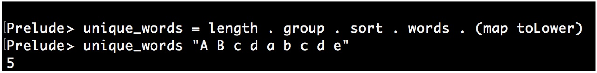

# 並置函數

其實很多函數沒有必要完全自定義的去實現。讓我們先來看一個使用Haskell實現的在文本中查找單一單詞的例子。第一行定義了一個`unique_words`函數，在第二行中傳入一個字符串：



Wow，就是這麼簡單！這裡不對Haskell的語法做過多的解釋，讓我們來看一下代碼。其定義了一個`unique_words`的函數，該函數對其傳入的參數進行了一系列的處理。首先，使用`map toLower`將所有字符都小寫化。然後，將句子用逗號進行分割，比如`"foo bar baz"`就會已變成`["foo", "bar","baz"]`。接下來，將單詞列表進行排序。這樣，`["a", "b", "a"] `就會變為` ["a", "a", "b"]`。現在，使用`group`函數，其會將相同的詞組放到一個列表中，也就是` ["a", "a", "b"]`成為`[ ["a", "a"], ["b"] ]`。現在就差不多快完事了，接下來就讓我們數一下列表中一共有多少個組，這個工作由`length`函數完成。

多麼完美的編程方式呀！我們可以從右往左看，來瞭解這段代碼是如何工作的。這裡我就不需要關心每個細節是如何進行實現(除非其性能很差，或者有Bug)。

我們不是來讚美Haskell的，而是來提升我們自己C++技能的，這樣的方式在C++中同樣奏效。本節的例子會展示如何使用Lambda表達式來模仿並置函數。

## How to do it...

本節中定義了一些函數對象，並將它們串聯起來，也就是將一個函數的輸出作為另一個函數的輸入，以此類推。為了很好的展示這個例子，我們編寫了一些串聯輔助函數：

1. 包含必要的頭文件

   ```c++
   #include <iostream>
   #include <functional>
   ```

2. 然後，我們實現一個輔助函數`concat`，其可以去任意多的參數。這些參數都是函數，比如f，g和h。並且一個函數的結果是另一個函數的輸入，可以寫成`f(g(h(...)))`:

   ```c++
   template <typename T, typename ...Ts>
   auto concat(T t, Ts ...ts)
   {
   ```

3. 現在，代碼就會變有些複雜了。當用戶提供函數f，g和h時，我們現將其轉換為`f( concat(g,h))`，然後再是`f(g(concat(h)))`，類似這樣進行遞歸，直到得到`f(g(h(...)))`為止。用戶提供的這些函數都可以由Lambda表達式進行捕獲，並且Lambda表達式將在之後獲得相應的參數p，然後前向執行這些函數`f(g(h(p)))`。這個Lambda表達式就是我們要返回的。`if constexpr`結構會檢查在遞歸步驟中，當前函數是否串聯了多個函數：

   ```c++
       if constexpr (sizeof...(ts) > 0) {
           return [=](auto ...parameters) {
           	return t(concat(ts...)(parameters...));
           };
       }
   ```

4. 當我們到達遞歸的末尾，編譯器會選擇`if constexpr`的另一分支。這個例子中，我們只是返回函數`t`，因為其傳入的只有參數了：

   ```c++
       else {
      		return t;
       }
   } 
   ```

5. 現在，讓我們使用剛創建的函數連接器對函數進行串聯。我們先在主函數的起始位置定義兩個簡單的函數對象：

   ```c++
   int main()
   {
       auto twice ([] (int i) { return i * 2; });
       auto thrice ([] (int i) { return i * 3; });
   ```

6. 現在，來串聯他們。這裡我們將兩個乘法器函數和一個STL函數` std::plus<int>`放在一起，STL的這個函數可以接受兩個參數，並返回其加和。這樣我們就得到了函數`  twice(thrice(plus( a, b )))`:

   ```c++
       auto combined (
       	concat(twice, thrice, std::plus<int>{})
       );
   ```

7. 我們來應用一下。`combined`函數現在看起來和一般函數一樣，並且編譯器會將這些函數連接在一起，且不產生任何不必要的開銷：

   ```c++
   	std::cout << combined(2, 3) << '\n';
   }
   ```

8. 編譯運行這個例子就會得到如下的結果，和我們的期望一致，因為`2 * 3 * (2 + 3)`為30：

   ```c++
   $ ./concatenation
   30
   ```

## How it works...

`concat`函數是本節的重點。其函數體看起來非常的複雜，因為其要對另一個Lambda表達式傳過來`ts`參數包進行解析，`concat`會遞歸多次調用自己，每次調用參數都會減少：

```c++
template <typename T, typename ...Ts>
auto concat(T t, Ts ...ts)
{
    if constexpr (sizeof...(ts) > 0) {
        return [=](auto ...parameters) {
        	return t(concat(ts...)(parameters...));
        };
    } else {
        return [=](auto ...parameters) {
        	return t(parameters...);
        };
    }
}
```

讓我們寫一個簡單點的版本，這次串聯了三個函數：

```c++
template <typename F, typename G, typename H>
auto concat(F f, G g, H h)
{
    return [=](auto ... params) {
    	return f( g( h( params... ) ) );
    };
}
```

這個例子看起來應該很簡單了吧。返回的Lambda表達式可以對f，g和h函數進行捕獲。這個Lambda表達式可以接受任意多的參數傳入，然後在調用f，g和h函數。我們先定義` auto combined (concat(f, g, h))`，並在之後傳入兩個參數，例如`combined(2, 3)`，這裡的2和3就為`concat`函數的參數包。

看起來很複雜，但`concat`卻很通用，有別與` f(g(h( params... )))`式的串聯。我們完成的是`f(concat(g, h))(params...)`的串聯，` f(g(concat(h)))(params...)`為其下一次遞歸調用的結果，最終會的結果為`f(g(h( params...)))`。

