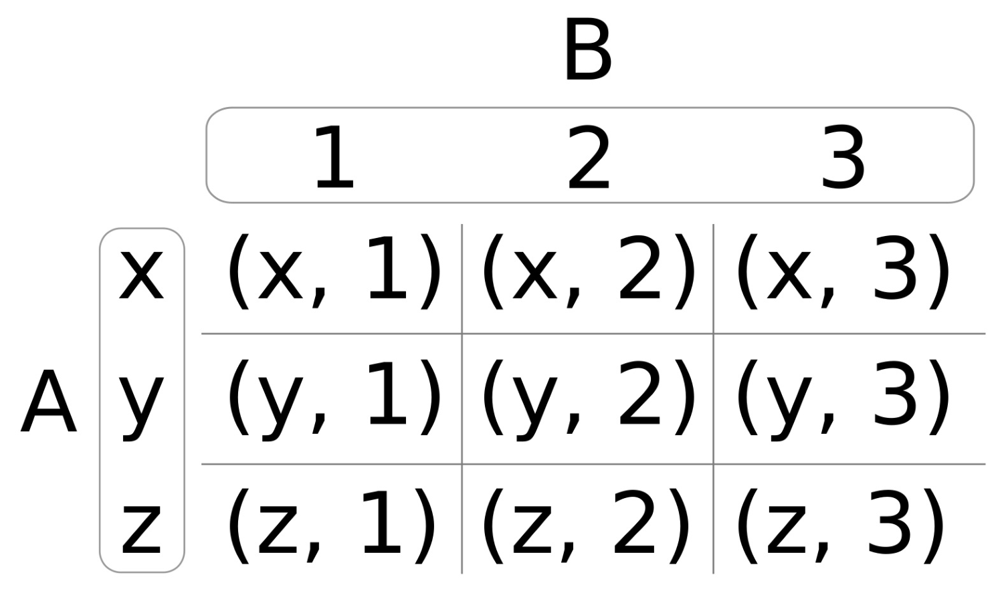

# 編譯時生成笛卡爾乘積

Lambda表達式結合參數包一起使用，可以用來解決比較複雜的問題。本節中，我們將實現一個函數對象，其能接受任意多的輸入參數，然後生成相應的**笛卡爾乘積**。

笛卡爾乘積是一個數學運算。其可以表示為`A x B`，其意思為使用集合A和集合B來結算笛卡爾乘積。結果為另一個單獨的集合，其包含集合A和集合B一一對應的組對。這個運算的意義在於，將兩個集合中的元素進行匹配。下圖就描述了這種運算操作：



圖中，`A = (x, y, z)`，`B = (1, 2, 3)`，所產生的笛卡爾乘積為`(x, 1)` , ` (x, 2)` ,`  (x, 3) `,`  (y, 1)` ,`  (y, 2)`等等。如果A和B為同一個集合，比如說是`(1, 2)`，那麼其笛卡爾乘積為`(1, 1)` , ` (1, 2)` ,` (2, 1) `, 和` (2, 2)`。有時候，這樣的操作卻十分冗餘，比如集合`(1, 1)`，或是剛才例子中的`(1, 2)`和`(2, 1)`。笛卡爾乘積可以通過一個簡單的條件，對結果進行過濾。

## How to do it...

我們實現了一個函數對形象，其能接受一個函數`f`，以及一組參數。該函數對象將會通過輸出參數集合創建笛卡爾乘積，將冗餘的部分進行過濾，並對每個乘積調用函數`f`。

1. 包含打印輸出的頭文件。

   ```c++
   #include <iostream>
   ```

2. 然後，我們定義一個簡單的輔助函數，用來對組對中的值進行打印：

   ```c++
   static void print(int x, int y)
   {
   	std::cout << "(" << x << ", " << y << ")\n";
   }
   
   int main()
   {
   ```

3. 複雜的地方到了。我們先實現了一個輔助函數`cartesian`，我們將在下一步實現這個函數。這個函數能接受一個參數`f`，在我們使用過程中，這個`f`函數就是`print`函數。另一些參數是`x`和參數包`rest`。其包含了計算笛卡爾乘積的元素。在`f(x, rest)`表達式中：當`x=1`和`rest=2, 3, 4`，為了得到結果，我們需要調用三次:`f(1, 2); f(1, 3); f(1, 4);`。`(x < rest)`的條件，會刪除冗餘的組對。我們來看下代碼：

   ```c++
       constexpr auto call_cart (
           [=](auto f, auto x, auto ...rest) constexpr {
               (void)std::initializer_list<int>{
                   (((x < rest)
                       ? (void)f(x, rest)
                       : (void)0)
                   ,0)...
               };
           });
   ```

4.  `cartesian`函數在本節中，算是最複雜的部分了。其能接受一個參數包`xs`，並返回一個其捕獲的函數對象。返回的函數對象能接受一個函數對象`f`。參數包，比如`xs = 1, 2, 3`，其內部Lambda表達式將會生成如下調用：call_cart(f, **1**, 1, 2, 3); call_cart(f, **2**, 1, 2, 3); call_cart(f, **3**, 1, 2, 3);。通過對這些函數的調用，我們能得到我們想要的所有笛卡爾乘積。我們使用`...`對`xs`參數包擴展了兩次，第一次看起來有些奇怪。調用`call_cart`時，我們第一次對`xs`進行了擴展。第二次擴展將會使得`call_cart`調用多次，並且每次的第二個參數都會不同。

   ```c++
       constexpr auto cartesian ([=](auto ...xs) constexpr {
           return [=] (auto f) constexpr {
               (void)std::initializer_list<int>{
               	((void)call_cart(f, xs, xs...), 0)...
               };
           };
       });
   ```

5. 那麼，現在讓我們使用數字集` 1, 2, 3`來生成笛卡爾乘積，並對組對進行打印。過濾了冗餘的組對，所剩的結果應該為 `(1, 2)` , ` (2, 3)` , 和 `(1, 3)`。我們對很多的結果進行了過濾，並且不考慮結果中組對中的數字順序。這也就是說，我們不需要`(1, 1)`，並且認為`(1, 2)`和`(2, 1)`為同一個組對。首先，我們讓`cartesian`函數產生一個函數對象，其會包含所有可能的組對，並且能夠接受我們的打印函數。然後，我們將所產生的組對，使用打印函數進行打印輸出。我們將`print_cart`變量聲明為`constexpr`，這樣我們就能在編譯時獲得所有的乘積結果:

   ```c++
       constexpr auto print_cart (cartesian(1, 2, 3));
   
       print_cart(print);
   }
   ```

6. 編譯並運行程序，我們就會得到如下的輸出。通過`call_cart`中的`x < rest`判斷條件，我們可以將一些冗餘組對結果進行刪除：

   ```c++
   $ ./cartesian_product
   (1, 2)
   (1, 3)
   (2, 3)
   ```

## How it works...

另一個看起來比較複雜的地方就是Lambda表達式了。但當我們充分的瞭解後，我們就不會再對Lambda表達式有任何的困惑了！

那麼，讓我們來仔細的瞭解一下吧。我們將所發生的事情，畫了一張圖來說明：


這裡有3步：

1. 我們將`1, 2, 3`作為新集合中的三個元素，其報了三個新的集合。第一個則是集合中的每一個單獨向，而第二部分則是整個集合本身。
2. 我們可以將第一個元素與每一個元素相組合(包括自己)，就能得到很多組對。
3. 對於三個結果組對來說，我們只需要將其中不冗餘的部分取出就好。

好了，回到我們例子：

```c++
constexpr auto cartesian ([=](auto ...xs) constexpr {
    return [=](auto f) constexpr {
        (void)std::initializer_list<int>{
        	((void)call_cart(f, xs, xs...), 0)...
        };
    };
});	
```

內部表達式` call_cart(xs, xs...) `將會對集合`1, 2, 3`分別進行表示，比如：`1, [1, 2, 3]`。整個表達式`((void)call_cart(f, xs, xs...), 0)...`其將`...`放在外部，其會將集合進行拆解，我們將會得到`2，[1, 2, 3]`和`3, [1, 2, 3]`。

`call_cart`完成了第2和第3步：

```c++
auto call_cart ([](auto f, auto x, auto ...rest) constexpr {
    (void)std::initializer_list<int>{
        (((x < rest)
            ? (void)f(x, rest)
            : (void)0)
        ,0)...
    };
});
```

參數`x`始終包含從這個集合中挑出的但選值，並且`rest`包含了整個集合。讓我麼先忽略`x < rest`這個條件。這裡，`f(x, rest)`表達式與`...`參數包展開所得到的調用`f(1, 1)`，`f(1, 2)`等等，其就會生成將被打印的組對。這就是第2步完成的事。

第3步中，就是用`x < rest`條件來過濾冗餘的組對了。

我們先給所有Lambda表達式和持有變量聲明成`constexpr`。通過這樣做，我們可以在運行時對代碼進行評估，這樣編譯出的二進制文件將會包含所有組對，而無需在運行時對其進行計算。需要注意的是，這裡需要傳入常量函數的參數為已知量，這樣才能在運行時讓編譯器知道，並對函數進行執行。