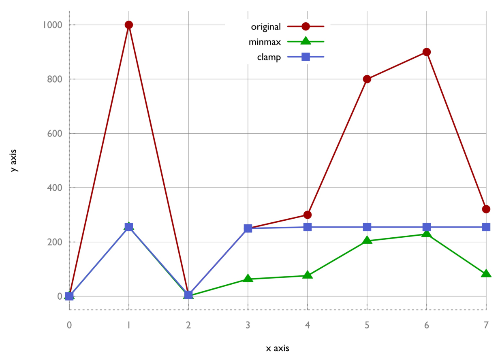

# 將vector中的值控制在特定數值範圍內——std::clamp

很多應用中，需要獲得相應的數據。在對其進行繪製或進行其他處理前，會先對這些數據進行歸一化，因為這些數據的差距很大。

通常可以使用`std::transform`通過傳入一個謂詞函數，對數據結構中的所有數據進行處理。不過，當不知道這些值有多大時或多小時，需要通過相應的函數找到數值的範圍。

STL就包含這樣的函數，比如`std::minmax_element`和`std::clamp`。將這些函數與Lambda函數相結合，可以解決一些簡單的任務。

## How to do it...

本節，將`vector`中的值使用兩種不同的方式進行歸一化，一種使用`std::minmax_element`，另一種使用`std::clamp`：

1. 包含必要的頭文件，並聲明所使用的命名空間。

   ```c++
   #include <iostream>
   #include <vector>
   #include <algorithm>
   #include <iterator>

   using namespace std;
   ```

2. 將實現一個獲得最大值和最小值的函數。這裡最大值和最小值會更新，以便我們進行處理。函數對象會獲取最大最小值，並返回另一個函數對象，這個返回的函數對象會做一些實際的轉換。為了簡單起見，新的最小值為0，所以舊值不需要進行偏移，並且值的歸一化都是相對於0。為了有更好的可讀性，這裡忽略了最大值和最小值可能是一個值的可能性，不過在實際程序中需要格外注意這點，否則就會遇到除零問題：

   ```c++
   static auto norm (int min, int max, int new_max)
   {
       const double diff (max - min);
       return [=] (int val) {
       	return int((val - min) / diff * new_max);
       };
   }
   ```

3. 另一個函數對象構造器成為`clampval`，其會返回一個函數對象用於捕獲最小值和最大值，並調用`std::clamp`將值控制在一定範圍內：

   ```c++
   static auto clampval (int min, int max)
   {
       return [=] (int val) -> int {
       	return clamp(val, min, max);
       };
   }
   ```

4. `vector`中需要歸一化的值大小不一。這些數據可能是熱度數據、海拔高度或股票金額：

   ```c++
   int main()
   {
   	vector<int> v {0, 1000, 5, 250, 300, 800, 900, 321};
   ```

5. 為對這些值進行歸一化，我們需要找到這個`vector`中的最大值和最小值。`std::minmax_element`函數將幫助我們獲得這兩個值。其會返回一組迭代器來代表這兩個值：

   ```c++
   	const auto [min_it, max_it] (
   		minmax_element(begin(v), end(v)));
   ```

6. 我們會將所有值從第一個`vector`拷貝到另一箇中。讓我們實例化第二個`vector`，並且讓其接收第一個`vector`中的值：

   ```c++
       vector<int> v_norm;
       v_norm.reserve(v.size());
   ```

7. 使用`std::transform`從第一個`vector`拷貝到第二個`vector`。拷貝過程中，將會使用到歸一化輔助函數。之前的最大值和最小值為0和1000。在歸一化之後，為0和255：

   ```c++
       transform(begin(v), end(v), back_inserter(v_norm),
       	norm(*min_it, *max_it, 255));
   ```

8. 在實現另一個歸一化策略之前，先將這個操作過後的結果進行打印：

   ```c++
   	copy(begin(v_norm), end(v_norm),
   		ostream_iterator<int>{cout, ", "});
   	cout << '\n'; 
   ```

9. 對已經歸一化的`vector`使用`clampval`，這時的最大值和最小值分別為255和0：

    ```c++
   	transform(begin(v), end(v), begin(v_norm),
   		clampval(0, 255));
    ```

10. 完成之後，打印所有元素：

    ```c++
    	copy(begin(v_norm), end(v_norm),
    		ostream_iterator<int>{cout, ", "});
    	cout << '\n';
    }	
    ```

11. 編譯並運行程序。當前值的範圍都在0到255之間，我們可以將其認為是RGB顏色的亮度值：

    ```c++
    $ ./reducing_range_in_vector
    0, 255, 1, 63, 76, 204, 229, 81,
    0, 255, 5, 250, 255, 255, 255, 255,
    ```

12. 我們將對應的數據進行繪製，就得到了如下的圖像。我們可以看到，使用最大最小值對原始數據進行變換，得到的數據時線性的。clamp曲線會損失一些信息。兩種不同的結果在不同的情況下會很有用：

    

## How it works...

除了`std::transform`，我們使用量兩個算法：

`std::minmax_element`能接受一對`begin`和`end`迭代器作為輸入。其會對這個範圍進行遍歷，然後找到這個範圍內的最大值和最小值。其返回值是一個組對，我們會在我們的縮放函數中使用這個組對。

`std::clamp`函數無法對一個範圍進行可迭代操作。其接受三個值作為參數：一個給定值，一個最小值，一個最大值。這個函數的返回值則會將對應的值截斷在最大值和最小值的範圍內。我們也能使用`max(min_val, min(max_val, x))`來替代` std::clamp(x, min_val, max_val) `。

