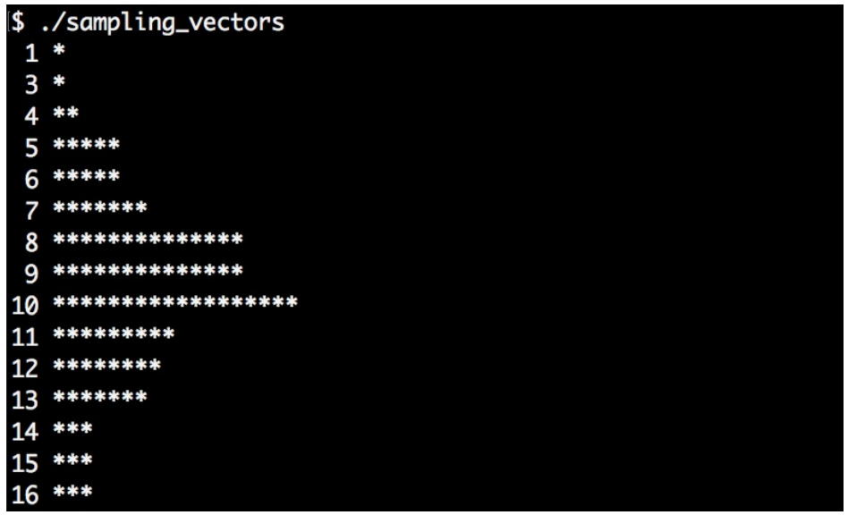

# 對大vector進行採樣

有時我們需要處理非常龐大的數據量，不可能在短時間內處理完這些數據。這樣的話，數據可能就需要採樣來減少要處理的數據量，從而加速整個處理過程。另一些情況下，不減少數據量也能加快程序處理的速度，不過這需要對一些數據進行存儲或變換。

採樣最原始的方式是每隔N個數據點，採樣一次。在大多數情況下這樣做沒有問題，但是在信號處理中，其會引發一種稱為**混淆**的數學情況。當減少兩個隨機採樣點的距離時，這種現象會減弱。我們看一下下面的圖，這張圖就很能說明問題——當原始信號為一個sin波時，圖例為三角的曲線就表示對這個曲線進行每隔100個點的取樣。


不幸的是，其採樣得到的值都是同一個Y值！連接起來就是與X軸平行的一條線。平方點採樣，其每隔`100+random(-15,  +15)`個值進行採樣。不過，這樣連接起來的曲線看起來和原始的曲線還是相差很遠，所以在這個例子中就不能以固定的步長進行採樣。

`std::sample`函數不會添加隨機值來改變採樣的步長，而是採用完全隨機的點進行採樣。所以其工作方式與上圖所顯示的大為不同。

## How to do it...

我們將對一個具有隨機值的大vector進行採樣。隨機數據符合正態分佈。採樣結果也要符合正態分佈，來讓我們看下代碼：

1. 首先包含必要的頭文件，以及聲明所使用的命名空間。

   ```c++
   #include <iostream>
   #include <vector>
   #include <random>
   #include <algorithm>
   #include <iterator>
   #include <map>
   #include <iomanip>

   using namespace std; 
   ```

2. 使用常數直接對變量進行初始化。第一個值代表了`vector`的的長度，第二個數代表了採樣的步長：

   ```c++
   int main()
   {
       const size_t data_points {100000};
       const size_t sample_points {100};
   ```

3. 我們要使用符合正態分佈的隨機值生成器來將`vector`填滿。這裡先來確定正太分佈的平均值和標準差：

   ```c++
   	const int mean {10};
   	const size_t dev {3};
   ```

4. 現在，我們來設置隨機數生成器。首先，我們實例化一個隨機設備，然後給定一個隨機種子，對生成器進行初始化。然後，就可以得到對應分佈的隨機生成器：

   ```c++
   	random_device rd;
   	mt19937 gen {rd()};
   	normal_distribution<> d {mean, dev};
   ```

5. 對`vector`進行初始化，並用隨機值將`vector`進行填充。這裡會使用到`std::generate_n`算法，其會將隨機值，通過`back_inserter`迭代器插入`vector`中。生成函數對象包裝成了`d(gen)`表達式，其能生成符合分佈的隨機值：

   ```c++
       vector<int> v;
       v.reserve(data_points);
       
   	generate_n(back_inserter(v), data_points,
       	[&] { return d(gen); });
   ```

6. 我們再實例化另一個`vector`，其來放採樣過後的數值：

   ```c++
   	vector<int> samples;
   	v.reserve(sample_points);
   ```

7. `std::sample`算法與`std::copy`的原理類似，不過其需要兩個額外的參數：採樣數量和隨機值生成對象。前者確定輸入範圍，後者去確定採樣點：

   ```c++
   	sample(begin(v), end(v), back_inserter(samples),
   		sample_points, mt19937{random_device{}()});
   ```

8. 這樣就完成了採樣。代碼的最後展示一下我們的採樣結果。輸入數據符合正態分佈，如果採樣算法可行，那麼其採樣的結果也要符合正態分佈。為了展示採樣後的值是否符合正態分佈，我們將數值的直方圖進行打印：

   ```c++
   	map<int, size_t> hist;

   	for (int i : samples) { ++hist[i]; }
   ```

9. 最後，我們使用循環打印出直方圖：

   ```c++
       for (const auto &[value, count] : hist) {
       	cout << setw(2) << value << " "
       		<< string(count, '*') << '\n';
       }
   }
   ```

10. 編譯並運行程序，我們將看到採樣後的結果，其也符合正態分佈：

## How it works...

 `std::sample`算法是C++17添加的。其函數簽名如下：

```c++
template<class InIterator, class OutIterator,
class Distance, class UniformRandomBitGenerator>
OutIterator sample(InIterator first, InIterator last,
				 SampleIterator out, Distance n,
				 UniformRandomBitGenerator&& g);
```

其輸入範圍有first和last迭代器確定，`out`迭代器作為採樣輸出。這些迭代器對於該函數來說和`std::copy`類似，元素從一個容器拷貝到另一個。`std::sample`算法只會拷貝輸入中的一部分，因為採樣結果只有n個元素。其在內部使用均勻分佈，所以能以相同的概率選擇輸入範圍中的每個數據點。