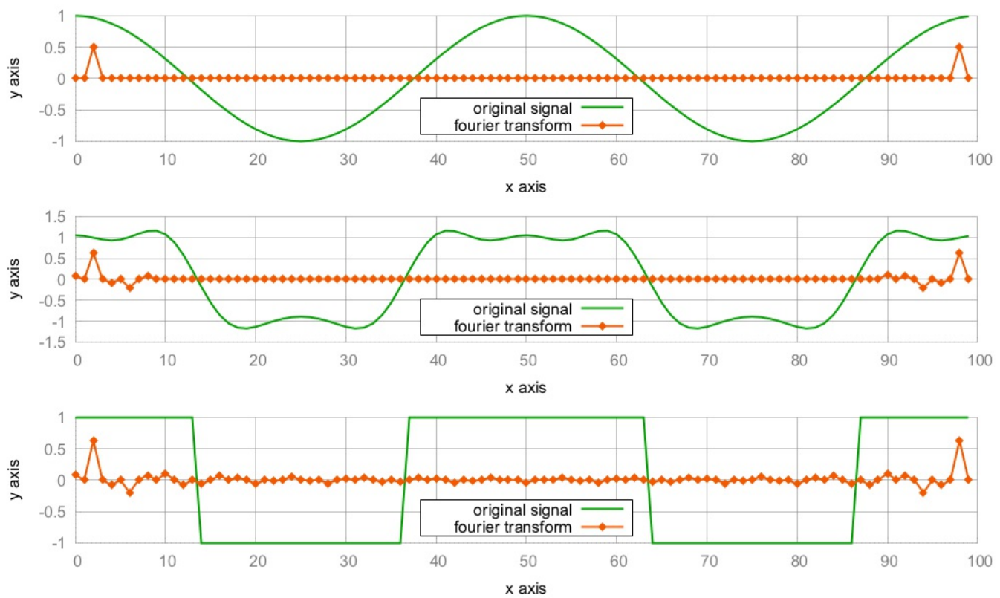

# 使用STL數值算法實現傅裡葉變換

信號處理領域傅裡葉變換是非常重要和著名的公式。這個公式發現於200年前，其計算機用例實很多了。傅裡葉變換可以用於音頻/圖像/視頻壓縮、音頻濾波、醫療圖像設備和用於辨識聲音的手機引用。

因為其應用領域廣泛，STL也試圖將其用在數值計算領域。傅裡葉變換隻是其中一個例子，同樣也是非常棘手的一個。其公式如下所示：


公式基於累加和的變換。累加中的每個元素是輸入信號向量中的一個數據點和表達式`exp(-2 * i * ...)`的乘積。這裡需要一些工程數學的知識，你需要簡單的瞭解複數的概念，如果你沒有相關的知識，瞭解概念就可以了。仔細觀察這個公式，其就是將信號中的所有數據點進行加和(信號數據的長度為N)，其循環索引值為j。其中k是另一個循環變量，因為傅裡葉變換計算出的是一組值。在這組值中，每一個數據點都表示著一段重複波形的幅值和相位，這些信息不包含在原始數據中。當使用循環對其進行實現時，代碼可能就會寫成下面這樣：

```c++
csignal fourier_transform(const csignal &s) {
    csignal t(s.size());
    const double pol {-2.0 * M_PI / s.size()};
    for (size_t k {0}; k < s.size(); ++k) {
        for (size_t j {0}; j < s.size(); ++j) {
            t[k] += s[j] * polar(1.0, pol * k * j);
        }
    }
    return t;
}
```

這裡`csignal`的類型可能是`std::vector`，其每個元素都是一個複數。對於複數而言，STL中已經有了對應的數據結構可以對其進行表示——`std::complex`。`std::polar`函數計算得是`exp(-2 * i * ...)`部分。

這樣實現看起來也挺好，不過本節中我們將使用STL工具對其進行實現。

## How to do it...

本節，我們將實現傅裡葉變換和逆變換，然後會對一些信號進行轉換：

1. 首先，包含必要的頭文件和聲明所使用的命名空間：

   ```c++
   #include <iostream>
   #include <complex>
   #include <vector>
   #include <algorithm>
   #include <iterator>
   #include <numeric>
   #include <valarray>
   #include <cmath>
   
   using namespace std;
   ```

2. 信號點的值一個複數，我們使用`std::complex`來表示，並使用`double`進行特化。我們可以對類型進行別名操作，使用`cmple`表示兩個`double`值，這兩個`double`值分別表示複數的實部和虛部。使用`csdignal`來別名相應的`vector`對象：

   ```c++
   using cmplx = complex<double>;
   using csignal = vector<cmplx>;
   ```

3. 我們需要使用數值指針遍歷數值序列。公式中的變量k和j就會隨著序列進行累加：

   ```c++
   class num_iterator {
   	size_t i;
   public:
   	explicit num_iterator(size_t position) : i{position} {}
       
   	size_t operator*() const { return i; }
       
   	num_iterator& operator++() {
   		++i;
   		return *this;
   	}
       
   	bool operator!=(const num_iterator &other) const {
   		return i != other.i;
   	}
   };
   ```

4. 傅裡葉變換需要接收一個信號，並返回一個新的信號。返回的信號表示已經經過傅裡葉變換的信號。通過傅裡葉逆變換，我們可以將一個經過傅裡葉變換的信號，還原成原始信號，這裡我們會提供一個可選的`bool`參數，其會決定變換的方向。`bool`參數作為參數是一種不好習慣，特別是在一個函數的簽名中出現多次。我們這有個很簡潔的例子。我們做的第一件事，是使用原始信號的尺寸來分配新的信號數組：

   ```c++
   csignal fourier_transform(const csignal &s, bool back = false)
   {
   	csignal t (s.size());
   ```

5. 公式中有兩個因子，其看起來是相同的。讓我們將其打包成一個變量：

   ```c++
   	const double pol {2.0 * M_PI * (back ? -1.0 : 1.0)};
   	const double div {back ? 1.0 : double(s.size())};
   ```

6. `std::accumulate`很適合用來執行公式中的累加部分，我們將對一個範圍內的數值使用`accumulate`。對於每個值，我們將逐步的進行單個相加。`std::accumulate`算法會調用一個二元函數。該函數的第一個參數為目前為止我們所累加的變量`sum`，第二個參數為範圍內下一個要累加的值。我們會在信號`s`中對當前為止的值進行查找，並且會將其和複數因子`pol`相乘。然後，我們返回新的`sum`。這裡的二元函數，使用Lambda表達式進行包裝，因為我們將在每次`accumulate`的調用時，`j`變量的值是不同的。因為其是二維循環算法，所以內層Lambda做內部的循環，外層Lambda做外層的循環：

   ```c++
       auto sum_up ([=, &s] (size_t j) {
           return [=, &s] (cmplx c, size_t k) {
           	return c + s[k] *
           		polar(1.0, pol * k * j / double(s.size()));
           };
       });
   ```

7. 傅裡葉的內部循環，現在使用`std::accumulate`進行，算法中每個位置都會進行加和。我們使用Lambda表達式來實現，這樣我們就能計算出傅裡葉變換數組中的每個數據點的值：

   ```c++
   	auto to_ft ([=, &s](size_t j){
           return accumulate(num_iterator{0},
                             num_iterator{s.size()},
                             cmplx{},
                             sum_up(j))
           / div;
       });
   ```

8. 目前位置，還沒有執行傅裡葉變換的代碼。我們會準備大量的功能性代碼，他們會幫助我們完成很多事情。`std::transform`的調用將會使j的值在[0, N)間變換(這步是在外層循環完成)。變換之後的值將全部放入`t`中，`t`就是我們要返回給用戶的值：

   ```c++
       transform(num_iterator{0}, num_iterator{s.size()},
       		 begin(t), to_ft);
       return t;
   }
   ```

9. 我們將會實現一些輔助函數幫助我們生成信號。首先實現的是一個餘弦信號生成器，其會返回一個Lambda表達式，這個表達式通過傳入的長度參數，產生對應長度的餘弦信號數據。信號本身的長度是不固定的，但是其有固定的週期。週期為N，意味著該信號會在N步之後重複。返回的Lambda表達式不接受任何參數。我們可以重複的對其進行調用，並且每次調用表達式將會返回給我們下一個時間點的信號值：

   ```c++
   static auto gen_cosine (size_t period_len){
       return [period_len, n{0}] () mutable {
       	return cos(double(n++) * 2.0 * M_PI / period_len);
       };
   }
   ```

10. 我們所要生成另一個波形是方波。該波形會在`-1`和`+1`兩值間震盪，其中不會有其他的值。公式看起來有點複雜，但是其變換非常簡單，也就是將值n置為`+1`或`-1`，並且其震盪週期為`period_len`。這裡要注意，我們沒有使用0對n進行初始化。這樣，我們的方波的其實位置就在`+1`上：

    ```c++
    static auto gen_square_wave (size_t period_len)
    {
        return [period_len, n{period_len*7/4}] () mutable {
        	return ((n++ * 2 / period_len) % 2) * 2 - 1.0;
        };
    }
    ```

11. 產生實際信號可以通過`vector`和信號生成器聯合進行，使用重複調用信號生成器對`vector`數組進行填充。`std::generate`就用來完成這個任務的。其接受一組`begin/end`迭代器組和一個生成函數。對於每個合法的迭代器，都會進行`*it = gen()`。通過將這些代碼包裝成一個函數，我們可以很容易的生成一個信號數組：

    ```c++
    template <typename F>
    static csignal signal_from_generator(size_t len, F gen)
    {
        csignal r (len);
        generate(begin(r), end(r), gen);
        return r;
    }
    ```

12. 最後，我們需要將信號的結果進行打印。我們可以將數組中的值拷貝到輸出流迭代器中進行輸出，不過我們需要先將數據進行變換，因為我們的信號數據都是複數對。這樣，我們只需要在意每個點的實部就好；所以，我們可以將數組扔到`std::transform`中進行變換，然後將實部提取出來：

    ```c++
    static void print_signal (const csignal &s)
    {
        auto real_val ([](cmplx c) { return c.real(); });
        transform(begin(s), end(s),
        		 ostream_iterator<double>{cout, " "}, real_val);
        cout << '\n';
    }
    ```

13. 目前為止，傅裡葉公式就已經實現了，不過現在還沒有信號進行變換。這個工作我們將在主函數中完成。我們先來定義信號數據的長度：

    ```c++
    int main()
    {
    	const size_t sig_len {100};
    ```

14. 現在來生成信號數據，轉換他們，然後進行打印。首先，生成一個餘弦信號和一個方波信號。這兩組信號的長度和週期數相同：

    ```c++
        auto cosine (signal_from_generator(sig_len,
            gen_cosine( sig_len / 2)));
    
        auto square_wave (signal_from_generator(sig_len,
            gen_square_wave(sig_len / 2)));
    ```

15. 那麼現在有了兩個波形信號。為了生成第三個信號，我們對方波信號進行傅裡葉變換，並且保存在`trans_sqw`數組中。方波的傅裡葉變換有些特殊，我們在後面會進行介紹。索引從10到`(signal_length - 10)`都設置為0.0。經過傅裡葉變換之後，原始信號將發生很大的變化。我們將在最後看到結果：

    ```c++
        auto trans_sqw (fourier_transform(square_wave));
    
        fill (next(begin(trans_sqw), 10), prev(end(trans_sqw), 10), 0);
        auto mid (fourier_transform(trans_sqw, true));
    ```

16. 現在，我們有三個信號：餘弦、mid和方波。對於每個信號，我們將會打印其原始波形，和傅裡葉變換過後的波形。輸出將有六條曲線組成：

    ```c++
        print_signal(cosine);
        print_signal(fourier_transform(cosine));
        
        print_signal(mid);
        print_signal(trans_sqw);
        
        print_signal(square_wave);
        print_signal(fourier_transform(square_wave));
    }
    ```

17. 編譯並運行程序，終端上會打印出大量的數據。如果這裡使用繪圖輸出，就可以看到如下的結果：

    

## How it works...

這段代碼又兩個比較難理解的部分。第一個是傅裡葉變換本身，另一個是使用可變Lambda表達式生成信號數據。

首先，我們來看一下傅裡葉變換。其核心部分在循環中實現(雖然沒有在我們實現中這樣做，但可以結合代碼看下介紹中的公式)，可能會以如下方式實現：

```c++
for (size_t k {0}; k < s.size(); ++k) {
    for (size_t j {0}; j < s.size(); ++j) {
    	t[k] += s[j] * polar(1.0, pol * k * j / double(s.size()));
    }
}
```

基於STL算法`std::transform`和`std::accumulate`，我們完成了自己的例子，總結一下就類似如下的偽代碼：

```
transform(num_iterator{0}, num_iterator{s.size()}, ...
	accumulate((num_iterator0}, num_iterator{s.size()}, ...
		c + s[k] * polar(1.0, pol * k * j / double(s.size()));
```

和循環相比，結果完全一樣。當然，使用STL算法也可以產生不太好的代碼。不管怎麼樣吧，這個實現是不依賴所選用的數據結構。其對於列表也起作用(雖然這沒有太大的意義)。另一個好處是，在C++17中STL很容易並行(將在本書的另一個章節進行介紹)，當需要並行的時候，我們就需要對純循環進行重構和拆分，將其放入指定的線程中(除非使用類似OpenMP這樣的併發庫，其會自動的將循環進行重構)。

下一個難點是信號生成。讓我來看一下另一個`gen_cosine`:

```c++
static auto gen_cosine (size_t period_len)
{
    return [period_len, n{0}] () mutable {
    	return cos(double(n++) * 2.0 * M_PI / period_len);
    };
}
```

每一個Lambda表達式代表一個函數對象，其會在每次調用時改變自身的狀態。其狀態包含兩個變量`period_len`和`n`。變量n會在每次調用時，進行變更。在不同的時間點上，得到的是不同的信號值，並且在時間增加時會使用`n++`對`n`的值進行更新。為了獲得信號值的數組，我們創建了輔助函數`signal_from_generator`：

```c++
template <typename F>
static auto signal_from_generator(size_t len, F gen)
{
    csignal r (len);
    generate(begin(r), end(r), gen);
    return r;
}
```

這個函數會通過所選長度創建一個信號`vector`，並且調用`std::generate`對數據點進行填充。數組r中的每一個元素，都會調用一個`gen`函數。`gen`函數是是一種自修改函數對象，我們使用相同的方式創建了`gen_cosine`對象。

> Note：
>
> 本節例子中，STL沒有讓代碼更加的優雅。如果將範圍庫添加入STL(希望在C++20時加入)，那麼可能就會有改觀。