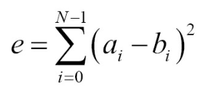

# 計算兩個vector的誤差和

對兩個值進行計算的時候，計算機的計算結果與我們期望的結果有一定的差別。比如，測量由多個數據點組成的信號之間的差異，通常會涉及相應數據點的循環和減法等計算。

我們給出一個簡單的計算信號a與信號b之間的誤差公式：



對於每一個`i`，都會計算一次`a[i] - b[i]`，對差值求平方(負值和正值就能進行比較)，最後計算平方差的和。通常我們會使用循環來做這件事，但是為了讓事情更加好玩，我們決定使用STL算法來完成。使用STL的好處是，無需耦合特定的數據結果。我們的算法能夠適應`vector`和類似鏈表的數據結構，不用直接進行索引。

## How to do it...

本節，我們將創建兩個信號，並計算這兩個信號之間的誤差：

1. 依舊是包含必要的頭文件和聲明所使用的命名空間。

   ```c++
   #include <iostream>
   #include <cmath>
   #include <algorithm>
   #include <numeric>
   #include <vector>
   #include <iterator>

   using namespace std; 
   ```

2.  我們將對兩個信號的誤差和進行計算。這兩個信號一個是`sine`，另一個信號也是`sine`，不過其中之一的使用`double`類型進行保存，另一個使用`int`類型進行保存。因為`double`和`int`類型表示數值的範圍有差異，就像是模擬信號`as`轉換成數字信號`ds`。

   ```c++
   int main()
   {
       const size_t sig_len {100};
       vector<double> as (sig_len); // a for analog
       vector<int> ds (sig_len); // d for digital
   ```

3. 為了生成一個`sin`波形，我們事先了一個簡單的Lambda表達式，並可以傳入一個可變的計數變量`n`。我們可以經常在需要的時候調用表達式，其將返回下一個時間點的`sine`波形。`std::generate`可以使用信號值來填充數組，並且使用`std::copy`將數組中的`double`類型的變量，轉換成`int`類型變量：

   ```c++
   	auto sin_gen ([n{0}] () mutable {
       	return 5.0 * sin(n++ * 2.0 * M_PI / 100);
       });
       generate(begin(as), end(as), sin_gen);
       copy(begin(as), end(as), begin(ds));
   ```

4. 我們可以對信號進行打印，也可以使用繪圖進行顯示：

   ```c++
   	copy(begin(as), end(as),
       	ostream_iterator<double>{cout, " "});
       cout << '\n';
       copy(begin(ds), end(ds),
       	ostream_iterator<double>{cout, " "});
       cout << '\n'; 
   ```

5. 現在來計算誤差和，我們使用`std::inner_product`，因為這個函數能幫助我們計算兩個信號矢量的差異。該函數能在指定範圍內進行迭代，然後選擇相應位置上進行差值計算，然後在進行平方，再進行相加：

   ```c++
       cout << inner_product(begin(as), end(as), begin(ds),
       					0.0, std::plus<double>{},
       					[](double a, double b) {
      							return pow(a - b, 2);
       					})
       	<< '\n';
   }
   ```

6. 編譯並運行程序，我們就能得到兩條曲線，還有一條曲線代表的是兩個信號的誤差和。最終這兩個信號的誤差為40.889。當我們使用連續的方式對誤差進行統計，要對值進行逐對匹配，然後得到無法曲線，其就像我們在下圖中看到的一樣：

   

## How it works...

本節，我們需要將兩個向量放入循環中，然後對不同位置的值計算差值，然後差值進行平方，最後使用`std::inner_product`將差的平方進行加和。這樣，我們可以使用Lambda表達式來完成求差值平方的操作——`[](double a, double b){return pow(a - b), 2}`，這樣就可以通過傳入不同的參數來計算差值平方。

這裡我們可以看下`std::inner_product`是如何工作的：

```c++
template<class InIt1, class InIt2, class T, class F, class G>
T inner_product(InIt1 it1, InIt1 end1, InIt2 it2, T val,
			   F bin_op1, G bin_op2)
{
    while(it1!= end1){
        val = bin_op1(val, bin_op2(*it1, *it2));
        ++it1;
        ++it2;
    }
    return value;
}
```

算法會接受一對`begin/end`迭代器作為第一個輸入範圍，另一個`begin`迭代器代表第二個輸入範圍。我們的例子中，這些迭代器所指向的是`vector`，並對這兩個`vector`進行誤差和的計算。`val`是一個初始化值。我們這裡將其設置為`0.0`。然後，算法可以接受兩個二元函數，分別為`bin_op1`和`bin_op2`。

我們會發現，這個算法與`std::accumulate`很相似。不過`std::accumulate`只對一個範圍進行操作。當將`bin_op2(*it1, *it2)`看做一個迭代器，那麼我們可以簡單的是用`accumulate`算法進行計算了。所以，我們可以將`std::inner_product`看成是帶有打包輸入範圍的`std::accumulate`。

例子中，打包函數就是`pow(a - b, 2)`。因為我們需要將所有元素的差平方進行加和，所以我們選擇`std::plus<double>`作為`bin_op1`。

