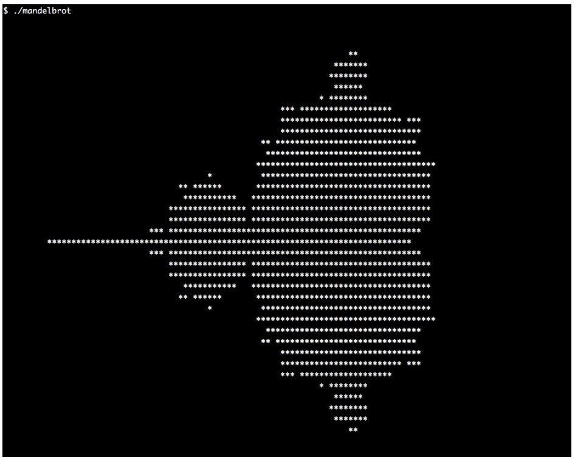

# 使用ASCII字符曼德爾布羅特集合

1975年，數學家貝諾曼德爾布羅特(Benoit Mandelbrot)創造了一個術語——**分形**。分形是一個數學圖像或者集合，這個術語中包含了很多有趣的數學特性，不過最後看起來分形更像是藝術品。分形圖像看起來是無限重複的縮小。其中最為眾人所知的分形是曼德爾布羅特(Mandelbrot)集合，其集合看起來就像下圖一樣：


曼德爾布羅特集合可以通過迭代下面的等式得到：


`z`和`c`變量都是複數。曼德爾布羅特集合包含等式所覆蓋所有讓方程收斂的`c`值，也就是海報彩色的部分。有些值收斂的早，有些值收斂的晚，這裡用不同的顏色對這些值進行描述，所以我們能在海報中看到各種不同的顏色。對於那些不收斂的值，我們則直接將其所在區域直接塗黑。

使用STL的`std::complex`類，且不使用循環來實現上面的等式。這並不是炫技，只是為了讓大家更容易理解STL相關特性的使用方式。

## How to do it...

本節，我們將打印類似牆上海報的圖，不過是使用ASCII字符將圖像打印在終端上：

1. 包含必要的頭文件並聲明所使用的命名空間：

   ```c++
   #include <iostream>
   #include <algorithm>
   #include <iterator>
   #include <complex>
   #include <numeric>
   #include <vector>
   
   using namespace std;
   ```

2. 曼德爾布羅特集合和之前的等式，都是對複數進行操作。所以，我們需要使用類型別名，使用`cmplx`來代表`std::complex`，並特化為`double`類型：

    ```c++
      using cmplx = complex<double>;
    ```

3. 我們將使用大約20行的代碼來完成一個ASCII組成的曼德爾布羅特集合圖像，不過我們會將邏輯逐步實現，最後將所有結果進行組合。第一步就是實現一個函數，用於將整型座標縮放為浮點座標。這也就是我們如何在屏幕上特定的位置上打印相應的字符。我們想要的是曼德爾布羅特集合中複數的座標，就需要實現一個函數，用於將對應的座標轉換成相應的幾何圖形。用一個Lambda表達式來構建這些變量，並將其返回。該函數能將`int`類型的函數轉換成一個`double`類型的函數：

   ```c++
   static auto scaler(int min_from, int max_from,
   double min_to, double max_to)
   {
       const int w_from {max_from - min_from};
       const double w_to {max_to - min_to};
       const int mid_from {(max_from - min_from) / 2 + min_from};
       const double mid_to {(max_to - min_to) / 2.0 + min_to};
       
       return [=] (int from) {
      		return double(from - mid_from) / w_from * w_to + mid_to;
       };
   }
   ```

4. 現在需要在一個維度上進行座標變換，不過曼德爾布羅特集合使用的是二維座標系。為了能將(x, y)座標系統轉換成另一個，我們需要將`x-scaler`和`y-scaler`相結合，並且構建一個`cmplx`實例作為輸出：

   ```c++
   template <typename A, typename B>
   static auto scaled_cmplx(A scaler_x, B scaler_y)
   {
       return [=](int x, int y) {
       	return cmplx{scaler_x(x), scaler_y(y)};
       };
   }
   ```

5. 將座標轉換到正確的維度上後，就可以來實現曼德爾布羅特方程。現在不管怎麼打印輸出，一心只關注於實現方程即可。循環中，對`z`進行平方，然後加上`c`，知道`abs`的值小於2。對於一些座標來說，其值永遠不可能比2小，所以當循環次數達到`max_iterations`時，我們就決定放棄。最後，將會返回那些`abs`值收斂的迭代次數：

   ```c++
   static auto mandelbrot_iterations(cmplx c)
   {
       cmplx z {};
       size_t iterations {0};
       const size_t max_iterations {1000};
       while (abs(z) < 2 && iterations < max_iterations) {
           ++iterations;
           z = pow(z, 2) + c;
       }
       return iterations;
   }
   ```

6. 那麼現在我們就來實現主函數。在主函數中我們會定義縮放函數對象`scale`，用於對座標值進行多維變換：

   ```c++
   int main()
   {
       const size_t w {100};
       const size_t h {40};
       
       auto scale (scaled_cmplx(
           scaler(0, w, -2.0, 1.0),
           scaler(0, h, -1.0, 1.0)
       ));
   ```

7. 為了可以在一維上迭代器整個圖形，需要完成另一個轉換函數，用於將二維圖像進行降維操作。其會根據我們所設置的字符寬度進行計算。其會將一維上的長度進行折斷，然後進行多行顯示，通過使用`scale`函數對座標進行變換，然後返回複數座標：

   ```c++
   	auto i_to_xy ([=](int i) { return scale(i % w, i / w); });
   ```

8. 我們將圖像的二維座標(int，int類型)轉換為一維座標(int類型)，再將座標轉換成曼德爾布羅特結合座標(cmplx類型)。讓我們將所有功能放入一個函數，我們將使用一組調用鏈：

   ```c++
   	auto to_iteration_count ([=](int i) {
   		return mandelbrot_iterations(i_to_xy(i));
   	});
   ```

9. 現在我們可以來設置所有數據。假設我們的結果ASCII圖像的字符寬度為`w`，高度為`h`。這樣就能將結果存儲在一個長度為`w * h`數組中。我們使用`std::iota`將數值範圍進行填充。這些數字可以用來作為轉換的輸入源 ，我們將變換過程包裝在`to_iteration_count`中：

   ```c++
       vector<int> v (w * h);
       iota(begin(v), end(v), 0);
       transform(begin(v), end(v), begin(v), to_iteration_count);
   ```

10. 現在有一個v數組，其使用一維座標進行初始化，不過後來會被曼德爾布羅特迭代計數所覆蓋。因此，我們就可以對圖像進行打印。可以將終端窗口設置為`w`個字符寬度，這樣我們就不需要打印換行符。不過，可能會有對`std::accumulate`有一種創造性的誤用。`std::accumulate`使用二元函數對處理範圍進行縮小。我們可以對其提供一個二元函數，其能接受一個輸出迭代器(並且我們將在下一步進行終端打印)，並使用範圍內的單個值進行計算。如果相應值的迭代次數大於50次時，我們會打印`*`字符到屏幕上。否則，會打印空字符在屏幕上。在每行結束時(因為計數器變量n可被W均勻地分割)，我們會打印一個換行符：

    ```c++
        auto binfunc ([w, n{0}] (auto output_it, int x) mutable {
        	*++output_it = (x > 50 ? '*' : ' ');
        	if (++n % w == 0) { ++output_it = '\n'; }
        	return output_it;
        });
    ```

11. 通過對輸入範圍使用`std::accumulate`，我們將二元打印函數和`ostream_iterator`相結合，我們需要在屏幕上刷新計算出的曼德爾布羅特集合：

    ```c++
    	accumulate(begin(v), end(v), ostream_iterator<char>{cout},
    			  binfunc);
    }
    ```

12. 編譯並運行程序，就可以看到如下的輸出，其看起來和牆上的海報很像吧！



## How it works...

整個計算過程都使用`std::transform`對一維數組進行處理：

```c++
vector<int> v (w * h);
iota(begin(v), end(v), 0);
transform(begin(v), end(v), begin(v), to_iteration_count);
```

所以，會發生什麼呢？我們為什麼要這麼做？`to_iteration_count`函數是基於從`i_to_xy`開始的調用鏈，從`scale`到`mandelbrot_iterations`。下面的圖像就能展示我們的轉換步驟：


這樣，我們就可以使用一維數組作為輸入，並且獲得曼德爾布羅特方程的迭代次數(使用一維座標表示的二維座標上的值)。三個互不相關的轉換是件好事。這樣代碼就可以獨立的進行測試，這樣就不用互相牽制了。同樣，這樣更容易進行正確性測試，並尋找並修復bug。