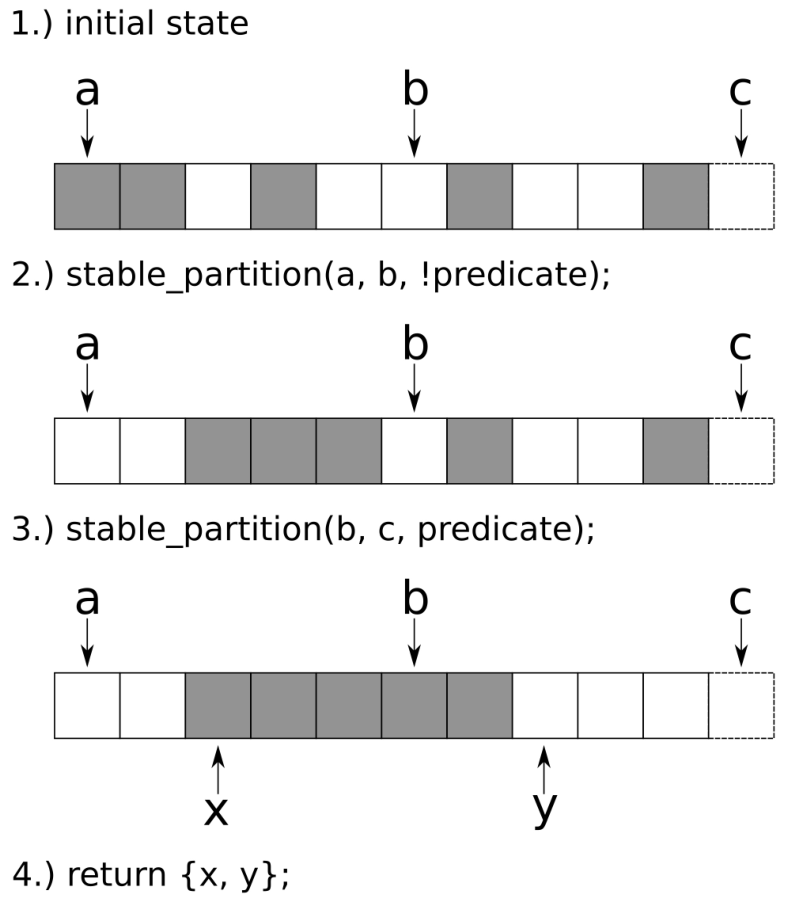

# 將標準算法進行組合

`gather`為STL算法中最好的組合性例子。Sean Parent在任Adobe系統首席科學家時，就在向世人普及這個算法，因為其本身短小精悍。其使用方式就如同做一件藝術品一樣。

`gather`算法能操作任意的元素類型。其更改元素的順序，通過用戶的選擇，其會將對應的數據放置在對應位置上。

## How to do it...

本節，我們來實現`gather`算法，並對其進行一定的修改。最後，將展示如何進行使用：

1. 包含必要的頭文件，聲明所使用的命名空間。

   ```c++
   #include <iostream>
   #include <algorithm>
   #include <string>
   #include <functional>
   
   using namespace std; 
   ```

2. `gather`算法是表現標準算法組合性很好的一個例子。`gather`接受一對`begin/end`迭代器和另一個迭代器`gather_pos`，其指向`begin`和`end`迭代器的中間位置。最後一個參數是一個謂詞函數。使用謂詞函數，算法會將滿足謂詞條件的所有元素放置在`gather_pos`迭代器附近。使用`std::stable_partition`來完成移動元素的任務。`gather`算法將會返回一對迭代器。這兩個迭代器由`stable_partition`所返回，其表示彙集範圍的起始點和結束點：

   ```c++
   template <typename It, typename F>
   pair<It, It> gather(It first, It last, It gather_pos, F predicate)
   {
   	return {stable_partition(first, gather_pos, not_fn(predicate)),
   		    stable_partition(gather_pos, last, predicate)};
   }
   ```

3. 算法的另一種變體為`gather_sort`。其工作原理與`gather`相同，不過其不接受一元謂詞函數；其能接受一個二元比較函數。這樣，其就也能將對應值彙集在`gather_pos`附近，並且能知道其中最大值和最小值：

   ```c++
   template <typename It, typename F>
   void gather_sort(It first, It last, It gather_pos, F comp_func)
   {
       auto inv_comp_func ([&](const auto &...ps) {
       	return !comp_func(ps...);
       });
       
       stable_sort(first, gather_pos, inv_comp_func);
       stable_sort(gather_pos, last, comp_func);
   }
   ```

4. 讓我們來使用一下這些算法。先創建一個謂詞函數，其會告訴我們當前的字母是不是`a`，再構建一個字符串，僅包含`a`和`-`字符：

   ```c++
   int main()
   {
       auto is_a ([](char c) { return c == 'a'; });
       string a {"a_a_a_a_a_a_a_a_a_a_a"};
   ```

5. 繼續構造一個迭代器，讓其指向字符串的中間位置。這時可以調用`gather`算法，然後看看會發生什麼。`a`字符將彙集在字符串中間的某個位置附近：

   ```c++
       auto middle (begin(a) + a.size() / 2);
       
   	gather(begin(a), end(a), middle, is_a);
       cout << a << '\n';
   ```

6. 再次調用`gather`，不過這次`gather_pos`的位置在字符串的起始端：

   ```c++
   	gather(begin(a), end(a), begin(a), is_a);
   	cout << a << '\n';
   ```

7. 再將`gather_pos`的位置放在末尾試試：

   ```c++
   	gather(begin(a), end(a), end(a), is_a);
   	cout << a << '\n';
   ```

8. 最後一次，這次將再次將迭代器指向中間位置。這次與我們的期望不相符，後面我們來看看發生了什麼：

   ```c++
   	// This will NOT work as naively expected
   	gather(begin(a), end(a), middle, is_a);
   	cout << a << '\n';
   ```

9. 再構造另一個字符串，使用下劃線和一些數字組成。對於這個輸入隊列，我們使用`gather_sort`。`gather_pos`迭代器指向字符串的中間，並且比較函數為`std::less<char>`：

   ```c++
       string b {"_9_2_4_7_3_8_1_6_5_0_"};
       gather_sort(begin(b), end(b), begin(b) + b.size() / 2,
       		   less<char>{});
       cout << b << '\n';
   }
   ```

10. 編譯並運行程序，就會看到如下的輸出。對於前三行來說和預期一樣，不過第四行貌似出現了一些問題。最後一行中，我們可以看到`gather_short`函數的結果。數字的順序是排過序的(中間小，兩邊大)：

    ```c++
    $ ./gather
    _____aaaaaaaaaaa_____
    aaaaaaaaaaa__________
    __________aaaaaaaaaaa
    __________aaaaaaaaaaa
    _____9743201568______
    ```

## How it works...

`gather`算法有點難以掌握，因為其非常短，但處理的是比較複雜的問題。讓我們來逐步解析這個算法：



1. 初始化相應元素，並提供一個謂詞函數。圖中滿足謂詞函數條件的元素為灰色，其他的為白色。迭代器`a`和`c`表示整個範圍的長度，並且迭代器`b`指向了最中間的元素。這就表示要將所有灰色的格子聚集在這個迭代器附近。
2. `gather`算法會對範圍`(a, b]`調用`std::stable_partition`，並對另一邊使用不滿足謂詞條件的結果。這樣就能將所有灰色格子集中在b迭代器附近。
3. 另一個`std::stable_partition`已經完成，不過在`[b, c)`間我們將使用滿足謂詞函數的結果。這樣就將灰色的格子彙集在b迭代器附近。
4. 所有灰色的格子都彙集在`b`迭代器附近，這是就可以返回起始迭代器`x`和末尾迭代器`y`，用來表示所有連續灰色格子的範圍。

我們對同一個範圍多次調用`gather`算法。最初，將所有元素放在範圍中間位置。然後，嘗試放在開始和末尾。這種實驗很有趣，因為這會讓其中一個`std::stable_partition`無元素可以處理。

最後一次對`gather`進行調用時，參數為`(begin, end, middle)`，但沒有和我們預期的一樣，這是為什麼呢？這看起來像是一個bug，實際上不是。

試想一個字符組`aabb`，使用謂詞函數`is_character_a`，用來判斷元素是否為`a`，當我們將第三個迭代器指向字符範圍的中間時，會復現這個bug。原因：第一個`stable_partition`調用會對子範圍`aa`進行操作，並且另一個`stable_partition`會對子範圍`bb`上進行操作。這種串行的調用時無法得到`baab`的，其結果看起來和開始一樣，沒有任何變化。

> Note：
>
> 要是想得到我們預期的序列，我們可以使用`std::rotate(begin, begin + 1, end);`

`gather_sort`基本上和`gather`差不多。簽名不同的就是在於謂詞函數。實現的不同在於`gather`調用了兩次`std::stable_partition`，而`gather_sort`調用了兩次`std::stable_sort`。

這是由於`not_fn`不能作用域二元函數，所以反向比較不能由`not_fn`完成。