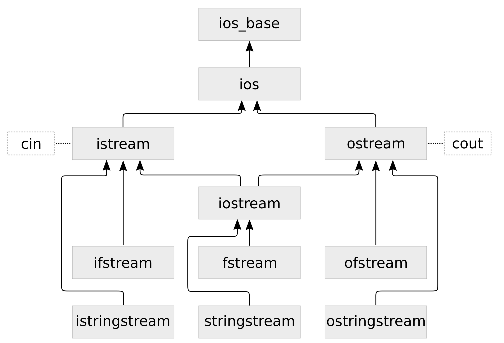

# 第7章 字符串, 流和正則表達

本章，我們將對字符串的處理進行介紹，其中包括處理、解析和打印任意的數據。對於這樣的需求，STL提供了I/O流庫進行支持。這些庫由以下的類組成，對應的類使用灰色框表示：

箭頭的指向代表了每個類之間的繼承關係。這裡面類的數量還挺多，本章中，我們會逐個來熟悉。我們使用類型名稱在STL的手冊中進行查找時，不一定能直接找到這些類。因為圖中的這些名字是對於應用開發者來說的，其中大多數類型的名稱都是以`basic_`為前綴(例如：我們能很容易的在STL文檔章找到`basic_istream`，而`istream`卻很難找到)。以`basic_`為前綴的I/O流類型為模板類，可以將其特化成不同的字符類型。圖中的類型都可以以`char`類型進行特化。我們將會在本書剩下的章節中，使用以`char`為特化的版本。當我們看到類型名前面以`w`開頭時(例如：`wistream`，`wostream`)，將使用`wchar_t`類型代替`char`類型。

圖的最頂端，能看到`std::ios_base`類。我們不能直接對其進行使用，不過其他的類型都是其子類。其一種特化為`std::ios`，這個類型對象會包含流數據，其能通過`good`成員函數對流的狀態進行查詢，還能通過`empty`成員函數數據狀態是否為(EOF)。

我們經常使用的特化類有兩個：`std::istream`和`std::ostream`。兩個類型的前綴`i`和`o`代表著輸入和輸出。我們在之前的代碼使用使用其`std::cout`和`std::cin`(還有`std::cerr`)對象對字符串進行過輸入和輸出。其都是這些類型的實例，也是非常通用的。我們通過`ostream`進行數據輸出，使用`istream`進行數據輸入。

`iostream`類則是對`istream`和`ostream`的繼承，其將輸入和輸出的能力進行合併。當我們要對流數據進行輸入和輸出的時候，我們就有三個類可供使用。

`ifstream`，`ofstream`和`fstream`繼承於`istream`，`ostream`和`iostream`，不過為I/O流添加了文件的讀入寫出功能。

`istringstream`,  `ostringstream`和`iostringstream`原理十分類似，會將字符串讀入內存中，並在內存中對數據進行處理。