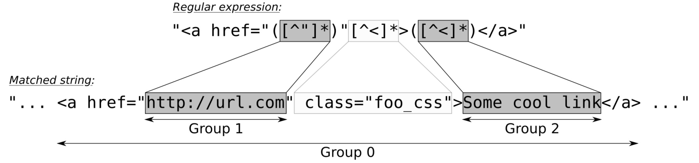

# 使用正則表達式庫標記輸入

當我們需要使用一些較為複雜的方式解析或轉換字符串時，正則表達式是個不錯的選擇。因為非常好用，很多編程語言中都會內置正則表達式。

如果你還對正則表達式不太瞭解，可以去維基百科的相關頁面進行了解。我相信其會擴展你的視野，正則表達式對於文本解析來說十分好用。正則表達式能用來檢查一個電子郵件或IP地址是否合法，也能從長字符串中找到對應的子字符串等等。

本節中，我們將提取HTML文件中的鏈接，並且將這些鏈接為使用者羅列出來。因為正則表達式在C++11標準中正式加入C++ STL，所以例程很短。

## How to do it...

我們將定義一個正則表達式來檢測鏈接，並且將其作用於一個HTML文件，並將獲得的鏈接打印出來：

1. 包含必要的頭文件，並聲明所使用的命名空間：

   ```c++
   #include <iostream>
   #include <iterator>
   #include <regex>
   #include <algorithm>
   #include <iomanip>
   
   using namespace std; 
   ```

2. 在後面將會生成一段可迭代器的區間，這個區間中只包含字符串。這裡會以鏈接地址字符串和鏈接描述字符串配對出現。因此，我們也要寫一個輔助函數來打印這些字符串：

   ```c++
   template <typename InputIt>
   void print(InputIt it, InputIt end_it)
   {
   	while (it != end_it) {
   ```

3. 每次循環中，我們對迭代器增加了兩次，這是因為要對鏈接地址和鏈接描述進行拷貝。兩個迭代器解引用間，我們添加了一個if條件，為了保證程序的安全，這個條件句會檢查迭代器是否過早的到達了最後：

   ```c++
   		const string link {*it++};
   		if (it == end_it) { break; }
   		const string desc {*it++};
   ```

4. 現在我們就可以對鏈接和其描述進行打印：

   ```c++
           cout << left << setw(28) << desc
           	<< " : " << link << '\n';
       }
   }
   ```

5. 主函數中，我們將從標準輸入中獲取所要讀取的數據。這樣，需要將全部標準輸入通過一個輸入流迭代器構造為一個字符串。為了避免符號化，為了確保我們所得到的輸入與用戶輸入的一樣，我們使用了`noskipws`控制符。這個控制符將會禁用空格跳過和符號化：

   ```c++
   int main()
   {
       cin >> noskipws;
       const std::string in {
           istream_iterator<char>{cin}, {} 
       };
   ```

6. 現在我們需要定義一個正則表達式，來對HTML文件進行查找。小括號在正在表達式中代表的是組，這裡我們要獲取我們想要訪問的鏈接——其為URL地址，並且還要獲取其描述：

   ```c++
   	const regex link_re {
   		"<a href=\"([^\"]*)\"[^<]*>([^<]*)</a>"};
   ```

7.  `sregex_token_iterator`類具有相同的功能，並且能對`istream_iterator`直接操作。我們將可迭代的輸入範圍和剛剛定義的正則表達式傳給它。不過，這裡還有第三個參數`{1, 2}`。其表示我們想要表達式組1和組2中的結果：

   ```c++
   	sregex_token_iterator it {
   		begin(in), end(in), link_re, {1, 2}
       };
   ```

8. 現在我們有一個迭代器，如果找到了連接，其會返回連接地址和相應的描述。這裡對第二個參數直接進行初始化，其類型與第一個參數類型相同，然後傳入我們之前實現的`print`函數中：

   ```c++
   	print(it, {});
   }
   ```

9. 編譯並運次那個程序，就會得到如下的輸出。我們使用curl獲取ISO C++首頁的信息，其會將HTML頁面直接從網上下載下來。當然，這裡也能寫成` cat some_html_file.html | ./link_extraction `。正則表達式可以很方便對硬編碼進行解析，通過HTML固定的格式對其進行解析。當然，你可以讓其變得更加通用：

   ```c++
   $ curl -s "https://isocpp.org/blog" | ./link_extraction
   Sign In / Suggest an Article : https://isocpp.org/member/login
   Register : https://isocpp.org/member/register
   Get Started! : https://isocpp.org/get-started
   Tour : https://isocpp.org/tour
   C++ Super-FAQ: https://isocpp.org/faq
   Blog : https://isocpp.org/blog
   Forums : https://isocpp.org/forums
   Standardization: https://isocpp.org/std
   About: https://isocpp.org/about
   Current ISO C++ status : https://isocpp.org/std/status
   (...and many more...)
   ```

## How it works...

正則表達式非常有用，看起來好像特別神祕，但值得學習。一個短小的表達式就能節省對我們多行的代碼進行手動匹配的時間。

本節中，我們第一次實例化了一個正則類型的對象。我們使用一個用於描述的字符串對正則表達式進行構造。最簡單的正則表達式是"."，其會對每個字符進行匹配，因為它是正則表達式的通配符。表達式為"a"時，其就只會對'a'字符進行匹配。表達式為"ab*"時，其表示"只有一個a，和零個或若干個b"，以此類推。正則表達式本身是一個很大的主題，維基百科和一些教學網站，還有一些學術論文中，對其都有非常詳盡的描述。

讓我們來看一下本節中的正則表達式，是如何對HTML連接進行匹配的。一個簡單HTML連接可寫為`  <a href="some_url.com/foo">A great link</a> `。我們只需要`some_url.com/foo`和`A great link`部分。所以，我們可以使用如下的正則表達式進行匹配，其會將字符串對應每個組，從而分解成多個字符串：



字符串本身為**第0組**，也就是整個字符串。引號中`href`的URL地址部分分在**第1組**中。正則表達式中，使用小括號來定義組，所以這個表達式中有兩個組。另一個組則獲取的是連接描述。

有很多STL函數可以接受正則對象，不過直接使用一個正則字符迭代器適配器，其是對使用`std::regex_search`進行自動化匹配的高階抽象。我們可用如下的代碼對其進行實例化：

```c++
sregex_token_iterator it {begin(in), end(in), link_re, {1, 2}};
```

開始和結束部分表示我們的輸入字符串，正則迭代器則在該字符串上進行迭代，並匹配所有鏈接。`link_re`則為用於匹配連接的正則表達式，`{1, 2}`可用來表示我們需要的部分。其第一組匹配的是我們想要的連接，進行自增後，就到了第二組，匹配的則是我們想要的連接描述，依次循環。其能非常智能的幫助我們對多行數據進行處理。

讓我們來看另一個例子，以確保我們明白了上面的內容。讓我們創建一個正則表達式`"a(b*)(c*)"`。其會對具有一個'a'字符，之後有或沒有'b'字符，再之後有或沒有'c'字符的字符串進行匹配：

```c++
const string s {" abc abbccc "};
const regex re {"a(b*)(c*)"};

sregex_token_iterator it {
    begin(s), end(s), re, {1, 2} 
};

print( *it ); // prints b
++it;
print( *it ); // prints c
++it;
print( *it ); // prints bb
++it;
print( *it ); // prints ccc
```

當然也可以使用`std::regex_iterator`類，其會將匹配的子字符串進行直接輸出。