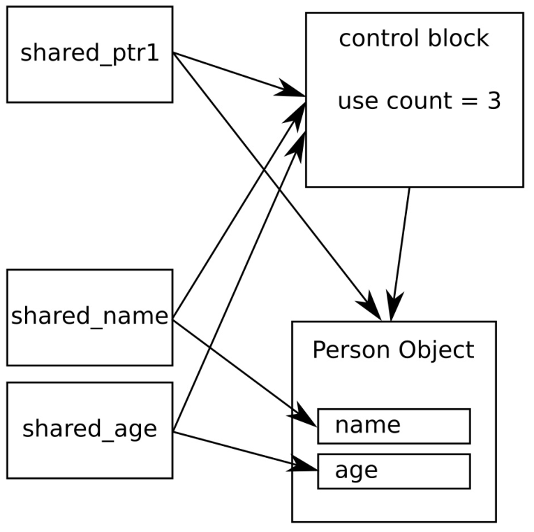

# 共享同一對象的不同成員

試想我們在一個共享指針中持有一個組成非常複雜的動態分配對象，然後使用新的線程完成一些特別耗時的任務。當我們想要對共享指針所持有的對象進行釋放時，線程很有可能仍舊會對這個對象進行訪問。當然，我們並不想把這個非常複雜的對象交給線程，因為這樣的設計有違我們的初衷。那麼就意味著我們要手動對內存進行管理了麼？

非也！這個問題可以由共享指針來解決，指向一個非常大的共享對象。另外，可以在初始化階段就接管對對象的內存管理任務。

在這個例子中，我們將模擬這樣一種情況(為了簡單，不使用線程)，讓我們來看一下`shared_ptr`是如何來解決這個問題的。

## How to do it...

我們將定義一個結構體，其中包含了多個成員。然後，我們會使用共享指針來管理這個類型的動態分配實例。對於共享指針來說，不會直接指向這個對象的本身，而會指向其成員：

1. 包含必要的頭文件，並聲明所使用的命名空間：

   ```c++
   #include <iostream>
   #include <memory>
   #include <string>
   
   using namespace std;
   ```

2.  定義一個類型，其中包含了不同的成員，將使用共享指針指向這些成員。為了能清晰的瞭解類型實例何時被創建與銷燬，我們讓構造和析構函數都打印一些信息：

   ```c++
   struct person {
       string name;
       size_t age;
       
       person(string n, size_t a)
       	: name{move(n)}, age{a}
       { cout << "CTOR " << name << '\n'; }
       
       ~person() { cout << "DTOR " << name << '\n'; }
   };
   ```

3. 再來創建幾個共享指針，用於指向`person`類型實例中的`name`和`age`成員變量：

   ```c++
   int main()
   {
       shared_ptr<string> shared_name;
       shared_ptr<size_t> shared_age;
   ```

4. 接下來，創建一個新代碼段，並創建一個`person`對象，並且用共享指針對其進行管理：

   ```c++
   	{
   		auto sperson (make_shared<person>("John Doe", 30));
   ```

5. 使用之前定義的兩個共享指針，分別指向`name`和`age`成員。使用了`shared_ptr`的特定構造函數，其能接受一個共享指針和一個共享指針持有對象的成員變量。這樣就能對整個對象進行管理，但不指向其本身！

   ```c++
   		shared_name = shared_ptr<string>(sperson, &sperson->name);
   		shared_age = shared_ptr<size_t>(sperson, &sperson->age);
   	}
   ```

6. 離開代碼段後，我們將會打印`person`的`name`和`age`的值。這個操作只是用來驗證，對象是否依舊存在：

   ```c++ 
   	cout << "name: " << *shared_name
   		<< "\nage: " << *shared_age << '\n';
   }	
   ```

7. 編譯並運行程序，我們就是會看到如下的輸出。從析構函數的信息中，我們看到通過指向成員的智能指針，打印`person`的`name`和`age`時，對象依舊存在：

   ```c++
   $ ./shared_members
   CTOR John Doe
   name: John Doe
   age:30
   DTOR John Doe
   ```

## How it works...

本節中，我們首先動態創建了一個`person`對象，交給共享指針進行管理。然後，我們創建兩個智能指針，分別指向`person`對象的兩個成員變量。

為了描述我們創建了一個什麼樣的情景，可以看一下下面的圖：



注意`shared_ptr1`是直接指向`person`對象，而`shared_name`和`shared_age`則指向的是同一個對象的`name`和`age`成員變量。顯然，這些指針管理著整個對象的生命週期。可能是因為內部控制塊都指為同一個控制塊，這樣就無所謂是否僅指向對象的子對象了。

這種情況下，控制塊中的使用計數為3。`person`對象在`shared_ptr1`銷燬時，其對象也不會被銷燬，因為還有其他指針指向它。

創建指向對象成員的指針的寫法，看起來有些奇怪。為了讓`shared_ptr<string>`指向`person`對象的`name`成員，我們的代碼需要這樣寫：

```c++
auto sperson (make_shared<person>("John Doe", 30));
auto sname (shared_ptr<string>(sperson, &sperson->name));
```

為了得到指向共享對象成員的指針，我們使用成員的類型對共享指針進行特化，以便其能對成員進行訪問。這也就是為什麼我們在上面的代碼中，創建智能指針的部分寫成`shared_ptr<string>`的原因。構造函數中，我們提供了持有`person`對象的原始共享指針，第二個參數則是新共享指針所要指向對象的地址。