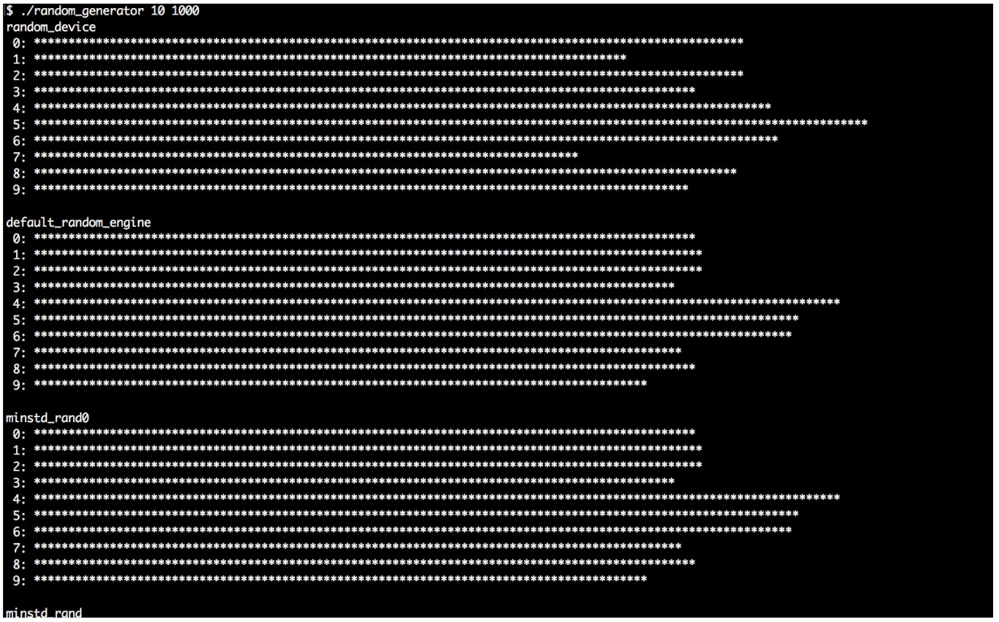
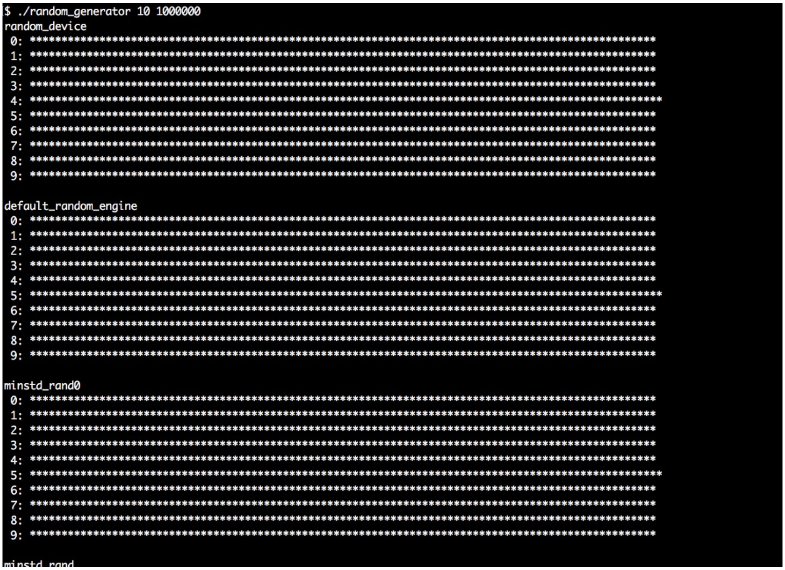

# 選擇合適的引擎生成隨機數

有時我們在寫程序的時候需要用隨機數，C++11之前開發者通常會使用C函數`rand()`獲取隨機數。在C++11之後，STL中添加了一整套隨機數生成器，每一個隨機數生成器都有自己的特性。

這些生成器並非都是以自解釋的方式命名，所以我們要在本節對它們進行了解。本節最後，我們會了解它們有什麼不同，哪種情況下應該選擇哪一個。不過，這麼多生成器，我們不會全部用到。

## How to do it...

我們將實現一個生產者，通過隨機生成器畫出漂亮的直方圖。然後，我們將通過這個生成器運行STL中所有的隨機值生成引擎，並且對其產生的結果進行了解。這個程序有很多重複的代碼，所以你可以從本書的代碼庫中直接對源碼進行拷貝，這樣要比手動輸入快得多。

1. 包含必要的頭文件，並聲明所使用的命名空間：

   ```c++
   #include <iostream>
   #include <string>
   #include <vector>
   #include <random>
   #include <iomanip>
   #include <limits>
   #include <cstdlib>
   #include <algorithm>
   
   using namespace std;
   ```

2. 然後，實現一個輔助函數，其能幫助我們將各種類型的隨機數生成引擎的結果進行統計。其接受兩個參數：一個`partitions`數和一個`samples`數。隨機生成器的類型是通過模板參數`RD`定義的。這個函數中做的第一件事，就是給結果數值類型進行別名。我們同樣要保證至少要將所有數字分成10份：

   ```c++
   template <typename RD>
   void histogram(size_t partitions, size_t samples)
   {
       using rand_t = typename RD::result_type;
       partitions = max<size_t>(partitions, 10);
   ```

3. 接下來，我們將使用`RD`類型實例化一個生成器。然後，我們定義一個除數變量`div`。所有隨機數引擎所產生的隨機數都在`0`到`RD::max()`之間。函數參數`partitions`，允許我們將生成數分成幾類。通過對可能的最大值進行分組，我們就能瞭解每一類的大小如何：

   ```c++
   	RD rd;
   	rand_t div ((double(RD::max()) + 1) / partitions); 
   ```

4. 接著，將使用一個`vector`對生成數進行計數，與我們類型的個數相同。然後，從隨機引擎中獲取很多隨機值，其個數與`samples`數一致。`rd()`表達式會從生成器中得到一個隨機數，並且調整內部狀態以生成下一個隨機數。每個隨機數都會與`div`進行相除，這樣我們就得到了其所在類的索引號，然後將`vector`對應位置的計數器進行加1：

   ```c++
   	vector<size_t> v (partitions);
       for (size_t i {0}; i < samples; ++i) {
       	++v[rd() / div];
       } 
   ```

5. 現在就有了一個粗粒度的直方圖。為了將其進行打印，就要知道實際計數器的值。可以使用`max_element`算法提取計數器的最大值。然後，將計數器的最大值除以100。這樣就可以將所有計數器的值除以`max_div`，得到的結果就在0到100的範圍內，我們要打印多少星號。當計數器最大值小於100時，因為我們採樣的數量也不是很多，所以我們使用`max`函數將被除數的值設置為1：

   ```c++
       rand_t max_elm (*max_element(begin(v), end(v)));
       rand_t max_div (max(max_elm / 100, rand_t(1)));
   ```

6. 將直方圖打印在終端上，每個類都有自己的一行。通過對`max_div`的除法確定有多少`*`要進行打印，我們將會在終端上得到一段固定長度的直方圖打印：

   ```c++
       for (size_t i {0}; i < partitions; ++i) {
           cout << setw(2) << i << ": "
           	<< string(v[i] / max_div, '*') << '\n';
       }
   }
   ```

7. 現在可以來完成主函數了。我們讓用戶來確定分成多少類，並對多少數進行採樣：

   ```c++
   int main(int argc, char **argv)
   {
       if (argc != 3) {
           cout << "Usage: " << argv[0]
           	<< " <partitions> <samples>\n";
           return 1;
       }
   ```

8. 然後，就可以從命令行來獲取這兩個值。當然，從命令行獲取到的是字符串，我們需要使用`std::stoull`將其轉換成數字(stoull為“**s**tring **to u**nsigned **l**ong **l**ong”的縮寫)：

   ```c++
   	size_t partitions {stoull(argv[1])};
   	size_t samples {stoull(argv[2])};
   ```

9. 現在我們就可以為STL提供的每種隨機數引擎，使用我們的直方圖輔助函數。這裡就是本節代碼最長的部分。你可以選擇從代碼庫中直接拷貝代碼過來。然後對程序的輸出進行觀察。我們從`random_device`開始。這個設備試圖將所有隨機值均勻分配：

   ```c++
   	cout << "random_device" << '\n';
   	histogram<random_device>(partitions, samples);
   ```

10. 下一個隨機引擎為`default_random_engine`，這種引擎的具體實現需要用實現來指定。其可能是後面任何一種隨機引擎：

   ```c++
   	cout << "\ndefault_random_engine" << '\n';
   	histogram<default_random_engine>(partitions, samples);
   ```

11. 然後，我們將嘗試其他引擎：

    ```c++
        cout << "\nminstd_rand0" << '\n';
        histogram<minstd_rand0>(partitions, samples);
        cout << "\nminstd_rand" << '\n';
        histogram<minstd_rand>(partitions, samples);
    
        cout << "\nmt19937" << '\n';
        histogram<mt19937>(partitions, samples);
        cout << "\nmt19937_64" << '\n';
        histogram<mt19937_64>(partitions, samples);
    
        cout << "\nranlux24_base" << '\n';
        histogram<ranlux24_base>(partitions, samples);
        cout << "\nranlux48_base" << '\n';
        histogram<ranlux48_base>(partitions, samples);
    
        cout << "\nranlux24" << '\n';
        histogram<ranlux24>(partitions, samples);
        cout << "\nranlux48" << '\n';
        histogram<ranlux48>(partitions, samples);
    
        cout << "\nknuth_b" << '\n';
        histogram<knuth_b>(partitions, samples);
    }
    ```

12. 編譯並運行程序，就會得到我們想要的結果。我們將看到一段很長的打印信息，並且將看到所有引擎的不同特點。這裡我們將類別分為10個，並對1000個數進行採樣：

    

13. 然後我們再次執行程序。這次我們仍舊分成10類，但是對1,000,000個數進行採樣。其將會生成非常直觀的直方圖，能更加清晰表現各種引擎的不同點。所以，對於這個程序來說，觀察很重要：

    

## How it works...

通常，任何隨機數生成器都需要在使用前進行實例化。生成的對象可以像函數一樣調用，並無需傳入參數，因為其對`operator()`操作符進行了重載。每一次調用都會產生一個新的隨機數。其使用起來非常的簡單。

本節中，我們寫了一個比較複雜的程序，從而對各種隨機數生成器進行了瞭解。可以使用我們的程序，在命令行傳入不同的參數，得到如下的結論：

- 我們進行的採樣次數越多，計數器分佈就越均勻。
- 各個引擎中，計數器的分佈有很大差異。
- 進行大量的樣本採樣時，每個隨機數引擎所表現出的性能也是不同的。
- 用少量的採樣進行多次的執行。每個分佈生成的圖形，每次都是一樣的——因為隨機引擎在每一次重複時，都會生成同樣的隨機數，這就意味著其生成的不是真正的隨機數。這樣的引擎具有某種確定性，因為其生成的隨機數可以進行預測。唯一的例外就是`std::random_device`。

如同我們所看到的，這裡有一些需要進行考量的特性。對於大多數標準應用來說，`std::default_random_engine`完全夠用。對於密碼學專家或是類似安全敏感的課題，都會有更加多的引擎可供選擇。不過，對於一般開發者來說，這裡的是否真正隨機，對我們的影響並不大。

我們需要從本節總結出三個實際情況：

1. 通常，選擇使用`std::default_random_engine`就夠用了。
2. 需要生成不確定的隨機數時，我們可以使用`std::random_device`。
3. 通過`std::random_device`(或從系統時鐘獲取的時間戳)對隨機數引擎進行初始化，這是為了讓其在每次調用時，生成不同的隨機數。這種方式也叫做“設置種子”。

> Note：
>
> 如果實際實現庫對不確定的隨機引擎不支持，那麼`std::random_device`將退化成其他隨機數引擎。

