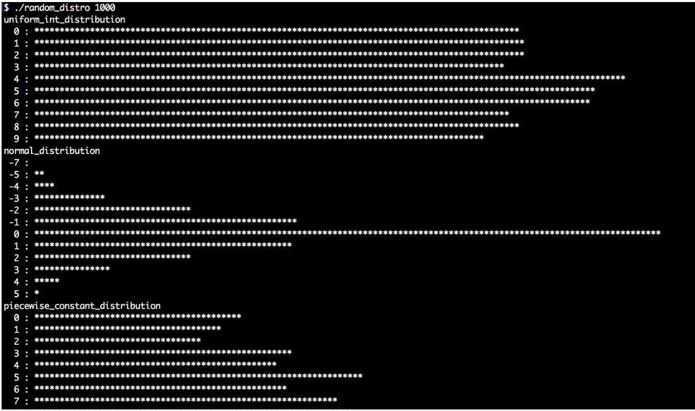
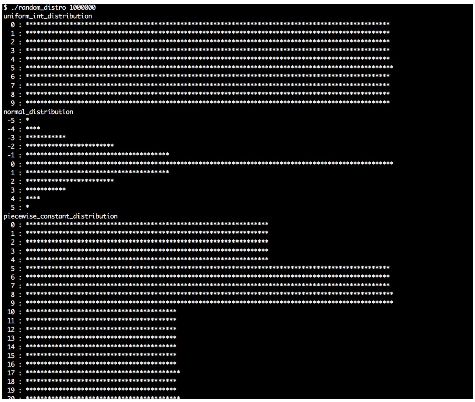

# 讓STL以指定分佈方式產生隨機數

上一節中，我們瞭解了STL中的隨機數引擎。使用引擎或其他方式生成隨機數，只是完成了一半的工作。

另一個問題就是，我們需要怎麼樣的隨機數？如何以編碼的方式進行擲硬幣？通常都會使用`rand()%2`的方式進行，因為其結果為0或1，也就分別代表著硬幣的正反面。很公平，不是麼；這樣就不需要任何多餘的庫(估計只有數學專業知道，這樣的方式獲取不到高質量隨機數)。

如果我們想要做成一個模型要怎麼弄？比如：寫成`(rand() % 6) + 1`，這個就表示所要生成的結果。對於這樣簡單的任務，有沒有庫進行支持？

當我們想要表示某些東西，並明確其概率為66%呢？Okay，我們可以寫一個公式出來`bool yesno = (rand() % 100 > 66)`。(這裡需要注意，是使用`>=`合適？還是使用`>`合適？)

如何設置一個不平等的模型，也就是生成數的概率完全不同呢？或是，讓我們生成的隨機數符合某種複雜的分佈？有些問題會很快發展為一個科學問題。為了回到我們的關注點上，讓我們瞭解一下STL所提供的具體工具。

STL有超過10種分佈算法，能用來指定隨機數的生成方式。本節中，我們將簡單的瞭解一下這些分佈，並且近距離了解一下其使用方法。

## How to do it...

我們生成隨機數，對生成數進行統計，並且將其分佈部分在終端上進行打印。我們將瞭解到，當想要以特定的分佈獲取隨機值時，應該使用哪種方式：

1. 包含必要的頭文件，並聲明所使用的命名空間：

   ```c++
   #include <iostream>
   #include <iomanip>
   #include <random>
   #include <map>
   #include <string>
   #include <algorithm>
   
   using namespace std; 
   ```

2. 對於STL所提供的分佈來說，我們將從打印出的直方圖中看出每種分佈的不同。隨機採樣時，可以將某種分佈作為參數傳入隨機數生成器。然後，我們將實例化默認隨機引擎和一個`map`。這個`map`將獲取的值與其計數器進行映射，計數器表示這個數產生的頻率。我們使用一個限定函數作為隨機引擎的指定分佈，然後通過隨機引擎生成對應分佈的隨機值：

   ```c++
   template <typename T>
   void print_distro(T distro, size_t samples)
   {
       default_random_engine e;
       map<int, size_t> m;
   ```

3. 使用`samples`變量來表示我們要進行多少次採樣，並且在採樣過程中對`map`中的計數器進行操作。這樣，就能獲得非常漂亮的直方圖。單獨調用`e()`時，隨機數引擎將生成一個隨機數，`distro(e)`會通過分佈對象對隨機數的生成進行限定。

   ```c++
       for (size_t i {0}; i < samples; ++i) {
       	m[distro(e)] += 1;
       }
   ```

4. 為了輸出到終端窗口中的數據的美觀性，需要了解計數器的最大值。`max_element`函數能幫助我們找到`map`中所有計數器中的最大的那一個，然後返回指向具有最大計數器那個節點的迭代器。知道了最大值，就可以讓所有計數器對其進行除法，這樣就能在終端窗口生成固定長度的圖像了：

   ```c++
   	size_t max_elm (max_element(begin(m), end(m),
   		[](const auto &a, const auto &b) {
   			return a.second < b.second;
   		})->second);
   	size_t max_div (max(max_elm / 100, size_t(1)));
   ```

5. 現在來遍歷`map`，然後對`*`進行打印，對於每一個計數器來說都有一個固定的長度：

   ```c++
       for (const auto [randval, count] : m) {
           if (count < max_elm / 200) { continue; }
           
           cout << setw(3) << randval << " : "
           	<< string(count / max_div, '*') << '\n';
       }
   }
   ```

6. 主函數中，會對傳入的參數進行檢查，我們會指定每個分佈所使用的採樣率。如果用戶給定的參數不合適，程序將報錯：

   ```c++
   int main(int argc, char **argv)
   {
       if (argc != 2) {
           cout << "Usage: " << argv[0]
           	<< " <samples>\n";
           return 1;
       } 
   ```

7. `std::stoull`會將命令行中的參數轉換成數字：

   ```c++
   	size_t samples {stoull(argv[1])};
   ```

8. 首先，來嘗試`uniform_int_distribution`和`normal_distribution`，這兩種都是用來生成隨機數的經典分佈。學過概率論的同學應該很熟悉。均勻分佈能接受兩個值，確定生成隨機數的上限和下限。例如，0和9，那麼生成器將會生成`[0, 9]`之間的隨機數。正態分佈能接受平均值和標準差作為傳入參數：

   ```c++
       cout << "uniform_int_distribution\n";
       print_distro(uniform_int_distribution<int>{0, 9}, samples);
       
   	cout << "normal_distribution\n";
       print_distro(normal_distribution<double>{0.0, 2.0}, samples);
   ```

9. 另一個非常有趣的分佈是`piecewise_constant_distribution`。其能接受兩個輸入範圍作為參數。比如定義為`0, 5, 10, 30`，那麼其中的間隔就是0到4，然後是5到9，最後一個間隔是10到29。另一個輸入範圍定義了權重。比如權重`0.2, 0.3, 0.5`，那麼最後生成隨機數落在以上三個間隔中的概率為20%，30%和50%。在每個間隔內，生成數的概率都是相同的：

   ```c++
       initializer_list<double> intervals {0, 5, 10, 30};
       initializer_list<double> weights {0.2, 0.3, 0.5};
       cout << "piecewise_constant_distribution\n";
       print_distro(
           piecewise_constant_distribution<double>{
               begin(intervals), end(intervals),
               begin(weights)},
           samples); 
   ```

10. `piecewise_linear_distribution`的構造方式與上一個類似，不過其權重值的特性卻完全不同。對於每一個間隔的邊緣值，只有一種權重值。從一個邊界轉換到另一個邊界中，概率是線性的。這裡我們使用同樣的間隔列表，但權重值不同的方式對分佈進行實例化：

    ```c++
        cout << "piecewise_linear_distribution\n";
        initializer_list<double> weights2 {0, 1, 1, 0};
        print_distro(
            piecewise_linear_distribution<double>{
                begin(intervals), end(intervals), begin(weights2)},
            samples);
    ```

11. 伯努利分佈是另一個非常重要的分佈，因為其分佈只有“是/否”，“命中/未命中”或“頭/尾”值，並且這些值的可能性是指定的。其輸出只有0或1。另一個有趣的分佈，就是`discrete_distribution`。例子中，我們離散化了一組值`1, 2, 4, 8`。這些值可被解釋為輸出為0至3的權重：

    ```c++
        cout << "bernoulli_distribution\n";
        print_distro(std::bernoulli_distribution{0.75}, samples);
        
    	cout << "discrete_distribution\n";
        print_distro(discrete_distribution<int>{ {1, 2, 4, 8} }, samples);
    ```

12. 不同分佈引擎之間有很大的不同。都非常特殊，也都在特定環境下非常有用。如果你沒有聽說過這些分佈，應該對其特性不是特別的瞭解。不過，我們的程序中會生成非常漂亮的直方圖，通過打印圖，你會對這些分佈有所瞭解：

    ```c++
    	cout << "binomial_distribution\n";
        print_distro(binomial_distribution<int>{10, 0.3}, samples);
        cout << "negative_binomial_distribution\n";
        print_distro(
            negative_binomial_distribution<int>{10, 0.8},
            samples);
        cout << "geometric_distribution\n";
        print_distro(geometric_distribution<int>{0.4}, samples);
        cout << "exponential_distribution\n";
        print_distro(exponential_distribution<double>{0.4}, samples);
        cout << "gamma_distribution\n";
        print_distro(gamma_distribution<double>{1.5, 1.0}, samples);
        cout << "weibull_distribution\n";
        print_distro(weibull_distribution<double>{1.5, 1.0}, samples);
        cout << "extreme_value_distribution\n";
        print_distro(
            extreme_value_distribution<double>{0.0, 1.0},
            samples);
        cout << "lognormal_distribution\n";
        print_distro(lognormal_distribution<double>{0.5, 0.5}, samples);
        cout << "chi_squared_distribution\n";
        print_distro(chi_squared_distribution<double>{1.0}, samples);
        cout << "cauchy_distribution\n";
        print_distro(cauchy_distribution<double>{0.0, 0.1}, samples);
        cout << "fisher_f_distribution\n";
        print_distro(fisher_f_distribution<double>{1.0, 1.0}, samples);
        cout << "student_t_distribution\n";
        print_distro(student_t_distribution<double>{1.0}, samples);
    }
    ```

13. 編譯並運行程序，就可以得到如下輸入。首先讓我們對每個分佈進行1000個的採樣看看：

     

14. 然後在用1,000,000個採樣，這樣獲得的每個分佈的直方圖會更加的清楚。不過，在生成隨機數的過程中，我們也會了解到那種引擎比較快，哪種比較慢：

    

## How it works...

我們通常都不會太在意隨機數引擎，不過隨著我們對隨機數分佈的要求和對生成速度的要求，我們就需要通過隨機數引擎來解決這個問題。

為了使用任意的分佈，首先實例化一個分佈對象。會看到不同分佈的構造函數所需要的構造參數並不相同。本節的描述中，只使用了一部分分佈引擎，因為其中大部分的用途非常特殊，或是使用起來非常複雜。不用擔心，所有分佈的描述都可以在C++ STL文檔中查到。

不過，當具有一個已經實例化的分佈時，我們可以像函數一樣對其進行調用(只需要一個隨機數引擎對象作為參數)。然後，隨機數生成引擎會生成一個隨機數，通過特定的分佈進行對隨機值進行限定，然後得到了所限定的隨機數。這就導致不同的直方圖具有不同的分佈，也就是我們程序輸出的結果。

可以使用我們剛剛編寫的程序，來確定不同分佈的功能。另外，我們也對幾個比較重要的分佈進行了總結。程序中使用到分佈並不都會在下表出現，如果你對某個沒出現的分佈感興趣，可以查閱C++ STL文檔的相關內容。


| 分佈                                                         | 描述                                                         |
| ------------------------------------------------------------ | ------------------------------------------------------------ |
| [uniform_int_distribution](http://zh.cppreference.com/w/cpp/numeric/random/uniform_int_distribution) | 該分佈接受一組上下限值作為構造函數的參數。之後得到的隨機值就都是在這個範圍中。我們可能得到的每個值的可能性是相同的，直方圖將會是一個平坦的圖像。這個分佈就像是擲骰子，因為擲到骰子的每一個面的概率都是相等的。 |
| [normal_distribution](http://zh.cppreference.com/w/cpp/numeric/random/normal_distribution) | 正態分佈或高斯分佈，自然界中幾乎無處不在。其STL版本能接受一個平均值和一個標準差作為構造函數的參數，其直方圖的形狀像是屋頂一樣。其分佈於人類個體高度或動物的IQ值，或學生的成績，都符合這個分佈。 |
| [bernoulli_distribution](http://zh.cppreference.com/w/cpp/numeric/random/bernoulli_distribution) | 當我們想要一個擲硬幣的結果時，使用伯努利分佈就非常完美。其只會產生0和1，並且其構造函數的參數是產生1的概率。 |
| [discrete_distribution](http://zh.cppreference.com/w/cpp/numeric/random/discrete_distribution) | 當我們有一些限制的時候，我們就可以使用離散分佈，需要我們為每個間隔的概率進行定義，從而得到離散集合的值。其構造函數會接受一個權重值類別，並且通過權重值的可能性產生相應的隨機數。當我們想要對血型進行隨機建模時，每種血型的概率是不一樣，這樣這種引擎就能很完美地契合這種需求。 |

