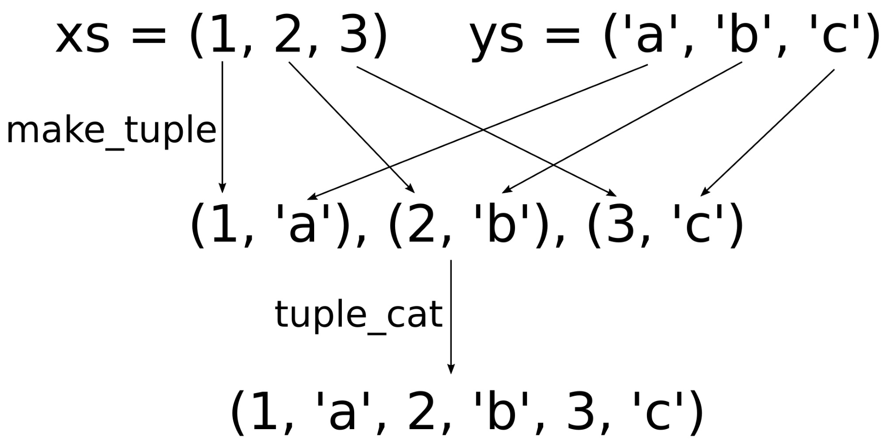

# 使用元組快速構成數據結構

我們已經在上一節中瞭解元組的基本使用方法。現在我們使用一個結構體，對一些變量進行捆綁：

```c++
struct Foo {
  int a;
  string b;
  float c;
};
```

之前的章節中，為了替代定義結構體，我們可以定義一個元組：

```c++
using Foo = tuple<int, string, float>;
```

我們可以根據類型列表中的索引，從而獲取相應變量的具體值。如要訪問元組他的第一個類型變量，可以使用`std::get<0>(t)`，第二個類型變量為`std::get<1>(t)`，以此類推。如果索引值過大，編譯器會在編譯時進行報錯。

之前的章節中已經展示了C++17對元組的分解能力，允許我們使用如下的方式快速分解元素，並能對單獨元素進行訪問：

```c++
auto [a, b, c] = some_tuple
```

綁定和分解單個數據結構，只是元組能力之一。我們也可以想盡辦法對元組進行連接和分割。本節中，我們將學習如何完成這樣的任務。

## How to do it...

本節，我們將完成對任意元組進行打印的任務。另外，我們將完成一個函數，可以對元組進行zip操作：

1. 包含必要的頭文件，並聲明所使用的命名空間：

   ```c++
   #include <iostream>
   #include <tuple>
   #include <list>
   #include <utility>
   #include <string>
   #include <iterator>
   #include <numeric>
   #include <algorithm>
   
   using namespace std;
   ```

2. 我們對要處理的元組中的內容非常感興趣，所以想要對其內容進行展示。因此，將實現一個非常通用的函數，能對任意具有可打印變量的元組進行打印。這個函數能接受一個輸出流引用`os`和一個可變的參數列表，其中具有元組中的所有成員。為瞭解析這些參數，我們將一個參數放在`v`中，其餘的放在參數包`vs...`中：

   ```c++
   template <typename T, typename ... Ts>
   void print_args(ostream &os, const T &v, const Ts &...vs)
   {
   	os << v;
   ```

3. 然後，我們就對參數包vs進行處理，其會使用逗號將`initializer_list`中的元素進行隔開。你可以回看一下第4章的[使用同一輸入調用多個函數](content/chapter4/chapter4-5-chinese.md)，瞭解下如何使用Lambda表達式來完成這個操作：

   ```c++
   	(void)initializer_list<int>{((os << ", " << vs), 0)...};
   }
   ```

4. 現在就可以對任意的變量進行打印了，例如：`print_args(cout, 1, 2, "foo", 3, "bar")`。不過，依舊無法對元組進行處理。為了實現打印元組的功能，我們會對輸出操作符`<<`進行重載，通過實現一個模板函數來匹配任意元組類型：

   ```c++
   template <typename ... Ts>
   ostream& operator<<(ostream &os, const tuple<Ts...> &t)
   {
   ```

5. 接下來會有些複雜。首先，使用Lambda表達式來接收任意多個參數。當調用Lambda表達式時，啟用`os`參數就會傳入`print_args`函數中組成新的參數列表。這也就意味著，對`capt_tup(...some parameters...)`的調用，會形成對`print_args(os, ...some parameters...)`的調用：

   ```c++
   	auto print_to_os ([&os](const auto &...xs) {
   		print_args(os, xs...);
   	});
   ```

6. 現在就可以來完成對元組解包的工作了。使用`std::apply`對元組進行解包，所有值將會解析成單獨的變量，然後傳入到所調用的函數中。當元組t為`(1, 2, 3)`時，調用`apply(capt_tup, t)`等價於`capt_tup(1, 2, 3)`的調用，隨後就會調用`print_args(os, 1, 2, 3)`。最後，我們用小括號來包圍所要打印的信息：

   ```c++
       os << "(";
       apply(print_to_os, t);
       return os << ")";
   }
   ```

7. Okay，現在已經完成打印元組代碼的編寫，這將讓後續的工作會變得更容易。不過，需要為元組做更多的事情。例如，編寫一個可以接受迭代範圍的函數。這個函數可以幫助對對應範圍進行迭代，然後返回這段範圍中所有值的加和，並且找到這個範圍內的最小值和最大值，還要能對所有值求平均。並將這四個值打包入一個元組中，我們可以不添加任何新的結構體類型類，來獲取其中每一個成員的值：

   ```c++
   template <typename T>
   tuple<double, double, double, double>
   sum_min_max_avg(const T &range)
   {
   ```

8. `std::minmax_element`會返回一對迭代器，其分別表示輸入範圍內的最小值和最大值。`std::accumulate`將會返回輸入範圍內所有值的加和。這樣就能獲得我們元組中的所有元素了！

   ```c++
       auto min_max (minmax_element(begin(range), end(range)));
       auto sum (accumulate(begin(range), end(range), 0.0));
       return {sum, *min_max.first, *min_max.second,
       		sum / range.size()};
   }
   ```

9. 實現主函數之前，我們將實現最後一個神奇輔助函數。為什麼說這個函數神奇呢？因為這個函數看起來非常複雜，但當瞭解工作原理後，你就能理解了，這個函數會對兩個元組進行zip操作。也就是說，當傳入兩個元組`(1, 2, 3)`和`('a', 'b', 'c')`時，函數將會返回一個值為`(1, 'a', 2, 'b', 3, 'c')`的元組：

   ```c++
   template <typename T1, typename T2>
   static auto zip(const T1 &a, const T2 &b)
   {
   ```

10. 接下來，我們將會看到本節中最為複雜的幾行代碼。我們會創建一個函數對象`z`，其能接受任意數量的參數。其會返回另一個函數對象，返回的函數對象將獲取的所有參數打包成`xs`，不過其也能接受任意數量的參數。其內部的函數對象可以對參數列表包`xs`和`ys`進行訪問。現在就讓我們看一下，如何對這兩個參數列表包進行操作。` make_tuple(xs, ys)... `會將參數分組。當`xs = 1, 2, 3`並且`ys = 'a', 'b', 'c'`時，我們將會返回一個新的參數包`(1, 'a'), (2, 'b'), (3, 'c')`。三個元組中，用逗號來對每個成員進行區分。為了獲取分組後的元組，我們使用了`std::tuple_cat`，其能接受任意數量的元組，並且將其解包後放入一個元組中。這樣我們就可以獲得一個新元組`(1, 'a', 2, 'b', 3, 'c')`：

   ```c++
       auto z ([](auto ...xs) {
           return [xs...](auto ...ys) {
           	return tuple_cat(make_tuple(xs, ys) ...);
           };
       });
   ```

11. 最後一步就是將所有輸入元組中的成員解包出來，也就是將`a`和`b`進行解包後放入`z`中。`apply(z, a)`就表示將`a`中的所有值放入`xs`中，`apply(..., b) `就表示將`b`中的所有值放入`ys`中。最後的結果元組就是zip後的一個非常大的元組，其會返回給調用者：

    ```c++
    	return apply(apply(z, a), b);
    } 
    ```

12. 我們寫了非常多的輔助代碼。現在，我們就來使用這些輔助函數。首先，構造出一些元組。`student`類型包括ID，名字，和[GPA](https://zh.wikipedia.org/wiki/%E6%88%90%E7%B8%BE%E5%B9%B3%E5%9D%87%E7%A9%8D%E9%BB%9E)分數。`student_desc`使用人類可讀的格式對學生進行介紹。`std::make_tuple`是一個非常不錯的工廠函數，因為其能通過傳入的參數，自適應的生成對應的元組類型：

    ```c++
    int main()
    {
        auto student_desc (make_tuple("ID", "Name", "GPA"));
        auto student (make_tuple(123456, "John Doe", 3.7)); 
    ```

13. 我們對這些信息進行打印。因為已經對輸出流操作符進行過重載，所以打印並不是什麼難事：

    ```c++
    	cout << student_desc << '\n'
    		<< student << '\n';
    ```

14. 我們也可以通過`std::tuple_cat`將所有元組進行連接，然後進行打印：

    ```c++
    	cout << tuple_cat(student_desc, student) << '\n';
    ```

15. 我們有可以通過我們的zip函數創建新的元組：

    ```c++
    	auto zipped (zip(student_desc, student));
    	cout << zipped << '\n';
    ```

16. 別忘記`sum_min_max_avg`函數。我們將初始化列表中具有一些數字，並且會將這些數字傳入這個函數中。創建了另一個同等大小的元組，其包含了一些描述字符串，這可能會讓程序變得複雜一些。通過zip這些元組，並將這些元組交錯的存儲在了一起：

    ```c++
        auto numbers = {0.0, 1.0, 2.0, 3.0, 4.0};
        cout << zip(
                make_tuple("Sum", "Minimum", "Maximum", "Average"),
                sum_min_max_avg(numbers))
            << '\n';
    }
    ```

17. 編譯並運行程序，我們就會得到如下輸出。前兩行是`student`和`student_desc`元組的打印結果。第3行是使用`tuple_cat`組合後的輸出結果。第4行是將學生元組進行`zip`後的結果。最後一行我們將會看到對應數字列表的和值、最小值、最大值和均值。因為有`zip`操作，我們可以清楚地瞭解這些數字的意義：

    ```c++
    $ ./tuple
    (ID, Name, GPA)
    (123456, John Doe, 3.7)
    (ID, Name, GPA, 123456, John Doe, 3.7)
    (ID, 123456, Name, John Doe, GPA, 3.7)
    (Sum, 10, Minimum, 0, Maximum, 4, Average, 2)
    ```

## How it works...

本節的有些代碼的確比較複雜。我們對元組的`operator<<`操作符進行了重載實現，這樣看起來比較複雜，但是這樣就能對元組中的成員進行打印。然後我們實現`sum_min_max_avg`函數，其會返回一個元組。另外，`zip`應該是個比較複雜的函數。

這裡最簡單的函數是`sum_min_max_avg`。當我們定義一個函數`tuple<Foo, Bar, Baz> f()`時，我們可以將返回語句寫成`return {foo_instance, bar_instance, baz_instance};`，這樣函數將會自動的構建一個元組進行返回。如果你對`sum_min_max_avg`中所使用的STL函數有疑問，那可以回看一下第5章，其中有一些STL的基本函數操作。

其他較為複雜的部分，就是一些輔助函數：

**operator<< for tuples**

使用`operator<<`對輸出流進行輸出時，我們實現了`print_args`函數。其可以接受任意個參數，不過第一個參數必須是一個`ostream`實例：

```c++
template <typename T, typename ... Ts>
void print_args(ostream &os, const T &v, const Ts &...vs)
{
	os << v;
    
	(void)initializer_list<int>{((os << ", " << vs), 0)...};
}
```

這個函數打印的第一個元素是`v`，然後會將參數包`vs`中的元素進行打印。我們將第一個元素單獨拎出來的原因是要使用逗號將所有元素進行分隔，但是我們不確定哪個參數是頭或是尾(也就是要打印成“1, 2, 3”或是“,1, 2, 3”)。我們在第4章瞭解到使用Lambda表達式對`initializer_list`進行擴展，也就是[使用同一輸入調用多個函數](content/chapter4/chapter4-5-chinese.md)這一節。這個函數，就能幫我們對元組進行打印。`operator<<`實現如下所示：

```c++
template <typename ... Ts>
ostream& operator<<(ostream &os, const tuple<Ts...> &t)
{
    auto capt_tup ([&os](const auto &...xs) {
    	print_args(os, xs...);
    });
    
    os << "(";
    apply(capt_tup, t);
    return os << ")";
}
```

首先我們定義了一個函數對象`capt_tup`。當我們調用`capt_tup(foo, ar, whatever)`時，其實際調用的是print_args(**os**, foo, bar, whatever)。這個函數只會做一件事，就是將可變列表中的參數輸出到輸出流對象`os`中。

之後，我們使用`std::apply`對元組`t`進行解包。如果這步看起來很複雜，那麼可以看一下前一節，以瞭解`std::apply`的工作原理。

**元素的zip函數**

zip函數能夠接收兩個元組，雖然其實現很清晰，但是看起來還是異常複雜：

```c++
template <typename T1, typename T2>
auto zip(const T1 &a, const T2 &b)
{
    auto z ([](auto ...xs) {
        return [xs...](auto ...ys) {
        	return tuple_cat(make_tuple(xs, ys) ...);
        };
    });
    return apply(apply(z, a), b);
}
```

為了能更好的瞭解這段代碼，我們可以假設有兩個元組，一個元組a為(1, 2, 3)，另一個元組b為('a', 'b', 'c')。

例程中，我們調用了`apply(z, a)`，也就相當於調用函數`z(1, 2, 3)`，其會構造一個哈數對象將這些參數捕獲後進行返回，這樣1，2，3就被放入參數包`xs`中了。這裡會再次調用，`apply(z(1, 2, 3), b)`，會將'a', 'b', 'c'放入參數包`ys`中。

Okay，現在`xs = (1, 2, 3)`，`ys = ('a', 'b', 'c')`，然後會發生什麼呢？`tuple_cat(make_tuple(xs, ys) ...)`就會完成下圖所描述的過程：



首先，`xs`和`ys`中的成員將會被zip到一起，也就是交叉配對在一起。這個交叉配對發生在`  make_tuple(xs, ys)... `部分，這會將兩個元組組成一個元組。為了獲得一個大元組，我們使用了`tuple_cat`，通過對元組的級聯獲取一個大的元組，其包含了所有元組中的成員，並進行了交叉配對。