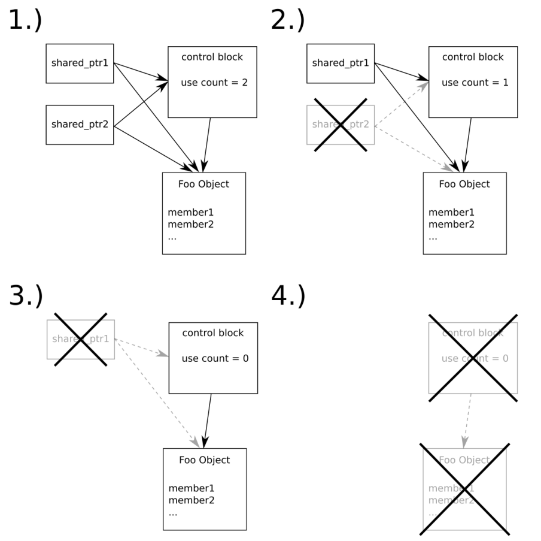

# 處理共享堆內存——std::shared_ptr

上一節中，我們瞭解瞭如何使用`unique_ptr`。這個類型非常有用，能幫助我們管理動態分配的對象。不過，所有權只能讓一個類型對象所有，不能讓多個對象指向同一個動態分配的對象。

指針類型`shared_ptr`就是為了應對這種情況所設計的。共享指針可以隨時進行拷貝，其內部有一個計數器，記錄了有多少對象持有這個指針。只有當最後一個持有者被銷燬時，才會對動態分配的對象進行刪除。同樣，其也不會讓我們陷入內存洩漏的窘境，因為對象也會在使用之後進行自動刪除。同時，需要確定對象沒有過早的被刪除，或是刪除的過於頻繁(每次對象的創建都要進行一次刪除)。

本節中，你將瞭解到如何使用`shared_ptr`自動的對動態對象進行管理，並且能在多個所有者間共享動態對象，而後瞭解其與`unique_ptr`之間的區別：

## How to do it...

我們將完成一個與`unique_ptr`節類似的程序，以展示`shared_ptr`的用法：

1. 包含必要的頭文件，並聲明所使用的命名空間：

   ```c++
   #include <iostream>
   #include <memory>
   
   using namespace std; 
   ```

2. 然後定義一個輔助類，其能幫助我們瞭解類何時創建和銷燬。我們將會使用`shared_ptr`對內存進行管理：

   ```c++
   class Foo
   {
   public:
       string name;
       
       Foo(string n)
       	: name{move(n)}
       { cout << "CTOR " << name << '\n'; }
       
       ~Foo() { cout << "DTOR " << name << '\n'; }
   };
   ```

3. 接下來，我們將實現一個函數`Foo`，其參數的類型為共享指針。接受共享指針作為參數的方式，要比引用有意思的多，因為這樣我們不會進行拷貝，但是會改變共享這指針內部的計數器：

   ```c++
   void f(shared_ptr<Foo> sp)
   {
       cout << "f: use counter at "
       	<< sp.use_count() << '\n';
   }
   ```

4. 主函數中聲明一個空的共享指針。通過默認構造方式對其進行構造，其實際上是一個`null`指針：

   ```c++
   int main()
   {
   	shared_ptr<Foo> fa;
   ```

5. 下一步，我們將創建一個代碼段，並創建兩個`Foo`對象。使用`new`操作符對第一個對象進行創建，然後使用構造函數在`shared_ptr`中創建這一對象。直接使用`make_shared<Foo>`對第二個實例進行創建，使用我們提供的參數創建一個`Foo`實例。這種創建的方式很優雅，使用`auto`進行類型推斷，對象也算第一次訪問。這裡與`unique_ptr`很類似：

   ```c++
   	{
           cout << "Inner scope begin\n";
           
           shared_ptr<Foo> f1 {new Foo{"foo"}};
           auto f2 (make_shared<Foo>("bar"));
   ```

6. 當共享指針被共享時，需要記錄有多少個指針共享了這個對象。這需要內部引用計數器或使用獨立計數器完成，我們可以使用`use_count`將這個值進行輸出。現在其值為1，因為其還沒進行拷貝。我們可以`f1`拷貝到`fa`，其計數值將會為2。

   ```c++
   	cout << "f1's use counter at " << f1.use_count() << '\n';
   	fa = f1;
   	cout << "f1's use counter at " << f1.use_count() << '\n';
   ```

7. 離開這個代碼段時，共享指針`f1`和`f2`將會被銷燬。`f1`變量引用計數將會減少1，現在只有`fa`擁有這個`Foo`實例。當`f2`被回收時，其引用計數將減為0。因此，`shared_ptr`指針將對對象進行銷燬：

   ```c++
       }
       cout << "Back to outer scope\n";
       
   	cout << fa.use_count() << '\n';
   ```

8. 現在，讓我們用兩種方式調用`f`函數。第一種，我們使用直接拷貝`fa`的方式。`f`函數將會將引用計數輸出，值為2。在第二次對`f`的調用時，我們將指針移動到函數中。現在只有`f`函數對其指向的對象具有所有權：

   ```c++
   	cout << "first f() call\n";
       f(fa);
       cout << "second f() call\n";
       f(move(fa));
   ```

9. `f`返回之後，`Foo`實例就被立即銷燬，因為沒有任何指針對其有所有權。因此，在主函數返回前，所有對象就都會被銷燬：

   ```c++
   	cout << "end of main()\n";
   }
   ```

10. 編譯並運行程序就會得到如下輸出。起初，我們可以看到`foo`和`bar`被創建。然後指針的副本`f1`出現(其指向`foo`實例)，引用計數增加到2。當離開代碼段時，因為沒有任何指針在對指向`bar`實例的共享指針具有所有權，所以其會自動進行銷燬。現在`fa`的引用計數為1，因為現在只有`fa`對`foo`對象具有所有權。之後，我們調用了兩次`f`函數。第一次調用，我們對`fa`進行了拷貝，會再次將引用計數增為2。第二次調用時，我們將`fa`移動到`f`中，其對引用計數的數值並無影響。此外，因為`f`函數具有了`foo`對象指針的所有權，所以當`f`函數結束時，`foo`對象就自動銷燬了。主函數打印出最後一行前，堆上分配的動態對象就會被全部銷燬：

  ```c++
  $ ./shared_ptr
  Inner scope begin
  CTOR foo
  CTOR bar
  f1's use counter at 1
  f1's use counter at 2
  DTOR bar
  Back to outer scope
  1
  first f() call
  f: use counter at 2
  second f() call
  f: use counter at 1
  DTOR foo
  end of main()
  ```

## How it works...

`shared_ptr`的工作方式與`unique_ptr`的類似。構造共享指針和唯一指針的方法也非常類似(使用`make_shared`函數創建共享對象的指針，使用`make_unique`創建`unique_pointer`)。

`unique_ptr`和`shared_pointer`的最大區別在於可複製性上，因為共享指針內部具有一塊控制區域(control block)，其中有用來管理對象的指針，還有一個計數器。當有N個`shared_ptr`實例指向某個對象時，其內部的計數器的值就為N。當`shared_ptr`實例銷燬時，內部計數器會減1。當沒有指針對對象具有所有權時，計數器的值即為0，對象就會被自動銷燬。這樣我們就不用擔心內存洩漏了。

為了更加形象的說明，我們來看一下下面的圖：



第1步中，我們具有兩`shared_ptr`實例用於管理`Foo`類型的一個對象。所以其引用個數為2。然後，`shared_ptr2`被銷燬，計數就會變為1。因為還有指針指向其實例，所以`Foo`對象並未被銷燬。第3步中，最後一個共享指針也被銷燬了，這就導致引用計數為0。第4步會很快在第3步之後發生，所有控制塊和`Foo`實例都會被銷燬，並且其內存也會在堆上釋放。

瞭解了`shared_ptr`和`unique_ptr`，我們將能很容易的對動態分配的對象進行管理，並且不用擔心出現內存洩漏。不過，這裡有個忠告——共享指針避免在循環引用的指針間進行，這樣會讓計數器無法歸零，導致內存洩漏。

## There's more...

來看一下下面的代碼。你能告訴我這段代碼是否會發生內存洩漏嗎？

```c++
void function(shared_ptr<A>, shared_ptr<B>, int);
// "function" is defined somewhere else

// ...somewhere later in the code:
function(new A{}, new B{}, other_function());
```

你可能會反問我，“怎麼可能有內存洩漏呢？”，A和B在分配後就放入`shared_ptr`類型中，並且其之後會進行釋放，所以不會有內存洩漏。

你說的沒錯，當我們確定`shared_ptr`實例獲取了對應的指針時，那麼我們不會遇到內存洩漏。不過這個問題又好像有點琢磨不透。

我們調用函數`f(x(), y(), z())`時，編譯器需要在f前找到`x`，`y`，`z`函數的定義，並先運行這些函數，然後將其返回值傳入`f`函數中。結合我們上面的例子來說的話，對於編譯器來說執行`x`，`y`和`z`函數的順序並沒有被規定。

回看下我們給出的例子，當編譯器決定首先進行`new A{}`的操作，然後進行`other_function()`，再進行`new B{}`操作時，那麼能確保這些操作的結果會傳到`function`中嗎？當`other_function()`拋出一個異常，因為沒有使用`shared_ptr`對A進行管理，所以會造成內存洩漏。無論我們如何捕獲這個異常，對這個對象的處理機會已經不在，我們無法將其刪除。

這裡有兩種方法可以規避這個問題：

```c++
// 1.)
function(make_shared<A>(), make_shared<B>(), other_function());

// 2.)
shared_ptr<A> ap {new A{}};
shared_ptr<B> bp {new B{}};
function(ap, bp, other_function());
```

這樣，對象在傳入函數之前就被`shared_ptr`所保管，也就無所謂函數是否會在中途拋出異常了。