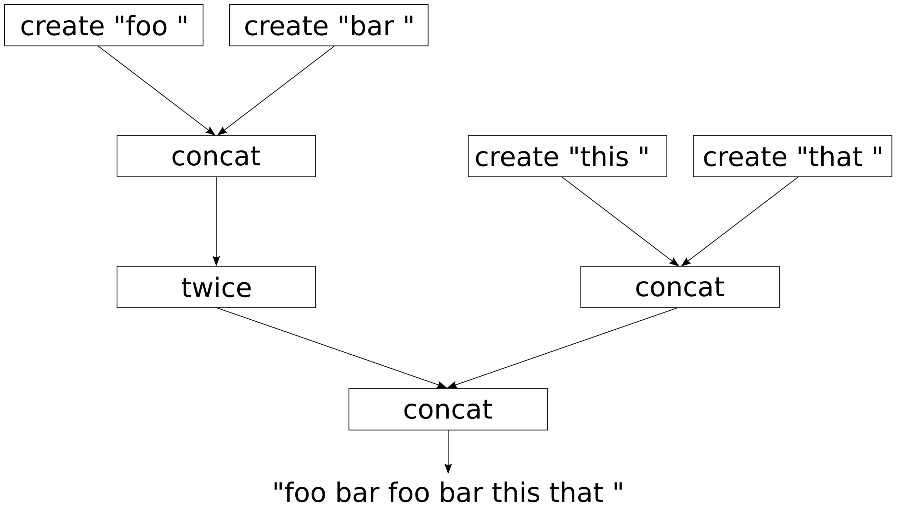
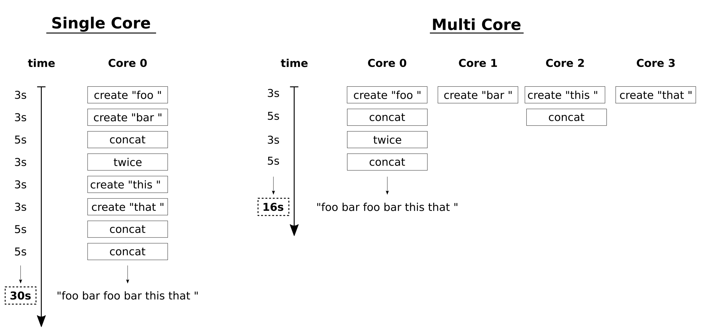

# 實現一個小型自動化並行庫——std::future

大多數複雜的任務都能分解為很多子任務。對於所有子任務，我們可以通過畫一張有向圖無環圖來描述哪些子任務鍵是有依賴的。我們來看一個例子，假設我們想要產出一個字符串`"foo bar foo barthis that "`，我們只能通過一個個字符進行產生，然後將這些詞彙拼接在一起。為了完成這項工作，我們提供了三個函數`create`，`concat`和`twice`。

考慮到這一點，我們可以通過繪製DAG圖來看一下詞組間相互的依賴關係：



實現過程中，當一個CPU核上串行的完成這些工作並沒有什麼問題。通過依賴關係在多個CPU核上執行任務，當所依賴的任務未完成時，只能處於等待狀態。

即使使用`std::async`，這樣寫出的代碼也太無趣了。因為子任務間的依賴關係需要提前建模。本節中，我們將實現兩個簡單的輔助庫，幫助我們將`create`，`concat`和`twice`函數轉換成異步的。這樣，我們就能找到一種更為優雅的方式，來設置依賴關係圖。執行過程中，代碼將會以一種智能的方式進行並行計算，並儘快將整個圖完成。

## How to do it...

本節中，我們將實現一些函數用來模擬計算敏感型任務，這些任務會互相依賴，我們的任務就是讓這些任務儘可能的並行執行：

1. 包含必要的頭文件，並聲明所使用的命名空間：

   ```c++
   #include <iostream>
   #include <iomanip>
   #include <thread>
   #include <string>
   #include <sstream>
   #include <future>
   
   using namespace std;
   using namespace chrono_literals;
   ```

2. 需要對輸出進行同步，所以可以使用之前章節中的同步輔助函數來幫助我們：

   ```c++
   struct pcout : public stringstream {
       static inline mutex cout_mutex;
       
       ~pcout() {
           lock_guard<mutex> l {cout_mutex};
           cout << rdbuf();
           cout.flush();
       }
   };
   ```

3. 現在，我們對三個字符串轉換函數進行實現。第一個函數會通過一個C風格的字符串來創建一個`std::string`對象。我們會讓這個函數休眠3秒，以模擬計算複雜度：

   ```c++ 
   static string create(const char *s)
   {
       pcout{} << "3s CREATE " << quoted(s) << '\n';
       this_thread::sleep_for(3s);
       return {s};
   }
   ```

4. 下一個函數需要兩個字符串對象作為參數，並且返回拼接後的結果。我們讓其休眠5秒：

   ```c++
   static string concat(const string &a, const string &b)
   {
       pcout{} << "5s CONCAT "
               << quoted(a) << " "
               << quoted(b) << '\n';
       this_thread::sleep_for(5s);
       return a + b;
   }
   ```

5. 最後一個函數接收一個字符串作為參數，並返回自己和自己拼接後的結果。我們讓其休眠3秒：

   ```c++
   static string twice(const string &s)
   {
       pcout{} << "3s TWICE " << quoted(s) << '\n';
       this_thread::sleep_for(3s);
       return s + s;
   }
   ```

6. 對於串行任務來說，這就已經準備好了，但是我們想使用並行的方式來完成。所以，我們還需要實現一些輔助函數。這裡需要注意了，下面三個函數看起來有些複雜。`asynchronize`能接收一個函數`f`，並返回一個其捕獲到的可調用對象。我們可以傳入任意數量的參數到這個可調用的對象中，然後其會將這些參數連同`f`捕獲到另一個可調用對象中，並且將這個可調用對象返回給我們。最後一個可調用對象不需要任何參數。之後，其會將參數傳入`f`中，並異步的執行函數`f`:

   ```c++
   template <typename F>
   static auto asynchronize(F f)
   {
       return [f](auto ... xs) {
           return [=] () {
           	return async(launch::async, f, xs...);
           };
       };
   } 
   ```

7. 接下來這個函數，將會使用下一步(也就是第8步)中我們聲明的函數。其能接受一個函數`f`，並且將該函數捕獲到一個可調用的對象中並返回。該對象可以被多個`future`對象所調用。然後，對`future`對象使用`.get()`，來獲取`f`中的結果：

   ```c++
   template <typename F>
   static auto fut_unwrap(F f)
   {
       return [f](auto ... xs) {
       	return f(xs.get()...);
       };
   }
   ```

8. 最後一個輔助函數能夠接受一個函數`f`。其會返回一個持有`f`函數的可調用對象。這個可調用對象可以傳入任意個參數，並且會將函數`f`與這些參數讓另一個可調用對象獲取。最後，返回給我們的可調用對象無需任何參數。然後，就可以調用`xs...`包中獲取到所有可調用對象。這些對象會返回很多`futrue`，這些`future`對象需要使用`fut_unwarp`進行展開。`future`展開，並會通過`std::async `對實際函數`f`進行執行，在通過`future`返回函數`f`執行的結果：

   ```c++
   template <typename F>
   static auto async_adapter(F f)
   {
       return [f](auto ... xs) {
           return [=] () {
               return async(launch::async,
               			fut_unwrap(f), xs()...);
           };
       };
   }
   ```

9. OK，完成以上工作的感覺就是“瘋狂”，這種表達式的嵌套讓我想起了電影《盜夢空間》的場景(上一步的代碼中，Lambda表達式會繼續返回一個Lambda表達式)。這段帶有魔法的代碼，我們會在後面來詳細的瞭解。現在，讓我們異步的使用`create`，`concat`和`twice`函數。`async_adapter`是一個非常簡單的函數，其會等待`future`參數，並返回一個`future`的結果，其會將同步世界轉換成異步世界。我們對`concat`和`twice`使用這個函數。我們必須對`create`使用`asynchronize`，因為其會返回一個`future`，不過我們會使用`future`對象獲取到的值，而非`future`對象本身。任務的依賴鏈，需要從`create`開始：

   ```c++
   int main()
   {
       auto pcreate (asynchronize(create));
       auto pconcat (async_adapter(concat));
       auto ptwice (async_adapter(twice));
   ```

10. 現在我們有了可以自動並行化的函數，其與同步代碼的函數名相同，不過添加了前綴`p`。現在，讓我們來設置一些比較複雜依賴關係樹。首先，我們創建兩個字符串`"foo"`和`"bar"`，然後進行拼接，返回`"foo bar"`。在`twice`中，字符串將會和自身進行拼接。然後，創建了字符串`"this"`和`"that"`，拼接得到`"this that"`。最後，我們拼接的結果為`"foo bar foo bar this that"`，結果將會保存在變量`callable`中。最後，調用`callable().get()`進行計算，並等待返回值，然後將返回值進行打印。我們沒有調用`callable()`時，計算不會開始，在我們對其進行調用後，就是見證奇蹟的時刻：

    ```c++
        auto result (
            pconcat(
                ptwice(
                pconcat(
                    pcreate("foo "),
                    pcreate("bar "))),
                pconcat(
                    pcreate("this "),
                    pcreate("that "))));
    
        cout << "Setup done. Nothing executed yet.\n";
    
        cout << result().get() << '\n';
    }
    ```

11. 編譯並運行程序，我們就會看到`create`每一次調用所產生的字符串，然後其他函數也開始執行。這個過程好像是通過智能調度來完成的，整個程序使用16秒完成。如果使用串行的方式，將會使用30s完成。需要注意的是，我們使用4核的機器來運行程序，也就是有4次`create`調用在同時進行。如果機器沒有太多和CPU，那麼運行時間會更長：

    ```c++
    $ ./chains
    Setup done. Nothing executed yet.
    3s CREATE "foo "
    3s CREATE "bar "
    3s CREATE "this "
    3s CREATE "that "
    5s CONCAT "this " "that "
    5s CONCAT "foo " "bar "
    3s TWICE"foo bar "
    5s CONCAT "foo bar foo bar " "this that "
    foo bar foo bar this that
    ```

## How it works...

本節例子的串行版本，可能看起來如下：

```c++
int main()
{
    string result {
        concat(
            twice(
                concat(
                    create("foo "),
                    create("bar "))),
            concat(
                create("this "),
                create("that "))) };
    
    cout << result << '\n';
}
```

本節中，我們完成了一些輔助函數，`async_adapter`和`asynchronize`，其能幫助我們對`create`，`concat`和`twice`函數進行包裝。然後調用其異步版本`pcreate`，`pconcat`和`ptwice`。

先不看這兩個函數複雜的實現，我們先來看一下我們獲得了什麼。

串行版本的代碼可能類似如下寫法：

```c++
string result {concat( ... )};
cout << result << '\n';
```

並行版本的寫法：

```c++
auto result (pconcat( ... ));
cout << result().get() << '\n';
```

好了！現在就是最複雜的環節了。並行最後的結果並不是`string`，而是一個能夠返回一個`future<string>`實例的可調用對象，我們可以對返回值調用`get()`得到函數運算後的值。這看起來可能很瘋狂。

所以，我們為什麼要返回`future`對象呢？問題在於我們的`create`，`concat`和`twice`函數運行起得來都非常慢。不過，我們通過依賴關係樹可以看到，數據流還是有可以獨立的部分，也就是可並行的部分。讓我們來看一下下面兩個例子的流水：



左側邊是單核的流水。所有函數一個接一個的在CPU上進行。這樣時間累加起來就是30秒。

右側邊是多核的流水。函數會通過依賴關係並行的運行。在有4個核的機器上，我們將同時創建4個子字符串，然後對其進行拼接，等等的操作。並行版本需要16秒就能完成任務。如果我們沒法讓函數本身變的更快，則我們無法再進行加速。4個CPU的情況下，我們能有如此的加速，其實我們可以以更好的方式進行調度。

應該怎麼做？

我們通常會寫成如下的模式：

```c++
auto a (async(launch::async, create, "foo "));
auto b (async(launch::async, create, "bar "));
auto c (async(launch::async, create, "this "));
auto d (async(launch::async, create, "that "));
auto e (async(launch::async, concat, a.get(), b.get()));
auto f (async(launch::async, concat, c.get(), d.get()));
auto g (async(launch::async, twice, e.get()));
auto h (async(launch::async, concat, g.get(), f.get()));
```

`a` , ` b` , ` c `和 ` d `都可以作為一個不錯的開始，因為會創建對應的子字符串，並且會在後臺同時進行創建。不幸的是，這段代碼將會在初始化`e`的時候被阻塞。為了拼接`a`和`b`，我們需要調用`get()`函數來獲取這兩個值，函數會對程序進行阻塞，直到獲得相應的值為止。這明顯不是一個好方法，因為並行代碼會在第一個`get()`調用時阻塞。我們需要更好的策略來解決這個問題。

OK，現在讓我們來看看我們在例子中完成的比較複雜的輔助函數。第一個就是`asynchronize`：

```c++
template <typename F>
static auto asynchronize(F f)
{
    return [f](auto ... xs) {
        return [=] () {
        	return async(launch::async, f, xs...);
        };
    };
}
```

當我們有一個函數`int f(int, int) `時，我們可以進行如下的操作：

```c++
auto f2 ( asynchronize(f) );
auto f3 ( f2(1, 2) );
auto f4 ( f3() );
int result { f4.get() };
```

`f2 `就是異步版本的`f`。其調用方式與`f`完全相同。之後，其會返回可調用對象，並保存在`f3`中。現在`f3`得到了`f`和參數`1`和`2`，不過函數還沒運行，只是捕獲過程。

我們調用`f3()`時，最後就會得到一個`future`實例，因為`f3`中的返回值是`async(launch::async, f, 1, 2);`的返回值。某種意義上來說`f3`表示為*集獲取函數和函數參數，與拋出`std::async`返回值與一身的變量*。

內部Lambda表達式只通過捕獲進行獲取，但不接受任何輸入參數。因此，可以讓任務並行的方式分發，而不會遭遇任何方式的阻塞。我們對同樣複雜的`async_adapter`函數採取同樣的策略：

```c++
template <typename F>
static auto async_adapter(F f)
{
    return [f](auto ... xs) {
        return [=] () {
        	return async(launch::async, fut_unwrap(f), xs()...);
        };
    };
}
```

函數能夠返回一個函數`f`的模擬函數，因為其能接受相同的參數。然後，函數會返回一個可調用對象，並且也不接受任何參數，這裡返回的可調用對象與其他輔助函數所返回的有所不同。

` async(launch::async, fut_unwrap(f), xs()...);`是什麼意思呢？其中`xs()...`部分意味著，所有參數都保存在`xs`包中，供可調用對象使用，並且返回的可調用對象都不需要參數。那些可調用對象通過自身的方式生產`future`變量，通過對`future`變量調用`get()`獲得實際返回值。這也就是`fut_unwrap`所要完成的事情：

```c++
template <typename F>
static auto fut_unwrap(F f)
{
    return [f](auto ... xs) {
    	return f(xs.get()...);
    };
}
```

`fut_unwrap`會將函數`f`轉換為一個可調用對象，其能接受一組參數。函數對象執行之後可以對所有的`future`對象調用`.get()`，從而獲得`f`函數實際的執行結果。

我們花點時間來消化一下上面的內容。當主函數中調用這些函數，使用`auto result (pconcat(...));`的方式創建調用鏈，將所有子字符串最後拼接成一個長字符串。這時對`async`的調用還未完成。然後，當調用`result()`時，我們則獲得`async`的返回值，並對其返回值調用`.get()`，這就能保證任何線程不會發生阻塞。實際上，在`async`調用前，不會有`get()`的調用。

最後，我們可以對`result()`的返回值調用`.get()`，從而獲取最終的結果字符串。