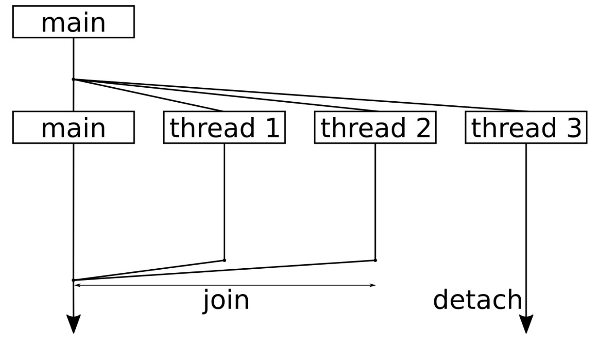

# 啟動和停止線程

C++11中添加了`std::thread`類，並能使用簡潔的方式能夠對線程進行啟動或停止，線程相關的東西都包含在STL中，並不需要額外的庫或是操作系統的實現來對其進行支持。

本節中，我們將實現一個程序對線程進行啟動和停止。如果是第一次使用線程的話，就需要了解一些細節。

## How to do it...

我們將會使用多線程進行編程，並且會瞭解到，當程序的某些部分使用多線程時，代碼會如何進行操作：

1. 包含必要的頭文件，並聲明所使用的命名空間：

   ```c++
   #include <iostream>
   #include <thread>
   
   using namespace std;
   using namespace chrono_literals;
   ```

2. 啟動一個線程時，我們需要告訴代碼如何執行。所以，先來定義一個函數，這個函數會在線程中執行。這個函數可接受一個參數`i`，可以看作為線程的ID，這樣就可以瞭解打印輸出對應的是哪個線程。另外，我們使用線程ID來控制線程休眠的時間，避免多個線程在同時執行`cout`。如果出現了同時打印的情況，那就會影響到輸出。本章的另一個章節會來詳述這個問題：

   ```c++
   static void thread_with_param(int i)
   {
       this_thread::sleep_for(1ms * i);
       
       cout << "Hello from thread " << i << '\n';
       
       this_thread::sleep_for(1s * i);
       
       cout << "Bye from thread " << i << '\n';
   }
   ```

3. 主函數中，會先了解在所使用的系統中能夠同時運行多少個線程，使用`std::thread::hardware_concurrency`進行確定。這個數值通常依賴於機器上有多少個核，或是STL實現中支持多少個核。這也就意味著，對於不同機器，這個函數會返回不同的值：

   ```c++
   int main()
   {
       cout << thread::hardware_concurrency()
       	<< " concurrent threads are supported.\n";
   ```

4. 現在讓我們來啟動線程，每個線程的ID是不一樣的，這裡我們啟動三個線程。我們使用實例化線程的代碼行為`thread t {f, x}`，這就等於在新線程中調用`f(x)`。這樣，在不同的線程中就可以給於`thread_with_param`函數不同的參數：

   ```c++
   	thread t1 {thread_with_param, 1};
       thread t2 {thread_with_param, 2};
       thread t3 {thread_with_param, 3};
   ```

5. 當啟動線程後，我們就需要在其完成其工作後將線程進行終止，使用`join`函數來停止線程。調用`join`將會阻塞調用線程，直至對應的線程終止為止：

   ```c++
   	t1.join();
   	t2.join();
   ```

6. 另一種方式終止的方式是分離。如果不以`join`或`detach`的方式進行終止，那麼程序只有在`thread`對象析構時才會終止。通過調用`detech`，我們將告訴3號線程，即使主線程終止了，你也可以繼續運行：

   ```c++
   	t3.detach();
   ```

7. 主函數結束前將打印一段信息：

   ```c++
   	cout << "Threads joined.\n";
   }
   ```

8. 編譯並運行程序，就會得到如下的輸出。我們可以看到我們的機器上有8個CPU核。然後，我們可以看到每個線程中打印出的*hello*訊息，但是在主線程最後，我們只對兩個線程使用`join`。第3個線程等待了3秒，但是再主線程結束的時候，其只完成了2秒的等待。這樣，我們就沒有辦法看到線程3的結束信息，因為主函數在結束之後，我們就沒有任何機會將其進行殺死了：

   ```c++
   $ ./threads
   8 concurrent threads are supported.
   Hello from thread 1
   Hello from thread 2
   Hello from thread 3
   Bye from thread 1
   Bye from thread 2
   Threads joined.
   ```

## How it works...

啟動和停止線程其實沒有什麼困難的。多線程編程的難點在於，如何讓線程在一起工作(共享資源、互相等待，等等)。

為了啟動一個線程，我們首先定義一些執行函數。沒有特定的規定，普通的函數就可以。我們來看一個簡化的例子，啟動線程並等待線程結束：

```c++
void f(int i) { cout << i << '\n'; }

int main()
{
    thread t {f, 123};
    t.join();
}
```

`std::thread`的構造函數允許傳入一個函數指針或一個可調用的對象，通過這個參數，我們就可以對函數進行調用。當然，我們也可以使用沒有任何參數的函數。

如果系統中有多個CPU核，那麼線程就可以並行或併發的運行。並行與併發之間有什麼區別呢？當計算機只有一個CPU核時，也可以有很多線程並行，但就不可能是併發的了，因為在單核CPU上，每個時間片上只有一個線程在執行。線程在單核上交錯著運行，當一個時間片結束後，會對下一個線程進行執行(不過對於使用者來說，看起來就像是同時在運行)。如果線程間可以不去分享一個CPU和，那麼這些線程就是併發運行。其實**併發**才是真正的同時運行。

這樣，以下幾點是我們絕對無法控制的：

- 共享一個CPU核時，無法控制線程交替運行的順序。
- 線程也是有優先級的，優先級會影響線程執行的順序。
- 實際上線程是分佈在所有CPU核上的，當然操作系統也可以將線程綁定在一個核上。這也就意味著所有的線程可以運行在單核上，也可以運行在具有100個CPU核的機器上。

大多數操作系統都會提供對多線程編程提供一些可能性，不過這些特性並沒包含在STL中。

在啟動和停止線程的時候，告訴他們要做什麼樣的工作，並且什麼時候線程停止工作。對於大多數應用來說就夠用了。本節中，我們啟動的3個線程。之後，對其中兩個進行了`join`，另一個進行`detach`。讓我們使用一個簡單的圖來總結一下本節的代碼：



這幅圖的順序是自頂向下，你會看到我們將整個程序分成了4個線程。一開始，啟動了額外3個線程來完成一些事情，之後主線程僅等待其他線程的結束。

線程結束對函數的執行後，會從函數中返回。標準庫會進行相關的操作，將線程從操作系統的中刪除，或用其他方式銷燬，所以這裡就不用操心了。

我們需要關心的就是`join`。當對線程對象調用函數`x.join()`時，其會讓調用線程休眠，直至`x`線程返回。如果線程處於一個無限循環中，就意味著程序無法終止。如果想要一個線程繼續存活，並持續到自己結束的時候，那就可以調用`x.detach()`。之後，就不會在等這個線程了。不管我們怎麼做——都必須`join`或`detach`線程。如果不想使用這兩種方式，可以在線程對象的析構函數中調用`std::terminate()`，這個函數會讓程序“突然死亡”。

主函數返回時，整個程序也就結束了。不過，第3個線程`t3`還在等待，並將對應的信息打印到終端。操作系統才不會在乎——會直接將我們的程序終止，並不管是否有線程還未結束。要怎麼解決這個這個問題，就是開發者要考慮的事情了。