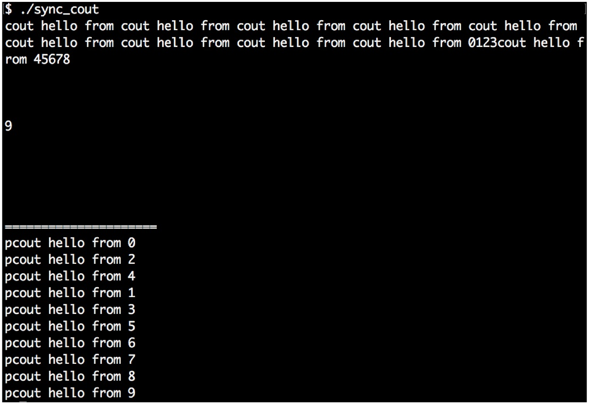

# 同步並行中使用std::cout

多線程中的一個麻煩的地方在於，需要對併發線程所要訪問的共享數據使用互斥量或其他方式進行保護，以避免讓多線程修改失控。

其中`std::cout`打印函數通常被使用到。如果多個線程同時調用`cout`，那麼其輸出將會混合在一起。為了避免輸出混在一起，我們將要用我們的函數進行併發安全的打印。

我們將會了解到，如何完成對`cout`的包裝，並使用最少量的代碼進行最優的打印。

## How to do it...

本節中，將實現一個併發打印安全的函數。避免將打印信息全部混在一起，我們實現了一個輔助類來幫助我們在線程間同步打印信息。

1. 包含必要的頭文件，並聲明所使用的命名空間：

   ```c++
   #include <iostream>
   #include <thread>
   #include <mutex>
   #include <sstream>
   #include <vector>
   
   using namespace std;
   ```

2. 然後實現輔助類，其名字為`pcout`。其中字母p代表parallel，因為其會將併發的上下文進行同步。`pcout`會`public`繼承於`stringstream`。這樣，我們就能直接對其實例使用`<<`操作符了。當`pcout`實例銷燬時，其析構函數會對一個互斥量進行加鎖，然後將`stringstream`緩衝區中的內容進行打印。我們將在下一步瞭解，如何對這個類進行使用：

   ```c++
   struct pcout : public stringstream {
       static inline mutex cout_mutex;
      
       ~pcout() {
           lock_guard<mutex> l {cout_mutex};
           cout << rdbuf();
           cout.flush();
       }
   };
   ```

3. 現在，讓我們來完成兩個函數，這個兩函數可運行在額外的線程上。每個線程都有一個線程ID作為參數。這兩個函數的區別在於，第一個就是簡單的使用`cout`進行打印。另一個使用`pcout`來進行打印。對應的實例都是一個臨時變量，只存在於一行代碼上。在所有`<<`調用執行完成後，我們想要的字符流則就打印在屏幕上了。然後，調用`pcout`實例的析構函數。我們可以瞭解到析構函數做了什麼事：其對一個特定的互斥量進行上鎖，所有`pcout`的實例都會這個互斥量進行共享：

   ```c++
   static void print_cout(int id)
   {
   	cout << "cout hello from " << id << '\n';
   }
   
   static void print_pcout(int id)
   {
   	pcout{} << "pcout hello from " << id << '\n';
   }
   ```

4. 首先，我們使用`print_cout`，其會使用`cout`進行打印。我們併發的啟動10個線程，使用其打印相應的字符串，並等待打印結束：

   ```c++
   int main()
   {
       vector<thread> v;
       
       for (size_t i {0}; i < 10; ++i) {
       	v.emplace_back(print_cout, i);
       }
      
       for (auto &t : v) { t.join(); }
   ```

5. 然後，使用`print_pcout`來完成同樣的事情：

   ```c++
       cout << "=====================\n";
   
       v.clear();
       for (size_t i {0}; i < 10; ++i) {
       	v.emplace_back(print_pcout, i);
       }
       
   	for (auto &t : v) { t.join(); }
   }
   ```

6. 編譯並運行程序，我們就會得到如下的輸出。如我們所見，前10行打印完全串行了。我們無法瞭解到哪條信息是由哪個線程所打印的。後10行的打印中，我們使用`print_pcout`進行打印，就不會造成任何串行的情況。可以清楚的看到不同線程所打印出的信息，因為每次運行的時候打印順序都是以類似隨機數的方式出現：

   

## How it works...

OK，我們已經構建了“cout包裝器”，其可以在併發程序中串行化的對輸出信息進行打印。其是如何工作的呢？

當我們一步一步的瞭解`pcout`的原理，就會發現其工作的原理並不神奇。首先，實現一個字符流，能接受我們輸入的字符串：

```c++
stringstream ss;
ss << "This is some printed line " << 123 << '\n';
```

然後，其會對全局互斥量進行鎖定：

```c++
{
	lock_guard<mutex> l {cout_mutex};
```

鎖住的區域中，其能訪問到字符流`ss`，並對其進行打印。離開這個代碼段時，對互斥鎖進行釋放。`cout.flush()`這會告訴字符流對象立即將其內容打印到屏幕上。如果沒有這一行，程序將會運行的更快，因為多次的打印可能會放在一起打印。我們的代碼中，想立即看到打印信息，所以我們使用了`flush`：

```c++
    cout << ss.rdbuf();
    cout.flush();
}
```

OK，這就很簡單了吧，但每次都寫這幾行代碼，就會讓整體的代碼變的很冗長。我們可以將`stringstream`的實例化簡寫為如下的方式：

```c++
stringstream{} << "This is some printed line " << 123 << '\n';
```

這個字符串流對象的實例，可以容納我們想打印的任何字符，最後對字符串進行析構。字符串流的聲明週期只在這一行內存在。之後，我們無法打印任何東西，因為我們無法對其進行訪問。最後，哪段代碼能訪問流的內容呢？其就是`stringstream`的析構函數。

我們無法對`stringstream`實例的成員函數進行修改，但是可以對通過繼承的方式包裝成我們想要的類型：

```c++
struct pcout : public stringstream {
    ~pcout() {
        lock_guard<mutex> l {cout_mutex};
        cout << rdbuf();
        cout.flush();
    }
};
```

這個類依舊是一個字符串流，並且可以像字符串流一樣對這個類型進行使用。不同的是，其會對互斥量進行上鎖，並且將其內容使用`cout`進行輸出。

我們也會將`cout_mutex`對象作為靜態實例移入`pcout`結構體中，所以可以讓不同的實例共享一個互斥量。

