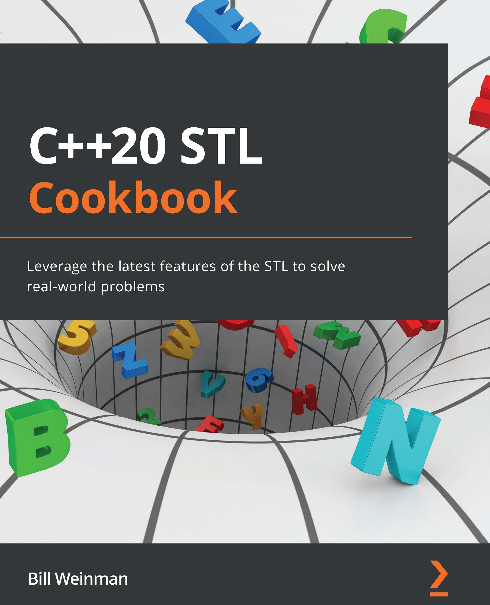

# C++20 STL Cookbook

*Leverage the latest features of the STL to solve real-world problems*

*使用STL的新特性來解決實際問題*

* 作者：Bill Weinman 
* 譯者：陳曉偉
* 首次發佈時間：2022年5月27日([來源](https://www.amazon.com/20-STL-Cookbook-Leverage-real-world/dp/1803248718/ref=sr_1_3?keywords=Modern+CMake+for+C%2B%2B&qid=1661265799&s=books&sr=1-3))

> 翻譯是譯者用自己的思想，換一種語言，對原作者想法的重新闡釋。鑑於我的學識所限，誤解和錯譯在所難免。如果你能買到本書的原版，且有能力閱讀英文，請直接去讀原文。因為與之相較，我的譯文可能根本不值得一讀。
>
> 
 — 雲風，程序員修煉之道第2版譯者

PDF可在本庫的[Release頁面](https://github.com/xiaoweiChen/CPP-20-STL-Cookbook/releases)獲取。

## 本書概述

快速、高效和靈活是C++編程語言一直以來的特點，從而應用於行業的各個領域來解決許多問題。最新版本的C++ 20將改變開發者的編碼方式，因為它帶來了一系列支持應用程序快速部署的特性。這本書將幫助您以最優的方式使用STL。

本書將從C++ 20中的新語言特性開始，幫助您理解該語言的機制和庫特性，並瞭解它們是如何工作的。與其他書籍不同，C++ 20 STL Cookbook採用了一種特定於實現的問題解決方法，將幫助您快速克服障礙。您將學習核心STL概念，如容器、算法、實用程序類、Lambda表達式、迭代器等，學習的同時結合實踐。本書是使用C++ STL及其最新功能的參考指南，可用來探索函數式編程和Lambda表達式中的前沿特性。

閱讀完這本書後，您將能夠利用最新的C++特性，並節省時間和精力，同時可以優雅地使用STL解決實際問題。

#### 關鍵特性

- 熟悉C++ 20的最新特性，並使用STL編寫更好的代碼

- 減少應用的開發時間，並支持更快的部署
- 啟動和使用新版本中引入的、更精簡的STL功能

#### 將會學到

- 理解新的語言特性和其可以解決的問題

- 用實際例子實現STL的通用特性

- 理解併發和同步的標準支持類

- 使用STL執行高效的內存管理

- 使用std::format實現格式化

- 使用STL方式處理字符串，而不是手工編寫C風格的代碼

  

## 適讀人群

這本書是為中高級的C++開發者準備的，他們希望從C++ 20的標準模板庫(C++的最新版本)中收益。開始閱讀這本書前，必須具備編碼和基本的C++知識。

## 作者簡介

**Bill Weinman** 自從他在1971年16歲時擁有了他的第一臺計算機以來，他一直在從事技術工作。自20世紀70年代初以來，一直用C和C++編程，為包括NASA、美國銀行、施樂、IBM和美國海軍在內的主要客戶編寫系統和應用程序。他還是一名電子工程師，曾為旅行者II號宇宙飛船、SAE的音頻放大器和Altec Lansing的音響系統工作。

自20世紀90年代中期以來，Weinman先生一直專注於寫作和教學。他的書和課程涵蓋了HTML、SQL、CGI、Python，當然還有C和C++。作為在線學習的早期貢獻者，清晰、簡潔的授課方式使他的課程在lynda和LinkedIn learning上很受歡迎。

可以關注Bill的網站:bw.org。

## 審評者介紹

**Vitalijs Vaznais** 出生在拉脫維亞的道格夫皮爾斯。他最喜歡的編程語言是C和C++，這兩種語言他已經使用了26年(商業使用了24年)。他對這兩種語言的最新變化/演變感到滿意，並期待看到更多。

## 本書相關

* github地址：https://github.com/xiaoweiChen/CPP-20-STL-Cookbook
* 譯文的LaTeX 環境配置：https://www.cnblogs.com/1625--H/p/11524968.html 
  * 禁用拼寫檢查：https://blog.csdn.net/weixin_39278265/article/details/87931348

* vscode中配置latex：https://blog.csdn.net/Ruins_LEE/article/details/123555016
* 原書示例：https://github.com/PacktPublishing/CPP-20-STL-Cookbook

