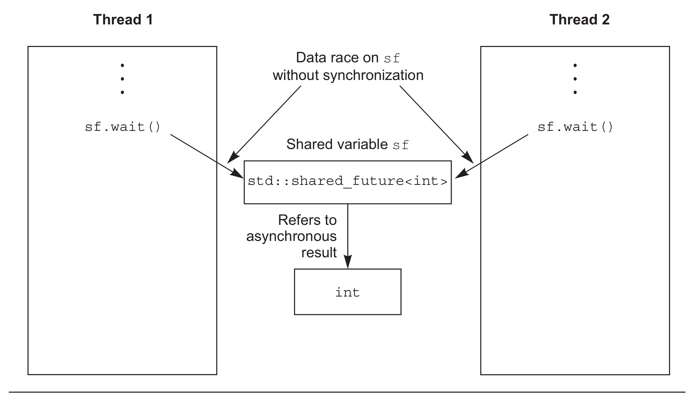

# 4.2 使用future

假設你要乘飛機去國外度假，當到達機場辦理完各種登機手續後，還需要等待機場廣播通知登機。這段時間內，你可能會在候機室裡面找一些事情來打發時間，比如：讀書，上網，或者來一杯咖啡。不過，你就在等待一件事情：機場廣播通知登機。

C++標準庫將這種事件稱為future。當線程需要等待特定事件時，某種程度上來說就需要知道期望的結果。之後，線程會週期性(較短的週期)的等待或檢查事件是否觸發(檢查信息板)，檢查期間也會執行其他任務(品嚐昂貴的咖啡)。另外，等待任務期間也可以先執行另外的任務，直到對應的任務觸發，而後等待future的狀態會變為就緒狀態。future可能是和數據相關(比如，登機口編號)，也可能不是。當事件發生時(狀態為就緒)，這個future就不能重置了。

C++標準庫中有兩種future，聲明在`<future>`頭文件中: unique future(`std::future<>`)和shared futures(`std::shared_future<>`)，與了`std::unique_ptr`和`std::shared_ptr`非常類似。`std::future`只能與指定事件相關聯，而`std::shared_future`就能關聯多個事件。後者的實現中，所有實例會在同時變為就緒狀態，並且可以訪問與事件相關的數據。這種關聯與模板有關，比如`std::unique_ptr` 和`std::shared_ptr`的模板參數就是相關的數據類型。與數據無關處的，可以使用`std::future<void>`與`std::shared_future<void>`的特化模板。雖然，我傾向於線程通訊，但future對象本身並不提供同步訪問。當多個線程需要訪問一個獨立future對象時，必須使用互斥量或類似同步機制進行保護。不過，當多個線程對一個`std::shared_future<>`副本進行訪問，即使同一個異步結果，也不需要同步future。

並行技術規範將這兩個模板類在`std::experimental`命名空間中進行了擴展：`std::experimental::future<>`和`std::experimental::shared_future<> `。這個命名空間是為了將其與`std`命名空間中的模板類進行區分，實驗命名空間中為這兩個模板類添加了更多的功能。尤其是`std::experimental`中的內容與代碼質量無關(我希望這裡也會有較高質量的實現)，需要強調的是這個命名空間提供的都不是標準類和函數，這個命名空間中類和函數的語法和語義，很可能與納入C++標準(也就是`std`命名空間)後有所不同。如果想要使用這兩個試驗性的模板類，需要包含`<experimental/future>`頭文件。

最簡單的事件，就是在後臺運行的計算操作。第2章中已經清楚了`std::thread` 執行的任務不能有返回值，不過這個問題能使用future進行解決。

### 4.2.1 後臺任務的返回值

假設有一個需要長時間的運算，需要計算出一個有效值，但並不迫切需要這個值。你可以啟動新線程來執行這個計算，你需要計算的結果，而`std::thread`並不提供直接接收返回值的機制。這裡就需要`std::async`函數模板(也是在頭文件`<future>`)。

當不著急讓任務結果時，可以使用`std::async`啟動一個異步任務。與`std::thread`對象等待的方式不同，`std::async`會返回一個`std::future`對象，這個對象持有最終計算出來的結果。當需要這個值時，只需要調用這個對象的get()成員函數，就會阻塞線程直到future為就緒為止，並返回計算結果。

代碼4.6 `std::future`從異步任務中獲取返回值

```c++
#include <future>
#include <iostream>

int find_the_answer_to_ltuae();
void do_other_stuff();
int main()
{
  std::future<int> the_answer=std::async(find_the_answer_to_ltuae);
  do_other_stuff();
  std::cout<<"The answer is "<<the_answer.get()<<std::endl;
}
```

與`std::thread`方式一樣，`std::async`允許通過添加額外的調用參數，向函數傳遞額外的參數。第一個參數是指向成員函數的指針，第二個參數提供這個函數成員類的具體對象(是通過指針，也可以包裝在`std::ref`中)，剩餘的參數可作為函數的參數傳入。否則，第二個和隨後的參數將作為函數的參數，或作為指定可調用對象的第一個參數。和`std::thread`一樣，當參數為右值時，拷貝操作將使用移動的方式轉移原始數據，就可以使用“只移動”類型作為函數對象和參數。

代碼4.7 使用`std::async`向函數傳遞參數

```c++
#include <string>
#include <future>
struct X
{
  void foo(int,std::string const&);
  std::string bar(std::string const&);
};
X x;
auto f1=std::async(&X::foo,&x,42,"hello");  // 調用p->foo(42, "hello")，p是指向x的指針
auto f2=std::async(&X::bar,x,"goodbye");  // 調用tmpx.bar("goodbye")， tmpx是x的拷貝副本
struct Y
{
  double operator()(double);
};
Y y;
auto f3=std::async(Y(),3.141);  // 調用tmpy(3.141)，tmpy通過Y的移動構造函數得到
auto f4=std::async(std::ref(y),2.718);  // 調用y(2.718)
X baz(X&);
std::async(baz,std::ref(x));  // 調用baz(x)
class move_only
{
public:
  move_only();
  move_only(move_only&&)
  move_only(move_only const&) = delete;
  move_only& operator=(move_only&&);
  move_only& operator=(move_only const&) = delete;
  
  void operator()();
};
auto f5=std::async(move_only());  // 調用tmp()，tmp是通過std::move(move_only())構造得到
```

future的等待取決於`std::async`是否啟動一個線程，或是否有任務在進行同步。大多數情況下，也可以在函數調用之前向`std::async`傳遞一個額外參數，這個參數的類型是`std::launch`，還可以是`std::launch::defered`，表明函數調用延遲到wait()或get()函數調用時才執行，`std::launch::async`表明函數必須在其所在的獨立線程上執行，`std::launch::deferred | std::launch::async`表明實現可以選擇這兩種方式的一種。最後一個選項是默認的，當函數調用延遲，就可能不會再運行了。如下所示：

```c++
auto f6=std::async(std::launch::async,Y(),1.2);  // 在新線程上執行
auto f7=std::async(std::launch::deferred,baz,std::ref(x));  // 在wait()或get()調用時執行
auto f8=std::async(
              std::launch::deferred | std::launch::async,
              baz,std::ref(x));  // 實現選擇執行方式
auto f9=std::async(baz,std::ref(x));
f7.wait();  //  調用延遲函數
```

本章的後續小節和第8章中，會再次看到這段程序，使用`std::async`會將算法分割到各個任務中，這樣程序就能併發了。不過，這不是讓`std::future`與任務實例相關聯的唯一方式，也可以將任務包裝入`std::packaged_task<>`中，或通過編寫代碼的方式，使用`std::promise<>`模板顯式設置值。與`std::promise<>`相比，`std::packaged_task<>`具有更高的抽象，所以我們從“高抽象”模板說起。

### 4.2.2 future與任務關聯

`std::packaged_task<>`會將future與函數或可調用對象進行綁定。當調用`std::packaged_task<>`對象時，就會調用相關函數或可調用對象，當future狀態為就緒時，會存儲返回值。這可以用在構建線程池(可見第9章)或其他任務的管理中，比如：在任務所在線程上運行其他任務，或將它們串行運行在一個特殊的後臺線程上。當粒度較大的操作被分解為獨立的子任務時，每個子任務都可以包含在`std::packaged_task<>`實例中，之後將實例傳遞到任務調度器或線程池中。對任務細節進行抽象，調度器僅處理`std::packaged_task<>`實例，而非處理單獨的函數。

`std::packaged_task<>`的模板參數是一個函數簽名，比如void()就是一個沒有參數也沒有返回值的函數，或int(std::string&, double*)就是有一個非const引用的`std::string`參數和一個指向double類型的指針參數，並且返回類型是int。構造`std::packaged_task<>`實例時，就必須傳入函數或可調用對象。這個函數或可調用的對象，需要能接收指定的參數和返回(可轉換為指定返回類型的)值。類型可以不完全匹配，因為這裡類型可以隱式轉換，可以用int類型參數和返回float類型的函數，來構建`std::packaged_task<double(double)>`實例。

函數簽名的返回類型可以用來標識從get_future()返回的`std::future<>`的類型，而函數簽名的參數列表，可用來指定packaged_task的函數調用操作符。例如，模板偏特化`std::packaged_task<std::string(std::vector<char>*,int)>`會在下面的代碼中使用到。

代碼4.8 `std::packaged_task<>`的偏特化

```c++
template<>
class packaged_task<std::string(std::vector<char>*,int)>
{
public:
  template<typename Callable>
  explicit packaged_task(Callable&& f);
  std::future<std::string> get_future();
  void operator()(std::vector<char>*,int);
};
```

`std::packaged_task`是個可調用對象，可以封裝在`std::function`對象中，從而作為線程函數傳遞到`std::thread`對象中，或作為可調用對象傳遞到另一個函數中或直接調用。當`std::packaged_task`作為函數調用時，實參將由函數調用操作符傳遞至底層函數，並且返回值作為異步結果存儲在`std::future`中，並且可通過get_future()獲取。因此可以用`std::packaged_task`對任務進行打包，並適時的取回future。當異步任務需要返回值時，可以等待future狀態變為“就緒”。

**線程間傳遞任務**

很多圖形架構需要特定的線程去更新界面，所以當線程對界面更新時，需要發出一條信息給正確的線程，讓相應的線程來做界面更新。`std::packaged_task`提供了這種功能，且不需要發送一條自定義信息給圖形界面線程。

代碼4.9 使用`std::packaged_task`執行一個圖形界面線程

```c++
#include <deque>
#include <mutex>
#include <future>
#include <thread>
#include <utility>

std::mutex m;
std::deque<std::packaged_task<void()> > tasks;

bool gui_shutdown_message_received();
void get_and_process_gui_message();

void gui_thread()  // 1
{
  while(!gui_shutdown_message_received())  // 2
  {
    get_and_process_gui_message();  // 3
    std::packaged_task<void()> task;
    {
      std::lock_guard<std::mutex> lk(m);
      if(tasks.empty())  // 4
        continue;
      task=std::move(tasks.front());  // 5
      tasks.pop_front();
    }
    task();  // 6
  }
}

std::thread gui_bg_thread(gui_thread);

template<typename Func>
std::future<void> post_task_for_gui_thread(Func f)
{
  std::packaged_task<void()> task(f);  // 7
  std::future<void> res=task.get_future();  // 8
  std::lock_guard<std::mutex> lk(m);
  tasks.push_back(std::move(task));  // 9
  return res; // 10
}
```

代碼十分簡單：圖形界面線程①循環直到收到一條關閉圖形界面的信息後關閉界面②。關閉界面前，進行輪詢界面消息處理③，例如：用戶點擊和執行在隊列中的任務。當隊列中沒有任務④時，循環將繼續。除非能在隊列中提取出一個任務⑤，釋放隊列上的鎖，並且執行任務⑥。這裡future與任務相關，當任務執行完時，其狀態會置為“就緒”。

將任務傳入隊列：提供的函數⑦可以提供一個打包好的任務，通過這個任務⑧調用get_future()成員函數獲取future對象，並且在任務推入列表⑨之前，future將返回調用函數⑩。

例子中使用`std::packaged_task<void()>`創建任務，其中包含了一個無參數無返回值的函數或可調用對象(如果當這個調用有返回值時，返回值會被丟棄)。這可能是最簡單的任務，`std::packaged_task`也可以用於複雜的情況——通過指定不同的函數簽名作為模板參數，不僅可以改變其返回類型(因此該類型的數據會存在期望相關的狀態中)，也可以改變函數操作符的參數類型。這個例子可以簡單的擴展成允許任務運行在圖形界面線程上，並且接受傳參，還可以通過`std::future`獲取返回值。

這些任務能作為簡單的函數調用來表達嗎？還有，任務的結果能從很多地方得到嗎？這些問題可以使用第三種方法創建future來解決：使用`std::promise`對值進行顯示設置。

### 4.2.3 使用std::promises

當需要處理很多網絡連接時，會使用不同線程嘗試連接每個接口，能使網絡儘早聯通。不幸的是，隨著連接數量的增長，這種方式變的越來越不合適。因為大量的線程會消耗大量的系統資源，還有可能造成線程上下文頻繁切換(當線程數量超出硬件可接受的併發數時)，這都會對性能有影響。最極端的例子：線程會將系統資源消耗殆盡，系統連接網絡的能力會變的極差。因此通過少數線程處理網絡連接，每個線程同時處理多個連接，對需要處理大量網絡連接的應用而言，這是一種比較普遍的做法。

當線程處理多個連接事件，來自不同的端口連接的數據包基本上以亂序方式進行處理。同樣的，數據包也將以亂序的方式進入隊列。很多情況下，一些應用不是等待數據成功的發送，就是等待(新的)指定網絡接口數據的接收成功。

`std::promise<T>`提供設定值的方式(類型為T)，這個類型會和後面看到的`std::future<T>`對象相關聯。`std::promise/std::future`對提供一種機制：future可以阻塞等待線程，提供數據的線程可以使用promise對相關值進行設置，並將future的狀態置為“就緒”。

可以通過給定的`std::promise`的get_future()成員函數來獲取與之相關的`std::future`對象，與`std::packaged_task`的用法類似。當promise設置完畢(使用set_value()成員函數)時，對應的future狀態就變為“就緒”，並且可用於檢索已存儲的值。當設置值之前銷燬`std::promise`，將會存儲一個異常。在4.2.4節中，會詳細描述異常是如何傳送到線程的。

代碼4.10中是單線程處理多接口的實現，這個例子中，可以使用一對`std::promise<bool>/std::future<bool>`找出傳出成功的數據塊，與future相關的只是簡單的“成功/失敗”標識。對於傳入包，與future相關的數據就是數據包的有效負載。

代碼4.10 使用promise解決單線程多連接問題

```c++
#include <future>

void process_connections(connection_set& connections)
{
  while(!done(connections))  // 1
  {
    for(connection_iterator  // 2
            connection=connections.begin(),end=connections.end();
          connection!=end;
          ++connection)
    {
      if(connection->has_incoming_data())  // 3
      {
        data_packet data=connection->incoming();
        std::promise<payload_type>& p=
            connection->get_promise(data.id);  // 4
        p.set_value(data.payload);
      }
      if(connection->has_outgoing_data())  // 5
      {
        outgoing_packet data=
            connection->top_of_outgoing_queue();
        connection->send(data.payload);
        data.promise.set_value(true);  // 6
      }
    }
  }
}
```

process_connections()中(直到done()返回true①為止)每一次循環，都會依次的檢查每個連接②，檢索是否有數據③或正在發送已入隊的傳出數據⑤。假設輸入數據包是具有ID和有效負載的(有實際的數在其中)，一個ID映射到一個`std::promise`(可能是在相關容器中進行的依次查找)④，並且值是在包的有效負載中。傳出包是在傳出隊列中檢索，從接口直接發送出去。當發送完成，傳出數據相關的promise將置為true，來表明傳輸成功⑥。是否能映射到實際網絡協議上，取決於所用協議。

上面的代碼不理會異常，一切工作都會很好的執行，但有悖常理。有時候磁盤滿載，有時候會找不到東西，有時候網絡會斷，還有時候數據庫會崩潰。當需要某個操作的結果時，就需要在對應的線程上執行這個操作，因為代碼可以通過異常來報告錯誤。不過，這會對使用`std::packaged_task`或`std::promise`帶來一些不必要的限制。因此，C++標準庫提供了一種在以上情況下清理異常的方法，並且允許將異常存儲為相關結果的一部分。

### 4.2.4 將異常存與future中

看完下面的代碼段，思考一下：當你傳遞-1到square_root()中時，它將拋出一個異常，並且你想讓調用者看到這個異常：

```c++
double square_root(double x)
{
  if(x<0)
  {
    throw std::out_of_range(“x<0”);
  }
  return sqrt(x);
}
```

假設調用square_root()函數不是當前線程，

```c++
double y=square_root(-1);
```

將調用改為異步調用：

```c++
std::future<double> f=std::async(square_root,-1);
double y=f.get();
```

當y獲得函數調用的結果，線程調用f.get()時，就能再看到異常了。

函數作為`std::async`的一部分時，當調用拋出一個異常時，這個異常就會存儲到future中，之後future的狀態置為“就緒”，之後調用get()會拋出已存儲的異常(注意：標準級別沒有指定重新拋出的這個異常是原始的異常對象，還是一個拷貝。不同的編譯器和庫將會在這方面做出不同的選擇)。將函數打包入`std::packaged_task`任務包後，當任務調用時，同樣的事情也會發生。打包函數拋出一個異常，這個異常將存儲在future中，在get()調用時會再次拋出。

當然，通過函數的顯式調用，`std::promise`也能提供同樣的功能。當存入的是異常而非數值時，就需要調用set_exception()成員函數，而非set_value()。這通常是用在一個catch塊中，並作為算法的一部分。為了捕獲異常，這裡使用異常填充promise：

```c++
extern std::promise<double> some_promise;
try
{
  some_promise.set_value(calculate_value());
}
catch(...)
{
  some_promise.set_exception(std::current_exception());
}
```

這裡使用`std::current_exception()`來檢索拋出的異常，可用`std::copy_exception()`作為替代方案，`std::copy_exception()`會直接存儲新的異常而不拋出：

```c++
some_promise.set_exception(std::copy_exception(std::logic_error("foo ")));
```

這比使用try/catch塊更加清晰，當異常類型已知，就應該優先使用。不是因為代碼實現簡單，而是給編譯器提供了極大的優化空間。

另一種向future中存儲異常的方式，在沒有調用promise上的任何設置函數前，或正在調用包裝好的任務時，銷燬與`std::promise`或`std::packaged_task`相關的future對象。任何情況下，當future的狀態還不是“就緒”時，調用`std::promise`或`std::packaged_task`的析構函數，將會存儲一個與`std::future_errc::broken_promise`錯誤狀態相關的`std::future_error`異常。通過創建一個future，可以構造一個promise為其提供值或異常，也可以通過銷燬值和異常源，去違背promise。這種情況下，編譯器沒有在future中存儲任何東西，線程可能會永遠的等下去。

現在，例子中都在用`std::future`，不過`std::future`也有侷限性。很多線程在等待的時候，只有一個線程能獲取結果。當多個線程等待相同事件的結果時，就需要使用`std::shared_future`來替代`std::future`了。

### 4.2.5 多個線程的等待

雖然`std::future`可以處理所有在線程間數據轉移的同步，但是調用某一特殊` std::future`對象的成員函數，就會讓這個線程的數據和其他線程的數據不同步。多線程在沒有額外同步的情況下，訪問獨立`std::future`對象時，就會有數據競爭和未定義行為。因為`std::future`獨享同步結果，並且通過調用get()函數，一次性的獲取數據，這就讓併發訪問變的毫無意義。

如果並行代碼沒辦法讓多個線程等待同一個事件，`std::shared_future`可以幫你解決這個問題。因為`std::future`是隻移動的，所以其所有權可以在不同的實例中互相傳遞，但只有一個實例可以獲得特定的同步結果，而`std::shared_future`實例是可拷貝的，所以多個對象可以引用同一關聯期望值的結果。

每一個`std::shared_future`的獨立對象上，成員函數調用返回的結果還是不同步的，所以為了在多個線程訪問一個獨立對象時避免數據競爭，必須使用鎖來對訪問進行保護。優先使用的辦法：為了替代只有一個拷貝對象的情況，可以讓每個線程都擁有自己對應的拷貝對象。這樣，當每個線程都通過自己擁有的`std::shared_future`對象獲取結果，那麼多個線程訪問共享同步結果就是安全的。可見圖4.1。



 

圖4.1 使用多個`std::shared_future`對象來避免數據競爭

可能會使用`std::shared_future`的場景，例如：實現類似於複雜的電子表格的並行執行，每一個單元格有唯一終值，這個終值可能由其他單元格中的數據通過公式計算得到。公式計算得到的結果依賴於其他單元格，然後可以使用`std::shared_future`對象引用第一個單元格的數據。當每個單元格內的所有公式並行執行後，任務會以期望的方式完成工作。不過，當其中有計算需要依賴其他單元格的值時就會阻塞，直到依賴單元格的數據準備就緒。這可以讓系統在最大程度上使用硬件併發。

`std::shared_future`的實例同步`std::future`實例的狀態。當`std::future`對象沒有與其他對象共享同步狀態所有權，那麼所有權必須使用`std::move`將所有權傳遞到`std::shared_future`，其默認構造函數如下：

```c++
std::promise<int> p;
std::future<int> f(p.get_future());
assert(f.valid());  // 1 期望值 f 是合法的
std::shared_future<int> sf(std::move(f));
assert(!f.valid());  // 2 期望值 f 現在是不合法的
assert(sf.valid());  // 3 sf 現在是合法的
```

期望值f開始是合法的①，因為引用的是promise p的同步狀態，但是在轉移sf的狀態後，f就不合法了②，而sf就是合法的了③。

如其他可移動對象一樣，轉移所有權是對右值的隱式操作，所以可以通過`std::promise`對象的成員函數get_future()的返回值，直接構造一個`std::shared_future`對象，例如：

```c++
std::promise<std::string> p;
std::shared_future<std::string> sf(p.get_future());  // 1 隱式轉移所有權
```

轉移所有權是隱式的，用右值構造`std::shared_future<>`，得到`std::future<std::string>`類型的實例①。

`std::future`的這種特性，可促進`std::shared_future`的使用，容器可以自動的對類型進行推斷，從而初始化該類型的變量(詳見附錄A，A.6節)。`std::future`有一個share()成員函數，可用來創建新的`std::shared_future` ，並且可以直接轉移future的所有權。這樣也就能保存很多類型，並且使得代碼易於修改：

```c++
std::promise< std::map< SomeIndexType, SomeDataType, SomeComparator,
     SomeAllocator>::iterator> p;
auto sf=p.get_future().share();
```

這個例子中，sf的類型推導為`std::shared_future<std::map<SomeIndexType, SomeDataType, SomeComparator, SomeAllocator>::iterator>`，還真的長。當比較器或分配器有所改動，只需要對promise的類型進行修改即可。future的類型會自動與promise的修改進行匹配。

有時需要限定等待事件的時間，不論是因為時間上有硬性規定(一段指定的代碼需要在某段時間內完成)，還是因為在事件沒有很快的觸發，或是有工作需要特定線程來完成，為了處理這種情況，需要等待函數能對超時進行指定。
