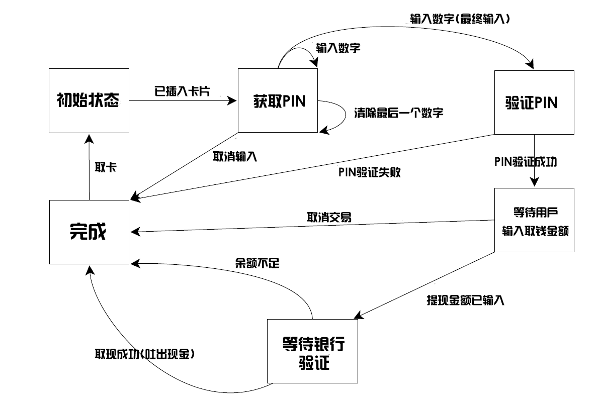

# 4.4 簡化代碼

同步工具在本章稱為構建塊。你可以關注下同步的操作，而非具體機制。當程序需要併發時，可提供更多的函數化方式簡化代碼。比起在多個線程間共享數據，每個任務最好擁有自己的數據，並且其他線程可以使用future獲取運行結果。

### 4.4.1 使用future的函數化編程

*函數化編程*(functional programming)是一種編程方式，函數結果只依賴於傳入函數的參數。使用相同的參數調用函數，不管多少次都會獲得相同的結果。C++標準庫中與數學相關的函數都有這個特性，例如：sin，cos和sqrt。基本類型間的簡單運算，例如：3+3，6*9，或1.3/4.7。純粹的函數不會改變任何外部狀態，並且這種特性限制了函數的返回值。

第3章我們討論過，不修改共享數據，就不存在條件競爭，並且沒有必要使用互斥量保護共享數據。這是對編程極大的簡化，例如Haskell語言[2]中所有函數默認都是“純粹的”。

函數化編程的好處並不限於將“純粹”作為默認方式(範型)的語言。C++是一個多範型的語言，也可以寫出FP類型的程序。C++11的方式要比C++98簡單許多，因為C++11支持Lambda表達式(詳見附錄A，A.6節)，還加入了[Boost](http://zh.wikipedia.org/wiki/Boost_C%2B%2B_Libraries)和[TR1](http://zh.wikipedia.org/wiki/C%2B%2B_Technical_Report_1)中的`std::bind`，以及自動可以自行推斷類型的自動變量(詳見附錄A，A.7節)。future作為最後一塊拼圖，使得*函數化編程模式併發化*(FP-style concurrency)在C++中成為可能。future可以在線程間互相傳遞，並允許計算結果互相依賴。

**快速排序——FP模式版**

為了展示在*函數化*(PF)併發中如何使用future，讓我們來看看一個簡單的實現——快速排序算法。該算法的基本思想很簡單：給定一個數據列表，然後選取其中一個數為“中間”值，之後將列表中的其他數值分成兩組——一組比中間值大，另一組比中間值小。之後對小於“中間”值的組進行排序，並返回排序好的列表，再返回“中間”值，再對比“中間”值大的組進行排序，並返回排序的列表。圖4.2中展示了10個整數在這種方式下進行排序的過程。


圖4.2 FP-模式的遞歸排序

下面代碼中的是FP-模式的串行實現，需要傳入列表，並且返回一個列表，與`std::sort()`做同樣的事情不同。
(譯者：`std::sort()`是無返回值的，因為參數接收的是迭代器，所以其可以對原始列表直進行修改與排序。可參考[sort()](http://www.cplusplus.com/reference/algorithm/sort/?kw=sort))

代碼4.12 快速排序——串行版

```c++
template<typename T>
std::list<T> sequential_quick_sort(std::list<T> input)
{
  if(input.empty())
  {
    return input;
  }
  std::list<T> result;
  result.splice(result.begin(),input,input.begin());  // 1
  T const& pivot=*result.begin();  // 2

  auto divide_point=std::partition(input.begin(),input.end(),
             [&](T const& t){return t<pivot;});  // 3

  std::list<T> lower_part;
  lower_part.splice(lower_part.end(),input,input.begin(),
             divide_point);  // 4
  auto new_lower(
             sequential_quick_sort(std::move(lower_part)));  // 5
  auto new_higher(
             sequential_quick_sort(std::move(input)));  // 6

  result.splice(result.end(),new_higher);  // 7
  result.splice(result.begin(),new_lower);  // 8
  return result;
}
```

雖然接口是FP的，但需要做大量的拷貝操作，所以內部會使用命令模式。選擇第一個數為“中間”值，使用splice()①將輸入的首個元素(中間值)放入結果列表中，這種方式產生的結果可能不是最優的。因為鏈表的訪問方式是遍歷，所以對`std::list`做任何事都需要花費較長的時間。我們清楚想要什麼樣的結果，可以將“中間”值進行拼接，還需要使用“中間”值進行比較，所以使用了引用②，避免過多的拷貝。之後，可以使用`std::partition`將序列中的值分成小於“中間”值的組和大於“中間”值的組③，最簡單的方法就是使用Lambda函數指定區分的標準(詳見附錄A，A.5節，更多有關Lambda函數的信息)。

`std::partition()`會對列表進行重置，並返回指向首元素(*不*小於“中間”值)的迭代器。迭代器的類型全稱可能會很長，可以使用auto讓編譯器幫忙定義迭代器類型的變量(詳見附錄A，A.7節)。

現在，選擇了FP模式的接口，要使用遞歸對兩部分排序，所以需要創建兩個列表。可以用splice()來完成，將input列表小於divided_point的值移動到新列表lower_part④中，其他數繼續留在input列表中。而後，可以遞歸調用⑤⑥，對兩個列表進行排序。顯式使用`std::move()`將列表傳遞到函數中後，可以再次使用splice()，將result中的結果以正確的順序進行拼接。new_higher指向的值放在“中間”值的後面⑦，new_lower指向的值放在“中間”值的前面⑧。

**快速排序——FP模式線程強化版**

使用純函數模式容易轉化為並行版本。

代碼4.13 快速排序——並行版

```c++
template<typename T>
std::list<T> parallel_quick_sort(std::list<T> input)
{
  if(input.empty())
  {
    return input;
  }
  std::list<T> result;
  result.splice(result.begin(),input,input.begin());
  T const& pivot=*result.begin();

  auto divide_point=std::partition(input.begin(),input.end(),
                [&](T const& t){return t<pivot;});
  
  std::list<T> lower_part;
  lower_part.splice(lower_part.end(),input,input.begin(),
                divide_point);

  std::future<std::list<T> > new_lower(  // 1
                std::async(&parallel_quick_sort<T>,std::move(lower_part)));

  auto new_higher(
                parallel_quick_sort(std::move(input)));  // 2

  result.splice(result.end(),new_higher);  // 3
  result.splice(result.begin(),new_lower.get());  // 4
  return result;
}
```

當前線程不對小於“中間”值部分的列表進行排序，`std::async()`①會使用另一線程對列表進行排序。大於部分如同之前一樣，使用遞歸進行排序②。通過遞歸調用parallel_quick_sort()，可以使用硬件併發。`std::async()`會啟動一個新線程，這樣當遞歸三次時，就會有八個線程在運行了。當遞歸十次(對於大約有1000個元素的列表)，如果硬件能處理這十次遞歸調用，將會創建1024個執行線程。當運行庫認為產生了太多的任務時(也許是因為數量超過了硬件併發的最大值)，可能會同步的切換新產生的任務。當任務過多時(已影響性能)，為了避免任務傳遞的開銷，這些任務應該在使用get()獲取結果的線程上運行，而不是在新線程上運行。這也符合`std::async`的行為，為每一個任務啟動一個線程(甚至是在任務超額時，也就是在`std::launch::deferred`沒有明確規定的情況下)，或為了同步執行所有任務(`std::launch::async`有明確規定的情況下)。當運行庫自動裁剪線程時，建議去查看一下運行庫的實現文檔，瞭解一下將會有怎樣的行為表現。

比起使用`std::async()`，可以寫一個spawn_task()函數對`std::packaged_task`和`std::thread`做一下包裝。如代碼4.14中所示，需要為函數結果創建一個`std::packaged_task`對象， 並從這個對象中獲取future，或在線程中返回future。其本身並沒有太多優勢(事實上會造成大規模的超額任務)，但可為轉型成一個更復雜的實現進行鋪墊，實現會向隊列添加任務，而後使用線程池的方式來運行。`std::async`更適合於已知所有任務的情況，並且要能完全控制線程池中構建或執行過任務的線程。

代碼4.14 spawn_task的簡單實現

```c++
template<typename F,typename A>
std::future<std::result_of<F(A&&)>::type>
   spawn_task(F&& f,A&& a)
{
  typedef std::result_of<F(A&&)>::type result_type;
  std::packaged_task<result_type(A&&)>
       task(std::move(f)));
  std::future<result_type> res(task.get_future());
  std::thread t(std::move(task),std::move(a));
  t.detach();
  return res;
}
```

其他先不管，回到parallel_quick_sort函數。因為直接遞歸去獲取new_higher列表，就可以如之前一樣對new_higher進行拼接③。new_lower列表是`std::future<std::list<T>>`類型，而非是一個簡單的列表，所以需要調用get()成員函數在調用splice()④之前去檢索數值。之後，等待後臺任務完成，並且將結果移入splice()中。get()返回一個包含結果的右值引用，這樣的結果就是可以移動的(詳見附錄A，A.1.1節，有更多有關右值引用和移動語義的信息)。

假設使用`std::async()`是硬件併發最好的選擇，但這樣的並行實現對於快速排序來說，依然不理想。`std::partition`已經足夠好了，但依舊是串行調用。如果對實現最快並行感興趣的話，可以去查閱一些學術文獻，或者可以選擇C++17中的並行重載版本(詳見第10章)。

函數化編程可算作是併發編程的範型，並且也是*通訊順序進程*(CSP，Communicating Sequential Processer[3])的範型，這裡的線程沒有共享數據，但有通訊通道允許信息在不同線程間進行傳遞。這種範型被[Erlang語言](http://www.erlang.org)所採納，並且常用在[MPI](http://www.mpi-forum.org)(*Message Passing Interface*，消息傳遞接口)上做高性能運算。現在不會再對它們而感到驚奇了吧，C++就能支持它們。

接下來的一節中，我們會討論實現這種操作的方式。

### 4.4.2 使用消息傳遞的同步操作

CSP的概念很簡單：沒有共享數據時，每個線程可以基於所接收到的信息獨立運行。每個線程就都有狀態機：當收到一條信息，會以某種方式更新狀態，並且可能向其他線程發出信息(消息處理機制依賴於線程的初始化狀態)。這是有限狀態機模式的實現，並且狀態機可以隱式實現，這種方式更加依賴於明確的行為要求和專業的編程團隊。無論選用哪種方式去實現線程，任務都會進行獨立處理，消除潛在的混亂(數據共享併發)，就讓編程變的更加簡單。

通訊處理沒有共享數據，所有消息都是通過消息隊列傳遞，而C++線程共享一塊地址空間，所以達不到真正通訊處理要求。這就需要一些約定來支持：作為應用或是庫作者有責任確保在實現中不存在共享數據。當然，為了線程間的通信，消息隊列必須共享，具體的細節要包含在庫中。

試想有一天要為實現ATM(自動取款機)寫一個應用。這個應用需要處理：取錢時和銀行之間的交互情況，以及控制器械接受用戶的卡片，顯示適當的信息，處理按鈕事件，吐出現金，還有退還卡。

一種處理方法是讓代碼將所有事情分配到三個獨立線程上去：一個線程去處理物理機械，一個去處理ATM機的邏輯，還有一個用來與銀行通訊，這些線程不共享任何數據，比如：當有人在ATM機上插入了卡片或者按下按鈕，處理機械的線程將會發送一條信息到邏輯線程上，並且邏輯線程將發送一條消息到機械線程，告訴機械線程可以分配多少錢等等。

ATM機邏輯建模的方式，就可以將其當狀態機。線程的每一個狀態都會等待一條可接受的信息，這條信息包含需要處理的內容。圖4.3中將展示有狀態參與的一個簡單是實現。這個簡化實現中，系統在等待一張卡插入。當有卡插入時，系統將會等待用戶輸入PIN(類似身份碼的東西)，並且用戶可以將最後輸入的數字刪除。當數字輸入完成，需要驗證PIN。當驗證有問題時，就需要退出卡，並且繼續等待其他人將卡插入到機器中。當驗證通過時，要等待用戶取消交易或選擇取款。當用戶選擇取消交易，程序可以結束，並返還卡片。當用戶選擇取出一定量的現金，程序就要在吐出現金和返還卡片前等待銀行方面的確認，或顯示“餘額不足”的信息，並返還卡片。很明顯，一個真正的ATM機要考慮的東西更多、更復雜。



圖4.3 一臺ATM機的狀態機模型(簡化)

我們已經為ATM機的邏輯設計了狀態機，可以使用一個類進行實現，類中有成員函數可以獲取每一個狀態。每一個成員函數可以等待從指定集合中傳入的信息，以及當進行處理時，這就有可能觸發原始狀態向另一個狀態的轉化。每種不同的信息類型由一個獨立的struct表示。代碼4.15展示了ATM邏輯部分的簡單實現(以上描述的系統中，有主循環和對第一狀態的實現)，並且一直在等待卡片插入。

如你所見，所有信息傳遞所需的的同步，完全包含在“信息傳遞”庫中(基本實現在附錄C中的代碼，是4.15代碼的完整版)

代碼4.15 ATM邏輯類的簡單實現

```c++
struct card_inserted
{
  std::string account;
};

class atm
{
  messaging::receiver incoming;
  messaging::sender bank;
  messaging::sender interface_hardware;
  void (atm::*state)();

  std::string account;
  std::string pin;

  void waiting_for_card()  // 1
  {
    interface_hardware.send(display_enter_card());  // 2
    incoming.wait().  // 3
      handle<card_inserted>(
      [&](card_inserted const& msg)  // 4
      {
       account=msg.account;
       pin="";
       interface_hardware.send(display_enter_pin());
       state=&atm::getting_pin;
      }
    );
  }
  void getting_pin();
public:
  void run()  // 5
  {
    state=&atm::waiting_for_card;  // 6
    try
    {
      for(;;)
      {
        (this->*state)();  // 7
      }
    }
    catch(messaging::close_queue const&)
    {
    }
  }
};
```

這個實現對於實際ATM機來說非常簡單，但是能讓你感受到信息傳遞編程的方式。這裡無需考慮同步和併發問題，只需要考慮什麼時候接收和發送信息即可。與系統的其他部分一起，為ATM邏輯所設的狀態機運行在獨立的線程上，比如：與銀行通訊的接口，以及運行在獨立線程上的終端接口。這種程序設計的方式被稱為*參與者模式*([Actor model](http://zh.wikipedia.org/wiki/%E5%8F%83%E8%88%87%E8%80%85%E6%A8%A1%E5%BC%8F))——在系統中有很多獨立的(運行在一個獨立的線程上)參與者，這些參與者會互相發送信息，去執行手頭上的任務，並且不會共享狀態，除非是通過信息直接傳入的。

從run()成員函數開始⑤運行，初始化waiting_for_card⑥的狀態，然後反覆執行當前狀態的成員函數(無論這個狀態時怎麼樣的)⑦。狀態函數是簡易atm類的成員函數。wait_for_card函數①依舊很簡單：發送一條信息到接口，讓終端顯示“等待卡片”的信息②，之後就等待傳入一條消息進行處理③。處理的消息類型只能是card_inserted類，這裡使用Lambda函數④對其進行處理。當然，可以傳遞任何函數或函數對象處理函數。注意，handle()與wait()進行連接，當收到的信息類型與處理類型不匹配時收到的信息將會被丟棄，並且線程繼續等待，直到接收到一條類型匹配的消息。

Lambda函數自身只是將用戶賬號信息緩存到成員變量中去，並且清除PIN信息，再發送一條消息到硬件接口，讓顯示界面提示用戶輸入PIN，然後將線程狀態改為“獲取PIN”。當消息處理程序結束，狀態函數就會返回，然後主循環會調用新的狀態函數⑦。

如圖4.3，getting_pin狀態函數會複雜一些，因為其要處理三個不同的信息類型。具體代碼展示如下：

代碼4.16 簡單ATM實現中的getting_pin狀態函數

```c++
void atm::getting_pin()
{
  incoming.wait()
    .handle<digit_pressed>(  // 1
      [&](digit_pressed const& msg)
      {
        unsigned const pin_length=4;
        pin+=msg.digit;
        if(pin.length()==pin_length)
        {
          bank.send(verify_pin(account,pin,incoming));
          state=&atm::verifying_pin;
        }
      }
      )
    .handle<clear_last_pressed>(  // 2
      [&](clear_last_pressed const& msg)
      {
        if(!pin.empty())
        {
          pin.resize(pin.length()-1);
        }
      }
      )
    .handle<cancel_pressed>(  // 3
      [&](cancel_pressed const& msg)
      {
        state=&atm::done_processing;
      }
      );
}
```

這次需要處理三種消息類型，所以wait()函數後面接了三個handle()函數調用①②③。每個handle()都有對應的消息類型作為模板參數，並且將消息傳入一個Lambda函數中(其獲取消息類型作為參數)。因為調用連接在了一起，wait()的實現知道在等待一條digit_pressed消息，或是一條clear_last_pressed消息，亦或是一條cancel_pressed消息，而其他的消息類型將會被丟棄。

當獲取一條消息時，無需再去改變狀態，比如：獲取一條digit_pressed消息時，僅需要將其添加到pin中。(代碼4.15中)主循環⑦將會再次調用getting_pin()去等待下一個數字(或清除數字，或取消交易)。

這裡對應的動作如圖4.3所示，每個狀態的實現都由不同的成員函數構成，等待相關信息並適當的更新狀態。

一個併發系統中，這種編程方式可以極大的簡化任務的設計，因為每一個線程都完全被獨立對待。因此，使用多線程去分離關注點時，需要明確線程之間的任務應該如何分配。

### 4.4.3 擴展規範中的持續性併發

併發技術擴展規範在`std::experiment`命名空間中提供了新的類型`std::promise`和`std::packaged_taks`。與`std`命名空間中類型完全不同，其返回實例類型為`std::experimental::future`，而不是`std::future`。這能讓使用者體會`std::experimental::future`所帶來的新特性——持續性。

假設任務產生了一個結果，並且future持有這個結果。然後，需要寫一些代碼來處理這個結果。使用`std::future`時，必須等待future的狀態變為就緒態，不然就使用全阻塞函數wait()，或是使用wait_for()/wait_unitl()成員函數進行等待，而這會讓代碼變得非常複雜。用一句話來說“完事俱備，只等數據”，這也就是持續性的意義。為了給future添加持續性，只需要在成員函數後添加then()即可。比如：給定一個future fut，添加持續性的調用即為fut.then(continuation)。

與`std::future`類似 ,  `std::experimental::future`的存儲值也只能檢索一次。如果future處於持續使用狀態，其他代碼就不能訪問這個furture。因此，使用fut.then()為fut添加持續性後，對原始fut的操作就是非法的。另外，調用fut.then()會返回一個新future，這個新future會持有持續性調用的結果。具體代碼，如下所示：

```c++
std::experimental::future<int> find_the_answer;
auto fut=find_the_answer();
auto fut2=fut.then(find_the_question);
assert(!fut.valid());
assert(fut2.valid());
```

當原始future為就緒態時，find_the_question持續性函數沒有安排在指定的線程上運行。這就給予了實現的自由，函數可以在線程池或是在另一個線程管理庫上運行。這樣做是經過考慮的，將持續性引入C++標準時，能讓實現者能基於其豐富的經驗，選擇更好的線程使用方式，併為用戶提供合適的機制來控制線程。

與直接調用`std::async`或`std::thread`不同，持續性函數不需要傳入參數，因為運行庫已經為其定義好了參數——會傳入處於就緒態的future，這個future保存了持續性觸發後的結果。假設find_the_answer返回類型為int，find_the_question函數會傳入` std::experimental::future<int> `作為參數：

```c++
std::string find_the_question(std::experimental::future<int> the_answer);
```

這樣做的原因是，持續性的過程中會持有具體值或是異常。如果future隱式的解引用，將其值直接傳遞給持續性函數，那麼運行庫將會決定如何處理這種異常。反之，將future傳遞給持續性函數，那麼持續性函數將回來處理這個異常。舉個簡單的例子，就是通過fut.get()獲取future持有的值，並且在持續性函數外將異常重新拋出並傳播。就如同將函數傳入`std::async`一樣，異常存在於持有持續性結果的future中，這樣異常就會重新傳播。

併發技術擴展規範中沒有指定這種情況等價於`std::async`，但實現可以相同。這種函數也很簡單：使用`std::experimental::promise`獲取future，並且生成新的線程運行Lambda表達式，該Lambda表達式為promise設置返回值，代碼如下所示。

代碼4.17 使用併發技術擴展規範中的特性，實現與`std::async`等價的功能

```c++
template<typename Func>
std::experimental::future<decltype(std::declval<Func>()())>
spawn_async(Func&& func){
  std::experimental::promise<
    decltype(std::declval<Func>()())> p;
  auto res=p.get_future();
  std::thread t(
    [p=std::move(p),f=std::decay_t<Func>(func)]()
      mutable{
      try{
        p.set_value_at_thread_exit(f());
      } catch(...){
        p.set_exception_at_thread_exit(std::current_exception());
      }
  });
  t.detach();
  return res;
}
```

和`std::aync`一樣，這裡將函數的結果存儲在future中，或捕獲函數拋出的異常，將異常存到future中。同樣的，為了保證在future達到就緒態時，需要保證thread_local變量已經使用set_value_at_thread_exit和set_exception_at_thread_exit清理過了。

值是從then()調用中返回，其返回的future是完整的future。也就意味著，持續性可以進行連接。

### 4.4.4 持續性連接

假設有一些列耗時任務要完成，並且要使用異步多線程完成這些任務，從而減輕主線程的計算壓力，例如：用戶登錄應用時，需要將登錄憑證發送給後臺，在對身份信息進行驗證後，從後臺獲取用戶的賬戶信息，使用獲取到的信息對顯示進行更新。

代碼4.18 處理用戶登錄——同步方式

```c++
void process_login(std::string const& username, std::string const& password)
{
  try{
    user_id const id = backend.authenticate_user(username, password);
    user_data const info_to_display = backend.request_current_info(id);
    update_display(info_to_display);
  } catch(std::exception& e){
    display_error(e);
  }
}
```

我們想要的是一段異步代碼，所以不想阻塞UI線程。使用`std::async`將另一個列表放在後臺線程上，不過依舊會阻塞UI線程，等待任務完成的同時，會消耗大量的資源。如果這樣的任務很多，可以結束一些等待線程節省資源。

代碼4.19 處理用戶登錄——異步方式

```c++
std::future<void> process_login(
  std::string const& username, std::string const& password)
{
  return std::async(std::launch::async,[=](){
    try{
      user_id consst id = backend.authenticate_user(username, password);
      user_data const info_to_display = 
        backend.request_current_info(id);
      update_display(info_to_display);
    } catch(std::exception& e){
      display_error(e);
    }      
  });
}
```

為了避免線程阻塞，機制需要對每個完成的任務進行連接：持續性。下面的代碼與之前大體相同，但這次將整個任務分成了一系列任務，並且每個任務在完成時回連到前一個任務上。

代碼4.20 處理用戶登錄——持續性方式

```c++
std::experimental::future<void> process_login(
  std::string const& username, std::string const& password)
{
  return spawn_async([=](){
    return backend.authenticate_user(username, password);  
  }).then([](std::experimental::future<user_id> id){
    return backend.request_current_info(id.get());
  }).then([](std::experimental::future<user_data> info_to_display){
    try{
      update_display(info_to_display.get());
    } catch(std::exception& e){
      display_error(e);
    }
  });
}
```

每個持續性函數都以`std::experimental::future`作為獨立參數，然後使用`.get()`來獲取其擁有的值。這意味著異常會沿著鏈條進行傳播，如果有函數拋出異常，就會在調用info_to_display.get()時拋出，捕獲結構可以處理所有的異常類型。

因為等待消息需要通過網絡或數據操作進行傳輸，所函數內部會對後端模塊進行調用，但這時前端的任務可能還沒有完成。雖然已經將任務進行分割成獨立的小任務，但仍然會阻塞線程的運行。這些需要在後端任務完成，前端處理就已經準備好了，而不是對線程進行阻塞。這樣的話，backend.async_authenticate_user(username, password)返回` std::experimental::future<user_id> `會比返回user_id更加合適。

因為持續函數返回的future類型為`future<future<some_value>>`，可能覺得這段代碼比較複雜，否則只能將調用`.then`的語句放置在持續函數中。如果這麼想就錯了，因為持續性支持一種極為精妙的特性，叫做*future展開*(future-unwrapping)。當向`.then()`傳遞了持續性函數，並且返回一個future<some_type>類型的值時，相應的`.then()`返回值類型也是future<some_type>。最終的代碼可能如下所示，這樣在異步函數鏈上就不會阻塞了。

代碼4.21  處理用戶登錄——全異步操作

```c++
std::experimental::future<void> process_login(
  std::string const& username, std::string const& password)
{
  return backend.async_authenticate_user(username, password).then(
    [](std::experimental::future<user_id> id){
      return backend.async_request_current_info(id.get());      
    }).then([](std::experimental::future<user_data> info_to_display){
      try{
        update_display(info_to_display.get());  
      } catch(std::exception& e){
        display_error(e);
      }
    });
}
```

和代碼4.18幾乎一模一樣，區別就是Lambda表達式和將相應的功能包裹在`.then`的調用中。如果所用編譯器支持C++14泛型Lambda表達式，那麼Lambda表達式的參數列表中的類型可以使用auto替換，例如：

```c++
return backend.async_authenticate_user(username, password).then(
    [](auto id){
      return backend.async_request_current_info(id.get());
    });
```

如果比較簡單的線性控制流，這裡的控制流比較複雜，可以使用Lambda表達式來實現一些邏輯功能。如果控制流是真的很複雜，就需要單獨寫一個函數來完成這件事了。

目前，我們一直將注意力放在支持持續性的`std::experimental::future`上，`std::experimental::shared_future`同樣支持持續性。二者的區別在於`std::experimental::shared_future`對象可以具有多個持續性對象，並且持續性參數是` std::experimental::shared_future`，而不是`std::experimental::future`。`std::experimental::shared_future`脫離了共享的本性——因為多個對象可以引用相同的共享狀態，如果只允許一個延續，那麼多個線程的情況下就會產生條件競爭，每個線程都試圖將持續性添加到在自己的`std::experimental::shared_future`對象中。這種情況的確很糟糕，所以才允許多持續性的存在。當使用多持續性時，可以通過同一個`std::experimental::shared_future`對象對其進行添加。另外，當打算給第二個持續性傳遞對象時，不能給第一個持續性對象傳遞臨時`std::experimental::shared_future`對象。因此，傳遞給延續性函數的參數也必須是`std::experimental::shared_future`對象。

```c++
auto fut = spawn_async(some_function).share();
auto fut2 = fut.then([](std::experimental::shared_future<some_data> data){
      do_stuff(data);
    });
auto fut3 = fut.then([](std::experimental::shared_future<some_data> data){
      return do_other_stuff(data);
    });
```

由於調用了`share()`，fut是`std::experimental::share_future`實例，這是因為持續性函數必須將`std::experimental::shared_future`對象作為參數。不過，持續性返回的值為`std::experimental::future`——目前這個值無法共享——所以fut2和fut3的類型都是`  std::experimental::future`。

技術規範中，持續性只是增強future能力的一種方式。另外還提供了兩個重載函數，並等待其中任意一個future狀態為就緒，或是等待所有future狀態為就緒。

### 4.4.5 等待多個future

假設有很多的數據需要處理，每個數據都可以單獨的進行處理，這就是利用硬件的好機會。可以使用異步任務組來處理數據項，每個任務通過future返回處理結果。不過，需要等待所有任務完成，才能得到最終的結果。對逐個future進行收集，然後再整理結果，總感覺不是很爽。如果用異步任務來收集結果，先要生成異步任務，這樣就會佔用線程的資源，並且需要不斷的對future進行輪詢，當所有future狀態為就緒時生成新的任務。

代碼4.22 使用`std::async`從多個future中收集結果

```c++
std::future<FinalResult> process_data(std::vector<MyData>& vec)
{
  size_t const chunk_size = whatever;
  std::vector<std::future<ChunkResult>> results;
  for (auto begin=vec.begin(), end=vec.end(); beg!=end;){
    size_t const remaining_size = end - begin;
    size_t const this_chunk_size = std::min(remaining_size, chunk_size);
    results.push_back(
      std::async(process_chunk, begin, begin+this_chunk_size));
    begin += this_chunk_size;
  }
  return std::async([all_results=std::move(results)](){
    std::vector<ChunkResult> v;
    v.reserve(all_results.size());
    for (auto& f : all_results)
    {
      v.push_back(f.get()); // 1      
    }
    return gather_results(v);
  });
}
```

這段代碼會生成異步任務來處理結果，所有結果都就緒時對結果進行整合。每個任務都是獨立的，因此調度程序會在①處反覆的進行喚醒，當發現有非就緒態的結果時，將再次回到休眠的狀態。這樣的方式不僅會佔用線程資源，而且在之後對future的操作會增加上下文切換頻率，從而增加很多額外的開銷。

可以使用` std::experimental::when_all`來避免這裡的等待和切換，可以將需要等待的future傳入when_all函數中，函數會返回新的future——當傳入的future狀態都為就緒時，新future的狀態就會置為就緒，這個future可以和持續性配合起來處理其他的任務。

代碼4.23 使用` std::experimental::when_all`從多個future中收集結果

```c++
std::experimental::future<FinalResult> process_data(
  std::vector<MyData>& vec)
{
  size_t const chunk_size = whatever;
  std::vector<std::experimental::future<ChunkResult>> results;
  for (auto begin = vec.begin(), end = vec.end(); beg != end){
    size_t const remaining_size = end - begin;
    size_t const this_chunk_size = std::min(remaining_size, chunk_size);
    results.push_back(
      spawn_async(
        process_chunk, begin, begin+this_chunk_size));
    begin += this_chunk_size;
  }
  return std::experimental::when_all(
    results.begin(), results.end()).then( // 1
      [](std::future<std::vector<std::experimental::future<ChunkResult>>> ready_results){
        std::vector<std::experimental::future<ChunkResult>> all_results = ready_results.get();
        std::vector<ChunkResult> v;
        v.reserve(all_results.size());
        for (auto& f: all_results){
          v.push_back(f.get()); // 2
        }
        return gather_results(v);
      });
}
```

這個例子中，when_all函數會等待所有future的狀態變為就緒，然後用`.then`調用函數①，而不是使用async。雖然Lambda表達式看上去是一樣的，但這裡將results的vector作為參數(包裝到future中)，而不是放在捕獲器中，並在之後對每個future使用get②，從而無阻塞的獲得所有處理結果。

為了補全when_all，也有when_any。其也會產生future，當future組中任意一個為就緒態，這個新future的狀態即為就緒。這對於併發性任務是一個不錯的選擇，也就需要為第一個就緒的線程找點事情來做。

### 4.4.6 使用when_any等待第一個future

假設要在一大堆數據裡面找一個符合要求的值(符合這樣要求的值有很多)，找到任何一個即可。這種任務是可以並行的，可以多線程完成，每個任務去檢查數據的一個子集，如果有線程找到了合適的值，這個線程就會設置一個標誌，讓其他線程停止搜索，並返回結果。這種情況下，還希望第一個完成搜索任務的線程，能對數據進行進一步的處理。

這就可以使用` std::experimental::when_any`將future收集在一起，當future有一個為就緒時，任務即為完成。when_all會根據傳入的future集合返回一個新的future，when_any會添加額外的層，並將集合和索引值組合在一起，這裡的索引用於表示觸發就緒的future，並將這個future添加到`std::experimental::when_any_result`類模板實例中。

代碼4.24 使用` std::experimental::when_any `處理第一個被找到的值

```c++
std::experimental::future<FinalResult>
find_and_process_value(std::vector<MyData> &data)
{
  unsigned const concurrency = std::thread::hardware_concurrency();
  unsigned const num_tasks = (concurrency > 0)? concurrency : 2；
  std::vector<std::experimental::future<MyData *>> results;
  auto const chunk_size = (data.size() + num_tasks - 1) / num_tasks;
  auto chunk_begin = data.begin();
  std::shared_ptr<std::atomic<bool>> done_flag = 
      std::make_shared<std::atomic<bool>>(false);
  for (unsigned i = 0; i < num_tasks; ++i){ // 1
    auto chunk_end = 
      (i < (num_tasks - 1)? chunk_begin + chunk_size : data.end());
    results.push_back(spawn_async([=]{ // 2
      for (auto entry = chunk_begin;
           !*done_flag && (entry != chunk_end);
           ++entry){
        if (matches_find_criteria(*entry)){
          *done_flag = true;
          return &*entry;
        }
      }
      return (MyData *)nullptr;
    }));
    chunk_begin = chunk_end;
  }
  std::shared_ptr<std::experimental::promise<FinalResult>> final_result =
    std::make_shared<std::experimental::promise<FinalResult>>();
  struct DoneCheck {
    std::shared_ptr<std::experimental::promise<FinalResult>>
      final_result;
      
  DoneCheck(
    std::shared_ptr<std::experimental::promise<FinalResult>>
      final_result_)
    : final_result(std::move(final_result_)) {}
    
  void operator()( // 4
    std::experimental::future<std::experimental::when_any_result<
      std::vector<std::experimental::future<MyData *>>>>
        results_param) {
    auto results = results_param.get();
    MyData *const ready_result =
      results.futures[results.index].get(); // 5
    if (ready_result)
      final_result->set_value( // 6
        process_found_value(*ready_result));
    else {
      results.futures.erase(
        results.futures.begin() + results.index); // 7
      if (!results.futures.empty()) {
        std::experimental::when_any( // 8
          results.futures.begin(), results.futures.end())
          .then(std::move(*this));
      } else {
        final_result->set_exception(
          std::make_exception_ptr( // 9
            std::runtime_error(“Not found”)));
      }
    }
  };
  std::experimental::when_any(results.begin(), results.end())
  .then(DoneCheck(final_result)); // 3
  return final_result->get_future(); // 10
}
```

初始化循環①會產生num_tasks個異步任務，每個任務都會執行②處的Lambda表達式。這個Lambda表達式的捕獲方式是拷貝，所以每個任務都有自己的chunk_begin和chunk_end，這裡同樣也拷貝了共享指針done_flag。這就避免了生命週期所帶來的問題。

當所有任務都已經產生，希望對任務的返回結果進行處理。可以調用when_any③通過連接持續性完成。這次可將持續性以類的方式去編寫，因為想要對其進行遞歸複用。當其中一個任務完成初始化，DoneCheck的函數操作符會被調用④。首先，準備好從就緒的future中獲取值⑤，並且當符合條件的值被找到，可以對結果進行處理，並對最終結果進行設置⑥。 否則，就需要從集合中丟棄就緒的future⑦。當還有很多future需要檢查時，會產生對when_any的再次調用⑧。要再觸發其持續性，需要等待下個future到達就緒態。如果沒有剩下任何future，就說明這個值沒有找到，將會在future中存儲一個異常⑨。函數的返回值是一個future，其包含有最終的結果⑩。當然，這個問題還有其他解法，不過這裡就展示一下when_any如何使用。

這兩個使用when_all和when_any的例子中，都使用了重載版的迭代器範圍，使用一堆迭代器來表示一組處於等待狀態future的開始和末尾。這兩個函數也可以以變量的形式出現，可以將一組future作為參數直接進行傳入。例子中，future中存儲的是元組(或when_any_result持有一個元組)，而不是vector：

```c++
std::experimental::future<int> f1=spawn_async(func1);
std::experimental::future<std::string> f2=spawn_async(func2);
std::experimental::future<double> f3=spawn_async(func3);
std::experimental::future<
  std::tuple<
    std::experimental::future<int>,
    std::experimental::future<std::string>,
    std::experimental::future<double>>> result=
  std::experimental::when_all(std::move(f1),std::move(f2),std::move(f3));
```

這個例子強調了when_any和when_all的重要性——可以通過容器中的任意`std::experimental::future`實例進行移動，並且通過值獲取參數，因此需要顯式的將future傳入，或是傳遞一個臨時變量。

有時等待的事件是一組線程，或是代碼的某個特定點，亦或是協助處理一定量的數據。這種情況下，最好使用鎖存器或柵欄，而非future。

### 4.4.7 鎖存器和柵欄

首先，鎖存器或是柵欄是什麼東西？鎖存器是一種同步對象，當計數器減為0時，就處於就緒態了。鎖存器是基於其輸出特性——當處於就緒態時，就會保持就緒態，直到被銷燬。因此，鎖存器是為同步一系列事件的輕量級機制。

柵欄是一種可複用的同步機制，其用於一組線程間的內部同步。雖然，鎖存器不在乎是哪個線程使得計數器遞減——同一個線程可以對計數器遞減多次，或多個線程對計數器遞減一次，再或是有些線程對計數器有兩次的遞減——對於柵欄來說，每一個線程只能在每個週期到達柵欄一次。當線程都抵達柵欄時，會對線程進行阻塞，直到所有線程都達到柵欄處，這時阻塞將會被解除。柵欄可以複用——線程可以再次到達柵欄處，等待下一個週期的所有線程。

鎖存器其實要比柵欄簡單很多，就先從簡單`std::experimental::latch`說起。

### 4.4.8 std::experimental::latch：基礎的鎖存器類型

` std::experimental::latch`聲明在`<experimental/latch>`頭文件中。構造`std::experimental::latch`時，將計數器的值作為構造函數的唯一參數。當等待的事件發生，就會調用鎖存器count_down成員函數。當計數器為0時，鎖存器狀態變為就緒。可以調用wait成員函數對鎖存器進行阻塞，直到等待的鎖存器處於就緒狀態。如果需要對鎖存器是否就緒的狀態進行檢查，可調用is_ready成員函數。想要減少計數器1並阻塞直至0，則可以調用count_down_and_wait成員函數。

代碼4.25 使用` std::experimental::latch`等待所有事件

```c++
void foo(){
  unsigned const thread_count=...;
  latch done(thread_count); // 1
  my_data data[thread_count];
  std::vector<std::future<void> > threads;
  for(unsigned i=0;i<thread_count;++i)
    threads.push_back(std::async(std::launch::async,[&,i]{ // 2
      data[i]=make_data(i);
      done.count_down(); // 3
      do_more_stuff(); // 4
    }));
  done.wait(); // 5
  process_data(data,thread_count); // 6
} // 7
```

使用需要等待的事件數量對done的構造進行初始化①，並使用`std::async`產生適量的線程②。進行下一步前④，線程生成了相應的數據塊，都會對鎖存器的計數器進行遞減③。處理生成的數據⑥之前，主線程只需要等待鎖存器成為就緒態即可⑤。⑥處的數據處理可能需要與線程的最終處理同步進行④——所以在`std::future`析構之前⑦，無法保證所有線程都已完成。

需要注意的是，②傳遞給`std::async`的Lambda表達式中，通過引用的方式對除了i之外的所有內容進行捕獲，而i是通過值捕獲的方式進行傳遞。這是因為i是這裡的循環計數器，數據和完成狀態是共享訪問的，所以通過引用捕獲將會導致數據競爭和未定義的行為。此外，這裡只要一個鎖存器就夠了，因為線程在數據準備好之後，還有其他任務要做。否則，就需要在處理數據前等待所有future，從確保所有任務都已經完成。

process_data中對data的訪問是安全的⑥，即便這個值是其他線程上的任務存儲的，因為鎖存器是一個同步對象，所以線程調用cound_down改變計數器的行為是可見的，從而保證對wait的調用和返回在同一個鎖存器上為可見。本質上，對count_down的調用與對wait的調用同步——第5章中瞭解了底層內存需和同步約束之後，就會明白這意味著什麼了。

除了鎖存器之外，併發技術擴展規範還為我們提供了用於同步一組線程的可複用的同步對象——柵欄。

### 4.4.9 std::experimental::barrier：簡單的柵欄

併發技術擴展規範提供了兩種柵欄機制，`<experimental/barrier>`頭文件中，分別為：`std::experimental::barrier` 和`std::experimental::flex_barrier` 。前者更簡單，開銷更低。後者更靈活，開銷較大。

假設有一組線程對某些數據進行處理。每個線程都在處理獨立的任務，因此在處理過程中無需同步。但當所有線程都必須處理下一個數據項前完成當前的任務時，就可以使用`std::experimental::barrier`來完成這項工作了。可以為同步組指定線程的數量，併為這組線程構造柵欄。當每個線程完成其處理任務時，都會到達柵欄處，並且通過調用柵欄對象的arrive_and_wait成員函數，等待小組的其他線程。當最後一個線程抵達時，所有線程將被釋放，柵欄重置。組中的線程可以繼續接下來的任務，或是處理下一個數據項，或是進入下一個處理階段。

鎖存器一旦就緒就會保持狀態，不會有釋放等待線程、重置、複用的過程。柵欄也只能用於一組線程內的同步——除非組中只有一個線程，否則無法等待柵欄就緒。可以通過顯式調用柵欄對象的arrive_and_drop成員函數讓線程退出組，這樣就不用再受柵欄的約束，所以下一個週期到達的線程數就必須要比當前週期到達的線程數少一個了。

代碼4.26 ` std::experimental::barrier`的用法

```c++
result_chunk process(data_chunk);
std::vector<data_chunk>
divide_into_chunks(data_block data, unsigned num_threads);

void process_data(data_source &source, data_sink &sink) {
  unsigned const concurrency = std::thread::hardware_concurrency();
  unsigned const num_threads = (concurrency > 0) ? concurrency : 2;
     
  std::experimental::barrier sync(num_threads);
  std::vector<joining_thread> threads(num_threads);

  std::vector<data_chunk> chunks;
  result_block result;

  for (unsigned i = 0; i < num_threads; ++i) {
    threads[i] = joining_thread([&, i] {
      while (!source.done()) { // 6
        if (!i) { // 1
          data_block current_block =
            source.get_next_data_block();
            chunks = divide_into_chunks(
              current_block, num_threads);
        }
        sync.arrive_and_wait(); // 2
        result.set_chunk(i, num_threads, process(chunks[i])); // 3
        sync.arrive_and_wait(); // 4
        if (!i) { // 5
          sink.write_data(std::move(result));
        }
      }
    });
  }
} // 7
```

代碼4.26中展示瞭如何使用柵欄來對一組線程進行同步。這裡的數據來源是source，輸出是sink，為了併發運行，需要將數據劃分成num_threads塊。這個操作是串行的，所以需要在初始化數據塊①時進行，並且初始化過程只運行在i為0的線程上。並行執行任務之前，所有線程都會在柵欄處等待數據劃分②，而後每個線程都會處理屬於自己的數據塊，再次同步之前④，將結果更新到result中③。然後到達下一個需要串行處理域，只有0號線程可以將結果輸出到sink中⑤。這時，所有線程都會循環等待，直到將source中的任務全部處理完(done)⑥。當線程進入循環時，串行部分與循環是連接在一起的。因為在串行部分只有0號線程會執行，所以也沒什麼問題，在第一個柵欄處②將所有線程進行同步。當所有的處理都結束了，就意味著所有線程將會退出循環。並且，等待所有joining_thread對象的外部函數結束時，對這些對象進行析構⑦(joining_thread在第2章的代碼2.7中有過介紹)。

需要著重注意的是arrive_and_wait的調用位置。所有線程就緒前，確定沒有運行線程這點很重要。第一個同步點，所有線程都在等待0號線程到達。而第二個同步點，情況剛好相反，0號線程在等待其他線程都到達之後，才能將完成的結果寫入sink中。

併發技術擴展規範不止提供了一種柵欄，與`std::experimental::barrier`相同，` std::experimental::flex_barrier`這個類型的柵欄更加的靈活。靈活之處在於，柵欄擁有完成階段，一旦參與線程集中的所有線程都到達同步點，則由參與線程之一去執行完成階段。

### 4.4.10  std::experimental::flex_barrier—更靈活和更友好的std::experimental::barrier

` std::experimental::flex_barrier `與`std::experimental::barrier`有一點不同：有一個額外的構造函數，需要傳入一個完整的函數和線程數量。當所有線程都到達柵欄處，那麼這個函數就由其中一個線程運行。其不僅指定了串行代碼的運行方式，還提供了一種修改下一個週期到達柵欄處線程個數的方式。對於線程的計數可以修改成任何數字，無論這個數字比當前數字高或低。這樣，開發者就能確定下一次到達柵欄處的線程數量了。

下面的代碼展示了使用`std::experimental::flex_barrier`對代碼4.26的進行重寫：

代碼4.27 使用`std::experimental::flex_barrier`管理串行部分

```c++
void process_data(data_source &source, data_sink &sink) {
  unsigned const concurrency = std::thread::hardware_concurrency();
  unsigned const num_threads = (concurrency > 0) ? concurrency : 2;

  std::vector<data_chunk> chunks;

  auto split_source = [&] { // 1
    if (!source.done()) {
      data_block current_block = source.get_next_data_block();
      chunks = divide_into_chunks(current_block, num_threads);
    }
  };
    
  split_source(); // 2

  result_block result;

  std::experimental::flex_barrier sync(num_threads, [&] { // 3
    sink.write_data(std::move(result));
    split_source(); // 4
    return -1; // 5
  });
  std::vector<joining_thread> threads(num_threads);

  for (unsigned i = 0; i < num_threads; ++i) {
    threads[i] = joining_thread([&, i] {
      while (!source.done()) { // 6
        result.set_chunk(i, num_threads, process(chunks[i]));
        sync.arrive_and_wait(); // 7
      }
    });
  }
}
```

與代碼4.26的第一個不同在於，使用一個Lambda表達式對數據進行拆分①。這個Lambda表達式會在運行前調用②，並封裝在迭代開始時的0號線程上運行。

第二個區別在於，sync對象的類型為` std::experimental::flex_barrier`，並且需要將一個完整的函數和線程數量對實例進行構造③。該函數會在所有線程抵達柵欄處的時候，運行在0號線程上，然後由0號線程調用Lambda表達式對數據進行拆分，當拆分結束後，下一輪迭代開始④。返回值-1表示線程數目保持不變，返回值為0或其他數值則指定的是下一個週期中參與迭代的線程數量。

主循環⑥就簡單了：其只包含了並行部分的代碼，所以只要有一個同步點就夠了⑦。使用`std::experimental::flex_barrier`能夠很好的對代碼進行簡化。

使用完整函數作為串行塊是一種很強大的功能，因為這能夠改變參與並行的線程數量。例如：流水線類型代碼在運行時，當流水線的各級都在進行處理時，線程的數量在初始階段和執行階段要少於主線程處理階段。

---------

[2] 詳見 http://www.haskell.org/.

[3] 《通信順序進程》(*Communicating Sequential Processes*), C.A.R. Hoare, Prentice Hall, 1985. 免費在線閱讀地址 http://www.usingcsp.com/cspbook.pdf.