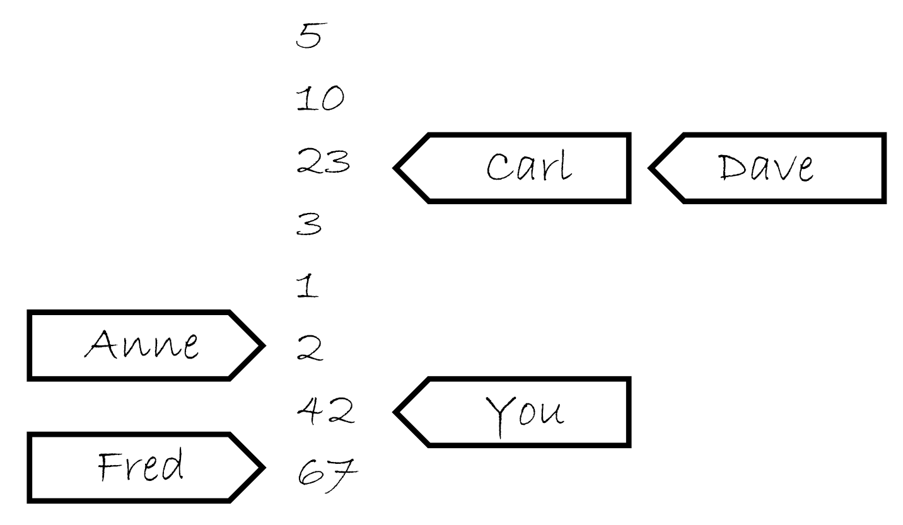
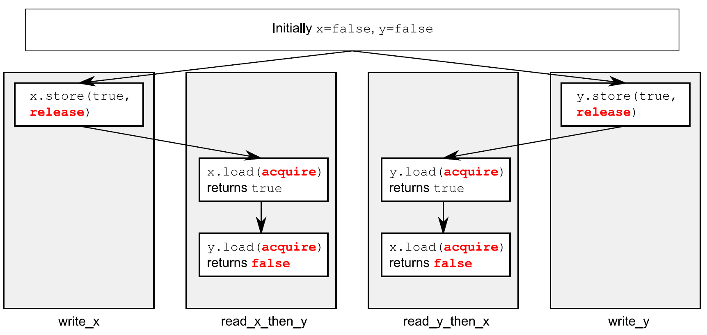

# 5.3 同步操作和強制排序

假設兩個線程，一個向數據結構中填充數據，另一個讀取數據結構中的數據。為了避免惡性條件競爭，第一個線程設置一個標誌，用來表明數據已經準備就緒，從而第二個線程在這個標誌設置前不能讀取數據。

代碼5.2 不同線程對數據的讀寫

```c++
#include <vector>
#include <atomic>
#include <iostream>

std::vector<int> data;
std::atomic<bool> data_ready(false);

void reader_thread()
{
  while(!data_ready.load())  // 1
  {
    std::this_thread::sleep(std::milliseconds(1));
  }
  std::cout<<"The answer="<<data[0]<<"\m";  // 2
}
void writer_thread()
{
  data.push_back(42);  // 3
  data_ready=true;  // 4
}
```

先把等待數據的循環①放在一邊(因為每一個數據項都必須是原子的，所以這個循環不會在線程間產生數據共享)。當非原子讀②和寫③對同一數據結構進行無序訪問時，破壞了循環遵守的訪問順序，所以會產生未定義行為。

訪問順序通過對`std::atomic<bool>`類型的data_ready變量進行操作完成，這些操作通過*[先行](http://en.wikipedia.org/wiki/Happened-before)*(happens-before)和*同發*(synchronizes-with)確定順序。寫入數據③在寫入data_ready④前發生，讀取①發生在讀取數據②之前。當data_ready①為true，寫操作就會與讀操作同步，建立一個“先行”的關係。因為“先行”關係是可傳遞的，所以寫入③先行於寫入④，這兩個行為又先行於讀取操作①，之前的操作都先行於讀取數據②，這樣就強制了順序：寫入數據先行於讀取數據。圖5.2展示了“先行”關係在兩線程間的重要性，讀者線程的while循環中有一對迭代。


圖5.2 對非原子操作，使用原子操作對操作進行強制排序

對一個值來說寫操作必然先於讀操作！默認都是原子操作時，這無疑是正確的(這就是原子操作為默認屬性的原因)。不過，原子操作對於排序要求也有其他選項。

現在，來看看“先行”和“同發”操作的真正意義，先從“同步發生”開始說起。

## 5.3.1 同步發生

“同發”只在原子類型之間進行。例如：操作一個數據結構(對互斥量上鎖)，如果數據結構包含有原子類型，並且操作內部執行了一定的原子操作，那這些操作就是“同發”關係。

“同發”的基本想法：原子寫操作W對變量x進行標記，同步與對x進行原子讀操作，讀取的是W操作寫入的內容，或是W之後，同一線程上的原子寫操作對x寫入的值，亦或是任意線程對x的一系列原子讀-改-寫操作(例如，fetch_add()或compare_exchange_weak())。

因為對原子類型的操作默認都有“適當的標記”，如果線程A存儲了一個值，並且線程B讀取了這個值，線程A的存儲操作與線程B的載入操作就是同步發生關係。

所有細微的差別都在“適當的標記”中，C++內存模型允許為原子類型提供各種約束順序。

## 5.3.2 先行發生

“先行”關係是一個程序中基本構建塊的操作順序：指定了某個操作去影響另一個操作。對於單線程來說：一個操作排在另一個之後，那這個操作就先執行。如果源碼中操作A發生在操作B之前，那A就先行於B。可以回看代碼5.2：對data的寫入③先於對data_ready④的寫入。如果操作在同時發生，因為操作間無序執行，通常情況下就沒有先行關係了。下面的程序會輸出“1，2”或“2，1”，因為兩個get_num()的執行順序未指定。

代碼5.3 對於參數中的函數調用順序未指定順序

```c++
#include <iostream>
void foo(int a,int b)
{
  std::cout<<a<<”,”<<b<<std::endl;
}
int get_num()
{
  static int i=0;
  return ++i;
}
int main()
{
  foo(get_num(),get_num());  // 無序調用get_num()
}
```

這種情況下，操作在單一聲明中可測序，例如：逗號操作符的使用或是表達式的結果作為參數傳給另一個表達式。通常情況下，操作在單一聲明中不可排序，所以無法先行安排順序(也就沒有先行發生了)。

這只是對之前單線程排序的重述，放在這裡有什麼新意嗎？新意在於線程間的互相作用：如果操作A在線程上，並且線程先行於另一線程上的操作B，那麼A就先行於B。只是添加了一個新關係(線程間的先行)，但在編寫多線程程序時，這就是至關重要的關係了。

線程間的先行比較簡單，並且依賴與同步關係(詳見5.3.1節)：如果操作A在一個線程上，與另一個線程上的操作B同步，那麼A就線程間先行於B。這也是一個傳遞關係：如果A線程間先行於B，並且B線程間先行於C，那麼A就線程間先行於C。

線程間先行可以與排序先行相結合：如果操作A排序先行於操作B，並且操作B線程間先行於操作C，那麼A線程間先行於C。同樣的，如果A同步於B，並且B排序先於C，那麼A線程間先行於C。當對數據進行一系列修改(單線程)時，只需要對數據進行一次同步即可。

強先行發生關係會有一些不同，不過在大多數情況下是一樣的。如果操作A與操作B同步，或操作A的順序在操作B之前，那麼A就是強先行於B。也適用於順序傳遞：如果A強先行於B，並且B強先行於C，那麼A就肯定強先行於C。事件在線程間的先行關係與普通事件有所區別，這裡的區別就在於操作被標記為memory_order_consume(詳見5.3.3節)，但不是強先行關係。由於大多數代碼並不適用memory_order_consume內存序，因此這種區別在實際中可能不會表現的很明顯。為了描述方便，本書中使用”先行發生“對這種關係進行描述。

這些是線程間強制排序操作的關鍵規則，也是讓代碼5.2正常運行的因素。並在數據依賴上有細微的差別。為了理解這些差別，需要說一下原子操作使用的內存序，以及這些內存序和同步發生之間的聯繫。

## 5.3.3 原子操作的內存序

這裡有六個內存序列選項可應用於對原子類型的操作：

1. memory_order_relaxed
2. memory_order_consume
3. memory_order_acquire
4. memory_order_release
5. memory_order_acq_rel
6. memory_order_seq_cst

除非為特定的操作指定一個序列選項，要不內存序列默認都是memory_order_seq_cst。

雖然有六個選項，但僅代表三種內存模型：順序一致性(sequentially consistent)，獲取-釋放序(memory_order_consume, memory_order_acquire, memory_order_release和memory_order_acq_rel)和自由序(memory_order_relaxed)。

不同的內存序在不同的CPU架構下功耗不同，例如：基於處理器架構的可視化精細操作系統，可使用順序一致或被獲取-釋放序(在自由序之前)添加的同步指令。如果有多個處理器，額外的同步指令會消耗大量的時間，從而降低系統性能。另一方面，CPU使用的是x86或x86-64架構(例如，使用Intel或AMD處理器的臺式電腦)，這種架構的CPU不需要對獲取-釋放序添加額外的指令(沒有保證原子性的必要了)，順序一致序對於加載操作也不需要任何處理，但在進行存儲時需要額外的消耗。

不同種類的內存序，允許使用其提升相關操作的性能。使用順序一致序(相較於其他序列，它是最簡單的)時，對於在通常情況來說就夠用了。

**順序一致性**

默認序命名為順序一致性，因為程序中的行為從任意角度去看，序列都保持一定順序。如果原子實例的所有操作都是序列一致的，那麼多線程就會如單線程那樣以某種特殊的排序執行。目前來看，該內存序是最容易理解的，這也是將其設置為默認的原因：不同的操作也要遵守相同的順序。因為行為簡單，可以使用原子變量進行編寫。通過不同的線程，可以寫出所有可能的操作消除那些不一致，以及確認代碼的行為是否與預期相符。所以，操作都不能重排；如果代碼在一個線程中，將一個操作放在另一個操作前面，那其他線程也需要了解這個順序。

從同步的角度看，是對同一變量的存儲操作與載入操作的同步。這就提供了一種對兩個(以上)線程操作的排序約束，但順序一致的功能要比排序約束大的多，所以對於使用順序一致的原子操作，都會存儲值後再加載，代碼5.4就是這種一致性約束的演示。這種約束不是線程在自由序中使用原子操作，這些線程依舊可以知道操作以不同順序排列，所以必須使用順序一致的操作去保證，多線程下的加速效果。

不過，簡單就要付出代價。多核機器會加強對性能的懲罰，因為整個序列中的操作都必須在多個處理器上保持一致，可能需要對處理器間的同步操作進行擴展(代價很昂貴！)。即便如此，一些處理器架構(比如：通用x86和x86-64架構)就提供了相對廉價的順序一致性，所以需要考慮使用順序一致性對性能的影響，就需要去查閱目標處理器的架構文檔進行更多的瞭解。

以下代碼展示了順序一致性的行為，對於x和y的加載和存儲都顯示標註為memory_order_seq_cst。因為是默認項，所以在這段代碼中，標籤可能會被忽略。

代碼5.4 全序——序列一致性

```c++
#include <atomic>
#include <thread>
#include <assert.h>

std::atomic<bool> x,y;
std::atomic<int> z;

void write_x()
{
  x.store(true,std::memory_order_seq_cst);  // 1
}

void write_y()
{
  y.store(true,std::memory_order_seq_cst);  // 2
}
void read_x_then_y()
{
  while(!x.load(std::memory_order_seq_cst));
  if(y.load(std::memory_order_seq_cst))  // 3
    ++z;
}
void read_y_then_x()
{
  while(!y.load(std::memory_order_seq_cst));
  if(x.load(std::memory_order_seq_cst))  // 4
    ++z;
}
int main()
{
  x=false;
  y=false;
  z=0;
  std::thread a(write_x);
  std::thread b(write_y);
  std::thread c(read_x_then_y);
  std::thread d(read_y_then_x);
  a.join();
  b.join();
  c.join();
  d.join();
  assert(z.load()!=0);  // 5
}
```

assert⑤語句是永遠不會觸發的，因為不是存儲x的操作①發生，就是存儲y的操作②發生。如果在read_x_then_y中加載y③返回false，是因為存儲x的操作發生在存儲y的操作之前。在read_y_then_x中加載x④必定會返回true，因為while循環能保證在某一時刻y是true。因為memory_order_seq_cst的語義需要一個全序將所有操作都標記為memory_order_seq_cst，這就暗示著“加載y並返回false③”與“存儲y①”的操作，需要有一個確定的順序。只有在全序時，當一個線程看到`x==true`，隨後又看到`y==false`，這就說明在總序列中存儲x的操作發生在存儲y的操作之前。

因為事情都是對稱的，所以有可能以其他方式發生，比如：加載x④的操作返回false，或強制加載y③的操作返回true。這兩種情況下，z都等於1。當兩個加載操作都返回true，z就等於2。所以任何情況下，z都不能是0。

當read_x_then_y知道x為true，並且y為false時，這些操作就有“先行”關係了，如圖5.3所示。


圖5.3 序列一致與先行關係

虛線始於read_x_then_y中對y的加載操作，到達write_y中對y的存儲，其表示排序關係需要保持一致：全局操作序memory_order_seq_cst中，加載操作必須在存儲操作前發生，這樣就產生了圖中的情況。

序列一致性是最簡單、直觀的序列，因為需要對所有線程進行全局同步，所以也是開銷最大的內存序。多處理器設備上需要在處理期間，在信息交換上耗費大量的時間。

為了避免這種消耗，就需考慮使用其他內存序。

**非順序一致性內存**

當踏出序列一致的世界時，事情就開始複雜了。不同線程看到相同操作，不一定有著相同的順序，還有對於不同線程的操作，都會一個接著另一個執行的想法就不可行了。不僅是考慮事情同時發生的問題，還有線程沒辦法保證一致性。為了寫出(或僅是瞭解)一段使用非默認內存序列的代碼，絕不僅是編譯器重新排列指令的事情。即使線程運行相同的代碼，都能拒絕遵循事件發生的順序，因為操作在其他線程上沒有明確的順序限制，不同的CPU緩存和內部緩衝區，在同樣的存儲空間中可以存儲不同的值。這非常重要，這裡再重申一次：線程沒辦法保證一致性。

不僅是要摒棄串行的想法，還要放棄編譯器或處理器重排指令的想法。沒有明確順序限制時，就需要所有線程要對每個獨立變量統一修改順序。對不同變量的操作可以體現在不同線程的不同序列上，提供的值要與任意附加順序限制保持一致。

踏出排序一致世界後，就使用memory_order_relaxed對所有操作進行約束。如果已經有所瞭解，可以跳到獲取-釋放序繼續閱讀，獲取-釋放序允許在操作間引入順序關係。

**自由序**

原子類型上的操作以自由序執行。同一線程中對於同一變量的操作還是遵從先行關係，但不同線程不需要規定順序。唯一的要求是在訪問同一線程中的單個原子變量不能重排序，當給定線程看到原子變量的值時，隨後線程的讀操作就不會去檢索較早的那個值。當使用memory_order_relaxed時，不需要任何額外的同步，對於每個變量的修改順序只存在於線程間共享。

為了演示如何使用非限制操作，只需要兩個線程。

代碼5.5 非限制操作只有非常少的順序要求

```c++
#include <atomic>
#include <thread>
#include <assert.h>

std::atomic<bool> x,y;
std::atomic<int> z;

void write_x_then_y()
{
  x.store(true,std::memory_order_relaxed);  // 1
  y.store(true,std::memory_order_relaxed);  // 2
}
void read_y_then_x()
{
  while(!y.load(std::memory_order_relaxed));  // 3
  if(x.load(std::memory_order_relaxed))  // 4
    ++z;
}
int main()
{
  x=false;
  y=false;
  z=0;
  std::thread a(write_x_then_y);
  std::thread b(read_y_then_x);
  a.join();
  b.join();
  assert(z.load()!=0);  // 5
}
```

這次assert⑤可能會觸發，因為加載x的操作④可能讀取到false，即使加載y的操作③讀取到true，並且存儲x的操作①先發與存儲y的操作②。x和y是兩個不同的變量，所以沒有順序去保證每個操作產生相關值的可見性。

非限制操作對於不同變量可以重排序，只要服從任意的先行關係即可(比如，在同一線程中)。儘管，不同的存儲/加載操作間有著先行關係，這裡不是在一對存儲/加載之間了，所以加載操作可以看到“違反”順序的存儲操作。


圖5.4 非限制原子操作與先發執行

來看一個略微複雜的例子，有三個變量和五個線程。

代碼5.6 非限制操作——多線程版

```c++
#include <thread>
#include <atomic>
#include <iostream>

std::atomic<int> x(0),y(0),z(0);  // 1
std::atomic<bool> go(false);  // 2

unsigned const loop_count=10;

struct read_values
{
  int x,y,z;
};

read_values values1[loop_count];
read_values values2[loop_count];
read_values values3[loop_count];
read_values values4[loop_count];
read_values values5[loop_count];

void increment(std::atomic<int>* var_to_inc,read_values* values)
{
  while(!go)
    std::this_thread::yield();  // 3 自旋，等待信號
  for(unsigned i=0;i<loop_count;++i)
  {
    values[i].x=x.load(std::memory_order_relaxed);
    values[i].y=y.load(std::memory_order_relaxed);
    values[i].z=z.load(std::memory_order_relaxed);
    var_to_inc->store(i+1,std::memory_order_relaxed);  // 4
    std::this_thread::yield();
  }
}

void read_vals(read_values* values)
{
  while(!go)
    std::this_thread::yield(); // 5 自旋，等待信號
  for(unsigned i=0;i<loop_count;++i)
  {
    values[i].x=x.load(std::memory_order_relaxed);
    values[i].y=y.load(std::memory_order_relaxed);
    values[i].z=z.load(std::memory_order_relaxed);
    std::this_thread::yield();
  }
}

void print(read_values* v)
{
  for(unsigned i=0;i<loop_count;++i)
  {
    if(i)
      std::cout<<",";
    std::cout<<"("<<v[i].x<<","<<v[i].y<<","<<v[i].z<<")";
  }
  std::cout<<std::endl;
}

int main()
{
  std::thread t1(increment,&x,values1);
  std::thread t2(increment,&y,values2);
  std::thread t3(increment,&z,values3);
  std::thread t4(read_vals,values4);
  std::thread t5(read_vals,values5);

  go=true;  // 6 開始執行主循環的信號

  t5.join();
  t4.join();
  t3.join();
  t2.join();
  t1.join();

  print(values1);  // 7 打印最終結果
  print(values2);
  print(values3);
  print(values4);
  print(values5);
}
```

代碼本質上很簡單，三個全局原子變量①和五個線程。每一個線程循環10次，使用時memory_order_relaxed讀取三個原子變量的值，並且將它們存儲在一個數組上。其中三個線程每次通過循環④來更新其中一個原子變量，這時剩下的兩個線程就負責讀取。當線程都匯入主線程，就能打印出來每個線程存到數組上的值了。

原子變量go②用來確保線程同時退出。啟動線程是昂貴的操作，並且沒有明確的延遲，第一個線程可能在最後一個線程開始前結束。每個線程都在go變為true前，都在循環③⑤。並且當go設置為true時，所有線程都會開始運行⑥。

程序一種可能的輸出為：

```
(0,0,0),(1,0,0),(2,0,0),(3,0,0),(4,0,0),(5,7,0),(6,7,8),(7,9,8),(8,9,8),(9,9,10)
(0,0,0),(0,1,0),(0,2,0),(1,3,5),(8,4,5),(8,5,5),(8,6,6),(8,7,9),(10,8,9),(10,9,10)
(0,0,0),(0,0,1),(0,0,2),(0,0,3),(0,0,4),(0,0,5),(0,0,6),(0,0,7),(0,0,8),(0,0,9)
(1,3,0),(2,3,0),(2,4,1),(3,6,4),(3,9,5),(5,10,6),(5,10,8),(5,10,10),(9,10,10),(10,10,10)
(0,0,0),(0,0,0),(0,0,0),(6,3,7),(6,5,7),(7,7,7),(7,8,7),(8,8,7),(8,8,9),(8,8,9)
```

前三行中線程都做了更新，後兩行線程只是做讀取。每三個值都是一組x，y和z，並按照這樣的順序依次循環。對於輸出，需要注意的是：

1. 第一組值中x增1，第二組值中y增1，第三組中z增1。
2. x元素只在給定集中增加，y和z也一樣，但是是不均勻增加，並且每個線程中的相對順序都不同。
3. 線程3看不到x或y的任何更新，它能看到的只有z的更新。這並不妨礙別的線程觀察z的更新，並同時觀察x和y的更新。

對於非限制操作，這個結果沒毛病(但是不是唯一合法的輸出)。任意組都用三個變量保持一致，從0到10依次遞增，並且線程對相應變量進行遞增操作，所以打印出的值在0到10的範圍內都合理。

**瞭解自由序**

為了瞭解自由序是如何工作的，可先將每一個變量想象成在一個獨立房間中拿著記事本的人。他的記事本上是一組值的列表，可以通過打電話的方式讓他給你一個值，或讓他寫下一個新值。如果告訴他寫下一個新值，他會將這個新值寫在表的最後。如果讓他給你一個值，他會從列表中讀取一個值給你。

第一次與這人交談時，如果問他要一個值，他可能會在現有的列表中選區任意值告訴你。如果之後再問他要一個值，可能會得到與之前相同的值，或是列表下端的其他值，他不會給你列表上端的值。如果讓他寫一個值，並且隨後再問他要一個值，他要不就給你你剛告訴他的那個值，要不就是一個列表下端的值。

試想當他的筆記本上開始有5，10，23，3，1，2這幾個數。如果問他索要一個值，你可能獲取這幾個數中的任意一個。如果他給你10，那麼下次再問他要值的時候可能會再給你10，或者10後面的數，但絕對不會是5。如果那你問他要了五次，他就可能回答“10，10，1，2，2”。如果你讓他寫下42，他將會把這個值添加在列表的最後。如果你再問他要值，他可能會告訴你“42”，直到有其他值寫在了後面，並且他願意將那個數告訴你。

現在，你有個朋友叫Carl，他也有那個計數員的電話。Carl也可以打電話給計算員，讓他寫下一個值或獲取一個值，他對Carl回應的規則和你是一樣的。他只有一部電話，所以一次只能處理一個人的請求，所以他記事本上的列表是一個簡單的列表。但是，你讓他寫下一個新值的時候，不意味著他會將這個消息告訴Carl，反之亦然。如果Carl從他那裡獲取一個值“23”，之後因為你告訴他寫下42，這不意味著下次他會將這件事告訴Carl。他可能會告訴Carl任意一個值，23，3，1，2，42亦或是67(是Fred在你之後告訴他的)。他會很高興的告訴Carl“23，3，3，1，67”，與你告訴他的值完全不一致，這就像在使用便籤跟蹤告訴每個人的數字，如圖5.5。



圖5.5 計數員的筆記

現在，不僅僅有一個人在房間裡，而是在一個小農場裡，每個人都有一部電話和一個筆記本，這就是原子變量。每一個變量擁有自己的修改順序(筆記上的簡單數值列表)，但是每個原子變量之間沒有任何關係。如果每一個調用者(你，Carl，Anne，Dave和Fred)是一個線程，對每個操作使用memory_order_relaxed就會得到上面的結果。還有些事情可以告訴小房子裡的人，例如：“寫下這個值，並且告訴我現在列表中的最後一個值”(exchange)，或“寫下這個值，當列表的最後一個值為某值時，會進行猜測，如果猜錯了，則告訴我最後一個值是多少”(compare_exchange_strong)，這些都不影響一般性原則。

仔細回顧下代碼5.5的邏輯，write_x_then_y就像某人打電話給房子x裡的人，並且告訴他寫下true，之後打電話給y房間的另一個人，告訴他寫下true。線程反覆執行調用read_y_then_x，就像打電話給房間y的人問他要值，直到要到true，然後打電話給房間x的，繼續問他要值。在x房間中的人有義務告訴他列表中任意指定的值，所以他也是有權利說false。

這就讓自由的原子操作變得難以處理，他們必須與原子操作結合使用，這些原子操作必須有較強的排序語義。為了讓內部線程同步變得更有用，我強烈建議避免自由序的原子操作，除非它們是硬性要求的，並且使用時需要十二分的謹慎。如同代碼5.5中使用雙線程和雙變量一樣，不難想象在更多線程和更多變量的情況下，會變的多麼複雜。

要想獲取額外的同步，且不使用全局排序一致，可以使用*獲取-釋放序*(acquire-release ordering)。

**獲取-釋放序**

這是*自由序*(relaxed ordering)的加強版，雖然操作依舊沒有統一順序，但引入了同步。這種序列模型中，原子加載就是*獲取*(acquire)操作(memory_order_acquire)，原子存儲就是*釋放*(memory_order_release)操作，原子讀-改-寫操作(例如fetch_add()或exchange())在這裡，不是“獲取”就是“釋放”，或者兩者兼有的操作(memory_order_acq_rel)，同步在線程釋放和獲取間是*成對的*(pairwise)，釋放操作與獲取操作同步就能讀取已寫入的值。下面列表中是使用獲取-釋放序(而非序列一致方式)，對代碼5.4的一次重寫。

代碼5.7 獲取-釋放不意味著統一操作順序

```c++
#include <atomic>
#include <thread>
#include <assert.h>

std::atomic<bool> x,y;
std::atomic<int> z;
void write_x()
{
  x.store(true,std::memory_order_release);
}
void write_y()
{
  y.store(true,std::memory_order_release);
}
void read_x_then_y()
{
  while(!x.load(std::memory_order_acquire));
  if(y.load(std::memory_order_acquire))  // 1
    ++z;
}
void read_y_then_x()
{
  while(!y.load(std::memory_order_acquire));
  if(x.load(std::memory_order_acquire))  // 2
    ++z;
}
int main()
{
  x=false;
  y=false;
  z=0;
  std::thread a(write_x);
  std::thread b(write_y);
  std::thread c(read_x_then_y);
  std::thread d(read_y_then_x);
  a.join();
  b.join();
  c.join();
  d.join();
  assert(z.load()!=0); // 3
}
```

例子中斷言③可能會觸發(就如同自由排序那樣)，因為在加載x②和y①時，可能讀取到false。因為x和y是由不同線程寫入，所以序列中的每一次釋放和獲取都不會影響到其他線程的操作。

圖5.6展示了代碼5.7的先行關係，對於讀取的結果，兩個(讀取)線程看到的是兩個完全不同的世界。如前所述，這可能是因為這裡沒有對先行順序進行強制規定導致的。



圖5.6 獲取-釋放，以及先行過程

為了瞭解獲取-釋放序的優點，需要考慮將兩次存儲由一個線程來完成，就像代碼5.5那樣。當需要使用memory_order_release改變y中的存儲，並使用memory_order_acquire來加載y中的值，而後就會影響對x的操作。

代碼5.8 獲取-釋放序操作會影響釋放操作

```c++
#include <atomic>
#include <thread>
#include <assert.h>

std::atomic<bool> x,y;
std::atomic<int> z;

void write_x_then_y()
{
  x.store(true,std::memory_order_relaxed);  // 1 
  y.store(true,std::memory_order_release);  // 2
}
void read_y_then_x()
{
  while(!y.load(std::memory_order_acquire));  // 3 自旋，等待y被設置為true
  if(x.load(std::memory_order_relaxed))  // 4
    ++z;
}
int main()
{
  x=false;
  y=false;
  z=0;
  std::thread a(write_x_then_y);
  std::thread b(read_y_then_x);
  a.join();
  b.join();
  assert(z.load()!=0);  // 5
}
```

最後，讀取y③時會得到true，和存儲時寫入的一樣②。存儲使用的是memory_order_release，讀取使用的是memory_order_acquire，存儲與讀取就同步了。因為這兩個操作是由同一個線程串行完成的，所以存儲x①的操作先行於存儲y②的操作。對y的存儲同步與對y的加載，存儲x也就先行於對y的加載，並且擴展先行於x的讀取。因此，加載x的值必為true，並且斷言⑤不會觸發。如果對於y的加載不是在while循環中，情況可能就會有所不同。加載y的時候可能會讀取到false，這種情況下對於讀取到的x是什麼值沒有要求了。為了保證同步，加載和釋放操作必須成對。所以，無論有何影響，釋放操作存儲的值必須要讓獲取操作看到。當存儲②或加載③都是一個釋放操作時，對x的訪問就無序了，也就無法保證④處讀到的是true，並且還會觸發斷言。

也可以將獲取-釋放序與之前提到記錄員相關聯，這樣就需要添加很多東西到模型中。首先，每個存儲操作做一部分更新，當你聯繫一個人時，讓他寫下一個數字，也需要告訴他更新哪一部分：“請在423組中寫下99”。對於某一組的最後一個值的存儲，你也需要告訴那個人：“請寫下147，這是最後存儲在423組的值”。隔間中的人會及時寫下這一信息，並註明這個值的來源，這個就是存儲-釋放操作的模型。下一次，你告訴另外一個人寫下一組值時，需要改變組號：“請在424組中寫入41”

當你詢問時就要做出一個選擇：要不就僅僅詢問一個值(這就是次自由加載，這種情況下，隔間中的人會給你的)，要不就詢問一個值以及其關於組的信息(是否是某組中的最後一個，這就是加載-獲取模型)。當你詢問組信息，且值不是組中的最後一個，隔間中的人會這樣告訴你，“這個值是987，它是一個普通值”，但當這個值是最後一個時，他會告訴你：“數字為987，這個值是956組的最後一個，來源於Anne”。這樣，獲取-釋放的語義就很明確了：當查詢一個值，你告訴他所有組後，他會低頭查看列表，看你給的這些數是不是在對應組的最後，並且告訴你那個值的屬性，或繼續在列表中查詢。

如何理解模型中獲取-釋放的語義？首先，線程a運行write_x_then_y函數，然後告訴在x屋的記錄員，“請寫下true作為組1的一部分，信息來源於線程a”，之後記錄員工整的寫下了這些信息。而後，線程a告訴在y屋的記錄員，“請寫下true作為組1的一部分，信息來源於線程a”。期間，線程b運行read_y_then_x。線程b持續向y屋的記錄員詢問值與組的信息，直到它聽到記錄員說“true”。記錄員可能需要告訴他很多遍，不過最終記錄員還是說了“true”。y屋的記錄員不僅僅是說“true”，他還要說“組1最後是由線程a寫入”。

現在，線程b會持續詢問x屋的記錄員，但這次他會說“請給我一個值，我知道這個值是組1的值，並且是由線程a寫入的”。所以現在，x屋中的記錄員就開始查找組1中由線程a寫入的值。這裡他注意到，他寫入的值是true，同樣也是他列表中的最後一個值，所以必須讀出這個值。否則，他將打破這個遊戲的規則。

回看5.3.2節中對“線程間先行”的定義，一個很重要的特性就是可傳遞：當A線程間先行於B，並且B線程間先行於C，那麼A就線程間先行於C。獲取-釋放序列可以在若干線程間使用同步數據，甚至在“中間”線程接觸到這些數據前，使用這些數據。

**獲取-釋放序傳遞同步**

為了考慮傳遞順序，至少需要三個線程。第一個線程用來修改共享變量，第二個線程使用“加載-獲取”讀取由“存儲-釋放”操作過的變量，並且再對第二個變量進行“存儲-釋放”操作。最後，由第三個線程通過“加載-獲取”讀取第二個共享變量，並提供“加載-獲取”操作來讀取被“存儲-釋放”操作寫入的值。為了保證同步關係，即便是中間線程沒有對共享變量做任何操作，第三個線程也可以讀取第一個線程操作過的變量。

代碼5.9 使用獲取和釋放序傳遞同步

```c++
std::atomic<int> data[5];
std::atomic<bool> sync1(false),sync2(false);

void thread_1()
{
  data[0].store(42,std::memory_order_relaxed);
  data[1].store(97,std::memory_order_relaxed);
  data[2].store(17,std::memory_order_relaxed);
  data[3].store(-141,std::memory_order_relaxed);
  data[4].store(2003,std::memory_order_relaxed);
  sync1.store(true,std::memory_order_release);  // 1.設置sync1
}

void thread_2()
{
  while(!sync1.load(std::memory_order_acquire));  // 2.直到sync1設置後，循環結束
  sync2.store(true,std::memory_order_release);  // 3.設置sync2
}
void thread_3()
{
  while(!sync2.load(std::memory_order_acquire));   // 4.直到sync1設置後，循環結束
  assert(data[0].load(std::memory_order_relaxed)==42);
  assert(data[1].load(std::memory_order_relaxed)==97);
  assert(data[2].load(std::memory_order_relaxed)==17);
  assert(data[3].load(std::memory_order_relaxed)==-141);
  assert(data[4].load(std::memory_order_relaxed)==2003);
}
```

儘管thread_2只接觸到變量syn1②和sync2③，對於thread_1和thread_3的同步就足夠了，這能保證斷言不會觸發。首先，thread_1將數據存儲到data中先行於存儲sync1①(它們在同一個線程內)。因為加載sync1①的是一個while循環，它最終會看到thread_1存儲的值。因此，對於sync1的存儲先行於最終對於sync1的加載(在while循環中)。thread_3的加載操作④，位於存儲sync2③操作的前面。存儲sync2③因此先行於thread_3的加載④，加載又先行於存儲sync2③，存儲sync2又先行於加載sync2④，加載syn2又先行於加載data。因此，thread_1存儲數據到data的操作先行於thread_3中對data的加載，並且保證斷言都不會觸發。

這個例子中，可將sync1和sync2通過在thread_2中使用“讀-改-寫”操作(memory_order_acq_rel)合併成一個獨立的變量。其中會使用compare_exchange_strong()來保證thread_1對變量只進行一次更新：

```c++
std::atomic<int> sync(0);
void thread_1()
{
  // ...
  sync.store(1,std::memory_order_release);
}

void thread_2()
{
  int expected=1;
  while(!sync.compare_exchange_strong(expected,2,
              std::memory_order_acq_rel))
    expected=1;
}
void thread_3()
{
  while(sync.load(std::memory_order_acquire)<2);
  // ...
}
```

使用“讀-改-寫”操作，選擇語義就很重要了。例子中，想要同時進行獲取和釋放的語義，所以memory_order_acq_rel是一個不錯的選擇，但也可以使用其他內存序。即使存儲了一個值，使用memory_order_acquire語義的fetch_sub不會和任何東西同步的，因為沒有釋放操作。同樣，使用memory_order_release語義的fetch_or也不會和任何存儲操作進行同步，因為對於fetch_or的讀取，並不是一個獲取操作。使用memory_order_acq_rel語義的“讀-改-寫”操作，每一個動作都包含獲取和釋放操作，所以可以和之前的存儲操作進行同步，並且可以對隨後的加載操作進行同步，就像上面例子一樣。

如果將獲取-釋放和序列一致進行混合，“序列一致”的加載動作就如使用了獲取語義的加載操作，序列一致的存儲操作就如使用了釋放語義的存儲，“序列一致”的讀-改-寫操作行為就如使用了獲取和釋放的操作。“自由操作”依舊那麼自由，但其會和額外的同步進行綁定(也就是使用“獲取-釋放”的語義)。

儘管結果並不那麼直觀，每個使用鎖的同學都需要了解：鎖住互斥量是一個獲取操作，並且解鎖這個互斥量是一個釋放操作。隨著互斥量的增多，必須確保同一個互斥量在讀取變量或修改變量時上鎖，所以獲取和釋放操作必須在同一個變量上，以保證訪問順序。當互斥量保護數據時，因為鎖住與解鎖的操作都是序列一致的操作，就保證了結果一致。當對原子變量使用獲取和釋放序時，代碼必然會使用鎖，即使內部操作序不一致，其外部表現將會為序列一致。

當原子操作不需要嚴格的序列一致序時，可以提供成對同步的獲取-釋放序，這種比全局序列一致性的成本更低，且有同步操作。為了保證序列能夠正常的工作，這裡還需要一些權衡，還要保證隱式的跨線程行為是沒有問題的。

**獲取-釋放序和memory_order_consume的數據相關性**

介紹本章節的時候，說過memory_order_consume是“獲取-釋放”模型的一部分，但並沒有對其進行過多的討論。因為memory_order_consume很特別：完全依賴於數據，並且其展示了與線程間先行關係(可見5.3.2節)的不同之處。這個內存序非常特殊，即使在C++17中也不推薦使用。這裡只為了完整的覆蓋內存序而討論， memory_order_consume不應該出現在代碼中。

數據依賴的概念相對簡單：第二個操作依賴於第一個操作的結果，這樣兩個操作之間就有了數據依賴。這裡有兩種新關係用來處理數據依賴：*前序依賴*(dependency-ordered-before)和*攜帶依賴*(carries-a-dependency-to)。攜帶依賴對於數據依賴的操作，嚴格應用於一個獨立線程和其基本模型。如果A操作結果要使用操作B的操作數，則A將攜帶依賴於B。如果A操作的結果是一個標量(比如int)，而後的攜帶依賴關係仍然適用於，當A的結果存儲在一個變量中，並且這個變量需要被其他操作使用。這個操作可以傳遞，所以當A攜帶依賴B，並且B攜帶依賴C，就可以得出A攜帶依賴C的關係。

當不影響線程間的先行關係時，對於同步來說沒有任何好處：當A前序依賴B，那麼A線程間也前序依賴B。

這種內存序在原子操作載入指向數據的指針時很重要，當使用memory_order_consume作為加載語義，並且memory_order_release作為存儲語義時，就要保證指針指向的值已同步，並且不要求其他非獨立數據同步。

代碼5.10 使用`std::memroy_order_consume`同步數據

```c++
struct X
{
int i;
std::string s;
};

std::atomic<X*> p;
std::atomic<int> a;

void create_x()
{
  X* x=new X;
  x->i=42;
  x->s="hello";
  a.store(99,std::memory_order_relaxed);  // 1
  p.store(x,std::memory_order_release);  // 2
}

void use_x()
{
  X* x;
  while(!(x=p.load(std::memory_order_consume)))  // 3
    std::this_thread::sleep(std::chrono::microseconds(1));
  assert(x->i==42);  // 4
  assert(x->s=="hello");  // 5
  assert(a.load(std::memory_order_relaxed)==99);  // 6
}

int main()
{
  std::thread t1(create_x);
  std::thread t2(use_x);
  t1.join();
  t2.join();
}
```

儘管，存儲a①在存儲p②之前，並且存儲p的操作標記為memory_order_release，加載p③的操作標記為memory_order_consume，所以存儲p僅先行那些需要加載p的操作。因為對x變量操作的表達式對加載p的操作攜帶有依賴，所以X結構體中數據成員所在的斷言語句④⑤不會被觸發。另一方面，對於加載變量a⑥的斷言就不能確定是否能觸發，因為這個操作標記為memory_order_relaxed，所以這個操作並不依賴於p的加載操作，也無法保證已經讀取數據。

有時，不想為攜帶依賴增加其他開銷。想使用編譯器在寄存器中緩存這些值，以及優化重排序操作代碼。可以使用`std::kill_dependecy()`顯式打破依賴鏈，`std::kill_dependency()`是一個簡單的函數模板，會複製提供的參數給返回值。例如，一個全局的只讀數組，當其他線程對數組索引進行檢索時，使用的是`std::memory_order_consume`，可以使用`std::kill_dependency()`讓編譯器知道這裡不需要重新讀取該數組的內容。

```c++
int global_data[]={ … };
std::atomic<int> index;

void f()
{
  int i=index.load(std::memory_order_consume);
  do_something_with(global_data[std::kill_dependency(i)]);
}
```

實際操作中，應該使用memory_order_acquire，而不是memory_order_consume和`std::kill_dependency`。

現在，已經討論了所有的內存序，是時候看看更加複雜的同步關係了——釋放隊列。

## 5.3.4 釋放隊列與同步

回到5.3.1節，通過線程在存儲和加載操作之間有(有序的)多個“讀-改-寫”操作(所有操作都已經做了適當的標記)，所以可以獲取原子變量存儲與加載的同步關係。存儲操作標記為memory_order_release，memory_order_acq_rel或memory_order_seq_cst，加載標記為memory_order_consum，memory_order_acquire或memory_order_sqy_cst，並且操作鏈上的每一加載操作都會讀取之前操作寫入的值，因此鏈上的操作構成了一個釋放序列(*release sequence*)，並且初始化存儲同步(對應memory_order_acquire或memory_order_seq_cst)或是前序依賴(對應memory_order_consume)的最終加載，操作鏈上的任何原子“讀-改-寫”操作可以擁有任意個內存序(甚至是memory_order_relaxed)。

為了瞭解這些操作的作用和其重要性，這裡假設使用`atomic<int>`對共享隊列的元素進行計數：

代碼5.11 使用原子操作從隊列中讀取數據

```c++
#include <atomic>
#include <thread>

std::vector<int> queue_data;
std::atomic<int> count;

void populate_queue()
{
  unsigned const number_of_items=20;
  queue_data.clear();
  for(unsigned i=0;i<number_of_items;++i)
  {
    queue_data.push_back(i);
  }

  count.store(number_of_items,std::memory_order_release);  // 1 初始化存儲
}

void consume_queue_items()
{
  while(true)
  {
    int item_index;
    if((item_index=count.fetch_sub(1,std::memory_order_acquire))<=0)  // 2 一個“讀-改-寫”操作
    {
      wait_for_more_items();  // 3 等待更多元素
      continue;
    }
    process(queue_data[item_index-1]);  // 4 安全讀取queue_data
  }
}

int main()
{
  std::thread a(populate_queue);
  std::thread b(consume_queue_items);
  std::thread c(consume_queue_items);
  a.join();
  b.join();
  c.join();
}
```

一種處理方式是讓線程產生數據，並存儲到一個共享內存中，而後調用count.store(number_of_items, memory_order_release)①讓其他線程知道數據是可用的。線程群會消耗隊列中的元素，調用count.fetch_sub(1, memory_order_acquire)②後，從隊列中獲取元素。在這之前，需要對共享內存進行完整的讀取④。一旦count歸零，隊列中就沒有元素了，這時線程必須等待③。

只有一個消費者線程時還好，fetch_sub()帶有memory_order_acquire的讀取操作，並且存儲操作是帶有memory_order_release語義，所以存儲與加載同步，線程可以從緩存中讀取元素。當有兩個讀取線程時，第二個fetch_sub()操作將看到第一個線程修改的值，且沒有值通過store寫入其中。先不管釋放序列的規則，第二個線程與第一個線程不存在先行關係，並且對共享內存中值的讀取也不安全。除非第一個fetch_sub()是帶有memory_order_release語義，為兩個消費者線程建立了不必要的同步。無論是釋放序列的規則，還是具有memory_order_release語義的fetch_sub操作，第二個消費者看到的是一個空的queue_data，無法從其獲取任何數據，並且還會產生條件競爭。幸運的是，第一個fetch_sub()對釋放順序做了一些事情，所以store()能同步與第二個fetch_sub()操作。兩個消費者線程間不需要同步關係。過程在圖5.7中展示，其中虛線表示的就是釋放順序，實線表示的是先行關係。


圖5.7 代碼5.11中對隊列操作的釋放順序

操作鏈中可以有任意數量的鏈接，提供的都是“讀-改-寫”操作，比如fetch_sub()，store()，每一個都會與使用memory_order_acquire語義的操作進行同步。例子中所有鏈接都是一樣的，並且都是獲取操作，但它們可由不同內存序列語義組成的操作混合。

雖然，大多數同步關係是對原子變量的操作應用了內存序，但這裡依舊有必要介紹對排序的約束——柵欄(*fences*)。

## 5.3.5 柵欄

柵欄操作會對內存序列進行約束，使其無法對任何數據進行修改，典型的做法是與使用memory_order_relaxed約束序的原子操作一起使用。柵欄屬於全局操作，執行柵欄操作可以影響到在線程中的其他原子操作。因為這類操作就像畫了一條任何代碼都無法跨越的線一樣，所以柵欄操作通常也被稱為*內存柵欄*(memory barriers)。回憶一下5.3.3節，自由操作可以使用編譯器或者硬件的方式，在獨立的變量上自由的重新排序。不過，柵欄操作就會限制這種自由。

我們給在不同線程上的兩個原子操作中添加一個柵欄，代碼如下所示：

代碼5.12 柵欄可以讓自由操作變的有序

```c++
#include <atomic>
#include <thread>
#include <assert.h>

std::atomic<bool> x,y;
std::atomic<int> z;

void write_x_then_y()
{
  x.store(true,std::memory_order_relaxed);  // 1
  std::atomic_thread_fence(std::memory_order_release);  // 2
  y.store(true,std::memory_order_relaxed);  // 3
}

void read_y_then_x()
{
  while(!y.load(std::memory_order_relaxed));  // 4
  std::atomic_thread_fence(std::memory_order_acquire);  // 5
  if(x.load(std::memory_order_relaxed))  // 6
    ++z;
}

int main()
{
  x=false;
  y=false;
  z=0;
  std::thread a(write_x_then_y);
  std::thread b(read_y_then_x);
  a.join();
  b.join();
  assert(z.load()!=0);  // 7
}
```

因為加載y的操作④讀取③處存儲的值，所以釋放柵欄②與獲取柵欄⑤同步。①處存儲x先行於⑥處加載x，最後x讀取出來必為true，並且不會觸發斷言⑦。原先不帶柵欄的存儲和加載x是無序的，並且斷言是可能會觸發。這兩個柵欄都是必要的：需要在一個線程中進行釋放，然後在另一個線程中進行獲取，這樣才能構建同步關係。

例子中，如果存儲y的操作③標記為memory_order_release，而非memory_order_relaxed，釋放柵欄②也會對這個操作產生影響。同樣，當加載y的操作④標記為memory_order_acquire時，獲取柵欄⑤也會對之產生影響。使用柵欄的想法是：當獲取操作能看到釋放柵欄操作後的存儲結果，那麼這個柵欄就與獲取操作同步。並且，當加載操作在獲取柵欄操作前，看到一個釋放操作的結果，那麼這個釋放操作同步於獲取柵欄。當然，也可以使用雙邊柵欄操作。舉一個簡單的例子：當一個加載操作在獲取柵欄前，看到一個值有存儲操作寫入，且這個存儲操作發生在釋放柵欄後，那麼釋放柵欄與獲取柵欄同步。

雖然，柵欄同步依賴於讀取/寫入的操作發生於柵欄之前/後，但是這裡有一點很重要：同步點，就是柵欄本身。當執行代碼5.12中的write_x_then_y，並且在柵欄操作之後對x進行寫入，就像下面的代碼一樣。觸發斷言的條件就不保證一定為true了，儘管寫入x的操作在寫入y的操作之前發生。

```c++
void write_x_then_y()
{
  std::atomic_thread_fence(std::memory_order_release);
  x.store(true,std::memory_order_relaxed);
  y.store(true,std::memory_order_relaxed);
}
```

柵欄不會分開這裡的兩個操作，並且也不再有序。只有當柵欄出現在存儲x和存儲y操作之間時，順序才是硬性的。當然，柵欄是否存在不會影響任何擁有先行關係的執行序列。

這個例子，以及本章中的其他例子，變量使用的都是原子類型，使用原子操作正真的好處在於執行內存序時，可以避免對數據競爭的未定義行為。

## 5.3.6 原子操作對非原子的操作排序

使用普通的非原子bool類型來替換代碼5.12中的x，行為和替換前完全一樣。

代碼5.13 使用非原子操作執行序列

```c++
#include <atomic>
#include <thread>
#include <assert.h>

bool x=false;  // x現在是一個非原子變量
std::atomic<bool> y;
std::atomic<int> z;

void write_x_then_y()
{
  x=true;  // 1 在柵欄前存儲x
  std::atomic_thread_fence(std::memory_order_release);
  y.store(true,std::memory_order_relaxed);  // 2 在柵欄後存儲y
}

void read_y_then_x()
{
  while(!y.load(std::memory_order_relaxed));  // 3 在#2寫入前，持續等待
  std::atomic_thread_fence(std::memory_order_acquire);
  if(x)  // 4 這裡讀取到的值，是#1中寫入
    ++z;
}
int main()
{
  x=false;
  y=false;
  z=0;
  std::thread a(write_x_then_y);
  std::thread b(read_y_then_x);
  a.join();
  b.join();
  assert(z.load()!=0);  // 5 斷言將不會觸發
}
```

柵欄仍然為存儲x①和存儲y②，還為加載y③和加載x④提供一個執行序，並且這裡存儲x和加載x之間仍然有一個先行關係，所以不會觸發斷言⑤。②中的存儲和③中對y的加載必須是原子操作，否則會在y上產生條件競爭。當讀取線程看到存儲到y的操作，柵欄將會對x執行有序的操作，這個執行序意味著x上不存在條件競爭。

不僅是柵欄可對非原子操作排序，memory_order_release/memory_order_consume也為非原子訪問排序，可以動態分配對象，並且本章中的許多例子都可以使用普通的非原子操作，去替代memory_order_relaxed的操作。

## 5.3.7 非原子操作排序

對非原子操作的排序，可以通過使用原子操作進行，“序前”作為“先行”的一部分，如果一個非原子操作是“序前”於一個原子操作，並且這個原子操作需要“先行”與另一個線程的操作，那麼這個非原子操作也就“先行”於在其他線程的操作了。 對於C++標準庫的高級同步工具來說，這些只是基本工具。

使用`std::memory_order_acquire`序的lock()操作是在flag.test_and_set()上的一個循環，並且使用`std::memory_order_release`序的unlock()調用flag.clear()。第一個線程調用lock()時，標誌最初是沒有的，所以第一次調用test_and_set()會設置標誌，並且返回false，表示線程已鎖，並且結束循環，線程可以自由的修改由互斥量保護的數據。這時任何想要調用lock()的線程，將會看到已設置的標誌，而後會阻塞於test_and_set()中的循環。

當帶鎖線程完成對保護數據的修改，就會調用unlock()，相當於調用帶有`std::memory_order_release`語義的flag.clear()。因為對lock()的調用帶有`std::memory_order_acquire`語義，所以隨後線程訪問flag.test_and_set()時調用lock()會進行同步(見5.3.1節)。對於保護數據的修改，必須先於unlock()的調用，所以修改“先行”於unlock()，並且“先行”於之後第二個線程對lock()的調用(因為同步關係是在unlock()和lock()中產生的)，還“先行”於當第二個線程獲取鎖後，對保護數據的任何訪問。

雖然，其他互斥量的內部實現不盡相同，不過基本原理一樣：某一內存位置上，lock()作為一個獲取操作，在同樣的位置上unlock()作為一個釋放操作。

第2章、第3章和第4章中都有對同步機制進行描述，這些機制會為同步關係之間的順序進行保證。這樣就可以使用它們進行數據同步，並保證同步關係間的順序。以下的工具都可以提供同步：

**std::thread**

* std::thread構造新線程時，構造函數與調用函數或新線程的可調用對象間的同步。
* 對std::thread對象調用join，可以和對應的線程進行同步。

**std::mutex, std::timed_mutex, std::recursive_mutex, std::recursibe_timed_mutex**

* 對給定互斥量對象調用lock和unlock，以及對try_lock，try_lock_for或try_lock_until，會形成該互斥量的鎖序。
* 對給定的互斥量調用unlock，需要在調用lock或成功調用try_lock，try_lock_for或try_lock_until之後，這樣才符合互斥量的鎖序。
* 對try_lock，try_lock_for或try_lock_until失敗的調用，不具有任何同步關係。

**std::shared_mutex ,  std::shared_timed_mutex**

* 對給定互斥量對象調用lock、unlock、lock_shared和unlock_shared，以及對 try_lock ,  try_lock_for ,  try_lock_until ,  try_lock_shared ,  try_lock_shared_for或 try_lock_shared_until的成功調用，會形成該互斥量的鎖序。
* 對給定的互斥量調用unlock，需要在調用lock或shared_lock，亦或是成功調用try_lock ,  try_lock_for,  try_lock_until,  try_lock_shared,  try_lock_shared_for或try_lock_shared_until之後，才符合互斥量的鎖序。
* 對try_lock，try_lock_for，try_lock_until，try_lock_shared，try_lock_shared_for或try_lock_shared_until 失敗的調用，不具有任何同步關係。

**std::shared_mutex和std::shared_timed_mutex**

* 成功的調用std::promise對象的set_value或set_exception與成功的調用wait或get之間同步，或是調用wait_for或wait_until的返回例如future狀態std::future_status::ready與promise共享同步狀態。
* 給定std::promise對象的析構函數，該對象存儲了一個std::future_error異常，成功的調用wait或get後，共享同步狀態與promise之間的同步，或是調用wait_for或wait_until返回的future狀態std::future_status::ready時，與promise共享同步狀態。

**std::packaged_task ,  std::future和std::shared_future**

* 成功的調用std::packaged_task對象的函數操作符與成功的調用wait或get之間同步，或是調用wait_for或wait_until的返回future狀態std::future_status::ready與打包任務共享同步狀態。
* std::packaged_task對象的析構函數，該對象存儲了一個std::future_error異常，其共享同步狀態與打包任務之間的同步在於成功的調用wait或get，或是調用wait_for或wait_until返回的future狀態std::future_status::ready與打包任務共享同步狀態。

**std::async ,  std::future和std::shared_future**

* 使用std::launch::async策略性的通過std::async啟動線程執行任務與成功的調用wait和get之間是同步的，或調用wait_for或wait_until返回的future狀態std::future_status::ready與產生的任務共享同步狀態。
* 使用std::launch::deferred策略性的通過std::async啟動任務與成功的調用wait和get之間是同步的，或調用wait_for或wait_until返回的future狀態std::future_status::ready與promise共享同步狀態。

**std::experimental::future ,  std::experimental::shared_future和持續性**

* 異步共享狀態變為就緒的事件與該共享狀態上調度延續函數的調用同步。
* 持續性函數的完成與成功調用wait或get的返回同步，或調用wait_for或wait_until返回的期望值狀態std::future_status::ready與調用then構建的持續性返回的future同步，或是與在調度用使用這個future的操作同步。

**std::experimental::latch**

* 對std::experimental::latch實例調用count_down或count_down_and_wait與在該對象上成功的調用wait或count_down_and_wait之間是同步的。

**std::experimental::barrier**

* 對std::experimental::barrier實例調用arrive_and_wait或arrive_and_drop與在該對象上隨後成功完成的arrive_and_wait之間是同步的。

**std::experimental::flex_barrier**

* 對std::experimental::flex_barrier實例調用arrive_and_wait或arrive_and_drop與在該對象上隨後成功完成的arrive_and_wait之間是同步的。
* 對std::experimental::flex_barrier實例調用arrive_and_wait或arrive_and_drop與在該對象上隨後完成的給定函數之間是同步的。
* 對std::experimental::flex_barrier實例的給定函數的返回與每次對arrive_and_wait的調用同步，當調用給定函數線程會在柵欄處阻塞等待。

**std::condition_variable和std::condition_variable_any**

* 條件變量不提供任何同步關係，它們是對忙等待的優化，所有同步都由互斥量提供。