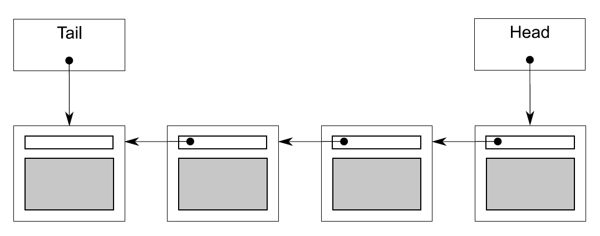

# 6.2 基於鎖的併發數據結構

基於鎖的併發數據結構需要確保訪問線程持有鎖的時間最短，對於只有一個互斥量的數據結構來說十分困難。需要鎖之外的操作不能訪問數據，保證不會產生條件競爭。使用多個互斥量保護數據結構不同的區域時，問題會更加明顯。當操作需要獲取多個互斥鎖時，可能會產生死鎖，所以使用多個互斥量時要格外小心。

本節將使用6.1.1節的指導建議，來設計簡單的數據結構——使用互斥量和鎖的來保護數據。每個例子都在保證是線程安全的前提下，對數據結構併發訪問的概率(機會)進行提高。

先來看看第3章中棧的實現，只使用了一個互斥量。但這個結構線程安全嗎？它離真正的併發訪問還差什麼呢？

## 6.2.1 線程安全棧——使用鎖

先把第3章中線程安全的棧拿過來看看：(試圖實現一個線程安全版的`std:stack<>`)

代碼6.1 線程安全棧的類定義

```c++
#include <exception>

struct empty_stack: std::exception
{
  const char* what() const throw();
};

template<typename T>
class threadsafe_stack
{
private:
  std::stack<T> data;
  mutable std::mutex m;
public:
  threadsafe_stack(){}
  threadsafe_stack(const threadsafe_stack& other)
  {
    std::lock_guard<std::mutex> lock(other.m);
    data=other.data;
  }

  threadsafe_stack& operator=(const threadsafe_stack&) = delete;

  void push(T new_value)
  {
    std::lock_guard<std::mutex> lock(m);
    data.push(std::move(new_value));  // 1
  }
  std::shared_ptr<T> pop()
  {
    std::lock_guard<std::mutex> lock(m);
    if(data.empty()) throw empty_stack();  // 2
    std::shared_ptr<T> const res(
      std::make_shared<T>(std::move(data.top())));  // 3
    data.pop();  // 4
    return res;
  }
  void pop(T& value)
  {
    std::lock_guard<std::mutex> lock(m);
    if(data.empty()) throw empty_stack();
    value=std::move(data.top());  // 5
    data.pop();  // 6
  }
  bool empty() const
  {
    std::lock_guard<std::mutex> lock(m);
    return data.empty();
  }
};
```

首先，互斥量m可保證線程安全，對每個成員函數進行加鎖保護。保證在同一時間內，只有一個線程可以訪問到數據。

其次，empty()和pop()之間會存在競爭，代碼會在pop()上鎖時，顯式的查詢棧是否為空，所以不是惡性競爭。pop()直接返回彈出值，就可避免`std::stack<>`中top()和pop()之間的競爭。

再次，類中也有一些異常源。因為上鎖操作是每個成員函數所做的第一個操作，所以對互斥量上鎖可能會拋出異常。因無數據修改，所以安全。解鎖互斥量不會失敗，所以這段代碼很安全，並且使用`std::lock_guard<>`也能保證互斥量上鎖的狀態。

對data.push()①的調用可能會拋出一個異常，不是拷貝/移動數據，就是內存不足。不管哪種情況，`std::stack<>`都能保證其安全性，所以也沒有問題。

pop()第一個重載中，代碼可能會拋出empty_stack異常②，數據沒有修改，是安全的。創建res③時，也可能會拋出異常，兩個原因：`std::make_shared`無法分配出足夠的內存去創建新對象，並且內部數據需要引用新對象；或者在拷貝或移動構造到新分配的內存中時拋出異常。兩種情況下，C++運行時庫和標準庫能確保不會出現內存洩露，並且新創建的對象(如果有的話)都能正確銷燬。因為沒有對棧進行任何修改，所以沒問題。當調用data.pop()④時，能保證不拋出異常並返回結果，所以這個重載的pop()是“異常-安全”的。

第二個重載pop()除了在拷貝賦值或移動賦值時會拋出異常⑤，當構造新對象和`std::shared_ptr`實例時都不會拋出異常。同樣，調用data.pop()⑥(這個成員函數保證不會拋出異常)之前，沒有對數據結構進行修改，所以這個函數也是“異常-安全”的。

最後，empty()不會修改任何數據，所以也是“異常-安全”函數。

當調用持有一個鎖的用戶代碼時，有兩個地方可能會死鎖：拷貝構造或移動構造(①，③)和拷貝賦值或移動賦值操作⑤。還有一個潛在死鎖的地方位於用戶定義的new操作符。無論是直接調用棧的成員函數的方式，還是在成員函數進行操作時，對已插入或刪除的數據進行操作的方式對鎖進行獲取，都可能造成死鎖。不過，用戶要對棧負責，當棧未對數據進行拷貝或分配時，用戶就不能隨意的將其添加到棧中。

所有成員函數都使用`std::lock_guard<>`保護數據，所以棧成員函數才是“線程安全”的。當然，構造與析構函數不是“線程安全”的，但構造與析構只有一次。調用不完全構造對象或是已銷燬對象的成員函數，無論在哪種編程方式下都不可取。所以，用戶就要保證在棧對象完成構建前，其他線程無法對其進行訪問。並且，要保證在棧對象銷燬後，停止所有線程的訪問操作。

即使在多線程下，併發調用成員函數也是安全的(因為使用鎖)。同時，要保證在單線程的情況下，數據結構能做出正確反應。串行化線程會隱性的限制程序性能，這就是棧爭議最大的地方：當一個線程在等待鎖時，就會無所事事。對於棧來說，等待添加元素是沒有意義的，所以當線程需要等待時，會定期檢查empty()或pop()，以及對empty_stack異常進行關注。這樣的現實會限制棧的實現方式，線程等待時會浪費寶貴的資源去檢查數據，或要求用戶編寫等待和提示的代碼(例如：使用條件變量)，這就使內部鎖失去存在的意義，也造成資源的浪費。

第4章中的隊列就是使用條件內部變量進行等待的數據結構，接下來我們就來了解一下。

## 6.2.2 線程安全隊列——使用鎖和條件變量

代碼6.2中重新實現了第4章中的線程安全隊列，與使用仿`std::stack<>`建立的棧類似，隊列也參照了`std::queue<>`。不過，與標準容器的接口不同，我們要設計的是線程安全的數據結構。

代碼6.2 使用條件變量實現的線程安全隊列

```c++
template<typename T>
class threadsafe_queue
{
private:
  mutable std::mutex mut;
  std::queue<T> data_queue;
  std::condition_variable data_cond;

public:
  threadsafe_queue()
  {}

  void push(T data)
  {
    std::lock_guard<std::mutex> lk(mut);
    data_queue.push(std::move(data));
    data_cond.notify_one();  // 1
  }

  void wait_and_pop(T& value)  // 2
  {
    std::unique_lock<std::mutex> lk(mut);
    data_cond.wait(lk,[this]{return !data_queue.empty();});
    value=std::move(data_queue.front());
    data_queue.pop();
  }

  std::shared_ptr<T> wait_and_pop()  // 3
  {
    std::unique_lock<std::mutex> lk(mut);
    data_cond.wait(lk,[this]{return !data_queue.empty();});  // 4
    std::shared_ptr<T> res(
      std::make_shared<T>(std::move(data_queue.front())));
    data_queue.pop();
    return res;
  }

  bool try_pop(T& value)
  {
    std::lock_guard<std::mutex> lk(mut);
    if(data_queue.empty())
      return false;
    value=std::move(data_queue.front());
    data_queue.pop();
    return true;
  }

  std::shared_ptr<T> try_pop()
  {
    std::lock_guard<std::mutex> lk(mut);
    if(data_queue.empty())
      return std::shared_ptr<T>();  // 5
    std::shared_ptr<T> res(
      std::make_shared<T>(std::move(data_queue.front())));
    data_queue.pop();
    return res;
  }

  bool empty() const
  {
    std::lock_guard<std::mutex> lk(mut);
    return data_queue.empty();
  }
};
```

除了在push()①中調用data_cond.notify_one()，以及wait_and_pop()②③，6.2中對隊列的實現與6.1中對棧的實現類似。兩個重載的try_pop()除了在隊列為空時拋出異常，其他的與6.1中pop()函數完全一樣。不同的是，6.1中對值的檢索會返回一個bool值，而6.2中當指針指向空值的時返回NULL⑤，這也是實現棧的一個有效方式。所以，即使排除掉wait_and_pop()函數，之前對棧的分析依舊適用於這裡。

wiat_and_pop()函數是等待隊列向棧進行輸入的一個解決方案。比起持續調用empty()，等待線程調用wait_and_pop()函數和條件變量的方式要好很多。對於data_cond.wait()的調用，直到隊列中有元素的時候才會返回，所以不用擔心會出現一個空隊列的情況，且互斥鎖會保護數據。因為不變量並未發生變化，所以函數不會增加新的條件競爭或死鎖的可能。

異常安全會有一些變化，不止一個線程等待對隊列進行推送操作時，只會有一個線程因data_cond.notify_one()而繼續工作。但是，如果工作線程在wait_and_pop()中拋出一個異常，例如：構造新的`std::shared_ptr<>`對象④時拋出異常，那麼其他線程則會永世長眠。這種情況不可以，所以調用函數需要改成data_cond.notify_all()，這個函數將喚醒所有的工作線程，不過當大多線程發現隊列依舊是空時，又會耗費資源讓線程重新進入睡眠。第二種替代方案，有異常拋出時，讓wait_and_pop()函數調用notify_one()，從而讓個另一個線程去索引存儲的值。第三種替代方案，將`std::shared_ptr<>`的初始化過程移到push()中，並且存儲`std::shared_ptr<>`實例，而不是直接使用數據值，將`std::shared_ptr<>`拷貝到內部`std::queue<>`中就不會拋出異常了，這樣wait_and_pop()又是安全的了。下面的代碼，就是根據第三種方案修改的。

代碼6.3 持有`std::shared_ptr<>`實例的線程安全隊列

```c++
template<typename T>
class threadsafe_queue
{
private:
  mutable std::mutex mut;
  std::queue<std::shared_ptr<T> > data_queue;
  std::condition_variable data_cond;
public:
  threadsafe_queue()
  {}

  void wait_and_pop(T& value)
  {
    std::unique_lock<std::mutex> lk(mut);
    data_cond.wait(lk,[this]{return !data_queue.empty();});
    value=std::move(*data_queue.front());  // 1
    data_queue.pop();
  }

  bool try_pop(T& value)
  {
    std::lock_guard<std::mutex> lk(mut);
    if(data_queue.empty())
      return false;
    value=std::move(*data_queue.front());  // 2
    data_queue.pop();
    return true;
  }

  std::shared_ptr<T> wait_and_pop()
  {
    std::unique_lock<std::mutex> lk(mut);
    data_cond.wait(lk,[this]{return !data_queue.empty();});
    std::shared_ptr<T> res=data_queue.front();  // 3
    data_queue.pop();
    return res;
  }

  std::shared_ptr<T> try_pop()
  {
    std::lock_guard<std::mutex> lk(mut);
    if(data_queue.empty())
      return std::shared_ptr<T>();
    std::shared_ptr<T> res=data_queue.front();  // 4
    data_queue.pop();
    return res;
  }

  void push(T new_value)
  {
    std::shared_ptr<T> data(
    std::make_shared<T>(std::move(new_value)));  // 5
    std::lock_guard<std::mutex> lk(mut);
    data_queue.push(data);
    data_cond.notify_one();
  }

  bool empty() const
  {
    std::lock_guard<std::mutex> lk(mut);
    return data_queue.empty();
  }
};
```

為讓`std::shared_ptr<>`持有數據的結果顯而易見：pop()函數會持有一個變量的引用，為了接收這個新值，必須對存儲的指針進行解引用①②。並且，返回調用函數前，pop()函數都會返回一個`std::shared_ptr<>`實例，實例可以在隊列中檢索③④。

`std::shared_ptr<>`持有數據的好處：新實例分配結束時，不會鎖在push()⑤中(而在代碼6.2中，只能在pop()持有鎖時完成)。因為內存分配需要在性能上付出很高的代價(性能較低)，因為減少了互斥量持有的時間，所以`std::shared_ptr<>`對隊列的性能有很大的提升，並且允許其他線程在分配內存的同時，可以對隊列進行其他操作。

如同棧的例子一樣，使用互斥量保護整個數據結構，不過會限制隊列對併發的支持。雖然成員函數會阻塞多線程，但仍有一個線程能在任意時間內進行工作。不過，因為使用標準容器的原因，數據處於保護中(這種限制是實現中使用了`std::queue<>`)，要對數據結構進行具體的控制，需要提供更多細粒度鎖，來完成更高級的併發。

## 6.2.3 線程安全隊列——使用細粒度鎖和條件變量

代碼6.2和6.3中，使用一個互斥量對*數據隊列*(data_queue)進行保護。為了使用細粒度鎖，需要看一下隊列內部的組成結構，並且將互斥量與每個數據相關聯。

最簡單的隊列就是單鏈表了，如圖6.1。隊列裡包含一個頭指針，其指向鏈表中的第一個元素，並且每一個元素都會指向下一個元素。從隊列中刪除數據，其實就是將頭指針指向下一個元素，並將之前頭指針指向的值進行返回。

向隊列中添加元素是要從結尾進行的。為了做到這點，隊列裡還有一個尾指針，其指向鏈表中的最後一個元素。新節點的加入將會改變尾指針的next指針，之前最後一個元素將會指向新添加進來的元素，新添加進來的元素的next將會使新的尾指針。當鏈表為空時，頭/尾指針皆為NULL。



圖6.1 用單鏈表表示的隊列

下面的代碼是一個簡單隊列的實現，基於代碼6.2的精簡版本。這個隊列僅供單線程使用，所以實現中只有一個try_pop()函數，沒有wait_and_pop()函數。

代碼6.4 隊列實現——單線程版

```c++
template<typename T>
class queue
{
private:
  struct node
  {
    T data;
    std::unique_ptr<node> next;

    node(T data_):
    data(std::move(data_))
    {}
  };

  std::unique_ptr<node> head;  // 1
  node* tail;  // 2

public:
  queue()
  {}
  queue(const queue& other)=delete;
  queue& operator=(const queue& other)=delete;
  std::shared_ptr<T> try_pop()
  {
    if(!head)
    {
      return std::shared_ptr<T>();
    }
    std::shared_ptr<T> const res(
      std::make_shared<T>(std::move(head->data)));
    std::unique_ptr<node> const old_head=std::move(head);
    head=std::move(old_head->next);  // 3
    return res;
  }

  void push(T new_value)
  {
    std::unique_ptr<node> p(new node(std::move(new_value)));
    node* const new_tail=p.get();
    if(tail)
    {
      tail->next=std::move(p);  // 4
    }
    else
    {
      head=std::move(p);  // 5
    }
    tail=new_tail;  // 6
  }
};
```

首先，代碼6.4中使用了`std::unique_ptr<node>`來管理節點，因為其能保證節點(其引用數據的值)在刪除時候，不需要使用delete操作。這樣的關係鏈表，管理著從頭結點到尾節點的每一個原始指針，就需要` std::unique_ptr<node> `類型的結點引用。

雖然，這種實現對於單線程來說沒什麼問題，但當在多線程下嘗試使用細粒度鎖時，就會出現問題。因為在給定的實現中有兩個數據項(head①和tail②)，即便是使用兩個互斥量來保護頭指針和尾指針，也會出現問題。

最明顯的問題就是push()可以同時修改頭指針⑤和尾指針⑥，所以push()函數會同時獲取兩個互斥量。雖然會將兩個互斥量都上鎖，但這還不算太糟糕。糟糕的是push()和pop()都能訪問next指針指向的節點：push()可更新tail->next④，隨後try_pop()讀取read->next③。當隊列中只有一個元素時，head==tail，所以head->next和tail->next是同一個對象，並且這個對象需要保護。不過，“在同一個對象在未被head和tail同時訪問時，push()和try_pop()鎖住的是同一個鎖”就不對了。

**通過分離數據實現併發**

可以使用“預分配虛擬節點(無數據)，確保這個節點永遠在隊列的最後，用來分離頭尾指針能訪問的節點”的辦法。對於一個空隊列來說，head和tail都屬於虛擬指針，而非空指針。因為當隊列為空時，try_pop()不能訪問head->next了。當添加一個節點入隊列時(這時有真實節點了)，head和tail現在指向不同的節點，所以就不會在head->next和tail->next上產生競爭。缺點是，必須額外添加一個間接層次的指針數據來做虛擬節點。

代碼6.5 帶有虛擬節點的隊列

```c++
template<typename T>
class queue
{
private:
  struct node
  {
    std::shared_ptr<T> data;  // 1
    std::unique_ptr<node> next;
  };

  std::unique_ptr<node> head;
  node* tail;

public:
  queue():
    head(new node),tail(head.get())  // 2
  {}
  queue(const queue& other)=delete;
  queue& operator=(const queue& other)=delete;

  std::shared_ptr<T> try_pop()
  {
    if(head.get()==tail)  // 3
    {
      return std::shared_ptr<T>();
    }
    std::shared_ptr<T> const res(head->data);  // 4
    std::unique_ptr<node> old_head=std::move(head);
    head=std::move(old_head->next);  // 5
    return res;  // 6
  }

  void push(T new_value)
  {
    std::shared_ptr<T> new_data(
      std::make_shared<T>(std::move(new_value)));  // 7
    std::unique_ptr<node> p(new node);  //8
    tail->data=new_data;  // 9
    node* const new_tail=p.get();
    tail->next=std::move(p);
    tail=new_tail;
  }
};
```

try_pop()不需要太多的修改。首先，可以拿head和tail③進行比較，這就要比檢查指針是否為空的好，因為虛擬節點意味著head不可能是空指針。head是一個`std::unique_ptr<node>`對象，需要使用head.get()來做比較。其次，因為node現在存在數據指針中①，就可以對指針進行直接檢索④，而非構造一個T類型的新實例。push()函數的改動最大：必須在堆上創建一個T類型的實例，並讓其與`std::shared_ptr<>`對象相關聯⑦(節點使用`std::make_shared`為了避免內存二次分配，避免增加引用次數)。創建的新節點就成為了虛擬節點，所以不需要為new_value提供構造函數⑧。這裡需要將new_value的副本賦給之前的虛擬節點⑨。最終，為了讓虛擬節點存在於隊列中，需要使用構造函數來創建它②。

現在的push()只能訪問tail，而不能訪問head，try_pop()可以訪問head和tail，但是tail只需在最開始進行比較，所以所存在的時間很短。重大的提升在於虛擬節點意味著try_pop()和push()不能對同一節點進行操作，所以不再需要互斥了。現在，只需要使用一個互斥量來保護head和tail就夠了。那麼，現在應該鎖哪裡？

為了最大程度的併發化，所以需要上鎖的時間儘可能的少。push()很簡單：互斥量需要對tail的訪問上鎖，就需要對每個新分配的節點上鎖⑧，還有對當前尾節點進行賦值時⑨也需要上鎖，鎖需要持續到函數結束時才能解開。

try_pop()就不簡單了。首先，需要使用互斥量鎖住head，一直到head彈出。實際上，互斥量決定了哪一個線程進行彈出操作。一旦改變head⑤，才能解鎖互斥量。當返回結果時，互斥量就不需要上鎖了⑥，這使得訪問tail需要尾互斥量。因為，只需要訪問tail一次，且只有在訪問時才需要互斥量。這個操作最好是通過函數進行包裝。事實上，代碼只有在成員需要head時互斥量才上鎖。

代碼6.6 線程安全隊列——細粒度鎖版

```c++
template<typename T>
class threadsafe_queue
{
private:
  struct node
  {
    std::shared_ptr<T> data;
    std::unique_ptr<node> next;
  };
  std::mutex head_mutex;
  std::unique_ptr<node> head;
  std::mutex tail_mutex;
  node* tail;

  node* get_tail()
  {
    std::lock_guard<std::mutex> tail_lock(tail_mutex);
    return tail;
  }

  std::unique_ptr<node> pop_head()
  {
    std::lock_guard<std::mutex> head_lock(head_mutex);
    if(head.get()==get_tail())
    {
      return nullptr;
    }
    std::unique_ptr<node> old_head=std::move(head);
    head=std::move(old_head->next);
    return old_head;
  }
public:
  threadsafe_queue():
  head(new node),tail(head.get())
  {}
  threadsafe_queue(const threadsafe_queue& other)=delete;
  threadsafe_queue& operator=(const threadsafe_queue& other)=delete;

  std::shared_ptr<T> try_pop()
  {
     std::unique_ptr<node> old_head=pop_head();
     return old_head?old_head->data:std::shared_ptr<T>();
  }

  void push(T new_value)
  {
    std::shared_ptr<T> new_data(
      std::make_shared<T>(std::move(new_value)));
    std::unique_ptr<node> p(new node);
    node* const new_tail=p.get();
    std::lock_guard<std::mutex> tail_lock(tail_mutex);
    tail->data=new_data;
    tail->next=std::move(p);
    tail=new_tail;
  }
};
```

用挑剔的目光來看一下上面的代碼，並考慮6.1.1節中給出的指導意見。觀察不變量前，需要確定的狀態有：

- tail->next == nullptr

- tail->data == nullptr

- head == taill(意味著空列表)

- 單元素列表 head->next = tail

- 列表中的每一個節點x，x!=tail且x->data指向一個T類型的實例，並且x->next指向列表中下一個節點。x->next == tail意味著x就是列表中最後一個節點

- 順著head的next節點找下去，最終會找到tail

這裡的push()很簡單：僅修改了被tail_mutex的數據，因為新的尾節點是一個空節點，並且其data和next都為舊的尾節點(實際上的尾節點)設置好，所以其能保持不變量的狀態。

有趣的部分在於try_pop()上，不僅需要對tail_mutex上鎖來保護對tail的讀取，還要保證在從頭讀取數據時，不會產生數據競爭。如果沒有這些互斥量，當線程調用try_pop()的同時，另一個線程調用push()，這裡操作順序將不可預測。儘管，每一個成員函數都持有一個互斥量，這些互斥量保護的數據不會同時被多個線程訪問到。並且，隊列中的所有數據來源，都是通過調用push()得到。線程可能會無序的訪問同一數據地址，就會有數據競爭，以及未定義行為。幸運的是，get_tail()中的tail_mutex解決了所有的問題。因為調用get_tail()將會鎖住同名鎖，就像push()一樣，這就為兩個操作規定好了順序。要不就是get_tail()在push()之前被調用，線程可以看到舊的尾節點，要不就是在push()之後完成，線程就能看到tail的新值，以及真正tail的值，並且新值會附加到之前的tail值上。

當get_tail()調用前head_mutex已經上鎖，這一步也是很重要。如果不這樣，調用pop_head()時就會被get_tail()和head_mutex所卡住，因為其他線程調用try_pop()(以及pop_head())時，都需要先獲取鎖：

```c++
std::unique_ptr<node> pop_head() // 這是個有缺陷的實現
{
  node* const old_tail=get_tail();  // 1 在head_mutex範圍外獲取舊尾節點的值
  std::lock_guard<std::mutex> head_lock(head_mutex);

  if(head.get()==old_tail)  // 2
  {
    return nullptr;
  }
  std::unique_ptr<node> old_head=std::move(head);
  head=std::move(old_head->next);  // 3
  return old_head;
}
```

這是一個有缺陷的實現，在鎖的範圍之外調用get_tail()。初始化線程並獲取head_mutex時，可能會發現head和tail發生了改變。並且，不只返回尾節點時不是尾節點的值，其值甚至都不列表中的值了。即使head是最後一個節點，也是一樣的，這也就意味著訪問head和old_tail②失敗。因此，當更新head③時，可能會將head移到tail之後，這樣數據結構就遭到了破壞。正確實現中(代碼6.6)，需要保證在head_mutex保護的範圍內調用get_tail()，保證其他線程不能對head進行修改，並且tail會向正確的方向移動(當有新節點添加時)，這樣就很安全了。head不會傳遞get_tail()的返回值，所以不變量的是穩定的。

當使用pop_head()更新head時(從隊列中刪除節點)，互斥量已經上鎖了，並且try_pop()可以提取數據，並在有數據的時候刪除一個節點(若沒有數據，則返回`std::shared_ptr<>`的空實例)，因為只有單線程可以訪問這個節點，所以是安全的。

接下來，外部接口就相當於代碼6.2中的子集了，同樣的分析結果：對於固有接口來說，不存在條件競爭。

異常是很有趣的東西。雖然，已經改變了數據的分配模式，但是異常可能從別的地方來襲。try_pop()中的對鎖的操作會產生異常，並直到獲取鎖才能對數據進行修改，try_pop()是異常安全的。另一方面，push()可以在堆上新分配出一個T的實例，以及node的新實例，這裡可能會拋出異常。但是，所有分配的對象都賦給了智能指針，當異常發生時就會被釋放掉。一旦獲取鎖，push()就不會拋出異常，所以也是異常安全的。

因為沒有修改任何接口，所以不會死鎖。實現內部也不會有死鎖，唯一需要獲取兩個鎖的是pop_head()，這個函數需要獲取head_mutex和tail_mutex，所以不會產生死鎖。

剩下的問題就在於實際併發的可行性上了。這個結構對併發訪問的考慮要多於代碼6.2，因為鎖粒度更小，並且更多的數據不在鎖的保護範圍內。push()中新節點和新數據的分配都不需要鎖來保護。多線程情況下，節點及數據的分配是“安全”併發的。同時，只有一個線程可以將它的節點和數據添加到隊列中，所以代碼中只是簡單使用了指針賦值的形式，相較於基於`std::queue<>`的實現，這個結構中就不需要對於`std::queue<>`的內部操作進行上鎖。

同樣，try_pop()持有tail_mutex的時間也很短，只為保護對tail的讀取。因此，當有數據push進隊列後，try_pop()可以完全併發調用。對head_mutex的持有時間也是極短的。併發訪問時，就會增加對try_pop()的訪問次數，並且只有一個線程在同一時間內可以訪問pop_head()，且多線程情況下可以刪除隊列中的舊節點，並且安全的返回數據。

**等待數據彈出**

OK，所以代碼6.6提供了一個使用細粒度鎖的線程安全隊列，不過只有try_pop()可以併發訪問(且只有一個重載存在)。代碼6.2中的wait_and_pop()呢？能通過細粒度鎖實現相同功能的接口嗎？

答案是“是的”，不過的確有些困難。修改push()相對簡單：只需要在函數末尾添加data_cond.notify_ont()的調用即可(如同代碼6.2)。當然，事實並沒有那麼簡單：使用細粒度鎖是為了保證最大程度的併發。當互斥量和notify_one()混用時，如果通知的線程在互斥量解鎖後喚醒，那麼線程就需要等待互斥量上鎖。另一方面，解鎖操作在notify_one()之前調用時，互斥量可能會等待線程醒來獲取互斥鎖(假設沒有其他線程對互斥量上鎖)。這可能是一個微小的改動，但對於某些情況來說就很重要。

wait_and_pop()有些複雜了，因為需要確定函數在哪裡執行，並且需要確定哪些互斥量需要上鎖。等待的條件是“隊列非空”，也就是head!=tail。這樣的話，就需要同時獲取head_mutex和tail_mutex，並對其進行上鎖，不過在代碼6.6中已經使用tail_mutex來保護對tail的讀取，以及不用和自身比較，這種邏輯也適用於這裡。如果有函數讓head!=get_tail()，只需要持有head_mutex，然後可以使用鎖，對data_cond.wait()的調用進行保護。當等待邏輯添加入結構當中，實現方式就與try_pop()一樣了。

對於try_pop()和wait_and_pop()的重載需要深思熟慮，將返回`std::shared_ptr<>`替換為從“old_head後索引出的值，並且拷貝賦值給value參數”進行返回時，會存在異常安全問題。數據項在互斥量未上鎖時刪除，剩下的數據返回。不過，拷貝賦值拋出異常(可能性很大)時，數據項將會丟失，因為它沒有返回到隊列原來的位置上。

當T類型有無異常拋出的移動賦值操作，或無異常拋出的交換操作時，都可以使用。不過有更通用的解決方案，無論T是什麼類型，這個方案都能使用。節點從列表中刪除前，就需要將可能拋出異常的代碼，放在鎖保護的範圍內來保證異常安全性。也就是需要對pop_head()進行重載，查找索引值在列表改動前的位置。

相比之下，empty()就簡單了：只需要鎖住head_mutex，並且檢查head==get_tail()(詳見代碼6.10)就可以了。最終的代碼，在代碼6.7，6.8，6.9和6.10中。

代碼6.7 可上鎖和等待的線程安全隊列——內部結構及接口

```c++
template<typename T>
class threadsafe_queue
{
private:
  struct node
  {
    std::shared_ptr<T> data;
    std::unique_ptr<node> next;
  };

  std::mutex head_mutex;
  std::unique_ptr<node> head;
  std::mutex tail_mutex;
  node* tail;
  std::condition_variable data_cond;
public:
  threadsafe_queue():
    head(new node),tail(head.get())
  {}
  threadsafe_queue(const threadsafe_queue& other)=delete;
  threadsafe_queue& operator=(const threadsafe_queue& other)=delete;

  std::shared_ptr<T> try_pop();
  bool try_pop(T& value);
  std::shared_ptr<T> wait_and_pop();
  void wait_and_pop(T& value);
  void push(T new_value);
  bool empty();
};
```

向隊列中添加新節點是相當簡單的——下面的實現與上面的代碼差不多。

代碼6.8 可上鎖和等待的線程安全隊列——推入新節點

```c++
template<typename T>
void threadsafe_queue<T>::push(T new_value)
{
  std::shared_ptr<T> new_data(
  std::make_shared<T>(std::move(new_value)));
  std::unique_ptr<node> p(new node);
  {
    std::lock_guard<std::mutex> tail_lock(tail_mutex);
    tail->data=new_data;
    node* const new_tail=p.get();
    tail->next=std::move(p);
    tail=new_tail;
  }
  data_cond.notify_one();
}
```

如同之前所提到的，複雜部分都在pop中，所以提供幫助性函數去簡化這部分就很重要了。下一段代碼中將展示wait_and_pop()的實現，以及相關的幫助函數。

代碼6.9 可上鎖和等待的線程安全隊列——wait_and_pop()

```c++
template<typename T>
class threadsafe_queue
{
private:
  node* get_tail()
  {
    std::lock_guard<std::mutex> tail_lock(tail_mutex);
    return tail;
  }

  std::unique_ptr<node> pop_head()  // 1
  {
    std::unique_ptr<node> old_head=std::move(head);
    head=std::move(old_head->next);
    return old_head;
  }

  std::unique_lock<std::mutex> wait_for_data()  // 2
  {
    std::unique_lock<std::mutex> head_lock(head_mutex);
    data_cond.wait(head_lock,[&]{return head.get()!=get_tail();});
    return std::move(head_lock);  // 3
  }

  std::unique_ptr<node> wait_pop_head()
  {
    std::unique_lock<std::mutex> head_lock(wait_for_data());  // 4
    return pop_head();
  }

  std::unique_ptr<node> wait_pop_head(T& value)
  {
    std::unique_lock<std::mutex> head_lock(wait_for_data());  // 5
    value=std::move(*head->data);
    return pop_head();
  }
public:
  std::shared_ptr<T> wait_and_pop()
  {
    std::unique_ptr<node> const old_head=wait_pop_head();
    return old_head->data;
  }

  void wait_and_pop(T& value)
  {
    std::unique_ptr<node> const old_head=wait_pop_head(value);
  }
};
```

代碼6.9中所示的pop實現中使用了一些幫助函數來降低代碼的複雜度，例如：pop_head()①和wait_for_data()②，這些函數分別是刪除頭結點和等待隊列中有數據彈出的結點。wait_for_data()需要特別關注，因為不僅使用Lambda函數對條件變量進行等待，而且還會將鎖的實例返回給調用者③。這就需要確保同一個鎖在執行與wait_pop_head()重載④⑤的相關操作時，已持有鎖。pop_head()是對try_pop()代碼的複用，將在下面進行展示：

代碼6.10 可上鎖和等待的線程安全隊列——try_pop()和empty()

```c++
template<typename T>
class threadsafe_queue
{
private:
  std::unique_ptr<node> try_pop_head()
  {
    std::lock_guard<std::mutex> head_lock(head_mutex);
    if(head.get()==get_tail())
    {
      return std::unique_ptr<node>();
    }
    return pop_head();
  }

  std::unique_ptr<node> try_pop_head(T& value)
  {
    std::lock_guard<std::mutex> head_lock(head_mutex);
    if(head.get()==get_tail())
    {
      return std::unique_ptr<node>();
    }
    value=std::move(*head->data);
    return pop_head();
  }
public:
  std::shared_ptr<T> try_pop()
  {
    std::unique_ptr<node> old_head=try_pop_head();
    return old_head?old_head->data:std::shared_ptr<T>();
  }

  bool try_pop(T& value)
  {
    std::unique_ptr<node> const old_head=try_pop_head(value);
    return old_head;
  }

  bool empty()
  {
    std::lock_guard<std::mutex> head_lock(head_mutex);
    return (head.get()==get_tail());
  }
};
```

這個隊列的實現將作為第7章無鎖隊列的基礎。這是一個無限隊列：線程可以持續向隊列中添加數據項，即使沒有元素被刪除。與之相反的就是有限隊列，有限隊列中隊列在創建的時候最大長度就已經是固定的了。當有限隊列滿載時，嘗試在向其添加元素的操作將會失敗或者阻塞，直到有元素從隊列中彈出。執行任務時(詳見第8章)，有限隊列對於減少線程間的開銷是很有幫助的。其會阻止線程對隊列進行填充，並且可以避免線程從較遠的地方對數據項進行索引。

無限隊列很容易擴展成可在push()中等待條件變量的定長隊列，相對於等待隊列中具有的數據項(pop()執行完成後)，需要等待隊列中數據項小於最大值就可以了。對於有限隊列更多的討論，已經超出了本書的範圍，這裡就不再多說。現在向更加複雜的數據結構進發吧。
