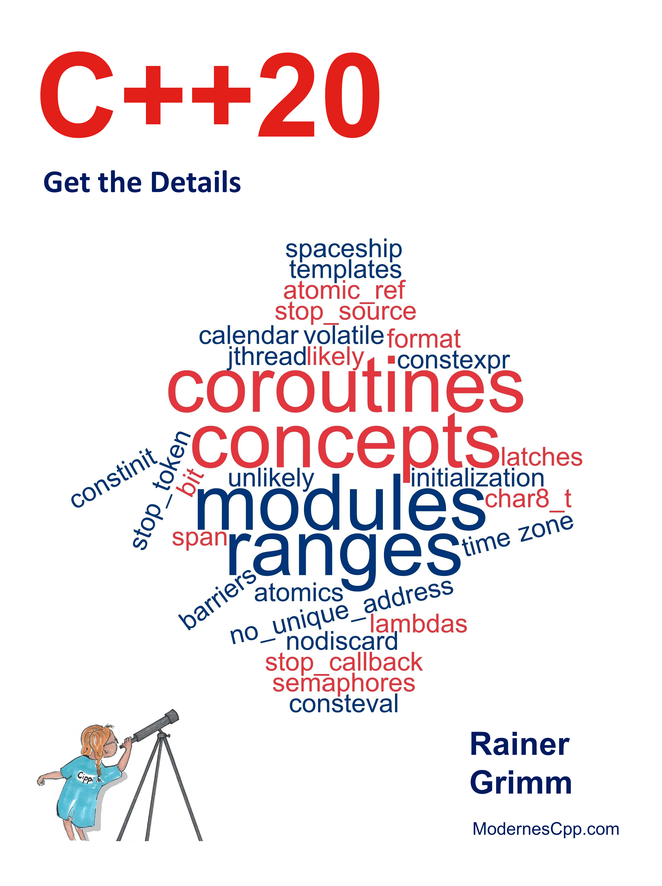

# C++20

*Get the Details* 

* 作者：Rainer Grimm 
* 譯者：陳曉偉
* 首次發佈時間：2021年4月20日([來源](https://www.amazon.com/C-20-Details-Rainer-Grimm/dp/B09328NKXK))

> 翻譯是譯者用自己的思想，換一種語言，對原作者想法的重新闡釋。鑑於我的學識所限，誤解和錯譯在所難免。如果你能買到本書的原版，且有能力閱讀英文，請直接去讀原文。因為與之相較，我的譯文可能根本不值得一讀。
>
> 
 — 雲風，程序員修煉之道第2版譯者

PDF可在本庫的[Release頁面](https://github.com/xiaoweiChen/CXX20-Get-Details/releases)獲取。

## 本書概述

這本書既是C++20標準的教程，也是C++20標準的參考資料。會教你如何使用C++20，並提供新C++標準的細節。這裡最主要是C++20的四大特性。

概念(Concept)改變了思考和編程模板的方式，是模板參數的語義類別，可在類型系統中直接表達意圖。若出現錯誤，將出現一條明確的錯誤信息。

新的“範圍”庫(ranges library)，能夠直接在容器上執行算法，用管道符號組合算法，並可應用到無限數據流上。

因為協程(coroutines)，C++中的異步編程成為主流。協程是協作任務、事件循環、無限數據流或管道的基礎。

模塊(Modules)克服了頭文件的限制，例如：頭文件和源文件的分離和預處理器一樣過時。最後，可以享受更快的構建時間和更簡單的構建包方法。

#### 將會瞭解

- 自動生成的比較運算符

- 日期和時區庫

- 格式庫

- 連續的內存塊

- 加強版可中斷線程

- 原子智能指針

- 信號量

- 協調原語，如鎖存和柵欄

## 如何閱讀

若不熟悉C++20，請從本書的第一部分開始瞭解。

當有了一定的瞭解，就可以繼續研究核心語言了。每個特性是獨立的，但推薦從頭到尾閱讀這本書。第一次閱讀時，可以跳過概述章節中沒有提到的特性。

## 作者簡介

**Rainer Grimm**自1999年以來一直擔任軟件架構師、團隊領導和講師。2002年，為公司的進一步教育組織了實習生會議。從2002年起，就開始開設培訓課程，第一個教程是關於專有管理軟件的，但不久之後開始教授Python和C++。在業餘時間，喜歡寫關於C++，Python和Haskell的文章，也喜歡在會議上發言。每週都會在英語博客[Modernes Cpp](https://www.modernescpp.com/  )和由[German blog](https://www.grimm-jaud.de/index.php/blog  )主辦的德語博客上發表文章。

自2016年以來，其一直是一名獨立講師，講授現代C++和Python的研討會。可以用不同的語言出版了幾本關於現代C++的書，特別是關於**併發性**的技術書籍。由於其職業素養，一直在尋找教授現代C++的最佳方法。

## 致謝

我開始在我的英文博客[ModernesCpp](http://www.modernescpp.com  )上邀請大家進行校對，收到的回覆比預期的要多。感謝你們所有人，包括我閨女朱麗葉。

以下是校對人員的名字，按字母順序排列: Bob Bird, Nicola Bombace, Dave Burchill, Sandor Dargo, James Drobina, Frank Grimm, Kilian Henneberger, Ivan “espkk” Kondakov, Péter Kardos, Rakesh Mane, Jonathan O’Connor, John Plaice, Iwan Smith, Peter Sommerlad, Paul Targosz, Steve Vinoski, and Greg Wagner。

## 本書相關

* github地址：https://github.com/xiaoweiChen/CXX20-Get-Details
* 譯文的LaTeX 環境配置：https://www.cnblogs.com/1625--H/p/11524968.html 
  * 禁用拼寫檢查：https://blog.csdn.net/weixin_39278265/article/details/87931348

* vscode中配置latex：https://blog.csdn.net/Ruins_LEE/article/details/123555016
* 原書示例：https://github.com/RainerGrimm/Cpp20

