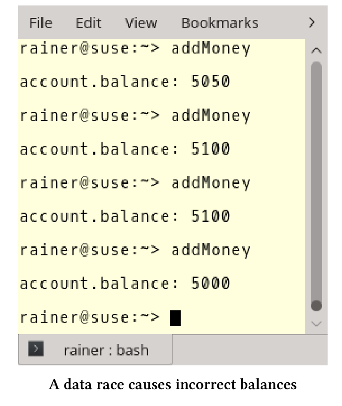
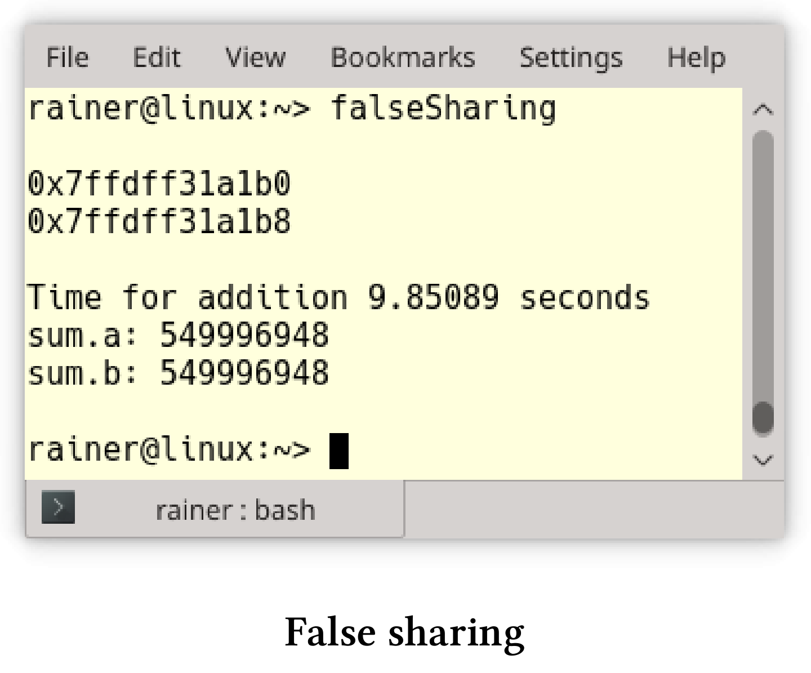
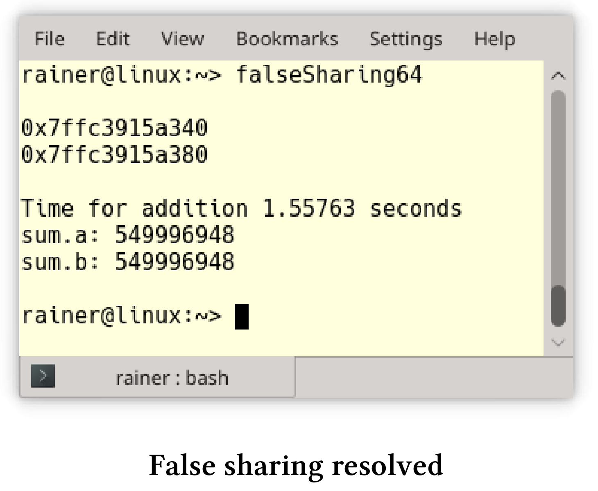
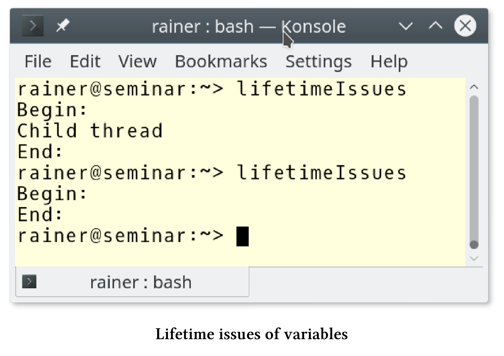

# 挑戰

編寫併發程序本身就很複雜，即便是使用C++11和C++14的新特性，也是如此。我希望通過用一整章的內容來討論併發編程的挑戰，讀者們會更清楚其中的陷阱與挑戰。

## ABA問題

ABA表示讀取了一個值兩次，每次都返回A值。因此，可以得出這樣的結論：兩次讀取之間，相應的變量沒有任何變化。然而，在兩次讀取之間，變量可能有被更新為B的時刻。

用一個簡單的場景來比擬這個問題。

**一個例子**

這個場景裡，你坐在車裡等待交通燈變綠，綠色代表B，紅色代表A。接下來會發生了什麼?

1. 你看到交通燈，它是紅色的(A)。
2. 因為很無聊，你打開手機看新聞，而忘記了時間。
3. 當你再看一次交通燈時。該死！還是紅色(A)。

當然，交通燈在你兩次抬頭看之間已經變成綠燈過。對於線程(進程)來說，意味著什麼?

1. 線程1讀取值為A的變量`var`。
2. 線程1被搶佔，線程2運行。
3. 線程2將變量`var`從A更改為B，再更改為A。
4. 線程1繼續運行並檢查變量`var`的值並得到A。因為獲取到值A，線程1繼續運行。

通常這不是一個問題，可以忽略。

**非關鍵的ABA**

```c++
// fetch_mult.cpp

#include <atomic>
#include <iostream>

template <typename T>
T fetch_mult(std::atomic<T>& shared, T mult) {
  T oldValue = shared.load();
  while (!shared.compare_exchange_strong(oldValue, oldValue * mult));
  return oldValue;
}

int main() {
  std::atomic<int> myInt{ 5 };
  std::cout << myInt << std::endl;
  fetch_mult(myInt, 5);
  std::cout << myInt << std::endl;
}
```

`compare_exchange_strong`和`compare_exchange_weak`可以在`fetch_mult`(第6行)中觀察到的ABA問題。`fetch_mult`將`std::atomic<t>& shared`和`mult`相乘。

關鍵是，讀取舊值`T oldValue = shared.load()`第8行和第9行中的新值比較之間有一個小的時間窗口。因此，另一個線程可以介入，將`oldValue`從更改為另一個值，然後再返回`oldValue`。舊值是A，另一個線程修改的值是ABA中的B。

通常，當讀操作處理相同的、未更改的變量，則沒有什麼影響。但是，在無鎖併發的數據結構中，ABA可能會產生重大影響。

**無鎖數據結構**

這裡不會詳細介紹無鎖數據結構，僅用單鏈表實現的無鎖堆棧，堆棧只支持兩個操作：

1. pop：彈出頂部對象，並返回指向它的指針。
2. push：將指定的對象推入堆棧。

這裡使用偽代碼描述pop操作，以便了解ABA問題。pop操作執行以下步驟：

1. 獲取頭節點:head
2. 獲取後續節點:headNext
3. 如果head仍然是堆棧的頭節點，則將headNext作為新的頭結點。

下面是堆棧的前兩個節點:

`Stack: TOP -> head -> headNext -> ...`

現在，來構造ABA問題的情景。

**構造ABA**

我們從下面的堆棧開始:

`Stack: TOP -> A -> B -> C`

線程1處於活動狀態，希望彈出堆棧的頭節點。

* Thread 1操作時

  head = A

  headNext = B

線程1完成pop前，線程2開始工作。

* Thread 2 pop A

  `Stack: TOP -> B -> C`

* Thread 2 pop B 並且刪除B

  `Stack: TOP -> C`

* Thread 2把A推回去

  `Stack: TOP -> A -> C`

線程1重新調度，並檢查`A == head`，因為當前`A == head`，那麼`headNext`應該是B，但B已經被刪除了。因此，程序具有未定義行為。

用什麼來拯救ABA問題呢？接下來就介紹，ABA問題的一些補救措施。

**補救措施**

ABA的概念問題很容易理解，解決方案是消除節點過早的刪除。以下是一些補救措施：

**標記參考狀態**

可以使用地址的低位向每個節點添加標記，以表示節點成功修改的頻率。儘管檢查返回true，但比較-交換(CAS)會失敗。這個想法並不能解決問題，因為標記位可能最終會交換。

引用標記狀態通常用於事務內存中。

接下來的三種技術是基於延遲迴收的思想。

**垃圾收集**

垃圾收集只保證在不再需要時刪除變量。這聽起來很有希望解決ABA問題，但有一個明顯的缺點。大多數垃圾收集器不是無鎖的，即使有一個無鎖的數據結構，整個系統也不是無鎖的。

**風險指針**

維基頁面： [Hazard Pointers](https://en.wikipedia.org/wiki/Hazard_pointer)

風險指針系統中，每個線程都保存一個風險指針列表，指示線程當前正在訪問哪些節點(許多系統中，這個“列表”可能僅限於一兩個元素)。風險指針列表中的節點不能被任何其他線程修改或釋放。當一個線程想要刪除一個節點時，它會將其放在一個節點列表中，進行“稍後釋放”，直到沒有其他線程的危險列表包含該指針時，才釋放該節點的內存。一個專門的垃圾收集線程可以手工進行垃圾收集(如果“稍後釋放”的列表由所有線程共享)；或者，清理“被釋放”列表可以由每個工作線程，作為“pop”等操作的一部分。

**RCU 讀取-複製-更新**

RCU是Read Copy Update的縮寫，是一種用於只讀數據結構的同步技術。RCU是由Paul McKenney創建的，自2002年以來一直在Linux內核中使用。

思想很簡單，就跟縮寫一樣，要修改數據，要複製數據。反之，所有的讀取都使用原始數據。如果沒有讀取操作，那麼可以安全地將數據進行修改。

要了解更多關於RCU的細節，請閱讀Paul McKenney的這篇文章:[What is RCU, Fundamentally?]( https://lwn.net/Articles/262464/) 

> 兩個新的提案
>
> 作為併發工具包的一部分，有兩個關於未來C++標準的提案。關於風險指針的提案是[P0233R0]( http://www.modernescpp.com/open-std.org/JTC1/SC22/WG21/docs/papers/2016/p0233r0.pdf)，關於RCU的提案是[P0461R0]( http://www.open-std.org/jtc1/sc22/wg21/docs/papers/2016/p0461r0.pdf) 。

## 阻塞問題

為了說明我的觀點，需要將條件變量與謂詞結合。不這樣做的話，程序可能會出現偽喚醒或未喚醒的情況。

如果使用沒有謂詞的條件變量，則通知線程可能在等待線程等待之前發送通知，等待線程將永遠等待，這種現象被稱為“未喚醒“。

程序如下。

```c++
// conditionVariableBlock.cpp

#include <iostream>
#include <condition_variable>
#include <mutex>
#include <thread>

std::mutex mutex_;
std::condition_variable condVar;

bool dataReady;


void waitingForWork() {

  std::cout << "Worker: Waiting for work." << std::endl;

  std::unique_lock<std::mutex> lck(mutex_);
  condVar.wait(lck);
  // do the work
  std::cout << "Work done." << std::endl;

}

void setDataReady() {

  std::cout << "Sender: Data is ready." << std::endl;
  condVar.notify_one();

}

int main() {

  std::cout << std::endl;

  std::thread t1(setDataReady);
  std::thread t2(waitingForWork);

  t1.join();
  t2.join();

  std::cout << std::endl;
}
```

程序的第一次工作得很好，第二次鎖定的原因是`notify`(第28行)發生在線程`t2`(第37行)等待之前(第19行)。


當然，死鎖和活鎖是條件競爭的副產物。死鎖通常取決於線程的交錯，有時會發生，有時不會。活鎖與死鎖類似，當死鎖阻塞時，活鎖“似乎''沒有阻塞程序。

## 破壞程序的不變量

程序不變量，應該在程序的整個生命週期中”保持不變“。

惡性條件競爭破壞程序的不變量。下面程序的不變量是所有餘額的總和，例子中是200歐元，因為每個賬戶起步都是100歐元(第9行)。

```c++
// breakingInvariant.cpp

#include <atomic>
#include <functional>
#include <iostream>
#include <thread>

struct Account {
  std::atomic<int> balance{ 100 };
};

void transferMoney(int amount, Account& from, Account& to) {
  using namespace std::chrono_literals;
  if (from.balance >= amount) {
    from.balance -= amount;
    std::this_thread::sleep_for(1ns);
    to.balance += amount;
  }
}

void printSum(Account& a1, Account& a2) {
  std::cout << (a1.balance + a2.balance) << std::endl;
}

int main() {

  std::cout << std::endl;

  Account acc1;
  Account acc2;

  std::cout << "Initial sum: ";
  printSum(acc1, acc2);

  std::thread thr1(transferMoney, 5, std::ref(acc1), std::ref(acc2));
  std::thread thr2(transferMoney, 13, std::ref(acc2), std::ref(acc1));
  std::cout << "Intermediate sum: ";
  std::thread thr3(printSum, std::ref(acc1), std::ref(acc2));

  thr1.join();
  thr2.join();
  thr3.join();

  std::cout << "  acc1.balance: " << acc1.balance << std::endl;
  std::cout << "  acc2.balance: " << acc2.balance << std::endl;

  std::cout << "Final sum: ";
  printSum(acc1, acc2);

  std::cout << std::endl;

}
```

開始時，賬戶的總數是200歐元。第33行，通過使用第21 - 23行中的`printSum`函數來顯示金額和。第38行使不變量可見。因為第16行有`1ns`的短睡眠，所以中間的金額是182歐元。最後，每個賬戶的餘額都是正確的(第44行和第45行)，金額是200歐元(第48行)。

下面是程序的輸出。


## 數據競爭

數據競爭是指至少兩個線程同時訪問一個共享變量的情況，並且至少有一個線程嘗試修改該變量。

程序有數據競爭，則會出現未定義行為，結果是不可預期的。

來看一個數據競爭的程序。

```c++
// addMoney.cpp

#include <functional>
#include <iostream>
#include <thread>
#include <vector>

struct Account {
  int balance{ 100 };
};

void addMoney(Account& to, int amount) {
    to.balance += amount;
}

int main() {

  std::cout << std::endl;

  Account account;

  std::vector<std::thread> vecThreads(100);


  for (auto& thr : vecThreads) thr = std::thread(addMoney, std::ref(account), 50);

  for (auto& thr : vecThreads) thr.join();


  std::cout << "account.balance: " << account.balance << std::endl;

  std::cout << std::endl;

}
```

100個線程`addMoney`函數將向相同的帳戶(第20行)添加50歐元(第25行)。關鍵的，對賬戶的寫入是不同步的，這裡有一個數據競爭，因為是未定義行為，所以結果無效。最後的餘額(第30行)會在5000歐元和5100歐元之間。



## 死鎖

死鎖是一種狀態，因為要等待沒有得到的資源的釋放，所以至少有一個線程會永久阻塞。

造成死鎖的主要原因有兩個:

1. 互斥鎖未解鎖。
2. 以不同的順序鎖定互斥鎖。

為了避免第二個問題，在經典C++中使用了諸如[層次鎖](http://collaboration.cmc.ec.gc.ca/science/rpn/biblio/ddj/Website/articles/DDJ/2008/0801/071201hs01/071201hs01.html)之類的技術。

有關死鎖，以及如何用現代C++克服死鎖的詳細信息，請參閱互斥量和鎖的章節內容。

> **多次鎖定非遞歸互斥鎖**
>
> 多次鎖定非遞歸互斥鎖會導致未定義行為。
>
> ```c++
> // lockTwice.cpp
> 
> #include <iostream>
> #include <mutex>
> 
> int main() {
> 
>     std::mutex mut;
> 
>     std::cout << std::endl;
> 
>     std::cout << "first lock call" << std::endl;
> 
>     mut.lock();
> 
>     std::cout << "second lock call" << std::endl;
> 
>     mut.lock();
> 
>     std::cout << "third lock call" << std::endl;
> }
> ```
>
> 通常會死鎖。
>
> 

## 偽共享

當處理器從主存中讀取一個變量(如int)時，從內存中讀取的數據要大於int的大小。處理器會從緩存中讀取整個高速緩存行(通常為64字節)。

如果兩個線程，同時讀取位於同一高速緩存行上的不同變量a和b，則會發生偽共享。雖然a和b在邏輯上是分開的，但在物理地址上是相連的。由於a和b共享同一條高速緩存線行，因此有必要在高速緩存行上進行硬件同步。得到了正確的結果，但是併發的性能下降了。正是這種現象發生在下面的程序中：

```c++
// falseSharing.cpp

#include <algorithm>
#include <chrono>
#include <iostream>
#include <random>
#include <thread>
#include <vector>

constexpr long long size{ 100'000'000 };

struct Sum {
  long long a{ 0 };
  long long b{ 0 };
};

int main() {

  std::cout << std::endl;

  Sum sum;

  std::cout << &sum.a << std::endl;
  std::cout << &sum.b << std::endl;

  std::cout << std::endl;

  std::vector<int> randValues, randValues2;
  randValues.reserve(size);
  randValues2.reserve(size);

  std::mt19937 engine;
  std::uniform_int_distribution<> uniformDist(1, 10);

  int randValue;
  for (long long i = 0; i < size; ++i) {
    randValue = uniformDist(engine);
    randValues.push_back(randValue);
    randValues2.push_back(randValue);
  }

  auto sta = std::chrono::steady_clock::now();

  std::thread t1([&sum, &randValues] {
    for (auto val : randValues) sum.a += val;
    });

  std::thread t2([&sum, &randValues2] {
    for (auto val : randValues2)sum.b += val;
    });

  t1.join(), t2.join();

  std::chrono::duration<double> dur = std::chrono::steady_clock::now() - sta;
  std::cout << "Time for addition " << dur.count()
    << " seconds" << std::endl;

  std::cout << "sum.a: " << sum.a << std::endl;
  std::cout << "sum.b: " << sum.b << std::endl;

  std::cout << std::endl;
  
}
```

第13行和第14行中的變量`a`和`b`共享同個緩存行。線程`t1(`第44行)和線程`t2`同時使用兩個變量，對向量`randValues`和`randValues2`中的元素進行求和。兩個向量在1到10之間都有1億個整數。程序的輸出顯示了一些有趣的事情，`a`和`b`在8字節邊界上對齊，因為我的操作系統中的`long long int`是8字節對齊的。



如果將`a`和`b`的對齊方式改為64字節會發生什麼?64字節是我係統上的高速緩存行的大小。我要對結構做點小改動，這次不用種子來生成隨機數，所以每次都得到的隨機數相同。

```c++
struct Sum{
  alignas(64) long long a{0};
  alignas(64) long long b{0};
};
```



現在，`a`和`b`在64字節邊界處對齊，程序速度提高了6倍多。原因是`a`和`b`現在不在同一高速緩存行上。

> **用優化器檢測偽共享**
>
> 如果我用最大的優化選項編譯的程序，優化器會檢測到偽共享並消除它。這意味著，我得到了相同的性能數據與真共享，這也適用於Windows。以下是優化後的性能數字。
>
> 


>**C++17中的`std:: hardware_destructive_interference_size`和與`std:: hardware_constructive_interference_size`**
>
>`std::hardware_destructive_interference_size`和`std::hardware_constructive_interference_size`允許以一種可移植的方式處理高速緩存行的大小。`std::hardware_destructive_interference_size`返回兩個對象之間的最小偏移量，以避免偽共享；`std::hardware_constructive_interference_size`返回相鄰內存的最大大小，以滿足真共享。
>
>在C++17中，Sum可以以一種平臺無關的方式編寫。
>
>```c++
>struct Sum{
>  alignas(std::hardware_destructive_interference_size) long long a{0};
>  alignas(std::hardware_destructive_interference_size) long long b{0};
>};
>```

## 變量的生命週期問題

寫一個具有生命週期相關問題的C++示例非常容易。讓創建的線程`t`在後臺運行(也就是說，它通過調用`t.detach()`來分離)，並且讓它只完成一半的工作。這裡，創建者線程不會等待子線程完成。在這種情況下，必須非常小心，最好不要在子線程中使用屬於創建線程的任何東西。

```c++
// lifetimeIssues.cpp

#include <iostream>
#include <string>
#include <thread>

int main() {

  std::cout << "Begin: " << std::endl;

  std::string mess{ "Child thread" };

  std::thread t([&mess] {std::cout << mess << std::endl; });
  t.detach();

  std::cout << "End:" << std::endl;

}
```

這程序太簡單了。線程`t`使用`std::cout`和變量`mess`，它們都屬於主線程。結果是，在第二次運行時，我看不到子線程的輸出。只有“Begin:”(第9行)和“End:”(第16行)打印了出來。



## 移動線程

移動線程會使線程的生命週期問題變得更加複雜。

線程支持移動語義，但不支持複製語義。原因是`std::thread`的複製構造函數被設置為`delete`：`thread (const thread&) = delete;`。試想，如果線程在持有鎖的情況下能進行復制，會發生什麼。

讓我們移動一個線程。

錯誤地移動線程

```c++
// threadMoved.cpp

#include <iostream>
#include <thread>
#include <utility>

int main(){
  
  std::thread t([]{std::cout << std::this_thread::get_id();});
  std::thread t2([]{std::cout << std::this_thread::get_id();});
  
  t = std::move(t2);
  t.join();
  t2.join();
}
```

線程`t`和`t2`應該完成它們的工作：打印它們的id。除此之外，線程`t2`的所有權移動到`t`(第12行)。最後，主線程處理它的子線程並匯入它們。等一下，結果與我的預期大不相同:


出了什麼問題?這裡有兩個問題:

1. 通過移動線程`t2`, `t`獲得一個新的可調用單元，並調用它的析構函數。結果，`t`的析構函數調用`std::terminate`，原始的`t`線程仍然是可匯入的。
2. 線程`t2`沒有相關的可調用單元，在沒有可調用單元的線程上調用`join`會導致異常`std::system_error`。

瞭解了這一點，修復工作就很簡單了。

```c++
// threadMovedFixed.cpp

#include <iostream>
#include <thread>
#include <utility>

int main(){
  
  std::thread t([]{std::cout << std::this_thread::get_id();});
  std::thread t2([]{std::cout << std::this_thread::get_id();});
  
  t.join();
  t = std::move(t2);
  t2.join();
  
  std::cout << "\n";
  std::cout << std::boolalpha << "t2.joinable(): " << t2.joinable() << std::endl;
  
}
```

結果是線程`t2`不可匯入。


## 競態條件

競態條件是一種情況，其中操作的結果取決於某些操作的交錯。

競態條件很難發現。由於其取決於線程是否交錯出現，也就是內核的數量、系統的利用率或可執行文件的優化級別，都可能是導致出現競態條件的原因。

競態條件本身並沒什麼。但線程以不同的方式交織在一起後，常常會導致嚴重的問題。這種情況下，稱其為**惡性競爭條件**。惡意競爭條件的典型症狀表現：數據競爭、破壞程序不變量、阻塞線程，或變量有生存週期問題等。