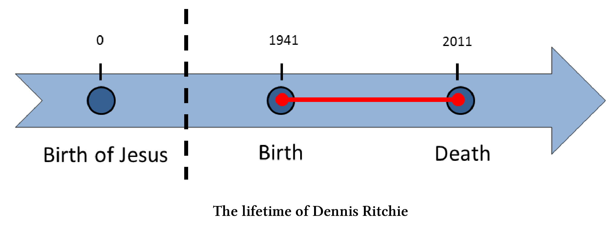
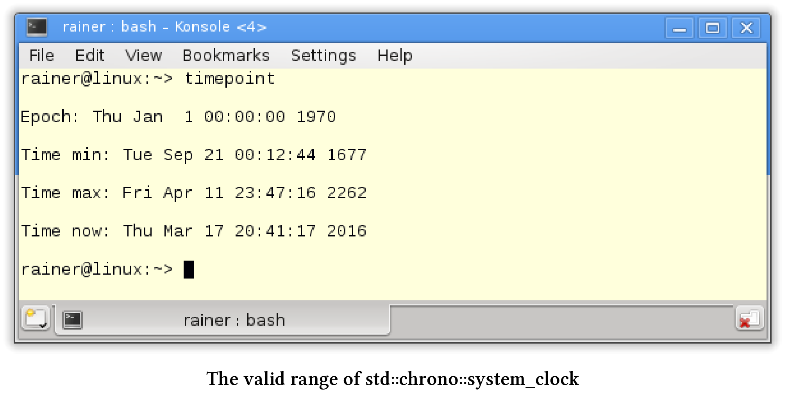
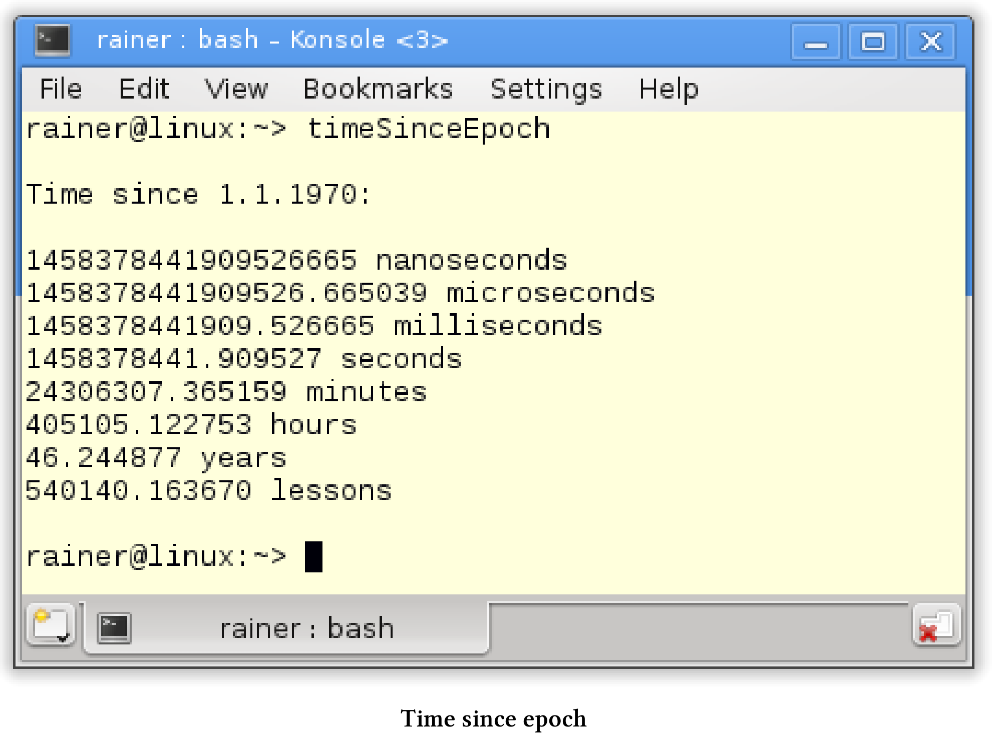
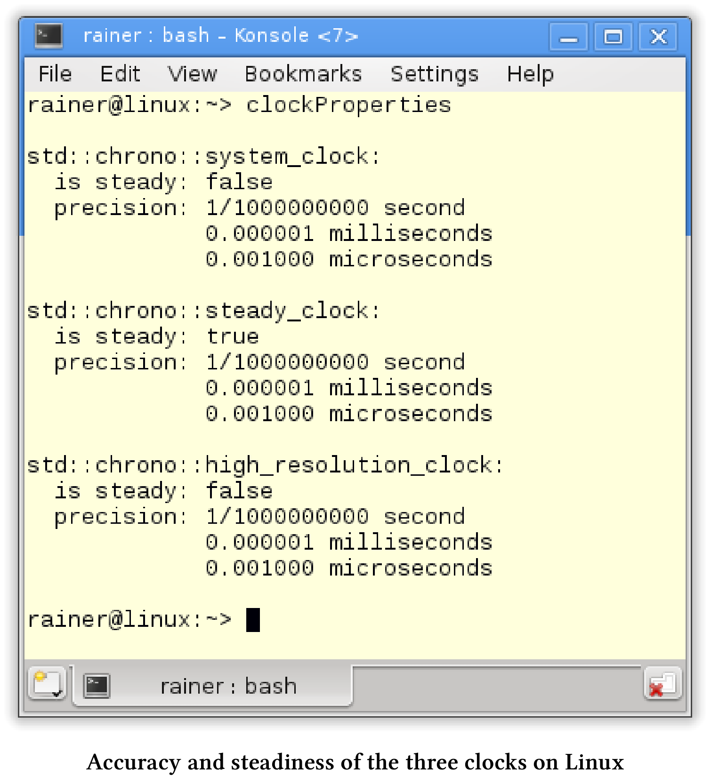
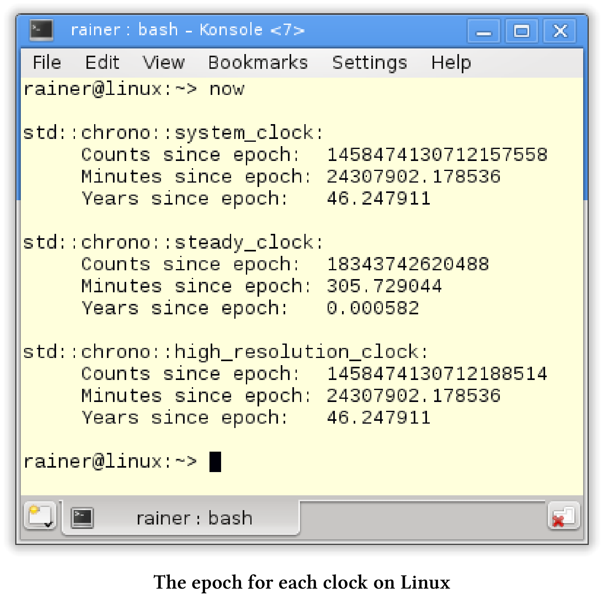
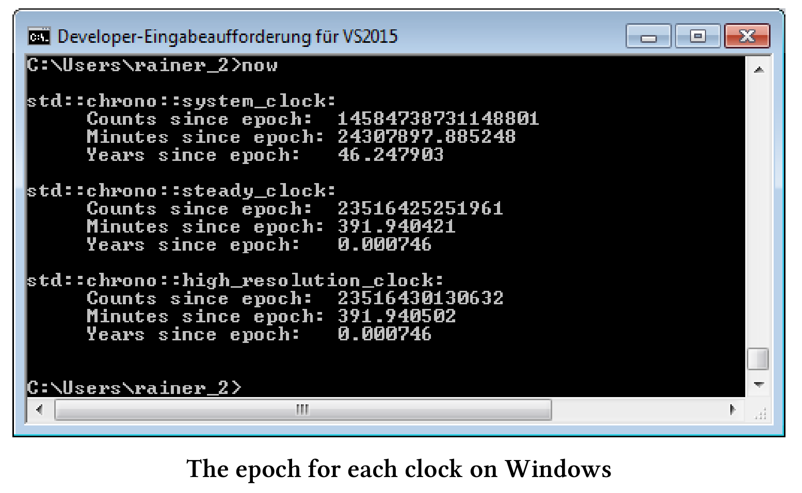

# 時間庫

如果不寫一些關於時間庫的內容，那麼使用現代C++處理併發性的書就顯得不那麼完整。時間庫由三個部分組成：時間點、時間段和時鐘。

## 時間點、時間段和時鐘

時間點：由它的起始點(所謂的紀元[epoch]( https://en.wikipedia.org/wiki/Epoch_(reference_date)))和從紀元起經過的時間(表示為時間段)來表示。

時間段：是兩個時間點之間的差值，它用時間刻度的數量來衡量。

時鐘：由一個起點和一個時間刻度組成，此信息可以計算當前時間。

可以比較時間點。將時間段添加到某個時間點時，可以得到一個新的時間點。時鐘週期是測量時間時鐘的準確性。耶穌的出生在我的文明中作為一個開始的時間點，一年是一個典型的時間週期。

[Dennis Ritchie](https://en.wikipedia.org/wiki/Dennis_Ritchie)，C語言的創造者於2011年去世，我用他的一生來說明這三個概念。為了簡單起見，這裡只使用年份。

這是他的一生。



耶穌的誕生是我們時代的起點，也就是紀元元年。1941年和2011年的時間是由紀元源時間點和時間段來定義的。從2011年減去1941年，得到的是時間段。所以，Dennis Ritchie去世時，享年70歲。

我們繼續研究時間庫的組件。

## 時間點

時間點`std::chrono::time_point`由起始點(`epoch`)和附加的時間段定義。類模板由兩個組件：時鐘和時間段。默認情況下，時間段是從時鐘類派生出來的。

`std::chrono::time_point`類模板

```c++
template<
  class Clock,
  class Duration= typename Clock::duration
>
class time_point;
```

對於時鐘來說，有以下四個特殊的時間點:

* epoch: 時鐘的起點。
* now: 當前時間。
* min: 時鐘可以統計的最小時間點。
*  max: 時鐘可以擁有的最大時間點。

最小和最大時間點的準確性取決於使用的時鐘：`std::system::system_clock`, `std::chrono::steady_clock`或`std::chrono::high_resolution_clock`。

C++不保證時鐘的準確性、起始點，還有有效時間範圍。`std::chrono::system_clock`的起始時間通常是1970年1月1日，也就是所謂的[UNIX元年](https://en.wikipedia.org/wiki/Unix_time)，而`std::chrono::high_resolution_clock`具有最高的統計精度。

### 從時間點到日曆時間

通過`std::chrono::system_clock::to_time_t`可以將一個內部使用`std::chrono::system_clock`的時間點，轉換成一個類型為`std::time_t`的對象。通過函數[`std::gmtime`](http://en.cppreference.com/w/cpp/chrono/c/gmtime)對`std::time_t`對象進行進一步轉換，可以得到以[世界統一時間]( https://en.wikipedia.org/wiki/Coordinated_Universal_Time)(UTC)表示的日曆時間。最後，可以使用這個日曆時間作為函數[`std::asctime`]( http://en.cppreference.com/w/cpp/chrono/c/asctime)的輸入，以獲得日曆時間的文本表示。

顯示日曆時間

```c++
// timepoint.cpp

#include <chrono>
#include <ctime>
#include <iostream>
#include <string>

int main() {

  std::cout << std::endl;

  std::chrono::time_point<std::chrono::system_clock> sysTimePoint;
  std::time_t tp = std::chrono::system_clock::to_time_t(sysTimePoint);
  std::string sTp = std::asctime(std::gmtime(&tp));
  std::cout << "Epoch: " << sTp << std::endl;

  tp = std::chrono::system_clock::to_time_t(sysTimePoint.min());
  sTp = std::asctime(std::gmtime(&tp));
  std::cout << "Time min: " << sTp << std::endl;

  tp = std::chrono::system_clock::to_time_t(sysTimePoint.max());
  sTp = std::asctime(std::gmtime(&tp));
  std::cout << "Time max: " << sTp << std::endl;

  sysTimePoint = std::chrono::system_clock::now();
  tp = std::chrono::system_clock::to_time_t(sysTimePoint);
  sTp = std::asctime(std::gmtime(&tp));
  std::cout << "Time now: " << sTp << std::endl;

}
```

程序會顯示`std::chrono::system_clock`的有效範圍。我的Linux PC上，`std::chrono::system_clock`以UNIX元年作為起始點，時間點可以在1677年到2262年之間。



可以將時間段添加到時間點上，以獲得新的時間點。在有效時間範圍之外添加時間段，是未定義行為。

### 跨越有效的時間範圍

下面的示例使用當前時間並加減1000年。為了簡單起見，我忽略閏年，假設一年有365天。

```c++
// timepointAddition.cpp

#include <chrono>
#include <ctime>
#include <iostream>
#include <string>

using namespace std::chrono;
using namespace std;

string timePointAsString(const time_point<system_clock>& timePoint) {
  time_t tp = system_clock::to_time_t(timePoint);
  return asctime(gmtime(&tp));
}

int main() {

  cout << endl;

  time_point<system_clock> nowTimePoint = system_clock::now();

  cout << "Now: " << timePointAsString(nowTimePoint) << endl;

  const auto thousandYears = hours(24 * 365 * 1000);
  time_point<system_clock> historyTimePoint = nowTimePoint - thousandYears;
  cout << "Now - 1000 years: " << timePointAsString(historyTimePoint) << endl;

  time_point<system_clock> futureTimePoint = nowTimePoint + thousandYears;
  cout << "Now + 1000 years: " << timePointAsString(futureTimePoint) << endl;

}
```

程序的輸出顯示，第25行和第28行中時間點的溢出，將導致錯誤的結果。從現在的時間點減去1000年，獲得了將來的時間點；在當前時間點上加上1000年，得到了過去的時間點。


兩個時間點之間的差值是時間段。時間段支持基本的算法，可以在不同的時間刻度下進行顯示。

## 時間段

`std::chrono::duration`是一個類模板， `Rep`類型的計次數和計次週期組成。

`std::chrono::duration`類模板

```c++
template<
  class Rep,
  class Period = std::ratio<1>
> class duration;
```

計次週期默認長度為`std::ratio<1>`。`std::ratio<1>`表示1秒，也可以寫成`std::ratio< 1,1 >`，以此類推，`std::ratio<60>`是一分鐘，`std::ratio<1,1000> `是1毫秒。當`Rep`類型是浮點數時，可以使用它來保存時間刻度的分數形式。

C++11預定義了幾個重要的時間單位:

```c++
typedef duration<signed int, nano> nanoseconds;
typedef duration<signed int, micro> microseconds;
typedef duration<signed int, milli> milliseconds;
typedef duration<signed int> seconds;
typedef duration<signed int, ratio< 60>> minutes;
typedef duration<signed int, ratio<3600>> hours;
```

從UNIX元年(1970年1月1日)到現在有多少時間了?通過不同時間的類型別名，我可以很容易地回答這個問題。下面的例子中，繼續忽略閏年，假設一年有365天。

```c++
// timeSinceEpoch.cpp

#include <chrono>
#include <iostream>

using namespace std;

int main() {

  cout << fixed << endl;

  cout << "Time since 1.1.1970:\n" << endl;

  const auto timeNow = chrono::system_clock::now();
  const auto duration = timeNow.time_since_epoch();
  cout << duration.count() << " nanoseconds " << endl;

  typedef chrono::duration<long double, ratio<1, 1000000>> MyMicroSecondTick;
  MyMicroSecondTick micro(duration);
  cout << micro.count() << " microseconds" << endl;

  typedef chrono::duration<long double, ratio<1, 1000>> MyMilliSecondTick;
  MyMilliSecondTick milli(duration);
  cout << milli.count() << " milliseconds" << endl;

  typedef chrono::duration<long double> MySecondTick;
  MySecondTick sec(duration);
  cout << sec.count() << " seconds " << endl;

  typedef chrono::duration<double, ratio<60>> MyMinuteTick;
  MyMinuteTick myMinute(duration);
  cout << myMinute.count() << " minutes" << endl;

  typedef chrono::duration<double, ratio<60 * 60>> MyHourTick;
  MyHourTick myHour(duration);
  cout << myHour.count() << " hours" << endl;

  typedef chrono::duration<double, ratio<60 * 60 * 24 * 365>> MyYearTick;
  MyYearTick myYear(duration);
  cout << myYear.count() << " years" << endl;

  typedef chrono::duration<double, ratio<60 * 45>> MyLessonTick;
  MyLessonTick myLesson(duration);
  cout << myLesson.count() << " lessons" << endl;

  cout << endl;

}
```

時間長度是微秒(第18行)、毫秒(第22行)、秒(第26行)、分鐘(第30行)、小時(第34行)和年(第38行)。另外，我在第42行定義了德國學校單節課的時長(45分鐘)。



## 計算時間

時間單位表示的時間支持基本的算術運算，可以用一個數字乘以或除以一個時間段。當然，也可以比較時間單位表示的時間，所有這些計算和比較都是基於時間單位的。

在C++14標準中，更加方便。C++14標準支持時間段的文字表示。

|           類型            | 後綴 | 示例 |
| :-----------------------: | :--: | :--: |
|    std::chrono::hours     |  h   |  5h  |
|   std::chrono::minutes    | min  | 5min |
|   std::chrono::seconds    |  s   |  5s  |
| std::chrono::milliseconds |  ms  | 5min |
| std::chrono::microseconds |  us  | 5us  |
| std::chrono::nanoseconds  |  ns  | 5ns  |

我17歲的兒子Marius，在學校的一天中要花多少時間?我在下面的示例中，回答了這個問題，並以不同的時間段格式顯示結果。

```c++
// schoolDay.cpp

#include <iostream>
#include <chrono>

using namespace std::literals::chrono_literals;
using namespace std::chrono;
using namespace std;

int main() {

  cout << endl;

  constexpr auto schoolHour = 45min;

  constexpr auto shortBreak = 300s;
  constexpr auto longBreak = 0.25h;

  constexpr auto schoolWay = 15min;
  constexpr auto homework = 2h;

  constexpr auto schoolDaySec = 2 * schoolWay + 6 * schoolHour + 4 * shortBreak +
    longBreak + homework;

  cout << "School day in seconds: " << schoolDaySec.count() << endl;

  constexpr duration<double, ratio<3600>> schoolDayHour = schoolDaySec;
  constexpr duration<double, ratio<60>> schoolDayMin = schoolDaySec;
  constexpr duration<double, ratio<1, 1000>> schoolDayMilli = schoolDaySec;

  cout << "School day in hours: " << schoolDayHour.count() << endl;
  cout << "School day in minutes: " << schoolDayMin.count() << endl;
  cout << "School day in milliseconds: " << schoolDayMilli.count() << endl;

  cout << endl;

}
```

有一節德語課的時間(第14行)，一個短暫的休息(第16行)，一個長時間的休息(第17行)，Marius去學校的路(第19行)上花費的時間，以及做家庭作業(第20行)的時間。計算結果`schoolDaysInSeconds`(第22行)在編譯時可用。


> **編譯時的計算**
>
> 時間常量(第14 - 20行)、第22行中的`schoolDaySec`和各種時間段(第28 - 30行)都是常量表達式(`constexpr`)。因此，所有值都可在編譯時獲得，只有輸出是在運行時執行。

報時的準確性取決於所用的時鐘。C++中，有三種時鐘`std::chrono::system_clock`, `std::chrono::steady_clock`和`std::chrono::high_resolution_clock`。

## 時鐘

三種不同類型的時鐘之間有什麼區別?

* `std::chrono::sytem_clock`: 是系統範圍內的實時時鐘([掛壁鐘](https://en.wikipedia.org/wiki/Wall-clock_time))。該時鐘具有`to_time_t`和`from_time_t`的輔助功能，可以將時間點轉換為日曆時間。
*  `std::chrono::steady_clock`: 是唯一提供保證的時鐘，並且不能調整它。因此，`std::chrono::steady_clock`是測量時間間隔的首選時鐘。
*  `std::chrono::high_resolution_clock`：是精度最高的時鐘，但它可以只是時鐘`std::chrono::system_clock`或`std::chrono::steady_clock`的別名。

> **無保證的準確性、起始點和有效的時間範圍**
>
> C++標準不保證時鐘的精度、起始點和有效時間範圍。通常，`std::chrono:system_clock`的起始點是1970年1月1日，也就是所謂的UNIX元年，而`std::chrono::steady_clock`的起始點則是PC的啟動時間。

### 準確性和穩定性

知道哪些時鐘是穩定的，以及它們提供的精度是很有趣的事情。穩定意味著時鐘不能調整，可以直接從時鐘中得到答案。

三個時鐘的準確性和穩定性

```c++
// clockProperties.cpp

#include <chrono>
#include <iomanip>
#include <iostream>

using namespace std::chrono;
using namespace std;

template < typename T>
void printRatio() {
  cout << " precision: " << T::num << "/" << T::den << " second " << endl;
  typedef typename ratio_multiply<T, kilo>::type MillSec;
  typedef typename ratio_multiply<T, mega>::type MicroSec;
  cout << fixed;
  cout << " " << static_cast<double>(MillSec::num) / MillSec::den
    << " milliseconds " << endl;
  cout << " " << static_cast<double>(MicroSec::num) / MicroSec::den
    << " microseconds " << endl;
}

int main() {

  cout << boolalpha << endl;

  cout << "std::chrono::system_clock: " << endl;
  cout << " is steady: " << system_clock::is_steady << endl;
  printRatio<chrono::system_clock::period>();

  cout << endl;

  cout << "std::chrono::steady_clock: " << endl;
  cout << " is steady: " << chrono::steady_clock::is_steady << endl;
  printRatio<chrono::steady_clock::period>();

  cout << endl;

  cout << "std::chrono::high_resolution_clock: " << endl;
  cout << " is steady: " << chrono::high_resolution_clock::is_steady
    << endl;
  printRatio<chrono::high_resolution_clock::period>();

  cout << endl;

}
```

在第27行、第33行和第39行顯示每個時鐘是否穩定。函數`printRatio`(第10 -20行)比較難懂。首先，以秒為單位顯示時鐘的精度。此外，使用函數模板`std::ratio_multiply`，以及常量`std::kilo`和`std::mega`來將單位調整為以浮點數顯示的毫秒和微秒。您可以通過[cppreference.com]( http://en.cppreference.com/w/cpp/numeric/ratio)獲得計算時間在編譯時的更多詳細信息。

Linux上的輸出與Windows上的不同。Linux上，`std::chrono::system_clock`要精確得多；Windows上，`std::chrono::high_resultion_clock`是穩定的。




雖然C++標準沒有指定時鐘的紀元，但是可以通過計算得到。

### 紀元元年

由於輔助函數[time_since_epoch](http://en.cppreference.com/w/cpp/chrono/time_point/time_since_epoch)，每個時鐘返回顯示自元年以來已經過了很多時間。

計算每個時鐘的元年

```c++
// now.cpp

#include <chrono>
#include <iomanip>
#include <iostream>

using namespace std::chrono;

template < typename T>
void durationSinceEpoch(const T dur) {
  std::cout << " Counts since epoch: " << dur.count() << std::endl;
  typedef duration<double, std::ratio<60>> MyMinuteTick;
  const MyMinuteTick myMinute(dur);
  std::cout << std::fixed;
  std::cout << " Minutes since epoch: " << myMinute.count() << std::endl;
  typedef duration<double, std::ratio<60 * 60 * 24 * 365>> MyYearTick;
  const MyYearTick myYear(dur);
  std::cout << " Years since epoch: " << myYear.count() << std::endl;

}

int main() {

  std::cout << std::endl;

  system_clock::time_point timeNowSysClock = system_clock::now();
  system_clock::duration timeDurSysClock = timeNowSysClock.time_since_epoch();
  std::cout << "system_clock: " << std::endl;
  durationSinceEpoch(timeDurSysClock);

  std::cout << std::endl;

  const auto timeNowStClock = steady_clock::now();
  const auto timeDurStClock = timeNowStClock.time_since_epoch();
  std::cout << "steady_clock: " << std::endl;
  durationSinceEpoch(timeDurStClock);
  std::cout << std::endl;

  const auto timeNowHiRes = high_resolution_clock::now();
  const auto timeDurHiResClock = timeNowHiRes.time_since_epoch();
  std::cout << "high_resolution_clock: " << std::endl;
  durationSinceEpoch(timeDurHiResClock);

  std::cout << std::endl;

}
```

變量`timeDurSysClock`(第26行)、`timeDurStClock`(第33行)和`timeDurHiResClock`(第40行)包含從對應時鐘的起始點經過的時間。如果不使用`auto`自動類型推斷，則寫入時間點和時間段的確切類型將非常冗長。函數`durationSinceEpoch`(第9 - 19行)中，以不同的分辨率顯示時間持續時間。首先，顯示時間刻度的數量(第11行)，然後顯示分鐘的數量(第15行)，最後顯示自`epoch`以來的年份(第18行)。所有值都依賴於所使用的時鐘。為了簡單起見，忽略閏年，假設一年有365天。

同樣，Linux和Windows上的結果也是不同的。





為了得出正確的結論，我得提一下，Linux PC已經運行了大約5小時(305分鐘)，而Windows PC已經運行了超過6小時(391分鐘)。

我的Linux PC上，`std::chrono::system_clock`和`std::chrono::high_resolution_clock`以UNIX元年作為起始點。`std::chrono::steady_clock`的起始點是我電腦的啟動時間。雖然`std::high_resolution_clock`是Linux上的`std::system_clock`的別名，但`std::high_resolution_clock`似乎是Windows上的`std::steady_clock`的別名，這一結論與前一小節的精度和穩定性結果相一致。

有了時間庫，可以限制讓線程進入睡眠狀態的時限。休眠和等待函數的參數，可以是時間點或是時間段。

## 休眠和等待

時間概念是多線程組件(如線程、鎖、條件變量和future)的一個重要特性。

**慣例**

多線程中處理時間的方法遵循一個簡單的慣例。以`_for`結尾的方法必須按時間長度進行參數化；以`_until`結尾的方法，指定一個時間點。下面簡要概述了處理睡眠、阻塞和等待的方法。

|         多線程組件         |          _until           |       _for        |
| :------------------------: | :-----------------------: | :---------------: |
|       std::thread th       |  th.sleep_until(in2min)   | th.sleep_for(2s)  |
|    std::unique_lock lk     | lk.try_lock_until(in2min) |  lk.try_lock(2s)  |
| std::condition_variable cv |   cv.wait_until(in2min)   |  cv.wait_for(2s)  |
|       std::future fu       |   fu.wait_until(in2min)   |  fu.wait_for(2s)  |
|  std::shared_future shFu   |     shFu.wait(in2min)     | shFu.wait_for(2s) |

`in2min`表示未來2分鐘的時間，`2s`是時間段2秒。雖然使用自動初始化的時間點` in2min`，以下的表達式仍然冗長:

定義一個時間點

```c++
auto in2min= std::chrono::steady_clock::now() + std::chrono::minutes(2);
```

當使用時間單位時，C++14的時間文字可以幫助我們：2s就代表2秒。

接下來，讓我們看看不同的等待策略。

**各種等待策略**

以下程序的主要思想是，promise提供四種共享future的結果。因為多個`shared_future`可以等待相同的promise通知，所以沒問題。每個future都有不同的等待策略，並且promise和future在不同的線程中執行。為了簡單起見，本小節中只討論一個正在等待的線程。

下面是四個等待線程的策略:

* consumeThread1: 為promise的結果等待4秒。
* consumeThread2: 為promise的結果等待20秒。
* consumeThread3: 查詢promise的結果，並返回休眠700毫秒。
*  consumeThread4: 向對方詢問結果，然後繼續休眠。它的休眠時間從1毫秒開始，每次翻倍。

程序如下。

各種等待策略

```c++
// sleepAndWait.cpp

#include <utility>
#include <iostream>
#include <future>
#include <thread>
#include <utility>

using namespace std;
using namespace std::chrono;

mutex coutMutex;

long double getDifference(const steady_clock::time_point& tp1,
  const steady_clock::time_point& tp2) {
  const auto diff = tp2 - tp1;
  const auto res = duration <long double, milli>(diff).count();
  return res;
}

void producer(promise<int>&& prom) {
  cout << "PRODUCING THE VALUE 2011\n\n";
  this_thread::sleep_for(seconds(5));
  prom.set_value(2011);
}

void consumer(shared_future<int> fut,
  steady_clock::duration dur) {
  const auto start = steady_clock::now();
  future_status status = fut.wait_until(steady_clock::now() + dur);
  if (status == future_status::ready) {
    lock_guard<mutex> lockCout(coutMutex);
    cout << this_thread::get_id() << " ready => Result: " << fut.get()
      << endl;
  }
  else {
    lock_guard<mutex> lockCout(coutMutex);
    cout << this_thread::get_id() << " stopped waiting." << endl;
  }
  const auto end = steady_clock::now();
  lock_guard<mutex> lockCout(coutMutex);
  cout << this_thread::get_id() << " waiting time: "
    << getDifference(start, end) << " ms" << endl;
}

void consumePeriodically(shared_future<int> fut) {
  const auto start = steady_clock::now();
  future_status status;
  do {
    this_thread::sleep_for(milliseconds(700));
    status = fut.wait_for(seconds(0));
    if (status == future_status::timeout) {
      lock_guard<mutex> lockCout(coutMutex);
      cout << " " << this_thread::get_id()
        << " still waiting." << endl;
    }
    if (status == future_status::ready) {
      lock_guard<mutex> lockCout(coutMutex);
      cout << " " << this_thread::get_id()
        << " waiting done => Result: " << fut.get() << endl;
    }
  } while (status != future_status::ready);
  const auto end = steady_clock::now();
  lock_guard<mutex> lockCout(coutMutex);
  cout << " " << this_thread::get_id() << " waiting time: "
    << getDifference(start, end) << " ms" << endl;
}

void consumeWithBackoff(shared_future<int> fut) {
  const auto start = steady_clock::now();
  future_status status;
  auto dur = milliseconds(1);
  do {
    this_thread::sleep_for(dur);
    status = fut.wait_for(seconds(0));
    dur *= 2;
    if (status == future_status::timeout) {
      lock_guard<mutex> lockCout(coutMutex);
      cout << " " << this_thread::get_id()
        << " still waiting." << endl;
    }
    if (status == future_status::ready) {
      lock_guard<mutex> lockCout(coutMutex);
      cout << " " << this_thread::get_id()
        << " waiting done => Result: " << fut.get() << endl;
    }
  } while (status != future_status::ready);
  const auto end = steady_clock::now();
  lock_guard<mutex> lockCout(coutMutex);
  cout << " " << this_thread::get_id()
    << " waiting time: " << getDifference(start, end) << " ms" << endl;
}

int main() {

  cout << endl;

  promise<int> prom;
  shared_future<int> future = prom.get_future();
  thread producerThread(producer, move(prom));

  thread consumerThread1(consumer, future, seconds(4));
  thread consumerThread2(consumer, future, seconds(20));
  thread consumerThread3(consumePeriodically, future);
  thread consumerThread4(consumeWithBackoff, future);

  consumerThread1.join();
  consumerThread2.join();
  consumerThread3.join();
  consumerThread4.join();
  producerThread.join();

  cout << endl;

}
```

我在主函數中創建promise(第98行)，使用promise創建關聯的future(第99行)，並將promise移動到一個單獨的線程(第100行)。因為promise不支持複製語義，必須將其移動到線程中。這對於共享future來說是不必要的(第102 - 105行)，它們支持複製語義，因此可以複製。

討論線程的工作包之前，簡單介紹一下輔助函數`getDifference`(第14 - 19行)。該函數接受兩個時間點，並以毫秒為單位返回這兩個時間點之間的時間段。

那創建的五個線程呢?

* producerThread: 執行函數生成器(第21 - 25行)，並在5秒休眠後發佈其結果2011。這是future正在等待的結果。
* consumerThread1: 執行函數`consumer`函數(第27 - 44行)。線程最多等待4秒(第30行)才繼續工作。這段等待的時間不夠長，無法從promise中得到結果。
* consumerThread2: 執行`consumer`函數(第27 - 44行)。線程在繼續工作之前最多等待20秒。
* consumerThread3: 定期執行`consume`函數(第46 - 67行)。休眠700毫秒(第50行)，並請求promise的結果(第60行)。因為第51行`std::chrono::seconds(0)`，所以不需要等待。如果計算結果可用，將第60行在顯示。
* consumerThread4: 執行`consumeWithBackoff`函數(第69 - 92行)。在第一個迭代1秒內休眠，並在每個迭代中將休眠時間加倍。否則，它的策略就與consumerThread3的策略差不多了。

現在來同步程序。確定當前時間的時鐘和`std::cout`都是共享變量，但不需要同步。首先，調用`std::chrono::steady_clock::now()`是線程安全的(第30行和第40行)；其次，C++運行時保證這些字符被寫入`std::cout`是線程安全的。這裡，只使用了`std::lock_guard`來保護`std::cout`(在第32、37和41行)。

儘管線程逐個地向`std::cout`寫入數據，但是輸出並不容易理解。


第一個輸出來自於promise。左邊的輸出來自future。首先，consumerThread4詢問結果，8個字符縮進輸出，consumerThread4也顯示它的id，consumerThread3緊跟其後，4個字符縮進它的輸出，consumerThread1和consumerThread2的輸出沒有縮進。

* consumeThread1: 等待4000.18ms，但是沒有得到結果。
* consumeThread2: 在等待5000.3ms後獲取結果，但其等待時間最長可達20秒。
* consumeThread3: 在等待5601.76ms後獲取結果。也就是5600ms= 8 * 700ms。
* consumeThread4: 在等待8193.81ms後的獲取結果。換句話說，它等待的時間達到了3s之久。