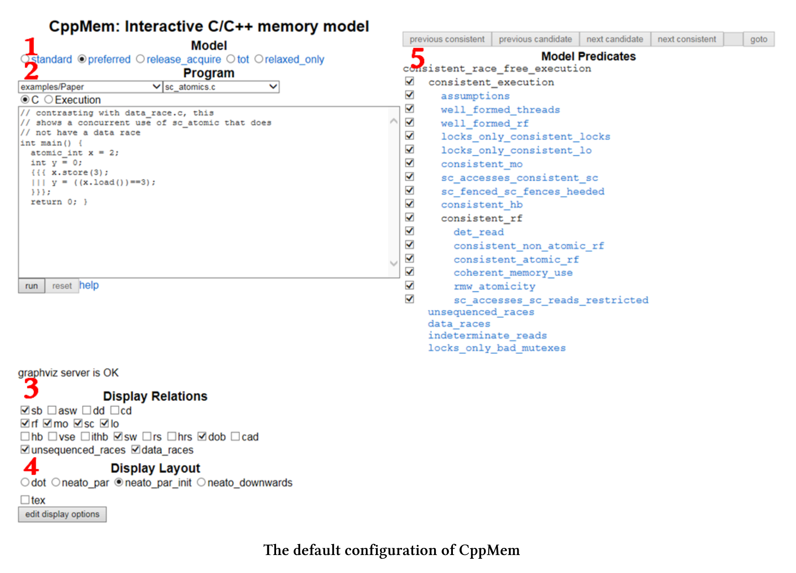

# CppMem-概述

[CppMem](http://svr-pes20-cppmem.cl.cam.ac.uk/cppmem/)是一個交互式工具，用於對C++小代碼段的內存模型行為進行研究。它應該是每個認真處理內存模型程序員的必備工具。

CppMem的網上版本(也可以把它安裝在你的個人電腦上)以兩種方式提供服務:

1. CppMem驗證小代碼段的行為，基於選擇的C++內存模型，該工具考慮所有可能的線程交錯，將每個線程可視化到一個圖中，並用附加的細節對這些圖進行註釋。
2. CppMem的精確分析，可以更加深入瞭解C++內存模型。簡言之，CppMem是一個幫助理解內存模型的工具。

當然，必須跨過一些門檻，這通常是強大工具的共性。CppMem的本質是提供與這個極具挑戰性的主題相關的非常詳細的分析，並且是高度可配置的。因此，我才打算介紹該工具的各種組件。

## 簡單概述

我對CppMem的簡單概述是基於默認配置的。這篇概述只是提供了進一步的實驗基礎，應該有助於理解我正在進行的優化過程。



簡單起見，我引用了屏幕截圖中的紅色數字。

### 1. Model模型

* 指定C++內存模型。首選是C++11內存模型的一個(簡化)等價的變體。

### 2. Program 程序

* 包含可執行程序，其語法類似於簡化的C++11。確切地說，不能直接將C或C++代碼程序複製到CppMem中。
* 可以在許多典型多線程場景之間進行切換。要獲得這些程序的詳細信息，請閱讀這篇寫得非常好的文章，該文章將[C++併發性數學化](http://www.cl.cam.ac.uk/~pes20/cpp/popl085ap-sewell.pdf)。當然，也可以運行自己的代碼。
* CppMem是關於多線程的，所以可以使用多線程的快捷方式。
  * 可以使用表達式`{ { {…|||…} } }`。三個點`(…)`表示每個線程的工作包。
  * 如果使用表達式`x.readvalue(1)`，則CppMem會計算線程交錯的情況，其中線程會為`x`賦值1。

### 3. Display Relations 關係顯示

*  描述原子操作、柵欄和鎖上的讀、寫和讀寫改之間的關係。
* 可以使用複選框顯式地啟用帶註釋的圖中的關係。
* 有三種關係，最有趣的是原始關係和派生關係之間的粗略區別。這裡使用的是默認值。
  * 淵源關係:
    * sb: sequenced-before 序前
    * rf: read from 讀取
    * mo: modification order 修改順序
    * sc: sequentially consistent 按順序一致
    * lo: lock order 鎖定順序
  * 派生關係:
    * sw: synchronises-with 與...同步
    * dob: dependency-ordered-before 序前依賴
    * unsequenced_races: 單線程中的競爭
    * data_races: 線程內的數據競爭

### 4. Display Layout 佈局顯示

* 可以選擇使用哪個[Doxygraph](https://sourceforge.net/projects/doxygraph/)圖形。

### 5. Model Predicates 模型謂詞

* 使用此按鈕，可以為所選模型設置謂詞，這會導致不一致(非無數據爭用)的執行，所以當執行不一致，就會看到不一致執行的原因。我在這本書裡不使用這個按鈕。

有關更多細節，請參閱[文檔](http://svr-pes20-cppmem.cl.cam.ac.uk/cppmem/help.html)。

作為對CppMem的入門，這就足夠了。現在，是時候嘗試一下CppMem了。

CppMem提供了許多示例。

### 示例

這些示例展示了使用併發代碼，特別是使用無鎖代碼時的典型用例。可以將這些例子，分成幾類。

**論文**

示例/論文類別為您提供了一些示例，這些示例在本文中對[C++併發性的數學化](https://www.cl.cam.ac.uk/~pes20/cpp/popl085ap-sewell.pdf)進行了深入的討論。

* data_race.c : x上的數據競爭
* partial_sb.c : 單線程中計算的序前
* unsequenced_race.c : 根據評價順序，對x上未排序的競爭進行評價
* sc_atomics.c : 正確的使用原子變量
* thread_create_and_asw.c : 額外的同步——與適當的線程創建同步

讓我們從第一個示例開始。

**測試運行**

從CppMem樣本中選擇data_race.c程序。run之後，立即顯示有一個數據競爭。


簡單起見，只解釋示例中的紅色數字。

1. 很容易觀察到的數據競爭。一個線程寫`x (x==3)`，另一個線程不同步讀`x (x==3)`。
2. 由於C++內存模型，兩個線程可能交織在一起運行，其中只有一個與所選模型一致。如果在表達式`x==3`中的`x`，在主函數中進行賦值`int x= 2`，則會出現這種情況。圖中在用`rf`和`sw`標註的邊緣顯示了這種關係。
3. 不同的線程交錯之間切換顯得非常有趣。
4. 該圖顯示關係中啟用的所有關係。
   * `a:Wna x=2`在圖表中是第`a`中表述，它是非原子性的。`Wna`表示“非原子寫入”。
   * 圖中的關鍵是`x (b:Wna)`的寫和`x (C:Rna)`的讀之間的連線。這也就是`x`上的數據競爭。

**進一步分類**

進一步的分類會關注於無鎖編程的方面。每個類別的示例都有不同的形式，每個表單使用不同的內存順序。有關類別的更多討論，請閱讀前面提到的[將C++併發性數學化](https://www.cl.cam.ac.uk/~pes20/cpp/popl085ap-sewell.pdf)的文章。如果可能的話，我會用順序一致性來表示程序。

**存儲緩衝(示例/SB_store_buffering)**

兩個線程分別寫入不同的位置，然後從另一個位置讀取。

SB+sc_sc+sc_sc+sc.c

```c++
// SB+sc_sc+sc_sc
// Store Buffering (or Dekker's), with all four accesses SC atomics
// Question: can the two reads both see 0 in the same execution?
int main() {
  atomic_int x=0; atomic_int y=0;
  {{{ { y.store(1,memory_order_seq_cst);
  	r1=x.load(memory_order_seq_cst); }
  ||| { x.store(1,memory_order_seq_cst);
  	r2=y.load(memory_order_seq_cst); } }}}
  return 0;
}
```

**消息傳遞(示例/MP_message_passing)**

一個線程寫入數據(非原子變量)並設置一個原子標誌，而另一個線程等待讀取數據標誌(非原子變量)。

MP+na_sc+sc_na.c

```c++
// MP+na_sc+sc_na
// Message Passing, of data held in non-atomic x,
// with sc atomic stores and loads on y giving release/acquire synchronisation
// Question: is the read of x required to see the new data value 1
// rather than the initial state value 0?
int main() {
	int x=0; atomic_int y=0;
  {{{ { x=1;
  	y.store(1,memory_order_seq_cst); }
  ||| { r1=y.load(memory_order_seq_cst).readsvalue(1);
  	r2=x; } }}}
  return 0;
}
```

**讀取緩衝(例子/LB_load_buffering)**

兩個讀操作可以看到之後的其他線程的寫操作嗎?

Lb+sc_sc+sc_sc.c

```c++
// LB+sc_sc+sc_sc
// Load Buffering, with all four accesses sequentially consistent atomics
// Question: can the two reads both see 1 in the same execution?
int main() {
  atomic_int x=0; atomic_int y=0;
  {{{ { r1=x.load(memory_order_seq_cst);
  	y.store(1,memory_order_seq_cst); }
  ||| { r2=y.load(memory_order_seq_cst);
  	x.store(1,memory_order_seq_cst); } }}}
  return 0;
}
```

**從寫到讀的因果關係(例子/WRC)**

第三個線程是否看到第一個線程的寫操作?

* 第一個線程寫x。
* 第二個線程從中讀取數據並寫入到y。
* 第三個線程讀取x。

WRC+rel+acq_rel+acq_rlx.c

```c++
// WRC
// the question is whether the final read is required to see 1
// With two release/acquire pairs, it is
int main() {
  atomic_int x = 0;
  atomic_int y = 0;
  {{{ x.store(1,mo_release);
  ||| { r1=x.load(mo_acquire).readsvalue(1);
  	y.store(1,mo_release); }
  ||| { r2=y.load(mo_acquire).readsvalue(1);
  	r3=x.load(mo_relaxed); }
  }}}
  return 0;
}
```

**獨立讀-獨立寫(示例\IRIW)**

兩個線程寫入不同的位置，第二個線程能以不同的順序看到寫操作嗎?

IRIW+rel+rel+acq_acq+acq_acq.c

```c++
// IRIW with release/acquire
// the question is whether the reading threads have
// to see the writes to x and y in the same order.
// With release/acquire, they do not.
int main() {
  atomic_int x = 0; atomic_int y = 0;
  {{{ x.store(1, memory_order_release);
  ||| y.store(1, memory_order_release);
  ||| { r1=x.load(memory_order_acquire).readsvalue(1);
  	r2=y.load(memory_order_acquire).readsvalue(0); }
  ||| { r3=y.load(memory_order_acquire).readsvalue(1);
  	r4=x.load(memory_order_acquire).readsvalue(0); }
  }}};
  return 0;
}
```

