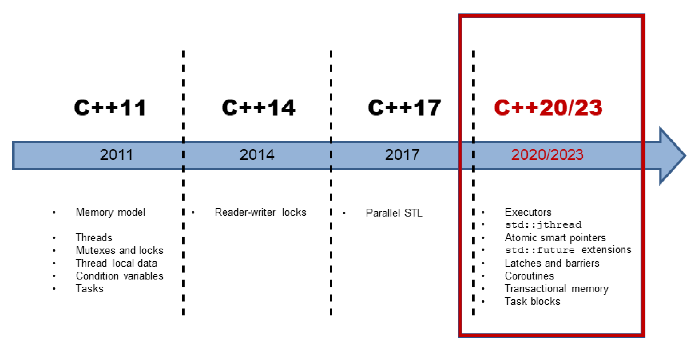

# C++並行歷史概述

隨著C++11的發佈，C++標準添加了多線程和內存模型。這樣，標準庫有了基本的構建塊，比如：原子變量、線程、鎖和條件變量。C++11提供了比引用更抽象的構建塊，這是未來C++標準(C++20/23)能建立更高抽象的基礎。

粗略地說，可以將C++併發分為三個演化過程。

## C++11和C++14: 鋪墊

C++11引入多線程，包括兩個部分：良好的內存模型和標準化的線程接口。C++14為C++的多線程功能增加了讀寫鎖。

### 內存模型

多線程的基礎，是定義良好的內存模型。內存模型需要處理以下幾個方面的內容:

* 原子操作: 不受中斷地操作。
* 部分排序運算: 不能重排序的操作序列。
* 操作的可見效果: 保證其他線程可以看到對共享變量的操作。

C++內存模型的靈感來自於Java。然而，與Java的內存模型不同，C++允許打破順序一致性的約束(原子操作的默認方式)。

順序一致性提供了兩個保證：

1. 程序指令按源碼順序執行。
2. 線程上的所有操作都遵循一個全局順序。

內存模型基於原子數據類型(短原子)的原子操作。

### 原子類型

C++有一組基本的原子數據類型，分別是布爾值、字符、數字和指針的變體。可以使用類模板`std::atomic`來定義原子數據類型。原子類型可以建立同步和排序約束，也適用於非原子類型。

標準化線程接口是C++併發的核心。

### 多線程

C++中的多線程由線程、(共享數據的)同步語義、線程本地數據和任務組成。

### 線程

`std::thread`表示一個獨立的程序執行單元。執行單元，表示可接受調用的單元。可調用單元可以是函數名、函數對象或Lambda函數。

新線程的可執行單元結束時，要麼進行等待主線程完成(`t.join()`)，要麼從主線程中分離出來(`t.detach()`)。如果沒有對線程`t`執行`t.join()`或`t.detach()`操作，則線程`t`是可匯入的(joinable)。如果可匯入線程進行銷燬時，會在其析構函數中調用`std::terminate`，則程序終止。

分離的線程在後臺運行，通常稱為**守護線程**。

`std::thread`是一個可變參數模板，它可以接收任意數量的參數。

#### 共享數據

如果多個線程同時使用共享變量，並且該變量是可變的(非const)，則需要協調對該變量的訪問。同時讀寫共享變量是一種數據競爭，也是一種未定義的行為。在C++中，可以通過鎖(或互斥鎖)來協調對共享變量的訪問。

#### 互斥鎖

互斥鎖(互斥量)保證在任何給定時間內，只有一個線程可以訪問共享變量。互斥鎖鎖定/解鎖共享變量所屬的臨界區(C++有5個不同的互斥對象)。即使互斥鎖同時共享一個鎖，也可以遞歸地、試探性地、有或沒有時間限制地進行鎖定。

#### 鎖

應該將互斥鎖封裝在鎖中，從而自動釋放互斥鎖。鎖通過將互斥鎖的生命週期綁定到自己的生命週期來實現RAII。C++中`std::lock_guard`/`std::scoped_lock`可用於簡單場景，`std::unique_lock`/`std::shared_lock`用於高級場景，例如：顯式鎖定或解鎖互斥鎖。

### 線程本地數據

將變量聲明為`thread-local`可以確保每個線程都有變量的副本。線程本地數據的生存週期，與線程的生存週期相同。

### 條件變量

條件變量允許通過消息機制對線程進行同步。一個線程為發送方，而另一個線程為接收方，其中接收方阻塞等待來自發送方的消息。條件變量的典型用例是"生產者-消費者"模式。條件變量可以是發送方，也可以是接收方。正確使用條件變量非常具有挑戰性。所以，這樣的任務通常有更簡單的解決方案。

### 任務

任務與線程有很多共同之處。雖然顯式地創建了一個線程，但任務只是工作的開始。C++運行時會自動處理任務的生存期，比如：`std::async`。

任務就像兩個通信端點之間的數據通道。支持線程之間的安全通信，當一個端點將數據放入數據通道時，另一個端點將在未來某個時刻獲取該值。數據可以是值、異常或通知。除了`std::async`, C++還有`std::promise`和`std::future`，這兩個類模板可以對任務有更多的控制。

## C++17: 標準模板庫算法的並行

C++17的併發性發生了巨大的變化，特別是標準模板庫(STL)的並行算法。C++11和C++14只提供了併發性的基礎構建塊。這些工具適合庫或框架開發人員，但不適合應用程序開發人員。C++11和C++14中的多線程，在C++ 17中的併發性面前，相當於彙編語言!

### 執行策略

C++17中，大多數STL算法都有並行實現，這樣就可以使用執行策略來調用算法。該策略指定算法是串行執行(`std::execution::seq`)、並行執行(`std::execution::par`)，還是與向量化的並行執行(`std::execution::par_unseq`)。

### 新算法

除了在重載，並行了原始的69種算法，還添加了8種新算法。這些新算法非常適合並行歸約、掃描或轉換。

## 案例研究

介紹了內存模型和多線程接口的理論知識之後，會將這些知識應用到一些案例中。

### 求向量元素的加和

計算一個向量的加和有多種方法。可以串行執行，也可以通過數據共享併發執行，不同的實現方式，性能上有很大的差別。

### 單例：線程安全的初始化

單例對象的初始化是線程安全的，是共享變量線程安全初始化的經典案例。有許多實現方法可以做到這一點，不過在性能上有一定的差異。

### 使用CppMem進行優化

我會從一個小程序開始，然後不斷地改進它，並用CppMem驗證優化過程的每個步驟。 [CppMem](http://svr-pes20-cppmem.cl.cam.ac.uk/cppmem)是一個交互式工具，用於研究小代碼段的C++內存模型行為。

## C++20/23: 併發的未來

對未來的標準預測非常難([Niels Bohr](https://en.wikipedia.org/wiki/Niels_Bohr))，這裡描述了C++20/23的併發特性。

### Executors

Executor由一組如何運行可調用單元的規則組成。它們指定執行是否應該在線程、線程池，甚至單線程(無併發)上運行(可調用的)基礎構建塊上進行。提案[N4734](http://www.open-std.org/jtc1/sc22/wg21/docs/papers/2018/n4734.pdf)的擴展依賴於擴展的future，也依賴於STL的並行算法，以及C++20/23中新的併發特性，如：門閂和柵欄、協程、事務性內存和任務塊(最終都會使用它們)。

#### std::jthread

`std::jthread`是`std::thread`的增強版。除了`std::thread`外，`std::jthread`還可以發出中斷信號，並自動併入啟動的線程。

#### 原子智能指針

智能指針[`std::shared_ptr`](http://en.cppreference.com/w/cpp/memory/shared_ptr)和[`std::weak_ptr`](http://en.cppreference.com/w/cpp/memory/weak_ptr)在併發程序中存在概念問題。它們的本質上是共享的，這就使得狀態可變，所以容易出現數據競爭，從而導致未定義的行為。`std::shared_ptr`和`std::weak_ptr`保證引用計數器的遞增或遞減是一個原子操作。資源只被刪除一次，但不能保證對資源訪問的原子性。新的原子智能指針`std::atomic<std::shared_ptr<T>>`和`std::atomic<std::weak_ptr<T>>`解決了這個問題。兩者都是`std::atomic`的偏特化版本。

#### 擴展版future

C++11引入了promise和future，其有很多優點，但也有一個缺點：不能組合成強大的工作流。在C++20/23中，future應該會消弭這個缺點。

#### 門閂和柵欄

C++14沒有信號量，而信號量是用於限制訪問資源的利器。因為C++20/23提出了門閂和屏障，就不用擔心沒有信號量可用的問題了。可以使用門閂和柵欄在異步點進行等待，直到計數器變為零。門閂和柵欄的區別在於，`std::latch`只能使用一次，而`std::barrier`和`std::flex_barrier`可以使用多次。與`std::barrier`不同，`std::flex_barrier`可以在每次迭代之後調整它的計數器。

#### 協程

協程是可以掛起，並保持執行函數的狀態。協程通常在操作系統、事件循環、無限列表或管道中使用，用於實現需要協作才能完成的任務。

#### 事務內存

事務內存基於數據庫理論中事務的基本思想。事務是一種操作，它提供了ACID數據庫事務的前三個屬性：原子性、一致性和隔離性。數據庫特有的持久性不適用C++的事務內存。新標準有兩種類型的事務內存：同步塊和原子塊。它們都按總順序執行的，表現得好像有一個全局鎖在保護它們。與同步塊相比，原子塊不能執行事務不安全的代碼。

#### 任務塊

任務塊在C++中實現了fork-join範式。下圖說明瞭任務塊的關鍵思想：啟動任務的fork階段和同步任務的join階段。

### 模式和最佳實踐

模式是從實踐中記錄下來的最佳方式。[Christopher Alexander](https://en.wikipedia.org/wiki/Christopher_Alexander)說，“模式表達了特定環境、問題和解決方案之間的關係“。從更概念化的角度看待併發編程，會得到更多解決問題的方式。與更概念化的併發模式相比，本章提供了面對併發挑戰的實用技巧。

#### 同步

數據競爭的必要前提是數據處於共享的、可變狀態。同步模式可以歸結為兩個問題：處理共享和處理可變。

#### 並行架構

併發架構章節中介紹了三種模式。前兩種模式是活動對象和監視器對象的同步，以及調度器方法的使用。第三種半同步/半異步模式關注體系結構，並在併發系統中解耦異步和同步(服務)的處理。

#### 最佳實踐

併發編程比較複雜，因此通過最佳實踐，可以更多的瞭解多線程和內存模型。

###數據結構

#### 挑戰項目

編寫併發程序本來就很複雜，使用C++11和C++14的特性也是如此。因此，我將詳細描述具挑戰性的問題。希望用一整章的篇幅來討論併發編程的挑戰，會讓你更清楚其中的陷阱。這裡有競爭條件、數據競爭和死鎖等挑戰項目。

#### 計時庫

計時庫是C++併發工具的重要組成部分。通常，可以讓線程在特定的時間內處於休眠狀態，或者一直休眠到特定的時間點。計時庫包括：時間點、時間段和時鐘。

#### CppMem

CppMem是一個交互式工具，用於深入瞭解內存模型。它提供了兩項非常有價值的服務：可以驗證無鎖代碼，可以分析無鎖代碼，並且能得到對代碼的魯棒性有更多的理解。本書會經常使用CppMem。由於CppMem的配置選項和見解非常具有挑戰性，也會提供相應章節，以便對CppMem有一些基本的瞭解。

#### 術語表

術語表對最基本的術語作了簡單的解釋。