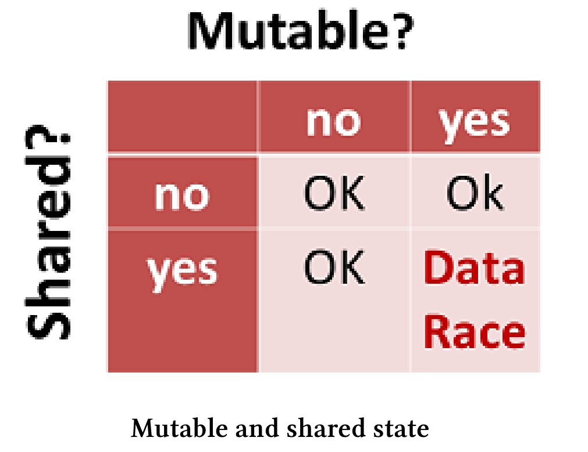
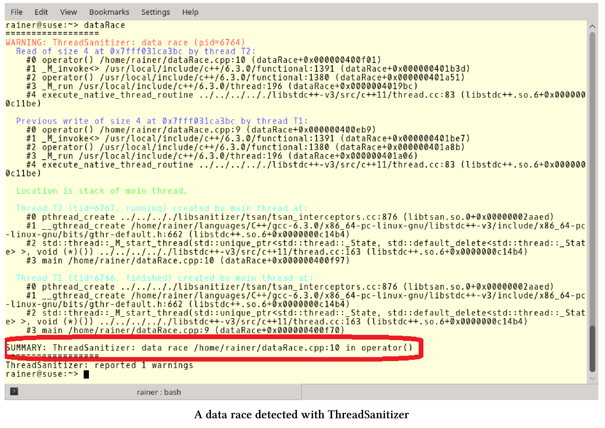

# 通常情況

我們先從一些原子操作和線程操作的最佳實踐開始。

## 代碼評審

代碼評審應該是專業軟件開發過程必備的一部分，尤其是處理併發。併發性本質上非常複雜，需要深思熟慮的分析和經驗。

為了使評審更有效，請在評審之前將想要討論的代碼發送給評審人員，並聲明代碼中哪些地方是不可變的。正式評審開始之前，應該給予評審員足夠的時間來分析代碼。

不知道怎麼做?舉個例子。還記得`std::shared_lock`一章readerWriterLock.cpp中的數據競爭嗎?

```c++
// readerWriterLock.cpp

#include <iostream>
#include <map>
#include <shared_mutex>
#include <string>
#include <thread>

std::map<std::string, int> teleBook{ {"Dijkstra", 1972}, {"Scott", 1976},
                                                          {"Ritchie", 1983} };

std::shared_timed_mutex teleBookMutex;

void addToTeleBook(const std::string& na, int tele) {
  std::lock_guard<std::shared_timed_mutex> writerLock(teleBookMutex);
  std::cout << "\nSTARTING UPDATE " << na;
  std::this_thread::sleep_for(std::chrono::milliseconds(500));
  teleBook[na] = tele;
  std::cout << " ... ENDING UPDATE " << na << std::endl;
}

void printNumber(const std::string& na) {
  std::shared_lock<std::shared_timed_mutex> readerLock(teleBookMutex);
  std::cout << na << ": " << teleBook[na];
}

int main() {

  std::cout << std::endl;

  std::thread reader1([] {printNumber("Scott"); });
  std::thread reader2([] {printNumber("Ritchie"); });
  std::thread w1([] {addToTeleBook("Scott",1968); });
  std::thread reader3([] {printNumber("Dijkstra"); });
  std::thread reader4([] {printNumber("Scott"); });
  std::thread w2([] {addToTeleBook("Bjarne", 1965); });
  std::thread reader5([] {printNumber("Scott"); });
  std::thread reader6([] {printNumber("Ritchie"); });
  std::thread reader7([] {printNumber("Scott"); });
  std::thread reader8([] {printNumber("Bjarne"); });

  reader1.join();
  reader2.join();
  reader3.join();
  reader4.join();
  reader5.join();
  reader6.join();
  reader7.join();
  reader8.join();
  w1.join();
  w2.join();

  std::cout << std::endl;

  std::cout << "\nThe new telephone book" << std::endl;
  for (auto teleIt : teleBook) {
    std::cout << teleIt.first << ": " << teleIt.second << std::endl;
  }

  std::cout << std::endl;

}
```

問題在於第24行`teleBook[na]`，這是一個可以修改的電話簿。可以通過將讀取線程`reader8`放在其他讀取線程之前，來觸發數據競爭。在我的C++研討會上，這個程序作為發現數據競爭的一種練習，大約10%的參與者在5分鐘內能發現數據競爭。

## 儘量減少可變數據的共享

應該儘量減少可變數據的共享，原因有兩個：性能和安全性。安全性主要是關於數據競爭，這裡我們來詳談一下性能。

在計算向量和的章節中，我們做了詳盡的性能研究。展示了將`std::vector`的值加起來要花費多少時間。

下面是單線程求和的關鍵部分。

```c++
...
  
constexpr long long size = 100000000;

std::cout << std::endl;

std::vector<int> randValues;
randValues.reserve(size);

// random values
std::random_device seed;std::mt19937 engine(seed());
std::uniform_int_distribution<> uniformDist(1, 10);

const unsigned long long sum = std::accumulate(randValues.begin(),                                   randValues.end(), 0);

...
```

然後，在四個線程上執行求和，並很天真地使用了一個共享的求和變量。

```c++
...
void sumUp(unsigned long long& sum, const std::vector<int>& val,
  				  unsigned long long beg, unsigned long long end){
  for (auto it = beg; it < end; ++it){
    std::lock_guard<std::mutex> myLock(myMutex);
    sum += val[it];
  }
}
...
```

後來，通過使用原子變量求和。

```c++
...
void sumUp(std::atomic<unsigned long long>& sum, const std::vector<int>& val,
						unsigned long long beg, unsigned long long end){
  for (auto it = beg; it < end; ++it){
  	sum.fetch_add(val[it]);
  }
}
...
```

最後，通過計算局部和，得到了性能的提升。

```c++
...
void sumUp(unsigned long long& sum, const std::vector<int>& val,
						unsigned long long beg, unsigned long long end){
  unsigned long long tmpSum{};
  for (auto i = beg; i < end; ++i){
  	tmpSum += val[i];
  }
  std::lock_guard<std::mutex> lockGuard(myMutex);
  sum += tmpSum;
}
...
```

性能數字令人印象深刻，並提供了明確的指示。求和變量共享的部分越少，從多線程中獲得性能收益越高。

|  單線程  | std::lock_guard | 原子變量 | 本地求和 |
| :------: | :-------------: | :------: | :------: |
| 0.07 sec |    3.34 sec     | 1.34 sec | 0.03 sec |

## 減少等待

你可能聽說過[阿姆達爾定律](https://en.wikipedia.org/wiki/Amdahl%27s_law)。它預測了使用多個處理器可以獲得的理論上的最大加速比。定律很簡單，如果p是可以併發運行的代碼的比例，則可以獲得最大的加速$\frac{1}{1-p}$。因此，如果90%的代碼可以併發運行，就可以
得到(最多)10倍的加速$\frac{1}{1-p}==\frac{1}{1-0.9}==\frac{1}{0.1}==10$。

反過來看，如果使用鎖導致10%的代碼必須串行，那麼最多可以獲得10倍的加速。當然，這裡假設可以訪問的處理資源是無限制的。

該圖清楚地顯示了Amdahl定律的曲線。


By Daniels220 at English Wikipedia, CC BY-SA 3.0, https://commons.wikimedia.org/w/index.php?curid=6678551

核心的最佳數量在很大程度上取決於代碼的並行部分。例如：如果有50%的並行代碼，那麼就可以用16個核芯可達到最高的性能，使用過多的內核會使程序運行速度變慢。如果您有95%的並行代碼，那麼使用2048個核芯可將性能達到峰值。

## 不可變數據

數據競爭是指，至少兩個線程同時訪問一個共享變量的情況，並且至少有一個線程嘗試修改該變量。數據競爭的一個必要條件是可變的共享狀態，下面的圖表清楚地說明瞭我的觀點。



如果沒有不可變的數據，則不會發生數據競爭。只需確保不可變數據以線程安全的方式初始化即可。在線程安全初始化的章節中，介紹了四種方法來保證這一點，這裡複述一下:

* 線程創建前進行初始化。
* 常數表達式。
* `std::call_once`與`std::once_flag`的組合。
*  具有塊作用域的靜態變量。

C++中創建不可變數據的兩種方法：`const`和`constexpr`。`const`是一種運行時技術，而`constexpr`可保證該值在編譯時初始化，因此是線程安全的。甚至自定義的類型，也可以在編譯時初始化。

**自定義的類型**

對於用戶定義的類型，在編譯時創建實例，會有一些限制。

`constexpr`的構造函數的限制:

* 只能用常量表達式。
* 不能使用異常處理。
* 必須聲明為默認或刪除，否則函數體必須為空(C++11)。

自定義的`constexpr`類型的限制：

* 不能有虛擬基類。
*  要求每個基對象和每個非靜態成員必須在構造函數的初始化列表中初始化，或者直接在類體中初始化。因此，使用的構造函數(例如基類的構造函數)必須是`constexpr`，而且必須使用常量表達式進行初始化。

[cppreference.com](https://en.cppreference.com/w/cpp/language/constexpr)為`constexpr`自定義類型提供了更多的信息。為了將實踐添加到理論中，我定義了`MyInt`類，`MyInt`涉及到了剛剛提到的點，還有`constexpr`方法。

```c++
// userdefinedTypes.cpp

#include <iostream>
#include <ostream>

class MyInt {
public:
  constexpr MyInt() = default;
  constexpr MyInt(int fir, int sec) :myVal1(fir), myVal2(sec) {}
  MyInt(int i) {
    myVal1 = i - 2;
    myVal2 = i + 3;
  }

  constexpr int getSum() const { return myVal1 + myVal2; }

  friend std::ostream& operator<<(std::ostream& out, const MyInt& myInt) {
    out << "(" << myInt.myVal1 << "," << myInt.myVal2 << ")";
    return out;
  }

private:
  int myVal1 = 1998;
  int myVal2 = 2003;

};

int main() {

  std::cout << std::endl;

  constexpr MyInt myIntConst1;

  constexpr int sec = 2014;
  constexpr MyInt myIntConst2(2011, sec);
  std::cout << "myIntConst2.getSum(): " << myIntConst2.getSum() << std::endl;

  int arr[myIntConst2.getSum()];
  static_assert(myIntConst2.getSum() == 4025, "2011 + 2014 should be 4025");

  std::cout << std::endl;

}
```

`MyInt`類有兩個`constexpr`構造函數。一個默認構造函數(第8行)和一個接受兩個參數的構造函數(第9行)。另外，該類有兩個方法，但是隻有`getSum`方法是常量表達式。因為`constexpr`方法在C++11和C++14是不同的，不會自動進行`const`修飾，所以方法聲明為`const`。如果在`constexpr`對象中使用變量`myVal1`和`myVal2`(第23行和第24行)，有兩種方法可以定義它們。首先，可以在構造函數的初始化列表中初始化它們(第9行)；其次，可以在類體中初始化它們(第23行和第24行)。這裡，構造函數的初始化列表中的初始化具有更高的優先級。

第38行和第39行中可以在一個常量表達式中調用`constexpr`方法。下面是程序的輸出。


再次強調：`constexpr`對象只能使用`constexpr`方法初始化。

像Haskell這樣沒有可變數據的函數式編程語言，則非常適合併發編程。

## 使用純函數

Haskell被稱為純函數語言，純函數是在給定相同參數時，總是產生相同結果的函數。它沒有副作用，因此不能改變程序的狀態。

從併發性的角度來看，純函數具有明顯的優勢。它們可以重新排序，也可以在另一個線程上自動運行。

C++中的函數默認不是純函數。以下三個函數都是純函數，但每個函數都有不同的特徵。

```c++
int powFunc(int m, int n){
  if (n == 0) return 1;
  return m * powFunc(m, n-1);
}
```

`powFunc`是一個普通函數。

```c++
template<int m, int n>
struct PowMeta{
	static int const value = m * PowMeta<m, n-1>::value;
};

template<int m>
struct PowMeta<m, 0>{
  static int const value = 1;
};
```

`PowMeta`是一個元函數(meta-function)，因為它在編譯時運行。

```c++
constexpr int powConst(int m, int n){
  int r = 1;
  for(int k = 1; k <= n; ++k) r *= m;
  return r;
}
```

`powCont`函數可以在運行時和編譯時運行，它是一個常量函數。

## 尋找正確的抽象概念

多線程環境中，有多種方法可以初始化單例。可以使用標準庫中的`lock_guard`或`std::call_once`，或使用依賴於核心語言的靜態變量，亦或是使用依賴於原子變量的獲取-釋放語義。顯然，使用獲取-釋放語義最具挑戰性。使用者必須執行它，維護它，還要向同事解釋它。與這些工作相比，Meyers單例在更容易實現，並且運行速度更快。

可以使用`std::reduce`，而不是實現一個並行循環進行求和。可以使用二元操作可調用和並行執行策略，對`std::reduce`進行參數化。

越是追求正確的抽象，工作就會越輕鬆。

## 使用靜態代碼分析工具

案例分析章節中，我介紹了CppMem。[CppMem](http://svr-pes20-cppmem.cl.cam.ac.uk/cppmem/)是一個交互式工具，用於對小代碼段的C++內存模型，進行行為研究。CppMem可以提供兩個方面的幫助：首先，可以驗證代碼的正確性；其次，可以更深入地瞭解內存模型，從而更全面地瞭解多線程問題。

## 使用動態執行工具

[ThreadSanitizer](https://github.com/google/sanitizers/wiki/ThreadSanitizerCppManual)是一個針對C/C++的數據競爭探測器。ThreadSanitizer已經作為Clang 3.2和GCC 4.8的一部分。要使用ThreadSanitizer，必須使用編譯標誌`-fsanitize=thread`來編譯和鏈接你的程序。

下面的程序有一個數據競爭。

```c++
// dataRace.cpp

#include <thread>

int main() {

  int globalVar{};

  std::thread t1([&globalVar] { ++globalVar; });
  std::thread t2([&globalVar] { ++globalVar; });

  t1.join();
  t2.join();

}
```

`t1`和`t2`同時訪問`globalVar`，兩個線程都試圖修改`globalVar`。讓我們編譯並運行該程序。

`g++ -std=c++11 dataRace.cpp -fsanitize=thread -pthread -g -o dataRace`

這個程序的輸出相當冗長。



我用紅色框突出了屏幕截圖的關鍵段，這段表示在源碼第10行有一個數據競爭。