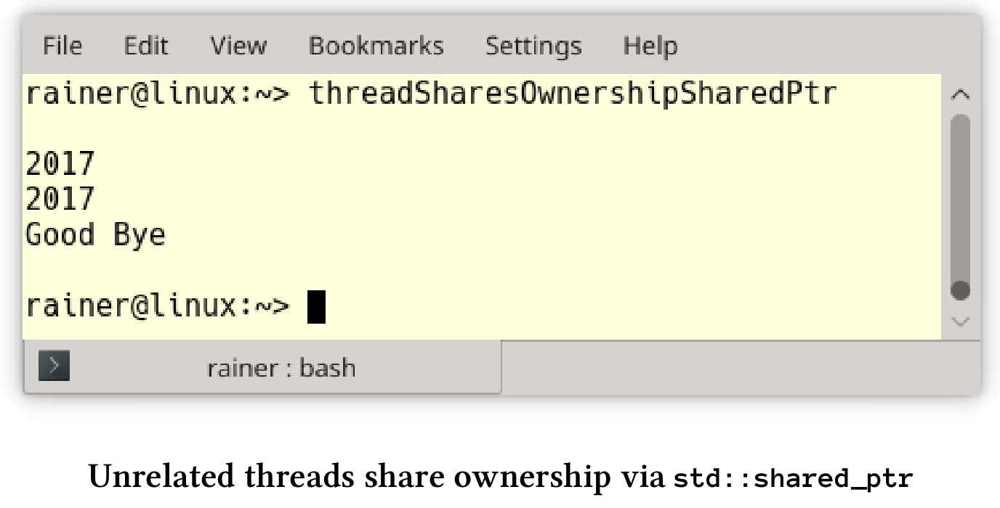

# 多線程

## 線程

線程是編寫併發程序的基礎件。

**減少線程的創建**

一個線程的開銷有多大?非常巨大！這就是最佳實踐背後的問題。讓我們先看看線程的大小，而不是創建它的成本。

**線程大小**

`std::thread`是對本機操作系統線程的包裝，這意味著需要對Windows線程和[POSIX thread](https://en.wikipedia.org/wiki/POSIX_Threads)的大小進行了解：

* Windows：[線程堆棧大小]( https://msdn.microsoft.com/en-us/library/windows/desktop/ms686774(v=vs.85).aspx)給了我答案：1MB。
* POSIX：pthread手冊頁為我提供了i386和x86_64架構的答案：2MB。下面有支持POSIX架構的線程堆棧大小：


**創建耗時**

我不知道創建一個線程需要多少時間，所以我在Linux和Windows上做了一個簡單的性能測試。

我在臺式機上使用GCC 6.2.1，在筆記本電腦上使用cl.exe(Visual Studio 2017)進行性能測試。我用最大優化來編譯程序，這意味著在Linux上的優化標誌為`O3`和Windows為`Ox`。

下面是我的程序。

```c++
// threadCreationPerformance.cpp

#include <chrono>
#include <iostream>
#include <thread>

static const long long numThreads = 1'000'000;

int main() {
  auto start = std::chrono::system_clock::now();

  for (volatile int i = 0; i < numThreads; ++i) std::thread([] {}).detach();

  std::chrono::duration<double> dur = std::chrono::system_clock::now() - start;
  std::cout << "time: " << dur.count() << " seconds" << std::endl;
}
```

該程序創建了100萬個線程，這些線程執行第13行中的空Lambda函數。以下是在Linux和Windows測試的結果:

**Linux**


這意味著在Linux上創建一個線程大約需要14.5秒/ 1000000 = 14.5微秒。

**Windows**


在Windows上創建線程大約需要44秒/ 1000000 = 44微秒。

換句話說，在Linux上一秒鐘可創建大約69000個線程，在Windows上一秒鐘可創建23000個線程。

**使用任務而不是線程**

```c++
// asyncVersusThread.cpp

#include <future>
#include <thread>
#include <iostream>

int main() {

  std::cout << std::endl;

  int res;
  std::thread t([&] {res = 2000 + 11; });
  t.join();
  std::cout << "res: " << res << std::endl;

  auto fut = std::async([] {return 2000 + 11; });
  std::cout << "fut.get(): " << fut.get() << std::endl;

  std::cout << std::endl;

}
```

有很多原因讓我們優先選擇任務而不是線程：

* 可以使用一個安全的通信通道來返回結果。如果使用共享變量，則必須同步的對它進行訪問。
* 調用者可以很容易的得到返回值、通知和異常。

通過擴展版future，我們可構建future，以及高度複雜的工作流。這些工作流基於`continuation then`，以及`when_any`和`when_all`的組合。

**如果要分離線程，一定要非常小心**

下面的代碼片段需要我們關注一下。

```c++
std::string s{"C++11"}

std::thread t([&s]{ std::cout << s << std::endl; });
t.detach();
```

線程`t`與它的創建者的生命週期是分離的，所以兩個競態條件會導致未定義行為。

1. 線程可能比其創建者的生命週期還長，結果是`t`引用了一個不存在的`std::string`。 
2. 因為輸出流`std::cout`的生存期與主線程的生存期綁定在一起，所以程序在線程`t`開始工作之前，輸出流就可能關閉了。

**考慮使用自動匯入的線程**

如果`t.join()`和`t.detach()`都沒有調用，則具有可調用單元的線程`t`被稱為可匯入的，這時進行銷燬的話，析構函數會拋出`std::terminate`異常。為了不忘記`t.join()`，可以對`std::thread`進行包裝。這個包裝器在構造函數中檢查給定線程是否仍然可連接，並將給定線程在析構函數中進行匯入操作。

我們不必自己構建這個包裝器，可以使用Anthony Williams的scoped_thread，或是[核心準則支持的庫](https://github.com/Microsoft/GSL)的`gsl::joining_thread`。

## 數據共享

隨著可變數據的數據共享，也就開啟了多線程編程的挑戰。

**通過複製傳遞數據**

```c++
std::string s{"C++11"}

std::thread t1([s]{ ... }); // do something with s
t1.join();

std::thread t2([&s]{ ... }); // do something with s
t2.join();

// do something with s
```

如果將`std::string s`之類的數據通過複製傳遞給線程`t1`，則創建者線程和創建的線程`t1`使用獨立的數據。線程`t2`相反，通過引用獲取`std::string s`，這意味著必須同步對創建者線程和已創建線程`t2`中的`s`的訪問。這裡非常容易出錯。

**使用`std::shared_ptr`在非關聯線程之間共享所有權**

試想，有一個在非關聯的線程之間共享的對象存在。接下來的問題是，對象的所有者是誰？誰負責這個對象的內存管理？現在，可以在內存洩漏(如果不釋放內存)和未定義行為(因為多次調用delete)之間進行選擇。大多數情況下，未定義行為會使運行時崩潰。

下面的程序展示了這個看似無解的問題。

```c++
// threadSharesOwnership.cpp

#include <iostream>
#include <thread>

using namespace std::literals::chrono_literals;

struct MyInt {
  int val{ 2017 };
  ~MyInt() {
    std::cout << "Good Bye" << std::endl;
  }
};

void showNumber(MyInt* myInt) {
  std::cout << myInt->val << std::endl;
}

void threadCreator() {
  MyInt* tmpInt = new MyInt;

  std::thread t1(showNumber, tmpInt);
  std::thread t2(showNumber, tmpInt);

  t1.detach();
  t2.detach();
}

int main() {

  std::cout << std::endl;

  threadCreator();
  std::this_thread::sleep_for(1s);

  std::cout << std::endl;

}
```

這個例子很簡單，主線程休眠1秒鐘(第34行)，以確保它比子線程`t1`和`t2`的生命週期長。當然，這不是恰當的同步，但幫我闡明瞭觀點。程序的關鍵是：誰負責刪除第20行中的`tmpInt` ?線程`t1`(第22行)？還是線程`t2`(第23行)？或函數本身(主線程)？因為無法預測每個線程運行多長時間，所以這個程序應該會有內存洩漏。因此，第10行中的`MyInt`的析構函數永遠不會被調用:


如果使用`std::shared_ptr`，則生命週期問題就很容易處理。



```c++
// threadSharesOwnershipSharedPtr.cpp

#include <iostream>
#include <memory>
#include <thread>

using namespace std::literals::chrono_literals;

struct MyInt {
  int val{ 2017 };
  ~MyInt() {
    std::cout << "Good Bye" << std::endl;
  }
};

void showNumber(std::shared_ptr<MyInt> myInt) {
  std::cout << myInt->val << std::endl;
}

void threadCreator() {
  auto sharedPtr = std::make_shared<MyInt>();

  std::thread t1(showNumber, sharedPtr);
  std::thread t2(showNumber, sharedPtr);

  t1.detach();
  t2.detach();
}

int main() {

  std::cout << std::endl;

  threadCreator();
  std::this_thread::sleep_for(1s);

  std::cout << std::endl;

}
```

對源代碼進行兩個小的必要的修改：首先，第21行中的指針變成了`std::shared_ptr`，然後，第16行中的函數`showNumber`接受了一個智能指針，而不是普通指針。

**儘量減少持有鎖的時間**.

如果持有鎖，那麼只有單個線程可以進入臨界區。

```c++
void setDataReadyBad(){
  std::lock_guard<std::mutex> lck(mutex_);
  mySharedWork = {1, 0, 3};
  dataReady = true;
  std::cout << "Data prepared" << std::endl;
  condVar.notify_one();
} // unlock the mutex

void setDataReadyGood(){
  mySharedWork = {1, 0, 3};
  {
  	std::lock_guard<std::mutex> lck(mutex_);
    dataReady = true;
  } // unlock the mutex
  std::cout << "Data prepared" << std::endl;
  condVar.notify_one();
}
```

函數`setDataReadyBad`和`setDataReadyGood`是條件變量的通知組件。可變的數據是必要的，以防止偽喚醒和未喚醒的發生。由於`dataReady`是一個非原子變量，因此必須使用鎖`lck`對其進行同步。為了使鎖的生命週期儘可能短，可以在函數`setDataReadyGood`中使用一個範圍`({…}) `。

**將互斥量放入鎖中**

不應該使用沒有鎖的互斥量。

```c++
std::mutex m;
m.lock();
// critical section
m.unlock();
```

臨界區內可能會發生意外，或者忘記解鎖。如果不解鎖，則想要獲取該互斥鎖的另一個線程將被阻塞，最後程序將死鎖。

由於鎖可以自動處理底層的互斥量，因此死鎖的風險大大降低了。根據RAII習慣用法，鎖在構造函數中自動綁定互斥量，並在析構函數中釋放互斥量。

```c++
{
  std::mutex m,
  std::lock_guard<std::mutex> lockGuard(m);
  // critical section
} // unlock the mutex
```

`({…})`範圍確保鎖的生命週期自動結束，所以底層的互斥量會被解鎖。

**最多鎖定一個互斥鎖**

有時在某個時間點需要多個互斥鎖，這種情況下，可能會引發死鎖的競態條件。因此，可能的話，應該儘量避免同時持有多個互斥鎖。

**給鎖起個名字**

如果使用沒有名稱的鎖，比如`std::lock_guard`，那麼將立即銷燬。

```c++
{
  std::mutex m,
  std::lock_guard<std::mutex>{m};
  // critical section
}
```

這個看起來無害的代碼片段中，`std::lock_guard`立即被銷燬。因此，下面的臨界區是不同步執行的。C++標準的鎖遵循所有相同的模式，會在構造函數中鎖定互斥鎖，並在析構函數中解鎖，這種模式稱為RAII。

下面例子的行為令人驚訝:

```c++
// myGuard.cpp

#include <mutex>
#include <iostream>

template <typename T>
class MyGuard {
  T& myMutex;
public:
  MyGuard(T& m) :myMutex(m) {
    myMutex.lock();
    std::cout << "lock" << std::endl;
  }
  ~MyGuard() {
    myMutex.unlock();
    std::cout << "unlock" << std::endl;
  }
};

int main() {

  std::cout << std::endl;

  std::mutex m;
  MyGuard<std::mutex> {m};
  std::cout << "CRITICAL SECTION" << std::endl;

  std::cout << std::endl;

}
```

`MyGuard`在其構造函數和析構函數中調用`lock`和`unlock`。由於臨時變量的原因，對構造函數和析構函數的調用發生在第25行。特別是，這意味著析構函數的調用發生在第25行，而不是第31行。因此，第26行中的臨界段沒有同步執行。

這個程序的截圖顯示了，解鎖的發生在輸出CRITICAL SECTION之前。


**使用std::lock或std::scoped_lock原子地鎖定更多的互斥對象**

如果一個線程需要多個互斥對象，那麼必須非常小心地將互斥對象以相同的順序進行鎖定。如果不這樣，一個糟糕的線程交叉就可能導致死鎖。

```c++
void deadLock(CriticalData& a, CriticalData& b){
  std::lock_guard<std::mutex> guard1(a.mut);
  // some time passes
  std::lock_guard<std::mutex> guard2(b.mut);
  // do something with a and b
}

...
  
std::thread t1([&]{deadLock(c1,c2);});
std::thread t2([&]{deadLock(c2,c1);});

...
  
```

線程`t1`和`t2`需要兩個`CriticalData`，而`CriticalData`用自己的`mut`來控制同步訪問。不幸的是，因為這兩個調用參數`c1`和`c2`的順序不同，所以產生了一個競態，從而會導致死鎖。當線程`t1`可以鎖定第一個互斥對象`a.mut`，而沒鎖住第二個`b.mut `，這樣線程`t2`鎖住了第二個線程，而阻塞等待`a.mut`解鎖，就會產生出一個死鎖的狀態。

現在有了`std::unique_lock`，可以對互斥鎖進行延遲鎖定。函數`std::lock`可以原子地對任意數量的互斥鎖進行鎖定。

```c++
void deadLock(CriticalData& a, CriticalData& b){
  unique_lock<mutex> guard1(a.mut,defer_lock);
  // some time passes
  unique_lock<mutex> guard2(b.mut,defer_lock);
  std::lock(guard1,guard2);
  // do something with a and b
}

...
  
std::thread t1([&]{deadLock(c1,c2);});
std::thread t2([&]{deadLock(c2,c1);});

...
  
```

C++17有一個新鎖`std::scoped_lock`，它可以獲得任意數量的互斥鎖並自動鎖定它們。這樣，工作流變得更加簡單了：

```c++
void deadLock(CriticalData& a, CriticalData& b){
  std::scoped_lock(a.mut, b.mut);
  // do something with a and b
}

...
  
std::thread t1([&]{deadLock(c1,c2);});
std::thread t2([&]{deadLock(c2,c1);});

...
```

**不要在持有鎖時，調用未知代碼**

在持有互斥鎖的同時，調用`unknownFunction`會導致未定義行為。

```c++
std::mutex m;
{
  std::lock_guard<std::mutex> lockGuard(m);
  sharedVariable= unknownFunction();
}
```

我只能對`unknownFunction`進行推測數。如果`unknownFunction`：

* 試圖鎖定互斥量`m`，這就是未定義行為。大多數情況下，會出現死鎖。
* 啟動一個試圖鎖定互斥鎖`m`的新線程，就會出現死鎖。
* 鎖定另一個互斥鎖`m2`可能會陷入死鎖，因為需要同時鎖定了兩個互斥鎖`m`和`m2`。
* 不要直接或間接嘗試鎖住互斥鎖，雖然一切可能都沒什麼問題。“可能”是因為你的同事，可以修改函數或函數是動態鏈接的，這樣就會得到一個與已知版本不同的函數。對於可能發生的事情，所有一切都是可能的。
*   可能會出現性能問題，因為不知道`unknownFunction`函數需要多長時間。

要解決這些問題，請使用局部變量。

```c++
auto tempVar = unknownFunction();
std::mutex m,
{
  std::lock_guard<std::mutex> lockGuard(m);
  sharedVariable = tempVar;
}
```

這種方式解決了所有的問題。`tempVar`是一個局部變量，因此不會成為數據競爭的受害者，所以可以在沒有同步機制的情況下調用`unknownFunction`。此外，將`tempVar`的值賦給`sharedVariable`，可以將持有鎖的時間降到最低。

## 條件變量

通過通知同步線程是一個簡單的概念，但是條件變量使這個任務變得非常具有挑戰性。主要原因是條件變量沒有狀態：

* 如果條件變量得到了通知，則可能是錯誤的(偽喚醒)。
* 如果條件變量在準備就緒之前得到通知，則通知丟失(未喚醒)。

**不要使用沒有謂詞的條件變量**

使用沒有謂詞的條件變量，通常是競爭條件之一。

```c++
// conditionVariableLostWakeup.cpp

#include <condition_variable>
#include <mutex>
#include <thread>

std::mutex mutex_;
std::condition_variable condVar;

void waitingForWork() {
  std::unique_lock<std::mutex> lck(mutex_);
  condVar.wait(lck);
  // do the work
}

void setDataReady() {
  condVar.notify_one();
}

int main() {

  std::thread t1(setDataReady);
  std::thread t2(waitingForWork);

  t1.join();
  t2.join();

}
```

如果線程`t1`在線程`t2`之前運行，就會出現死鎖。`t1`在`t2`接收之前發送通知，通知就會丟失。這種情況經常發生，因為線程`t1`在線程`t2`之前啟動，而線程`t1`需要執行的工作更少。

在工作流中添加一個布爾變量`dataReady`可以解決這個問題。`dataReady`還可以防止偽喚醒，因為等待的線程會檢查通知是否來自於正確的線程。

```c++
// conditionVarialbleLostWakeupSolved.cpp

#include <condition_variable>
#include <mutex>
#include <thread>

std::mutex mutex_;
std::condition_variable condVar;

bool dataReady{ false };

void waitingForWork() {
  std::unique_lock<std::mutex> lck(mutex_);
  condVar.wait(lck, [] { return dataReady; });
  // do the work
}

void setDataReady() {
  {
    std::lock_guard<std::mutex> lck(mutex_);
    dataReady = true;
  }
  condVar.notify_one();
}

int main() {

  std::thread t1(setDataReady);
  std::thread t2(waitingForWork);

  t1.join();
  t2.join();

}
```

**使用Promise和Future代替條件變量**

對於一次性通知，promise和future則是更好的選擇。conditioVarialbleLostWakeupSolved.cpp的工作流程，可以使用promise和future直接實現。

```c++
// notificationWithPromiseAndFuture.cpp

#include <future>
#include <utility>

void waitingForWork(std::future<void>&& fut) {
  fut.wait();
  // do the work
}

void setDataReady(std::promise<void>&& prom) {
  prom.set_value();
}

int main() {

  std::promise<void> sendReady;
  auto fut = sendReady.get_future();

  std::thread t1(waitingForWork, std::move(fut));
  std::thread t2(setDataReady, std::move(sendReady));

  t1.join();
  t2.join();

}
```

工作流程被簡化到極致。promise`prom.set_value()`會發送future`fut.wait()`正在等待的通知。因為沒有臨界區，程序不需要互斥量和鎖。因為不可能發生丟失喚醒或虛假喚醒，所以有沒有謂詞也沒有關係。

如果工作流要求多次使用條件變量，那麼promise和future就是不二之選。

## Promise和Future

promise和future常被用作線程或條件變量的替代物。

**儘可能使用std::async**

如果可能，應該使用`std::async`來執行異步任務。

```c++
auto fut = std::async([]{ return 2000 + 11; });
// some time passes
std::cout << "fut.get(): " << fut.get() << std::endl;
```

通過調用`auto fut = std::async([]{ return 2000 + 11; })`，相當於對C++運行時說：“運行這個”。調用者不關心它是否立即執行，以及是運行在同一個線程上，還有是運行在線程池上，或是運行在[GPU](https://en.wikipedia.org/wiki/Graphics_processing_unit)上。調用者只對future的結果感興趣：`fut.get()`。

從概念上看，線程只是運行作業的實現細節。對於線程而言，使用者應該只指定做什麼，而不應該指定如何做。