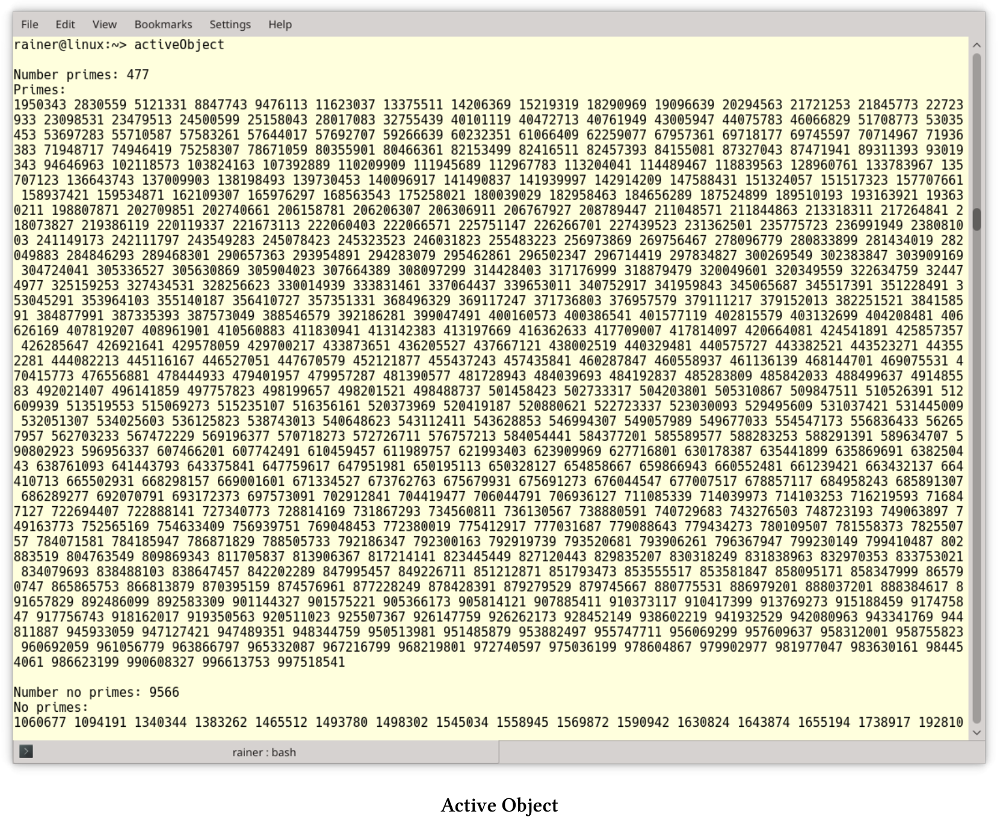

# 活動對象

活動對象模式將執行與對象的成員函數解耦，每個對象會留在在自己的控制線程中。其目標是通過使用異步方法，處理調度器的請求，從而觸發併發。維基百科：[Active object]( https://en.wikipedia.org/wiki/Active_object)。所以，這種模式也稱為併發對象模式。

客戶端的調用會轉到代理，代理表現為活動對象的接口。服務提供活動對象的實現，並在單獨的線程中運行。代理在運行時將客戶端的調用轉換為對服務的調用，調度程序將方法加入到激活列表中。調度器與服務在相同的線程中活動，並將方法調用從激活列表中取出，再將它們分派到相應的服務上。最後，客戶端可以通過future從代理處獲取最終的結果。

## 組件

活動對象模式由六個組件組成:

1.  代理為活動對象的可訪問方法提供接口。代理將觸發激活列表的方法，並請求對象的構造。並且，代理和客戶端運行在相同的線程中。
2. 方法請求類定義了執行活動對象的接口。
3. 激活列表的目標是維護掛起的請求，激活列表將客戶端線程與活動對象線程解耦。代理對入隊請求的進行處理，而調度器將請求移出隊列。
4. 調度器與代理可在不同的線程中運行。調度器會在活動對象的線程中運行，並決定接下來執行激活列表中的哪個請求。
5. 可以通過服務實現活動對象，並在活動對象的線程中運行，服務也支持代理接口。
6. future是由代理創造的，客戶端可以從future上獲取活動對象調用的結果。客戶端可以安靜等待結果，也可以對結果進行輪詢。

下面的圖片顯示了消息的順序。


> **代理**
>
> 代理設計模式是[《設計模式:可重用的面向對象軟件的元素》](https://en.wikipedia.org/wiki/Design_Patterns)中的經典模式，代理是其他對象的代表。典型的代理可以是遠程代理[CORBA](https://en.wikipedia.org/wiki/Common_Object_Request_Broker_Architecture)、安全代理、虛擬代理或智能指針，如`std::shared_ptr`。每個代理會為它所代表的對象添加額外的功能。遠程代理代表遠程對象，並使客戶端產生本地對象的錯覺。安全代理通過對數據進行加密和解密，將不安全的連接轉換為安全的連接。虛擬代理以惰性的方式封裝對象的創建，智能指針將接管底層內存的生存期。
>
> 
>
> *  代理具有與RealSubject相同的接口，用於管理引用，還有subject的生命週期。
> * 與Subject具有相同的接口，如代理和RealSubject。
> * RealSubject用於提供具體的功能。
>
> 關於代理模式的更多細節，可以參考[Wikipedia](https://en.wikipedia.org/wiki/Proxy_pattern)頁面。

## 優點和缺點

介紹Active Object模式的最小實現前，先了解一下它的優點和缺點。

* 優點:
  * 同步只需要在活動對象的線程上進行，不需要在客戶端的線程上進行。
  * 客戶端(用戶)和服務器(實現者)之間的解耦，同步的挑戰則在實現者的一邊。
  * 由於客戶端為異步請求，所以系統的吞吐量提高了，從而調用處理密集型方法不會阻塞整個系統。
  * 調度器可以實現各種策略來執行掛起請求，因此可以按不同的順序執行入隊請求。
* 缺點:
  * 如果請求的粒度太細，則活動對象模式(如代理、激活列表和調度器)的性能開銷可能過大。
  * 由於調度器的調度策略和操作系統的調度互相影響，調試活動對象模式通常非常困難，尤其是以不同順序執行請求的情況下。

## 具體實現

下面的示例展示了活動對象模式的簡單實現。我沒有定義一個請求，這應該由代理和服務實現。而且，當請求調度程序執行下一個請求時，服務應該只執行這個請求。

所涉及的類型為`future<vector<future<pair<bool, int>>>>`，這個類型的標識有點長。為了提高可讀性，我使用了聲明(第16 - 37行)。

```c++
// activeObject.cpp

#include <algorithm>
#include <deque>
#include <functional>
#include <future>
#include <iostream>
#include <memory>
#include <mutex>
#include <numeric>
#include <random>
#include <thread>
#include <utility>
#include <vector>

using std::async;
using std::boolalpha;
using std::cout;
using std::deque;
using std::distance;
using std::endl;
using std::for_each;
using std::find_if;
using std::future;
using std::lock_guard;
using std::make_move_iterator;
using std::make_pair;
using std::move;
using std::mt19937;
using std::mutex;
using std::packaged_task;
using std::pair;
using std::random_device;
using std::sort;
using std::thread;
using std::uniform_int_distribution;
using std::vector;

class IsPrime {
public:
  pair<bool, int> operator()(int i) {
    for (int j = 2; j * j <= i; ++j) {
      if (i % j == 0)return std::make_pair(false, i);
    }
    return std::make_pair(true, i);
  }
};

class ActivaeObject {
public:

  future<pair<bool, int>> enqueueTask(int i) {
    IsPrime isPrime;
    packaged_task<pair<bool, int>(int)> newJob(isPrime);
    auto isPrimeFuture = newJob.get_future();
    auto pair = make_pair(move(newJob), i);
    {
      lock_guard<mutex> lockGuard(activationListMutex);
      activationList.push_back(move(pair));
    }
    return isPrimeFuture;
  }

  void run() {
    thread servant([this] {
      while (!isEmpty()) {
        auto myTask = dequeueTask();
        myTask.first(myTask.second);
      }
      });
    servant.join();
  }

private:

  pair<packaged_task<pair<bool, int>(int)>, int> dequeueTask() {
    lock_guard<mutex> lockGuard(activationListMutex);
    auto myTask = std::move(activationList.front());
    activationList.pop_front();
    return myTask;
  }

  bool isEmpty() {
    lock_guard<mutex> lockGuard(activationListMutex);
    auto empty = activationList.empty();
    return empty;
  }

  deque<pair<packaged_task<pair<bool, int>(int)>, int >> activationList;
  mutex activationListMutex;
};

vector<int> getRandNumber(int number) {
  random_device seed;
  mt19937 engine(seed());
  uniform_int_distribution<> dist(1000000, 1000000000);
  vector<int> numbers;
  for (long long i = 0; i < number; ++i) numbers.push_back(dist(engine));
  return numbers;
}

future<vector<future<pair<bool, int>>>> getFutures(ActivaeObject& activeObject,
  int numberPrimes) {
  return async([&activeObject, numberPrimes] {
    vector<future<pair<bool, int>>> futures;
    auto randNumbers = getRandNumber(numberPrimes);
    for (auto numb : randNumbers) {
      futures.push_back(activeObject.enqueueTask(numb));
    }
    return futures;
    });
}


int main() {

  cout << boolalpha << endl;

  ActivaeObject activeObject;

  // a few clients enqueue work concurrently
  auto client1 = getFutures(activeObject, 1998);
  auto client2 = getFutures(activeObject, 2003);
  auto client3 = getFutures(activeObject, 2011);
  auto client4 = getFutures(activeObject, 2014);
  auto client5 = getFutures(activeObject, 2017);

  // give me the futures
  auto futures = client1.get();
  auto futures2 = client2.get();
  auto futures3 = client3.get();
  auto futures4 = client4.get();
  auto futures5 = client5.get();

  // put all futures together
  futures.insert(futures.end(), make_move_iterator(futures2.begin()),
    make_move_iterator(futures2.end()));

  futures.insert(futures.end(), make_move_iterator(futures3.begin()),
    make_move_iterator(futures3.end()));

  futures.insert(futures.end(), make_move_iterator(futures4.begin()),
    make_move_iterator(futures4.end()));

  futures.insert(futures.end(), make_move_iterator(futures5.begin()),
    make_move_iterator(futures5.end()));

  // run the promises
  activeObject.run();

  // get the results from the futures
  vector<pair<bool, int>> futResults;
  futResults.reserve(futResults.size());
  for (auto& fut : futures)futResults.push_back(fut.get());

  sort(futResults.begin(), futResults.end());

  // separate the primes from the non-primes
  auto prIt = find_if(futResults.begin(), futResults.end(),
    [](pair<bool, int>pa) {return pa.first == true; });

  cout << "Number primes: " << distance(prIt, futResults.end()) << endl;
  cout << "Primes: " << endl;
  for_each(prIt, futResults.end(), [](auto p) {cout << p.second << " "; });

  cout << "\n\n";

  cout << "Number no primes: " << distance(futResults.begin(), prIt) << endl;
  cout << "No primes: " << endl;
  for_each(futResults.begin(), prIt, [](auto p) {cout << p.second << " "; });

  cout << endl;

}
```

示例的基本思想是，客戶端可以在激活列表上併發地安排作業。線程的工作是確定哪些數是質數。激活列表是活動對象的一部分，而活動對象在一個單獨的線程上進行入隊操作，並且客戶端可以在激活列表中查詢作業的結果。

程序的詳情：5個客戶端通過`getFutures`將工作(第121 - 126行)入隊到`activeObject`。`numberPrimes`中的數字是1000000到1000000000之間(第96行)的隨機數，將這些數值放入`vector<future<pair<bool, int>> `中。`future<pair<bool, int>`持有一個`bool`和`int`對，其中`bool`表示`int`值是否是質數。再看看第108行：`future .push_back(activeObject.enqueueTask(numb))`。此調用將觸發新作業進入激活列表的隊列，所有對激活列表的調用都必須受到保護，這裡激活列表是一個promise隊列(第89行)：`deque<pair<packaged_task<pair<bool, int>(int)>, int >> `。

每個promise在調用執行函數對象`IsPrime`(第39 - 47行)時，會返回一個`bool`和`int`對。現在，工作包已經準備好了，開始計算吧。所有客戶端在第129 - 133行中返回關聯future的句柄，並把所有的future放在一起(第136 - 146行)，這樣會使工作更加容易。第149行中的調用`activeObject.run()`啟動執行。`run`(第64 - 72行)啟動單獨的線程，並執行promises(第68行)，直到執行完所有作業(第66行)。`isEmpty`(第83 - 87行)確定隊列是否為空，`dequeTask`會返回一個新任務。通過在每個`future`上調用`futResults.push_back(fut.get())`(第154行)，所有結果都會推送到`futResults`上。第156行對成對的向量進行排序:`vector<pair<bool, int>>`。其餘代碼則是給出了計算結果，第159行中的迭代器`prIt`將第一個迭代器指向一個素數對。

程序打印素數數量為`distance(prIt, futResults.end())`(第162行)，並(第164行)逐一顯示。



## 拓展閱讀

* [Pattern-Oriented Software Architecture: Patterns for Concurrent and Networked Objects](https://www.dre.vanderbilt.edu/~schmidt/POSA/POSA2/)
* [Prefer Using Active Object instead of Naked Thread (Herb Sutter)]( http://www.drdobbs.com/parallel/prefer-using-active-objects-instead-of-n/225700095)
* [Active Object implementation in C++11]( https://github.com/lightful/syscpp/)

