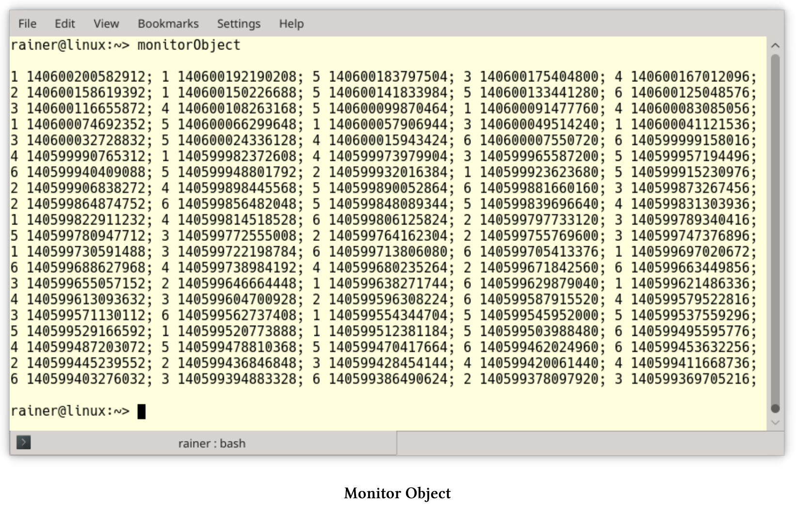

# 監控對象

監控對象模式會同步併發執行，以確保對象只執行一個方法。並且，還允許對象的方法協同調度執行序列。這種模式也稱為線程安全的被動對象模式。

## 模式要求

多個線程同時訪問一個共享對象時，需要滿足以下要求：

1. 併發訪問時，需要保護共享對象不受非同步讀寫操作的影響，以避免數據爭用。
2. 必要的同步是實現的一部分，而不是接口的一部分。
3. 當線程處理完共享對象時，需要發送一個通知，以便下一個線程可以使用共享對象。這種機制有助於避免死鎖，並提高系統的整體性能。
4. 方法執行後，共享對象的不變量必須保持不變。

客戶端(線程)可以訪問監控對象的同步方法。因為監控鎖在任何時間點上，只能運行一個同步方法。每個監控對象都有一個通知等待客戶端的監控條件。

## 組件

監控對象由四個組件組成。


1. 監控對象：支持一個或多個方法。每個客戶端必須通過這些方法訪問對象，每個方法都必須在客戶端線程中運行。
2. 同步方法：監控對象支持同步方法。任何給定的時間點上，只能執行一個方法。線程安全接口有助於區分接口方法(同步方法)和(監控對象的)實現方法。
3.  監控鎖：每個監控對象有一個監控鎖，鎖可以確保在任何時間點上，只有一個客戶端可以訪問監控對象。
4. 監控條件：允許線程在監控對象上進行調度。當前客戶端完成同步方法的調用後，下一個等待的客戶端將被喚醒。

雖然監控鎖可以確保同步方法的獨佔訪問，但是監控條件可以保證客戶端的等待時間最少。實質上，監控鎖可以避免數據競爭，條件監控可以避免死鎖。

## 運行時行為

監控對象及其組件之間的交互具有不同的階段。

* 當客戶端調用監控對象的同步方法時，必須鎖定全局監控鎖。如果客戶端成功訪問，將執行同步方法，並在結束時解鎖。如果客戶端訪問不成功，則阻塞客戶端，進入等待狀態。
* 當客戶端阻塞時，監控對象會在解鎖時，對阻塞的客戶端發送通知。通常，等待是資源友好的休眠，而不是忙等。
* 當客戶端收到通知時，會鎖定監控鎖，並執行同步方法。同步方法結束時解鎖，併發送監控條件的通知，以通知下一個客戶端去執行。

## 優點和缺點

監控對象的優點和缺點是什麼?

* 優點:
  * 同步方法會完全封裝在實現中，所以客戶端不知道監控對象會隱式同步。
  * 同步方法將自動調度監控條件的通知/等待機制，其表現類似一個簡單的調度器。
* 缺點:
  * 功能和同步是強耦合的，所以很難改變同步機制。
  * 當同步方法直接或間接調用同一監控對象時，可能會發生死鎖。

下面的程序段中定義了一個ThreadSafeQueue。

```c++
// monitorObject.cpp

#include <condition_variable>
#include <functional>
#include <queue>
#include <iostream>
#include <mutex>
#include <random>
#include <thread>

template <typename T>
class Monitor {
public:
  void lock() const {
    monitMutex.lock();
  }
  void unlock() const {
    monitMutex.unlock();
  }

  void notify_one() const noexcept {
    monitCond.notify_one();
  }
  void wait() const {
    std::unique_lock<std::recursive_mutex> monitLock(monitMutex);
    monitCond.wait(monitLock);
  }

private:
  mutable std::recursive_mutex monitMutex;
  mutable std::condition_variable_any monitCond;
};

template <typename T>
class ThreadSafeQueue : public Monitor<ThreadSafeQueue<T>> {
public:
  void add(T val) {
    derived.lock();
    myQueue.push(val);
    derived.unlock();
    derived.notify_one();
  }

  T get() {
    derived.lock();
    while (myQueue.empty()) derived.wait();
    auto val = myQueue.front();
    myQueue.pop();
    derived.unlock();
    return val;
  }
private:
  std::queue<T> myQueue;
  ThreadSafeQueue<T>& derived = static_cast<ThreadSafeQueue<T>&>(*this);
};

class Dice {
public:
  int operator()() { return rand(); }
private:
  std::function<int()>rand = std::bind(std::uniform_int_distribution<>(1, 6), 
    std::default_random_engine());
};


int main() {

  std::cout << std::endl;

  constexpr auto NUM = 100;

  ThreadSafeQueue<int> safeQueue;
  auto addLambda = [&safeQueue](int val) {safeQueue.add(val); };
  auto getLambda = [&safeQueue] {std::cout << safeQueue.get() << " "
    << std::this_thread::get_id() << ";";
  };

  std::vector<std::thread> addThreads(NUM);
  Dice dice;
  for (auto& thr : addThreads) thr = std::thread(addLambda, dice());

  std::vector<std::thread> getThreads(NUM);
  for (auto& thr : getThreads) thr = std::thread(getLambda);

  for (auto& thr : addThreads) thr.join();
  for (auto& thr : addThreads) thr.join();

  std::cout << "\n\n";

}
```

該示例的核心思想是，將監控對象封裝在一個類中，這樣就可以重用。監控類使用`std::recursive_mutex`作為監控鎖，`std::condition_variable_any`作為監控條件。與`std::condition_variable`不同，`std::condition_variable_any`能夠接受遞歸互斥。這兩個成員變量都聲明為可變，因此可以在常量方法中使用。監控類提供了監控對象的最小支持接口。

第34 - 55行中的`ThreadSafeQueue`使用線程安全接口擴展了第53行中的`std::queue`。`ThreadSafeQueue`繼承於監控類，並使用父類的方法來支持同步的方法`add`和`get`。方法`add`和`get`使用監控鎖來保護監控對象，特別是非線程安全的`myQueue`。當一個新項添加到`myQueue`時，`add`會通知等待線程，並且這個通知是線程安全的。當如`ThreadSafeQueue`這樣的模板類，將派生類作為基類的模板參數時，這屬於C++的一種習慣性用法，稱為CRTP：`class ThreadSafeQueue: public Monitor<threadsafequeue<T>>`。理解這個習慣的關鍵是第54行：`ThreadSafeQueue<T>& derived = static_cast<threadsafequeue<T>&>(*this)`，該表達式將`this`指針向下轉換為派生類。監控對象`safeQueue`第72行使用(第73行和第74行中的)Lambda函數添加一個數字，或從同步的`safeQueue`中刪除一個數字。`ThreadSafeQueue`本身是一個模板類，可以保存任意類型的值。程序模擬的是100個客戶端向`safeQueue`添加100個介於1 - 6之間的隨機數(第78行)的同時，另外100個客戶端從`safeQueue`中刪除這100個數字。程序會顯示使用的線程的編號和id。



> 奇異遞歸模板模式(CRTP)
>
> 奇異遞歸模板模式，簡單地說，CRTP代表C++中的一種習慣用法，在這種用法中，Derived類派生自類模板Base，因此Base作為Derived模板參數。
>
> ```c++
>template<class T>
> class Base{
>	....
> };
> 
> class Derived : public Base<Derived>{
> 	....
> };
> ```
> 
> 理解CRTP習慣用法的關鍵是，實例化方法是惰性的，只有在需要時才實例化方法。CRTP有兩個主要的用例。
> 
> *  靜態多態性：靜態多態性與動態多態性類似，但與使用虛方法的動態多態性相反，方法調用的分派在編譯時進行。
>* Mixin: Mixin是設計混合代碼類時的一個流行概念。`ThreadSafeQueue`使用Mixin技術來擴展它的接口。通過從`Monitor`類派生`ThreadSafeQueue`，派生類`ThreadSafeQueue`獲得類`Monitor`的所有方法：`ThreadSafeQueue: public Monitor<threadsafequeue<T>>`類。
> 
>[惰性C++：CRTP]( https://www.modernescpp.com/index.php/c-is-still-lazy)一文中，有對CRTP習語有更深入地描述。

活動對象和監控對象在幾個重要的方面類似，但也有不同。這兩種體系結構模式，會同步對共享對象的訪問。活動對象的方法在不同線程中執行，而監控對象的方法則在同一線程中執行。活動對象更好地將其方法調用與執行解耦，因此更容易維護。

## 擴展閱讀

* [Pattern-Oriented Software Architecture: Patterns for Concurrent and Networked Objects](https://www.dre.vanderbilt.edu/~schmidt/POSA/POSA2/)