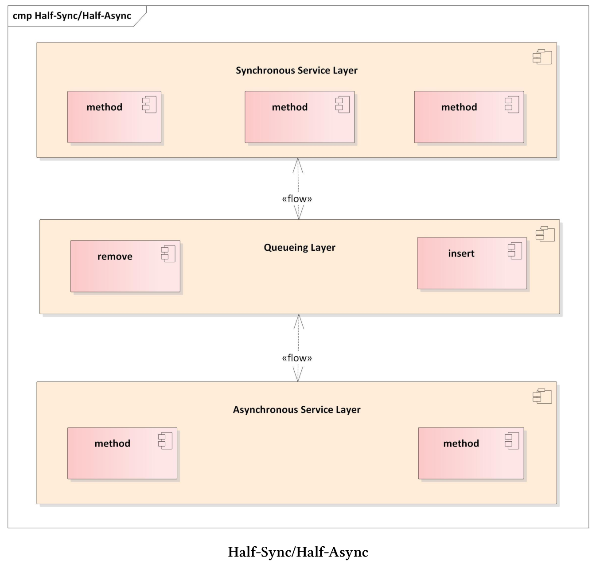

# 半同步/半異步

半同步/半異步模式會對併發系統中異步和同步服務進行解耦，從而在不過度降低性能的情況下簡化編程。該模式引入了兩個可以相互通信的層，一個用於異步，另一個用於同步。



半同步/半異步模式通常用於服務器的事件循環或圖形界面。事件循環的工作流是將事件請求插入隊，並在單獨的線程中同步處理。異步處理確保了運行效率，而同步處理簡化了申請流程。異步服務層和同步服務層分解為兩個層，並且在這兩個層之間有隊列座標。異步層由較底層的系統服務(如中斷)組成，而同步層由較高層的服務(如數據庫查詢或文件操作)組成。異步層和同步層可以通過隊列層相互通信。

## 優點和缺點

半同步/半異步模式的優點和缺點是什麼?

* 優點:
  * 異步和同步分界線很明確。底層系統服務在異步層中處理，高層服務在同步層中處理。
  *  對請求隊列處理的層，保證了異步層和同步層的解耦。
  * 清晰的分離使軟件更容易理解、調試、維護和擴展。
  * 同步服務中的阻塞不會影響異步服務。
* 缺點:
  * 異步層和同步層之間交叉的部分可能會導致開銷。通常，因為異步服務通常在內核空間中運行，同步服務在用戶空間中運行，所以“邊界的部分”會涉及內核空間和用戶空間之間的上下文切換。
  * 為了嚴格分離各層，要求複製數據或數據是不可變的

半同步/半異步模式通常用於事件的多路分解和調度框架，如Reactor或Proactor模式。

## Reactor模式

Reactor模式也稱為調度程序或通知程序。該模式是一個事件驅動的框架，用於將多個服務請求併發地分發到各個服務端。

**使用要求**

服務器應該併發地處理客戶端的請求。每個客戶端的請求都有一個唯一標識符，並支持映射到特定的服務端。以下幾點是Reactor必備的：

* 不阻塞。
* 支持最大吞吐量，避免不必要的上下文切換，避免數據的複製或同步。
* 易於擴展，以支持服務的修改。
* 不使用複雜的同步機制。

**解決方案**

對於支持的服務類型，實現一個事件處理程序來滿足特定客戶端的請求。反應器中使用註冊的方式，將服務端的事件處理程序進行註冊，這裡使用了事件解複用器來同步等待所有傳入的事件。當一個事件到達時，反應器得到通知，並將相應的事件分派給特定的服務。

**組件**


* 句柄:
  * 句柄標識了事件源，如網絡連接、打開文件或GUI事件。
  * 事件源生成連接、讀或寫等事件，這些事件會在句柄上進行排隊。
*  同步事件多路分解器:
  * 同步事件多路分解器會等待一個或多個事件。多路分解器會進行阻塞，直到關聯的句柄能夠處理該事件為止。
* 事件處理接口:
  * 事件處理程序定義了處理特定事件的接口。
  * 事件處理程序定義了應用程序支持的服務。
* 特定事件處理程序：
  * 特定的事件處理實現，由事件處理接口確定。
* 反應器:
  * 反應器支持接口註冊和註銷。
  * 反應器使用同步事件多路分解器，例如系統調用[select](https://en.wikipedia.org/wiki/Select_(Unix)), [epoll](https://en.wikipedia.org/wiki/Epoll)或[WaitForMultipleObjects]( https://docs.microsoft.com/en-us/windows/desktop/api/synchapi/nf-synchapi-waitformultipleobjects)來等待特定事件。
  * 反應器將事件映射到具體處理程序上。
  * 反應器會對事件循環的生命週期進行管理。

反應器(而不是應用程序)等待特定事件，並進行分解和分派。具體的事件處理在反應器中註冊，反應器改變了控制流程。反應器等待特定事件，並調用特定的處理程序。這種控制的倒置，稱為[好萊塢原則](https://en.wikipedia.org/wiki/Inversion_of_control)。(譯者注：“不要給[我們](https://baike.baidu.com/item/我們/2751)打電話，我們會給你打電話(don‘t call us, we‘ll call you)”這是著名的好萊塢原則。)

下面的代碼段顯示了C++框架的事件循環——[自適應通信環境(ACE)]( https://www.dre.vanderbilt.edu/~schmidt/ACE.html)。

```c++
// CTRL c
SignalHandler *mutateTimer1 = new SignalHandler(timerId1);

// CTRL z
SignalHandler *mutateTimer2 = new SignalHandler(timerId2);

ACE_Reactor::instance()->register_handler(SIGINT, mutateTimer1);
ACE_Reactor::instance()->register_handler(SIGTSTP, mutateTimer2);


// "run" the timer.
Timer::instance()->wait_fot_event();
```

第2行和第5行定義按CTRL+c和CTRL+z的鍵盤事件的信號處理程序。第7行和第8行記錄它們，事件循環從第12行開始。

**優點和缺點**

反應器模式的優點和缺點是什麼呢?

* 優點:
  * 框架和應用邏輯解耦。
  * 各種具體處理程序的模塊化。
  * 接口和實現的分離，使服務更容易適應或擴展。
  * 整體結構支持併發。
* 缺點:
  * 需要調用事件分解系統。
  * 長時間運行的程序會阻塞反應器。
  * 反轉控制使得測試和調試更加困難。

半同步/半異步模式通常在反應器模式中，用於在獨立線程中對客戶端請求的響應。

Proactor模式是反應器模式的異步變體。反應器模式同步地分解和分派事件處理程序，而Proactor模式異步地分派事件處理程序。

## Proactor模式

Proactor模式允許事件驅動的應用程序，對異步操作完成時觸發的服務請求進行多路的分解和分派。

**使用要求**

事件驅動程序(如服務器)，其性能可以通過異步處理服務來提高。為了實現這種方式，事件驅動程序必須同步處理多個事件，從而避免昂貴的數據同步或上下文切換。此外，修改後的服務應該很容易集成入系統，應用程序應該避免對多線程和同步方式進行挑戰。

**解決方案**

將服務分為兩部分：異步運行的長時間操作和處理操作結果的程序。結果處理程序與反應器模式中的事件處理程序非常相似，不過異步操作通常是操作系統的工作。所以，作為反應器模式，Proactor模式定義了事件循環。

異步操作(如連接請求)是該模式的獨特之處，並且在不阻塞調用線程的情況下執行操作。當耗時相當長的操作完成時，它將一個完成事件放入完成事件隊列，Proactor通過使用異步事件多路分解器在隊列上等待。異步事件多路分解器將從隊列中刪除完成事件，而Proactor將其分派給特定的處理程序，處理操作的結果。

**組件**

Proactor模式由九個組件組成。


* 句柄:
  * 表示操作系統的實體(如套接字)，可以生成完成事件。
* 異步操作:
  * 通常異步執行耗時相當長的操作。可以在套接字上進行讀或寫操作。
* 異步操作處理器:
  * 執行異步操作，完成後在完成事件隊列上註冊完成事件。
*  完成事件接口:
  * 定義處理異步操作結果的接口。
* 完成事件處理邏輯:
  * 用特定的程序處理異步操作的結果。
* 完成事件隊列:
  * 作為完成事件的緩衝，直到被異步事件分解器移出隊列。
* 異步事件多路分解器:
  * 在完成事件隊列上等待完成事件時，可以阻塞程序。
  * 從完成事件隊列中刪除完成事件。
* Proactor:
  * 調用異步事件分解器對完成事件進行脫隊操作。
  * 分解和分派完成事件，並調用特定的處理程序處理完成事件。
*  創建者:
  * 調用異步操作。
  * 可與異步操作處理器進行交互。

**優點和缺點**

Proactor模式的優點和缺點是什麼呢?

* 優點:
  * 應用程序將獨立的異步功能進行功能性分離。
  * Proactor的接口可用於支持不同操作系統上的多種異步事件分解器。
  * 應用程序不需要啟動新線程，因為耗時相當長的異步操作會在調用者的線程中運行。
  * Proactor模式可以避免上下文的切換。
  * 應用程序的邏輯部分不啟動任何線程，因此不需要同步。
* 缺點:
  * 為了高效地應用Proactor模式，操作系統需要支持異步操作。
  * 由於操作啟動和完成之間在時間和空間上的分離，調試或測試程序相當困難。
  * 異步操作的調用和完成事件的維護需要額外的內存。

> **Asio，即「異步 IO」(Asynchronous Input/Output)**
>
> 隨著[Boost.Asio](https://www.boost.org/doc/libs/1_69_0/doc/html/boost_asio.html)庫可能作為網絡庫成為C++23的一部分，在未來大家可以在C++中輕易實現Proactor模式了。Boost.Asio是由Christopher Kohlhoff的提供，是“一個用於網絡和低級I/O編程的跨平臺C++庫，並使用現代C++為其他開發者提供了一致性異步模型”。

## 擴展閱讀

* [Adaptive Communication Environment (ACE)]( https://en.wikipedia.org/wiki/Adaptive_Communication_Environment)
* [Boost.Asio]( https://www.boost.org/doc/libs/1_69_0/doc/html/boost_asio.html)
* [Pattern-Oriented Software Architecture: Patterns for Concurrent and Networked Objects]( https://www.dre.vanderbilt.edu/~schmidt/POSA/POSA2/)
* [基於 Asio 的 C++ 網絡編程](https://segmentfault.com/a/1190000007225464)

