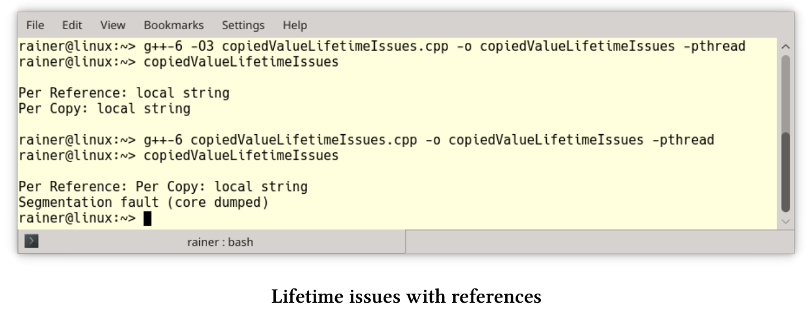

# 處理共享

如果使用不共享數據，就沒有競爭。不共享意味著線程只處理本地變量，可以通過值複製、特定的線程存儲，也可以通過受保護的數據通道將結果傳輸到future來實現。本節中的模式非常直觀，我會給出一些簡單的解釋。

## 值複製

線程通過值複製，而不是引用來獲取參數時，就不需要對任何數據的訪問進行同步，也就沒有數據競爭的條件和數據生命週期的問題。

**使用引用的數據競爭**

下面的程序啟動三個線程：一個線程通過複製獲取參數，另一個線程通過引用獲取參數，最後一個線程通過常量引用獲取參數。

```c++
// copiedValueDataRace.cpp

#include <functional>
#include <iostream>
#include <string>
#include <thread>

using namespace std::chrono_literals;

void byCopy(bool b) {
  std::this_thread::sleep_for(1ms);
  std::cout << "byCopy: " << b << std::endl;
}

void byReference(bool& b) {
  std::this_thread::sleep_for(1ms);
  std::cout << "byReference: " << b << std::endl;
}

void byConstReference(const bool& b) {
  std::this_thread::sleep_for(1ms);
  std::cout << "byConstReference: " << b << std::endl;
}

int main() {

  std::cout << std::boolalpha << std::endl;

  bool shared(false);

  std::thread t1(byCopy, shared);
  std::thread t2(byReference, std::ref(shared));
  std::thread t3(byConstReference, std::cref(shared));

  shared = true;

  t1.join();
  t2.join();
  t3.join();

  std::cout << std::endl;

}
```

每個線程在顯示布爾值之前會休眠1毫秒(第11、16和21行)，其中只有線程`t1`具有布爾值的副本，因此沒有數據競爭。程序顯示線程`t2`和`t3`中的布爾值，而且布爾值在沒有同步的情況下進行修改。


copiedValueDataRace.cpp例子中，我做了一個假設，這個假設對於布爾值來說很簡單，但是對於更復雜的類型來說就不一定了。如果參數是“值對象”，那麼通過複製傳遞參數必然就是無數據競爭。

> **值對象**
>
> “值對象”是一個對象，相等性基於狀態。值對象是不可變的，以便在創建為“相等”的情況下，保持同等的生命週期。如果通過複製將值對象傳遞給線程，則不需要同步訪問。[ValueObject](https://martinfowler.com/bliki/ValueObject.html)源於Martin Fowler的文章，“考慮兩類對象：值對象和引用對象”。

**當引用為拷貝時**

示例copyedValueDataRace.cpp中的線程`t3`可能可以替換為`std::thread t3(byConstReference, shared)`。 該程序可以編譯並運行，但是隻是看起來像是引用而已， 原因是[`std::decay`](https://en.cppreference.com/w/cpp/types/decay)會應用於線程的每個參數。 `std::decay`對類型T的執行是從左值到右值，數組到指針和函數到指針的隱式轉換。這種用例中，對類型T使用的是`[std :: remove_reference]` 。

perConstReference.cpp使用不可複製類型NonCopyableClass。

線程引用參數的"隱式"複製

```c++
// perConstReference.cpp

#include <thread>

class NonCopyableClass {
public:

  // the compiler generated default constructor
  NonCopyableClass() = default;

  // disallow copying
  NonCopyableClass& operator=(const NonCopyableClass&) = delete;
  NonCopyableClass(const NonCopyableClass&) = delete;

};

void perConstReference(const NonCopyableClass& nonCopy){}

int main() {

  NonCopyableClass nonCopy;

  perConstReference(nonCopy);

  std::thread t(perConstReference, nonCopy);
  t.join();
}
```

對象`nonCopy`(第21行)是不可複製的， 如果使用參數`nonCopy`調用函數`perConstReference`則沒什麼問題，因為該函數接受常量引用參數。線程`t`(第25行)中使用相同的函數，會導致GCC 6生成300多行冗長的編譯器錯誤：


因為複製構造函數在NonCopyableClass類中是不可用的，所以錯誤消息的重要部分位於屏幕截圖中間的紅色部分：“錯誤：使用已刪除的功能”。 


**引用參數的生命週期問題**

如果分離通過引用獲取參數的線程，則必須格外小心。 copyValueValueLifetimeIssues.cpp中就有未定義行為。

使用引用引發的生命週期問題

```c++
// copiedValueLifetimeIssues.cpp

#include <iostream>
#include <string>
#include <thread>

void executeTwoThreads() {

  const std::string localString("local string");

  std::thread t1([localString] {
    std::cout << "Per Copy: " << localString << std::endl;
    });

  std::thread t2([&localString] {
    std::cout << "Per Reference: " << localString << std::endl;
    });

  t1.detach();
  t2.detach();
}

using namespace std::chrono_literals;

int main() {

  std::cout << std::endl;

  executeTwoThreads();

  std::this_thread::sleep_for(1s);

  std::cout << std::endl;

}
```

executeTwoThreads(第7 - 21行)啟動了兩個線程，且兩個線程都被分離(第19行和第20行)，並且線程在執行時會打印局部變量`localString`(第9行)。第一個線程通過複製捕獲局部變量，第二個線程通過引用捕獲局部變量。為了讓程序看起來簡單，我使用Lambda函數來綁定參數。

因為executeTwoThreads函數不會等待兩個線程完成，所以線程`t2`引用本地字符串，而該字符串與函數的生命週期綁定，這就會導致未定義行為的發生。奇怪的是，在GCC 6中以最大優化`-O3`編譯連接的可執行文件似乎可以工作，而非優化的可執行文件卻崩潰了。



**擴展閱讀**

* [Pattern-Oriented Software Architecture: A Pattern Language for Distributed Computing](http://www.dre.vanderbilt.edu/~schmidt/POSA/POSA4/)

## 線程特定的存儲器

線程的本地存儲，允許多個線程通過全局訪問使用本地存儲。通過使用存儲說明符`thread_local`，變量變成了線程的局部變量。這意味著，可以在不同步的情況下，使用線程局部變量。

下面是一個典型的用例。假設想要計算一個向量`randValues`的元素和，使用for循環執行此任務非常簡單。

```c++
// calculateWithLoop.cpp
...
unsigned long long sum = {};
for (auto n: randValues) sum += n;
```

不過，電腦有四個核心，也可以使串行程序變成一個併發程序。

```c++
// threadLocalSummation.cpp
...
thread_local unsigned long long tmpSum = 0;
void sumUp(std::atomic<unsigned long long>& sum, const std::vector<int>& val,
unsigned long long beg, unsigned long long end){
for (auto i = beg; i < end; ++i){
tmpSum += val[i];
}
sum.fetch_add(tmpSum, std::memory_order_relaxed);
}
...
std::atomic<unsigned long long> sum{};
std::thread t1(sumUp, std::ref(sum), std::ref(randValues), 0, fir);
std::thread t2(sumUp, std::ref(sum), std::ref(randValues), fir, sec);
std::thread t3(sumUp, std::ref(sum), std::ref(randValues), sec, thi);
std::thread t4(sumUp, std::ref(sum), std::ref(randValues), thi, fou);
```

將for循環放入函數中，讓每個線程計算線程局部變量`tmpSum`中總和的四分之一。`sum.fetch_add(tmpSum, std::memory_order_relaxed)`最後以原子的方式彙總所有值。

> **使用標準模板庫的算法**
>
> 如果有算法標準模板庫可以做這項工作，就用不著循環了。本例中，[std::accumulate](https://en.cppreference.com/w/cpp/algorithm/accumulate)就可以完成這項工作，以彙總向量加和：`sum = std::accumulate(randValues.begin(), randValues.end(), 0) `。在C++17中，可以使用`std::accumulate`的並行版本`std::reduce`：`sum = std::reduce(std::execution::par, randValues.begin(), randValues.end(), 0)`。

**擴展閱讀**

* [ValueObject](https://martinfowler.com/bliki/ValueObject.html)
* [Pattern-Oriented Software Architecture: Patterns for Concurrent and Networked Objects](https://www.dre.vanderbilt.edu/~schmidt/POSA/POSA2/)

## Future

C++11提供了三種類型的future和promise：`std::async`、`std::packaged_task`和`std::promise`與`std::future`對。promise這個詞可以追溯到70年代。future是可寫promise設置的只讀佔位符。從同步的角度來看，promise/future對的關鍵屬性是兩者都由受保護的數據通道進行連接。

實現future時需要做出一些決策：

* future可以通過get調用隱式或顯式地獲取值。
* future可以積極地或消極地啟動計算，只有`std::async`可以通過啟動策略控制是否支持延遲計算。

```c++
auto lazyOrEager = std::async([]{ return "LazyOrEager"; });
auto lazy = std::async(std::launch::deferred, []{ return "Lazy"; });
auto eager = std::async(std::launch::async, []{ return "Eager"; });

lazyOrEager.get();
lazy.get();
eager.get();
```

如果沒有指定啟動策略，則由系統決定是立即啟動還是延遲啟動。通過使用啟動策略`std::launch::async`，創建一個新線程，promise會立即開始它的工作。這與啟動策略`std::launch::async`不同，`eager.get()`會啟動promise，而promise是在創建線程中執行的。

* 如果promise的值不可用，則future阻塞或拋出異常。C++11阻塞了wait或get，也可以等待promise的超時(`wait_for`和`wait_until`)。
* 有多種方法實現future：[協程](https://en.wikipedia.org/wiki/Coroutine)、[生成器]( https://en.wikipedia.org/wiki/Generator_(computer_programming))或[通道](https://en.wikipedia.org/wiki/Channel_(programming))。

**擴展閱讀**

* [Futures and promises](https://en.wikipedia.org/wiki/Futures_and_promises)