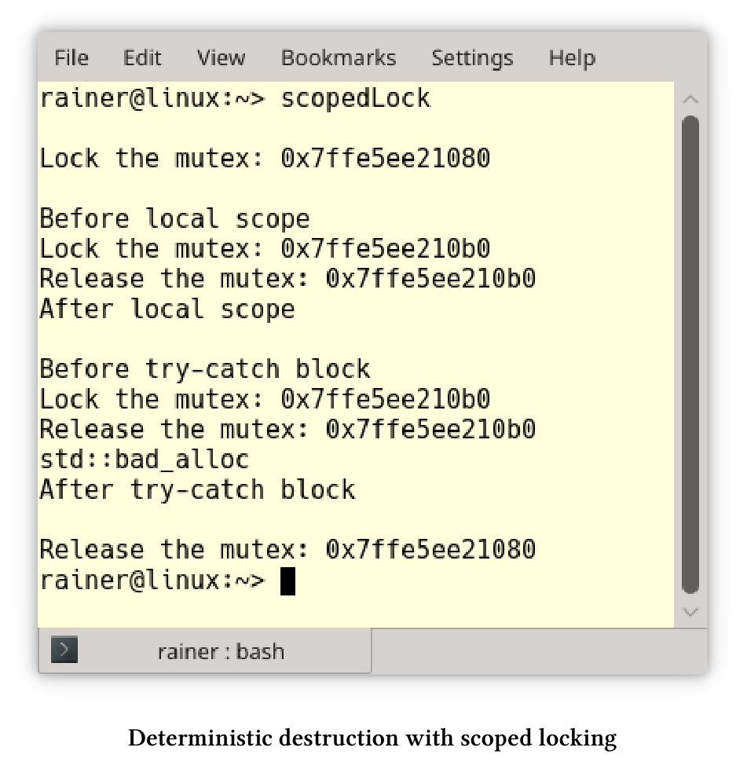
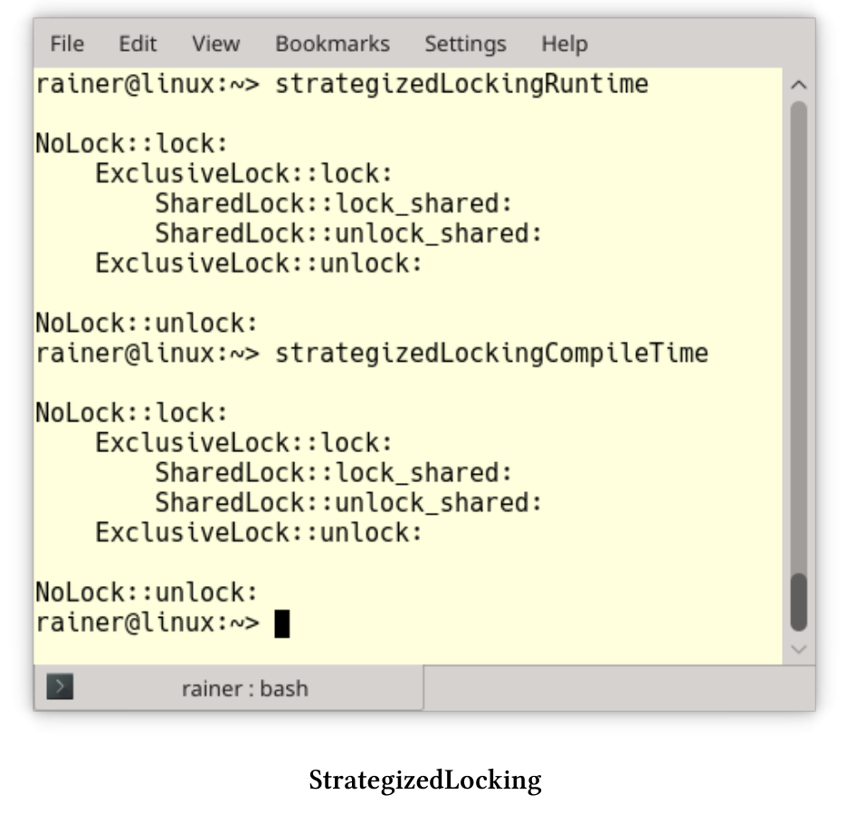

# 處理突變

如果不同時讀寫數據，就沒有數據競爭，最簡單的方法是使用不可變值。除此之外，還有兩種典型的策略。首先，用鎖來保護臨界區，例如：範圍鎖或策略鎖。在面向對象設計中，關鍵部分的通常是對象(包括它的接口)，線程安全的接口會保護整個對象。其次，修改線程只是在工作完成時發出信號，這就是*保護性暫掛*模式。

## 範圍鎖

範圍鎖是將RAII(資源獲取即初始化)應用於互斥鎖，這個用法的關鍵思想是將資源獲取和釋放綁定到對象的生存期。顧名思義，對象的生命週期範圍是確定的。這裡的範圍意味著，C++運行時會負責調用對象的析構函數，從而釋放資源。

ScopedLock類實現了範圍鎖。

```c++
// scopedLock.cpp

#include <iostream>
#include <mutex>
#include <new>
#include <string>
#include <utility>

class ScopedLock{
private:
  std::mutex& mut;
public:
	explicit ScopedLock(std::mutex& m) :mut(m) {
		mut.lock();
		std::cout << "Lock the mutex: " << &mut << std::endl;
	}
	~ScopedLock() {
		std::cout << "Release the mutex: " << &mut << std::endl;
		mut.unlock();
	}
};

int main() {

	std::cout << std::endl;

	std::mutex mutex1;
	ScopedLock scopedLock1{ mutex1 };

	std::cout << "\nBefore local scope" << std::endl;
	{
		std::mutex mutex2;
		ScopedLock scopedLock2{ mutex2 };
	}
	std::cout << "After local scope" << std::endl;

	std::cout << "\nBefore try-catch block" << std::endl;
	try {
		std::mutex mutex3;
		ScopedLock scopedLoack3{ mutex3 };
		throw std::bad_alloc();
	}
	catch (std::bad_alloc& e) {
		std::cout << e.what();
	}
	std::cout << "\nAfter try-catch block" << std::endl;

	std::cout << std::endl;

}
```

ScopedLock通過引用的方式獲取互斥對象(第13行)。互斥量在構造函數(第15行)中鎖定，在析構函數(第19行)中進行解鎖。由於RAII的使用習慣，對象在銷燬時，會自動對互斥量進行解鎖。



`scopedLock1`的作用域在主函數體中。因此，`mutex1`最後才解鎖，`mutex2`(第34行)和`mutex3`(第42行)也是同理。對於`mutex3`而言，如果觸發異常，也會調用`scopedLock3`的析構函數。有趣的是，`mutex3`重用了`mutex2`的內存，因為兩者的地址相同。

C++17支持四種類型的鎖：`std::lock_guard`/`std::scoped_lock`用於簡單場景，`std::unique_lock`/`std::shared_lock`用於高級場景，可以在關於鎖的章節中瞭解更多的細節。

**拓展閱讀**

* [Pattern-Oriented Software Architecture: Patterns for Concurrent and Networked Objects]( https://www.dre.vanderbilt.edu/~schmidt/POSA/POSA2/)

## 策略鎖

編寫代碼庫時，這個庫可用於各種領域，包括併發。為了安全起見，要用鎖來保護關鍵部分。倘若庫在單線程環境中運行，因為實現使用了重量級同步機制，則會存在性能問題。那麼，現在就輪到策略鎖登場了。

策略鎖是將策略模式的思想應用於鎖。這意味著，會將鎖定策略放到實例對象中，並使其成為一個可熱插拔的組件。那麼，什麼是策略模式呢?

**Strategy Pattern**


策略模式是[《設計模式：可重用的面向對象軟件元素》]( https://en.wikipedia.org/wiki/Design_Patterns)一書中經典的行為模式之一。其關鍵思想是定義一系列算法，將它們封裝在一個對象中，從而使其成為可熱插拔的組件。

策略模式

```c++
// strategy.cpp

#include <iostream>
#include <memory>

class Strategy {
public:
  virtual void operator()() = 0;
  virtual ~Strategy() = default;
};

class Context {
  std::shared_ptr<Strategy> _start;
public:
  explicit Context() : _start(nullptr) {}
  void setStrategy(std::shared_ptr<Strategy> start) { _start = start; }
  void strategy() { if (_start)(*_start)(); }
};

class Strategy1 :public Strategy {
  void operator()() override {
    std::cout << "Foo" << std::endl;
  }
};

class Strategy2 : public Strategy {
  void operator()() override {
    std::cout << "Bar" << std::endl;
  }
};

class Strategy3 :public Strategy {
  void operator()() override {
    std::cout << "FooBar" << std::endl;
  }
};

int main() {

  std::cout << std::endl;

  Context con;

  con.setStrategy(std::shared_ptr<Strategy>(new Strategy1));
  con.strategy();

  con.setStrategy(std::shared_ptr<Strategy>(new Strategy2));
  con.strategy();

  con.setStrategy(std::shared_ptr<Strategy>(new Strategy3));
  con.strategy();

  std::cout << std::endl;

}
```

第6至10行中的抽象類`Strategy`定義了策略。每個特定的策略，如`Strategy1`(第20行)、`Strategy2`(第26行)或`Strategy3`(第32行)，都必須支持函數調用操作符(第8行)。使用者在`Context`中集合了各種策略，在第16行設置特定的策略，並在第17行執行它。因為`Context`通過一個指向`Strategy`類的指針來執行，所以`Strategy1`、`Strategy2`和`Strategy3`的執行方法是私有的。


**具體實現**

實現策略鎖有兩種經典的方法：運行時多態性(面向對象)和編譯時多態性(模板)。兩種方式各有利弊。

*  優點：
  * 運行時多態
    * 允許在運行時配置策略鎖。
    * 瞭解有面向對象的開發人員，更容易理解。
  * 編譯時多態
    * 無抽象的懲罰。
    * 扁平的層次結構。
* 缺點：
  *  運行時多態
    * 額外需要一個指針。
    * 可能有很深的派生層次。
  * 編譯時多態
    * 出錯時會有非常詳細的信息。

討論了理論之後，我在兩個程序中實現了策略鎖。示例中，策略鎖可支持無鎖、獨佔鎖和共享鎖。簡單起見，我在內部使用了互斥鎖。此外，策略鎖的模型也限定了其鎖定的範圍。

**運行時多態**

strategizedLockingRuntime.cpp程序中展示了三種互斥鎖。

運行時的多態性策略鎖

```c++
// strategizedLockingRuntime.cpp

#include <iostream>
#include <mutex>
#include <shared_mutex>

class Lock {
public:
  virtual void lock() const = 0;
  virtual void unlock() const = 0;
};

class StrategizedLocking {
  Lock& lock;
public:
  StrategizedLocking(Lock& l) :lock(l) {
    lock.lock();
  }
  ~StrategizedLocking() {
    lock.unlock();
  }
};

struct NullObjectMutex {
  void lock() {};
  void unlock() {};
};

class NoLock :public Lock {
  void lock() const override {
    std::cout << "NoLock::lock: " << std::endl;
    nullObjectMutex.lock();
  }
  void unlock() const override {
    std::cout << "NoLock::unlock: " << std::endl;
    nullObjectMutex.unlock();
  }
  mutable NullObjectMutex nullObjectMutex;
};

class ExclusiveLock : public Lock {
  void lock() const override {
    std::cout << "  ExclusiveLock::lock: " << std::endl;
    mutex.lock();
  }
  void unlock() const override {
    std::cout << "  ExclusiveLock::unlock: " << std::endl;
    mutex.unlock();
  }
  mutable std::mutex mutex;
};

class SharedLock : public Lock {
  void lock() const override {
    std::cout << " SharedLock::lock_shared: " << std::endl;
    sharedMutex.lock_shared();
  }
  void unlock() const override {
    std::cout << " SharedLock::unlock_shared: " << std::endl;
    sharedMutex.unlock_shared();
  }
  mutable std::shared_mutex sharedMutex;
};

int main() {

  std::cout << std::endl;

  NoLock noLock;
  StrategizedLocking stratLock1{ noLock };

  {
    ExclusiveLock exLock;
    StrategizedLocking stratLock2{ exLock };
    {
      SharedLock sharLock;
      StrategizedLocking startLock3{ sharLock };
    }
  }

  std::cout << std::endl;

}
```

`StrategizedLocking`類中有一把鎖(第14行)。`StrategizedLocking`模型是範圍鎖，因此在構造函數(第16行)中進行鎖定，在析構函數(第19行)中進行解鎖。`Lock`(第7 - 11行)是一個抽象類，定義了所有接口。派生類分別是`NoLock` (第29行)、`ExclusiveLock`(第41行)和`SharedLock`(第53行)。`SharedLock`在`std::shared_mutex`上可使用`lock_shared`(第56行)和`unlock_shared`進行鎖定和解鎖。每個鎖持有一個互斥對象`NullObjectMutex`(第38行)、`std::mutex`(第50行)或`std::shared_mutex`(第62行)。其實，`NullObjectMutex`就是一個無操作的佔位符。互斥對象聲明為可變，就意味著可以用在常量方法中使用，比如：lock和unlock中。

> **空對象**
>
> 類NullObjectMutex是[空對象模式](https://en.wikipedia.org/wiki/Null_object_pattern)的一個例子，由空方法組成，算是一個佔位符，這樣便於優化器可以將它完全刪除。

**編譯時多態**

基於模板的實現與基於面向對象的實現非常相似。

編譯時多態性策略鎖

```c++
// StrategizedLockingCompileTime.cpp

#include <iostream>
#include <mutex>
#include <shared_mutex>


template <typename LOCK>
class StrategizedLocking {
  LOCK& lock;
public:
  StrategizedLocking(LOCK& l) :lock(l) {
    lock.lock();
  }
  ~StrategizedLocking() {
    lock.unlock();
  }
};

struct NullObjectMutex {
  void lock() {};
  void unlock() {};
};

class NoLock {
public:
  void lock() const {
    std::cout << "NoLock::lock: " << std::endl;
    nullObjectMutex.lock();
  }
  void unlock() const {
    std::cout << "NoLock::unlock: " << std::endl;
    nullObjectMutex.unlock();
  }
  mutable NullObjectMutex nullObjectMutex;
};

class ExclusiveLock {
public:
  void lock() const {
    std::cout << "  ExclusiveLock::lock: " << std::endl;
    mutex.lock();
  }
  void unlock() const {
    std::cout << "  ExclusiveLock::unlock: " << std::endl;
    mutex.unlock();
  }
  mutable std::mutex mutex;
};

class SharedLock {
public:
  void lock() const {
    std::cout << " SharedLock::lock_shared: " << std::endl;
    sharedMutex.lock_shared();
  }
  void unlock() const {
    std::cout << " SharedLock::unlock_shared: " << std::endl;
    sharedMutex.unlock_shared();
  }
  mutable std::shared_mutex sharedMutex;
};

int main() {

  std::cout << std::endl;

  NoLock noLock;
  StrategizedLocking stratLock1{ noLock };

  {
    ExclusiveLock exLock;
    StrategizedLocking stratLock2{ exLock };
    {
      SharedLock sharLock;
      StrategizedLocking startLock3{ sharLock };
    }
  }

  std::cout << std::endl;

}
```

這次`NoLock`(第25行)、`ExclusiveLock`(第38行)和`SharedLock`(第51行)沒有抽象的基類了。結果`StrategizedLocking`可以用不支持相應接口的對象進行實例化，而這將導致編譯時錯誤。C++20中，可以使用`Lockable : template <Lockable Lock> class StrategizedLocking`代替`template <typename Lock> class StrategizedLocking`。這意味著所有使用的鎖必須支持Lockable[概念](https://en.cppreference.com/w/cpp/language/constraints)。概念需要命名，並且[Lockable](https://en.cppreference.com/w/cpp/named_req)已經在C++20中定義了。如果沒有滿足此要求，則編譯將失敗，並出現簡單易懂的錯誤消息。

兩個程序會生成相同的輸出:



**拓展閱讀**

* [Design Patterns: Elements of Reusable Object-Oriented Software]( https://en.wikipedia.org/wiki/Design_Patterns)
* [Strategy Pattern](https://en.wikipedia.org/wiki/Strategy_pattern)
* [Null Object Pattern](https://en.wikipedia.org/wiki/Null_object_pattern)
* [Pattern-Oriented Software Architecture: Patterns for Concurrent and Networked Objects](https://www.dre.vanderbilt.edu/~schmidt/POSA/POSA2/)

## 線程安全的接口

當程序的關鍵部分只是一個對象時，那麼使用線程安全的接口就在合適不過了。用鎖可能會導致性能問題，甚至會導致死鎖。下面的偽代碼可以清楚地闡明我的觀點。

```c++
struct Critical{
  void method1(){
    lock(mut);
    method2();
    ...
  }
  void method2(){
    lock(mut);
    ...
  }
  mutex mut;
};

Critical crit;
crit.method1();
```

使用`crit.method1`會使互斥鎖鎖定兩次。為了簡單起見，這個鎖是一個範圍鎖。當然，這裡還有兩個問題：

1. 當`lock`是遞歸鎖時，`method2`中的第二個`lock(mut)`是多餘的。
2.  當`lock`不是遞歸鎖時，`method2`中的第二個`lock(mut)`會導致未定義行為。大多數情況下，會出現死鎖。

線程安全的接口可以避免這兩個問題，因為：

* 所有(public)接口都應該使用鎖。
* 所有(保護的和私有的)方法都不使用鎖。
* 接口只能使用保護的方法或私有方法調用，而公共方法則不能調用。

threadSafeInterface.cpp程序顯示了其用法。

```c++
// threadSafeInterface.cpp

#include <iostream>
#include <mutex>
#include <shared_mutex>

class Critical {

public:
  void interface1() const {
    std::lock_guard<std::mutex> lockGuard(mut);
    implementation1();
  }
  void interface2() {
    std::lock_guard<std::mutex> lockGuard(mut);
    implementation2();
    implementation3();
    implementation1();
  }
private:
  void implementation1() const {
    std::cout << "implementation1: "
      << std::this_thread::get_id() << std::endl;
  }
  void implementation2() const {
    std::cout << "  implementation2: "
      << std::this_thread::get_id() << std::endl;
  }
  void implementation3() const {
    std::cout << "   implementation3: "
      << std::this_thread::get_id() << std::endl;
  }


  mutable std::mutex mut;

};

int main() {

  std::cout << std::endl;

  std::thread t1([] {
    const Critical crit;
    crit.interface1();
    });

  std::thread t2([] {
    Critical crit;
    crit.interface2();
    crit.interface1();
    });


  Critical crit;
  crit.interface1();
  crit.interface2();

  t1.join();
  t2.join();

  std::cout << std::endl;

}
```

包括主線程在內的三個線程都使用了Critical實例。由於線程安全的接口，所有對公開API的調用都是同步的。第35行中的互斥對象是可變的，因此可以在const方法`implementation1`中使用。

線程安全的接口有三個好處：

1. 互斥鎖不可能遞歸調用。在C++中，對非遞歸互斥對象的遞歸調用會導致未定義行為，通常都會死鎖。
2. 該程序使用最小範圍的鎖定，因此同步的代價最小。僅在關鍵類的公共或私有方法中使用`std::recursive_mutex`將產生重量級的同步，從而遭受性能懲罰。
3. 從用戶的角度來看，`Critical`很容易使用，而同步只是實現的一個細節而已。

三個線程交錯的輸出：


儘管線程安全的接口看起來很容易實現，但是也需要留意兩個風險點。

**風險**

類中使用靜態成員和使用虛接口時，需要特別小心。

**靜態成員**

當類有靜態成員時，就必須同步該類實例上的所有成員函數。

```c++
class Critical {

public:
  void interface1() const {
    std::lock_guard<std::mutex> lockGuard(mut);
    implementation1();
  }
  void interface2() {
    std::lock_guard<std::mutex> lockGuard(mut);
    implementation2();
    implementation3();
    implementation1();
  }
  
private:
  void implementation1() const {
    std::cout << "implementation1: "
      << std::this_thread::get_id() << std::endl;
    ++called;
  }
  void implementation2() const {
    std::cout << "  implementation2: "
      << std::this_thread::get_id() << std::endl;
    ++called;
  }
  void implementation3() const {
    std::cout << "   implementation3: "
      << std::this_thread::get_id() << std::endl;
    ++called;
  }

  inline static int called{ 0 };
  inline static std::mutex mut;

};
```

`Critical`類使用了靜態成員(第32行)來計算調用成員函數的頻率。`Critical`的所有實例，都使用同一個靜態成員，因此必須同步。本例中，臨界區為`Critical`的所有實例。

> 內聯靜態成員
>
> C++17中，靜態數據成員可以聲明為內聯。可以在類中定義，以及初始化內聯靜態數據成員。
>
> ```c++
> struct X
> {
>   	inline static int n = 1;
> }
> ```
>

**虛接口**

當重寫虛接口函數時，即使重寫的函數是私有的，也應該有鎖。

```c++
// threadSafeInterfaceVirtual.cpp

#include <iostream>
#include <mutex>
#include <thread>

class Base {

public:
  virtual void interface() {
    std::lock_guard<std::mutex> lockGuard(mut);
    std::cout << "Base with lock" << std::endl;
  }
private:
  std::mutex mut;
};

class Derived : public Base {

  void interface() override {
    std::cout << "Derived without lock" << std::endl;
  };

};

int main() {

  std::cout << std::endl;

  Base* base1 = new Derived;
  base1->interface();

  Derived der;
  Base& base2 = der;
  base2.interface();

  std::cout << std::endl;

}
```

`base1->interface`和`base2.interface`中，`base1`和`base2`是靜態類型是`Base`，因此`interface`是一個公開接口。由於接口方法是虛函數，因此在運行時使用派生的動態類型Derived進行。最後，調用派生類Derived的私有接口。


有兩種方法可以避免風險：

1. 使接口成為非虛接口，這種技術稱為[NVI(非虛擬接口)](https://en.wikibooks.org/wiki/More_C%2B%2B_Idioms/Non-Virtual_Interface)。
2. 將接口聲明為`final`: `virtual void interface() final;`。

**擴展閱讀**

* [Pattern-Oriented Software Architecture: Patterns for Concurrent and Networked Objects](https://www.dre.vanderbilt.edu/~schmidt/POSA/POSA2/)

## 保護性暫掛模式

鎖和一些先決條件的組合，是構成保護性暫掛模式的基礎件。如果未滿足先決條件，則線程將自己置為休眠狀態。為了避免數據競爭或死鎖，檢查線程時會使用鎖。

現在，來看看各種情況:

* 處於等待狀態的線程，會根據通知更改狀態，也可以主動請求更改狀態。我把這稱為“推拉原則”。
* 等待可以有時限，也可以沒有時限。
* 可以將通知發送給一個或所有正在等待的線程。

**推拉原則**

先來說說推原則。

**推原則**

大多數情況下，使用條件變量或future/promise來進行線程同步。條件變量或promise將通知發送到正在等待的線程。promise沒有`notify_one`或`notify_all`方法，而空的`set_value`調用通常用於模擬通知。下面的程序段展示發送通知的線程和等待的線程。

*  條件變量

```c++
void waitingForWork(){
  std::cout << "Worker: Waiting for work." << std::endl;
  std::unique_lock<std::mutex> lck(mutex_);
  condVar.wait(lck, []{ return dataReady; });
  doTheWork();
  std::cout << "Work done." << std::endl;
}

void setDataReady(){
  {
    std::lock_guard<std::mutex> lck(mutex_);
    dataReady = true;
  }
  std::cout << "Sender: Data is ready." << std::endl;
  condVar.notify_one();
}
```

* future/promise

```c++
void waitingForWork(std::future<void>&& fut){
  std::cout << "Worker: Waiting for work." << std::endl;
  fut.wait();
  doTheWork();
  std::cout << "Work done." << std::endl;
}
void setDataReady(std::promise<void>&& prom){
  std::cout << "Sender: Data is ready." << std::endl;
  prom.set_value();
}
```

**拉原則**

線程也可以主動地要求改變狀態，而不是被動地等待狀態改變。C++中並不支持“拉原則”，但可以用原子變量來實現。

```c++
std::vector<int> mySharedWork;
std::mutex mutex_;
std::condition_variable condVar;

bool dataReady{false};

void waitingForWork(){
  std::cout << "Waiting " << std::endl;
  std::unique_lock<std::mutex> lck(mutex_);
  condVar.wait(lck, []{ return dataReady; });
  mySharedWork[1] = 2;
  std::cout << "Work done " << std::endl;
}

void setDataReady(){
  mySharedWork = {1, 0, 3};
  {
    std::lock_guard<std::mutex> lck(mutex_);
    dataReady = true;
  }
  std::cout << "Data prepared" << std::endl;
  condVar.notify_one();
}
```

**有或無時限的等待**

條件變量和future有三個用於等待的方法:`wait`、`wait_for`和`wait_until`。`wait_for`需要一個時間段，`wait_until`需要一個時間點。

各種等待策略中，消費者線程等待時間為`steady_clock::now() + dur`。如果promise已經準備好了，就會獲取值；如果沒準備好，則只顯示其id: `this_thread::get_it()`。

```c++
void producer(promise<int>&& prom){
  cout << "PRODUCING THE VALUE 2011\n\n";
  this_thread::sleep_for(seconds(5));
  prom.set_value(2011);
}

void consumer(shared_future<int> fut,
steady_clock::duration dur){
  const auto start = steady_clock::now();
  future_status status= fut.wait_until(steady_clock::now() + dur);
  if ( status == future_status::ready ){
    lock_guard<mutex> lockCout(coutMutex);
    cout << this_thread::get_id() << " ready => Result: " << fut.get()
    << endl;
  }
  else{
    lock_guard<mutex> lockCout(coutMutex);
    cout << this_thread::get_id() << " stopped waiting." << endl;
  }
  const auto end= steady_clock::now();
  lock_guard<mutex> lockCout(coutMutex);
  cout << this_thread::get_id() << " waiting time: "
  		 << getDifference(start,end) << " ms" << endl;
}
```

**通知一個或所有等待線程**

`notify_one`可以喚醒一個等待的線程，`notify_all`可以喚醒所有等待的線程。使用`notify_one`時，不能確定哪一個線程會被喚醒，而其他條件變量則保持在等待狀態。因為future和promise之間存在關聯性，所以這種情況在`std::future`中是不可能發生的。如果想模擬一對多的關係，那麼應該使用`std::shared_future`而不是`std::future`，因為`std::shared_future`是可以複製的。

下面的程序顯示了一個簡單的工作流，promise和future之間是一對一/一對多的關係。

```c++
// bossWorker.cpp

#include <future>
#include <chrono>
#include <iostream>
#include <random>
#include <string>
#include <thread>
#include <utility>

int getRandomTime(int start, int end) {

  std::random_device seed;
  std::mt19937 engine(seed());
  std::uniform_int_distribution<int> dist(start, end);

  return dist(engine);
}

class Worker {
public:
  explicit Worker(const std::string& n) :name(n) {}

  void operator()(std::promise<void>&& prepareWork,
    std::shared_future<void> boss2Worker) {

    // prepare the work and notify the boss
    int prepareTime = getRandomTime(500, 2000);
    std::this_thread::sleep_for(std::chrono::microseconds(prepareTime));
    prepareWork.set_value();
    std::cout << name << ": " << "Work prepared after "
      << prepareTime << " milliseconds." << std::endl;

    // still waiting for the permission to start working
    boss2Worker.wait();
  }
private:
  std::string name;
};

int main() {

  std::cout << std::endl;

  // define the std::promise = > Instruction from the boss
  std::promise<void> startWorkPromise;

  // get the std::shared_future's from the std::promise
  std::shared_future<void> startWorkFuture = startWorkPromise.get_future();

  std::promise<void> herbPrepared;
  std::future<void> waitForHerb = herbPrepared.get_future();
  Worker herb(" Herb");
  std::thread herbWork(herb, std::move(herbPrepared), startWorkFuture);

  std::promise<void> scottPrepared;
  std::future<void> waitForScott = scottPrepared.get_future();
  Worker scott(" Scott");
  std::thread scottWork(scott, std::move(scottPrepared), startWorkFuture);

  std::promise<void> bjarnePrepared;
  std::future<void> waitForBjarne = bjarnePrepared.get_future();
  Worker bjarne(" Bjarne");
  std::thread bjarneWork(bjarne, std::move(bjarnePrepared), startWorkFuture);

  std::cout << "BOSS: PREPARE YOUR WORK.\n " << std::endl;

  // waiting for the worker
  waitForHerb.wait(), waitForScott.wait(), waitForBjarne.wait();

  // notify the workers that they should begin to work
  std::cout << "\nBOSS: START YOUR WORK. \n" << std::endl;
  startWorkPromise.set_value();

  herbWork.join();
  scottWork.join();
  bjarneWork.join();

}
```

該程序的關鍵思想是boss(主線程)有三個員工：herb(第53行)、scott(第58行)和bjarne(第63行)，每個worker由一個線程表示。老闆在第64行等待，直到所有的員工完成工作。這意味著，每個員工在任務下發後的任意時間點，都可以向老闆發送完成通知。因為會轉到`std::future`，所以員工到老闆的通知是一對一的(第30行)。而從老闆到員工的工作指令，則是一對多的通知(第73行)。對於這個一對多的通知，需要使用`std::shared_future`。


**擴展閱讀**

* [Concurrent Programming in Java: Design Principles and Patterns (Doug Lea)](http://gee.cs.oswego.edu/dl/cpj/)