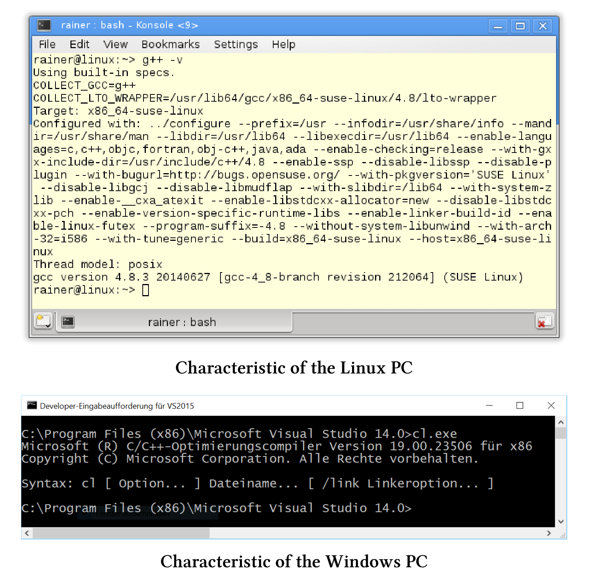

# 案例研究

瞭解了內存模型和多線程接口後，現在就要進行實踐了，本章會提供一些性能數據作為參考。

> **電腦配置參考**
>
> 我用Linux桌面版(GCC 4.8.3)和Windows筆記本電腦(cl.exe 19.00.23506)對程序的性能進行測試，使用優化的64位可執行文件進行測試。Linux PC有四個核心，而Windows PC有兩個核心。下面是這兩個編譯器的詳細信息：
>
> 

讀者們應該只將這裡的性能數值作為參考。我更喜歡憑直覺判斷哪些算法可行，哪些算法不可行，但對Linux和Windows操作系統支持算法的確切數目不感興趣。我想知道一些算法在不同的操作系統下，是否會有不同的性能表現(譯者注：這裡作者主要想比較操作系統中的實現，而不是對機器硬件進行比較)。

