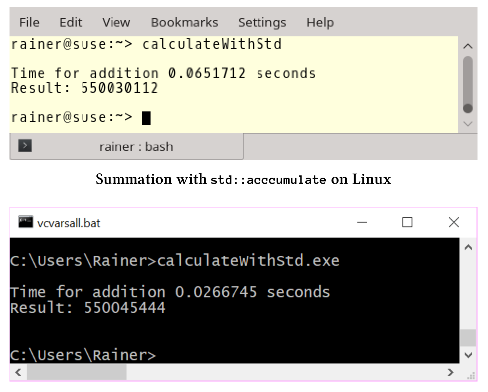
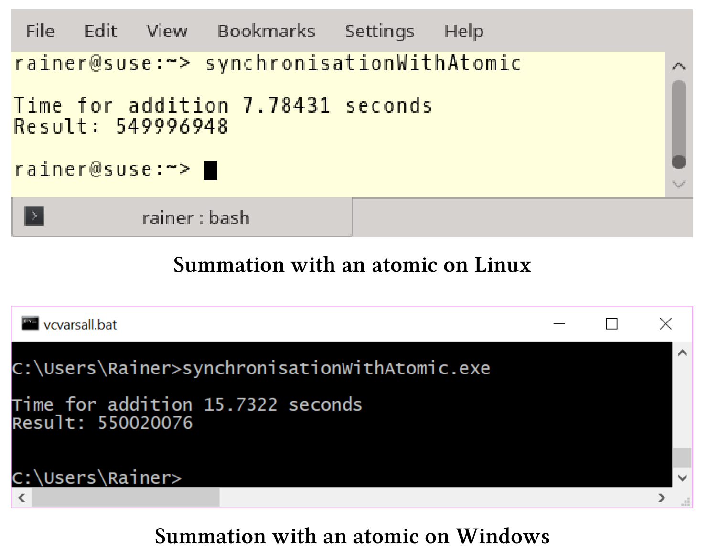
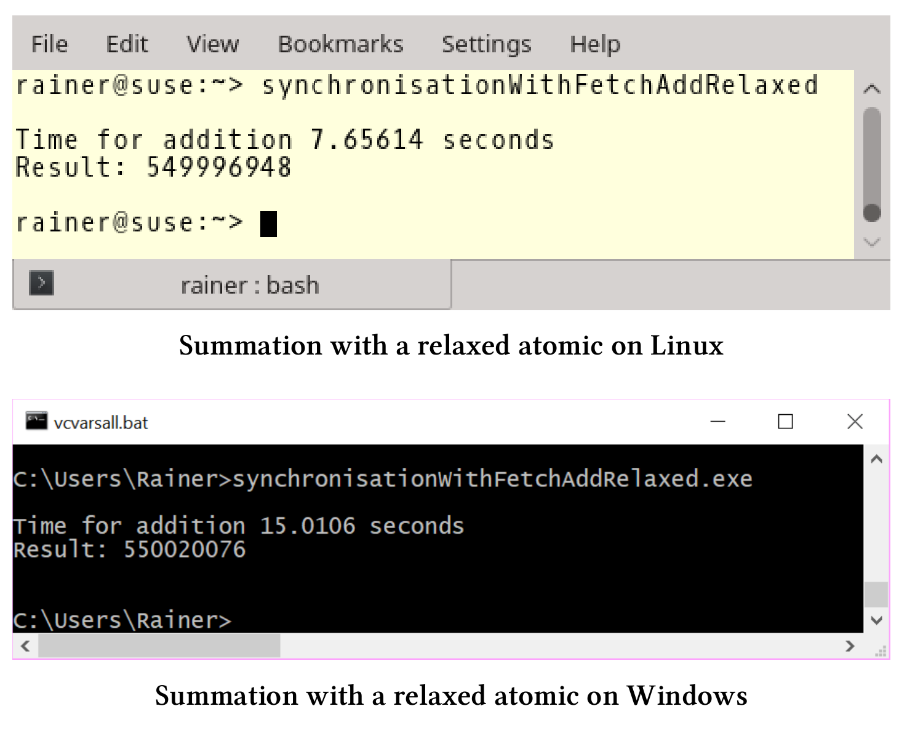
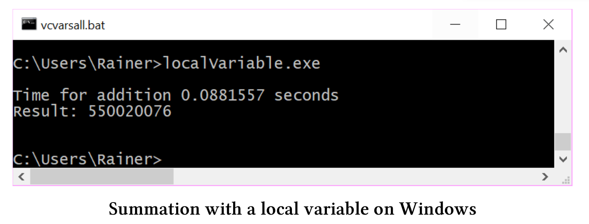

# 求向量元素的加和

向`std::vector`中添加元素最快的方法是哪種？為了得到答案，我準備向`std::vector`中填充了一億個數值，這些數在1~10之間[均勻分佈](https://en.wikipedia.org/wiki/Uniform_distribution_(continuous)) 。我們的任務是用各種方法計算這些數字的和，並添加執行時間作為性能指標。本節將討論原子、鎖、線程本地數據和任務。

## 單線程方式

最直接的方式是使用for循環進行數字的添加。

**for循環**

下面的代碼中，第27行進行加和計算。

```c++
// calculateWithLoop.cpp

#include <chrono>
#include <iostream>
#include <random>
#include <vector>

constexpr long long size = 100000000;

int main() {

  std::cout << std::endl;

  std::vector<int>randValues;
  randValues.reserve(size);

  // random values
  std::random_device seed;
  std::mt19937 engine(seed());
  std::uniform_int_distribution<> uniformDIst(1, 10);
  for (long long i = 0; i < size; ++i)
    randValues.push_back(uniformDIst(engine));

  const auto sta = std::chrono::steady_clock::now();

  unsigned long long sum = {};
  for (auto n : randValues)sum += n;

  const std::chrono::duration<double> dur =
    std::chrono::steady_clock::now() - sta;

  std::cout << "Time for mySumition " << dur.count()
    << "seconds" << std::endl;
  std::cout << "Result: " << sum << std::endl;

  std::cout << std::endl;

}
```

我的電腦可夠快？


顯式地使用循環沒什麼技術含量。大多數情況下，可以使用標準模板庫中的算法。

**使用std::accumulate進行加和計算**

`std::accumulate`是計算向量和的正確選擇，下面代碼展示了`std::accumulate`的使用方法。完整的源文件可以在本書的參考資料中找到。

```c++
// calculateWithStd.cpp
...
const unsigned long long sum = std::accumulate(randValues.begin(),
              randValues.end(), 0);
...
```

Linux上，`std::accumulate`的性能與for循環的性能大致相同，而在Windows上使用`std::accumulate`會產生很大的性能收益。



現在有了基線參考時間，就可以繼續剩餘的兩個單線程場景了：使用鎖和原子操作。為什麼是這兩個場景？我們需要有性能數字佐證，在沒有競爭的情況下，鎖和原子操作對數據進行保護，需要付出多大的性能代價。

**使用鎖進行保護**

如果使用鎖保護對求和變量的訪問，需要回答兩個問題。

1. 無爭搶的同步鎖，需要多大的代價?
2. 最優的情況下，鎖能有多快？

這裡使用`std::lock_guard`的方式，完整源碼可在本書資源中找到。

```c++
// calculateWithLock.cpp
...
std::mutex myMutex;
for (auto i: randValues){
	std::lock_guard<std::mutex> myLockGuard(myMutex);
	sum += i;
}
...
```

執行時間與預期的一樣：對變量`sum`進行保護後，程序變得很慢。


`std::lock_guard`的方式大約比`std::accumulate `慢50-150倍。接下來，讓我們來看看原子操作的表現。

**使用原子操作進行保護**

對於原子操作的問題與鎖一樣：

1. 原子同步的代價有多大?
2. 如果沒有競爭，原子操作能有多快?

還有一個問題：原子操作和鎖的性能有多大差異?

```c++
// calculateWithAtomic.cpp

#include <atomic>
#include <chrono>
#include <iostream>
#include <numeric>
#include <random>
#include <vector>

constexpr long long size = 100000000;

int main() {

  std::cout << std::endl;

  std::vector<int>randValues;
  randValues.reserve(size);

  // random values
  std::random_device seed;
  std::mt19937 engine(seed());
  std::uniform_int_distribution<> uniformDist(1, 10);
  for (long long i = 0; i < size; ++i)
    randValues.push_back(uniformDist(engine));

  std::atomic<unsigned long long> sum = {};
  std::cout << std::boolalpha << "sum.is_lock_free(): "
    << sum.is_lock_free() << std::endl;
  std::cout << std::endl;

  auto sta = std::chrono::steady_clock::now();

  for (auto i : randValues) sum += i;

  std::chrono::duration<double> dur = std::chrono::steady_clock::now() - sta;


  std::cout << "Time for addition " << dur.count()
    << " seconds" << std::endl;
  std::cout << "Result: " << sum << std::endl;

  std::cout << std::endl;
  
  sum = 0;
  sta = std::chrono::steady_clock::now();

  for (auto i : randValues) sum.fetch_add(i);

  dur = std::chrono::steady_clock::now() - sta;
  std::cout << "Time for addition " << dur.count()
    << " seconds" << std::endl;
  std::cout << "Result: " << sum << std::endl;

  std::cout << std::endl;

}
```

首先，第28行檢查是否有鎖，否則鎖和原子操作就沒有區別了。所有主流平臺上，原子變量都是無鎖的。然後，用兩種方法計算加和。第33行使用`+=`操作符，第45行使用`fetch_add`方法。單線程情況下，兩種方式相差不多；不過，我可以顯式地指定`fetch_add`的內存序。關於這點將在下一小節中詳細介紹。

下面是程序的結果。


**單線程場景總結**

1. 原子操作在Linux和Windows上的速度比`std::accumulate `要慢12 - 50倍。
2. 在Linux和Windows上，原子操作的速度比鎖快2 - 3倍。
3. `std::accumulate`似乎在Windows上有更好的優化。

進行多線程場景測試之前，用表總結了單線程執行的結果，時間單位是秒。

| 操作系統(編譯器) | for循環 | `std::accumulate` |  鎖  | 原子操作  |
| :--------------: | :-----: | :---------------: | :--: | :-------: |
|    Linux(GCC)    |  0.07   |       0.07        | 3.34 | 1.34/1.33 |
| Windows(cl.exe)  |  0.08   |       0.03        | 4.07 | 1.50/1.61 |

## 多線程：使用共享變量進行求和

使用四個線程並用共享變量進行求和，並不是最優的最優的方式，因為同步開銷超過了性能收益。

還是那兩個問題：

1. 使用鎖和原子的求和方式，在性能上有什麼不同?
2. `std::accumulate`的單線程執行和多線程執行的性能表現有什麼不同?

**使用`std::lock_guard`**

實現線程安全的求和，最簡單方法是使用`std::lock_guard`。

```c++
// synchronisationWithLock.cpp

#include<chrono>
#include <iostream>
#include <mutex>
#include <random>
#include <thread>
#include <utility>
#include <vector>

constexpr long long size = 100000000;

constexpr long long fir = 25000000;
constexpr long long sec = 50000000;
constexpr long long thi = 75000000;
constexpr long long fou = 100000000;

std::mutex myMutex;

void sumUp(unsigned long long& sum, const std::vector<int>& val,
  unsigned long long beg, unsigned long long end) {
  for (auto it = beg; it < end; ++it) {
    std::lock_guard<std::mutex> myLock(myMutex);
    sum += val[it];
  }
}

int main() {

  std::cout << std::endl;

  std::vector<int> randValues;
  randValues.reserve(size);

  std::mt19937 engine;
  std::uniform_int_distribution<> uniformDist(1, 10);
  for (long long i = 0; i < size; ++i)
    randValues.push_back(uniformDist(engine));

  unsigned long long sum = 0;
  const auto sta = std::chrono::steady_clock::now();

  std::thread t1(sumUp, std::ref(sum), std::ref(randValues), 0, fir);
  std::thread t2(sumUp, std::ref(sum), std::ref(randValues), fir, sec);
  std::thread t3(sumUp, std::ref(sum), std::ref(randValues), sec, thi);
  std::thread t4(sumUp, std::ref(sum), std::ref(randValues), thi, fou);

  t1.join();
  t2.join();
  t3.join();
  t4.join();

  std::chrono::duration<double> dur = std::chrono::steady_clock::now() - sta;
  std::cout << "Time for addition " << dur.count()
    << " seconds" << std::endl;
  std::cout << "Result: " << sum << std::endl;

  std::cout << std::endl;

}
```

程序很簡單，函數`sumUp`(第20 - 26行)是需要線程完成的工作包。通過引用的方式得到變量`sum`和`std::vector val`，`beg`和`end`用來限定求和的範圍，`std::lock_guard`(第23行)用於保護共享變量`sum`。每個線程(第43 - 46行)對四分之一的數據進行加和計算。

下面是我電腦上的性能數據：


因為`std::lock_guard`需要對行了同步，所以瓶頸在共享變量`sum`處。簡單直接的解決方案：用輕量級的原子操作來替換重量級的鎖。

> 沒有更改，為了簡單起見，本小節之後只展示`sumUp`函數體。完整的示例，請參閱本書的參考資料。

**使用原子變量**

求和變量`sum`是一個原子變量，就不再需要`std::lock_guard`。以下是修改後的求和函數。

```c++
// synchronisationWithAtomic.cpp
...
void sumUp(std::atomic<unsigned long long>& sum, const 	std::vector<int>& val,
		unsigned long long beg, unsigned long long end){
	for (auto it = beg; it < end; ++it){
		sum += val[it];
	}
}
```

我的Windows筆記本電腦的性能數據相當奇怪，耗時是使用`std::lock_guard`的兩倍多。



除了使用`+=`操作符外，還可以使用`fetch_add`。

**使用fetch_add**

這次，代碼的修改的更少，只是將求和表達式改為`sum.fetch_add(val[it])`。

```c++
// synchronisationWithFetchAdd.cpp
...
void sumUp(std::atomic<unsigned long long>& sum, const std::vector<int>& val,
	unsigned long long beg, unsigned long long end){
	for (auto it = beg; it < end; ++it){
		sum.fetch_add(val[it]);
	}
}
...
```

現在的性能與前面的例子相似，操作符`+=`和`fetch_add`之間貌似沒有什麼區別。


雖然`+=`操作和`fetch_add`在性能上沒有區別，但是`fetch_add`有一個優勢，可以顯式地弱化內存序，並使用自由語義。

**使用自由語義的fetch_add**

```c++
// synchronisationWithFetchAddRelaxed.cpp

...
  void sumUp(std::atomic<unsigned long long>& sum, const std::vector<int>& val,
             unsigned long long beg, unsigned long long end){
  for (auto it = beg; it < end; ++it){
    sum.fetch_add(val[it], std::memory_order_relaxed);
  }
}
  
...
```

原子變量默認是順序一致的。對於原子變量的加和和賦值，使用`fetch_add`是沒問題的，也可以進行優化。我將求和表達式中的內存序調整為自由語義：`sum.fetch_add (val[it],std::memory_order_relaxed)`。自由語義是最弱的內存序，也是我們優化的終點。

這個用例中，自由語義能很好的完成工作，因為`fetch_add`進行的每個加和都是原子的，並且線程會進行同步。

因為是最弱的內存模型，所以性能最好。



**多線程使用共享變量求和總結**

性能數值的時間單位是秒。

| 操作系統(編譯器) | `std::lock_guard` | 原子 += | fetch_add | fetch_add (使用自由內存序) |
| :--------------: | :---------------: | :-----: | :-------: | :------------------------: |
|    Linux(GCC)    |       20.81       |  7.78   |   7.87    |            7.66            |
| Windows(cl.exe)  |       6.22        |  15.73  |   15.78   |           15.01            |

性能數據並不樂觀，使用自由語義的共享原子變量，在四個線程的幫助下計算加和，其速度大約比使用`std::accumulate`算法的單個線程慢100倍。

結合前面的兩種加和的策略，接下來會使用四個線程，並儘量減少線程之間的同步。

## 線程本地的加和

接下來使用局部變量、線程本地數據和任務，可以最小化同步。

**使用本地變量**

每個線程都使用本地變量求和，所以可以在不同步的情況下完成自己的工作。不過，彙總局部變量的總和時需要進行同步。簡單地說：只添加了4個同步，所以從性能的角度來看，使用哪種同步並不重要。我使用`std::lock_guard`和一個具有順序一致語義和自由語義的原子變量。

**std::lock_guard**

使用`std::lock_guard`進行最小化同步的加和計算。

```c++
// localVariable.cpp

#include <mutex>
#include<chrono>
#include <iostream>
#include <random>
#include <thread>
#include <utility>
#include <vector>

constexpr long long size = 100000000;

constexpr long long fir = 25000000;
constexpr long long sec = 50000000;
constexpr long long thi = 75000000;
constexpr long long fou = 100000000;

std::mutex myMutex;

void sumUp(unsigned long long& sum, const std::vector<int>& val,
  unsigned long long beg, unsigned long long end) {
  unsigned long long tmpSum{};
  for (auto i = beg; i < end; ++i) {
    tmpSum += val[i];
  }
  std::lock_guard<std::mutex> lockGuard(myMutex);
  sum += tmpSum;
}

int main() {

  std::cout << std::endl;

  std::vector<int> randValues;
  randValues.reserve(size);

  std::mt19937 engine;
  std::uniform_int_distribution<> uniformDist(1, 10);
  for (long long i = 0; i < size; ++i)
    randValues.push_back(uniformDist(engine));

  unsigned long long sum{};
  const auto sta = std::chrono::steady_clock::now();

  std::thread t1(sumUp, std::ref(sum), std::ref(randValues), 0, fir);
  std::thread t2(sumUp, std::ref(sum), std::ref(randValues), fir, sec);
  std::thread t3(sumUp, std::ref(sum), std::ref(randValues), sec, thi);
  std::thread t4(sumUp, std::ref(sum), std::ref(randValues), thi, fou);

  t1.join();
  t2.join();
  t3.join();
  t4.join();

  std::chrono::duration<double> dur = 
    std::chrono::steady_clock::now() - sta;


  std::cout << "Time for addition " << dur.count()
    << " seconds" << std::endl;
  std::cout << "Result: " << sum << std::endl;

  std::cout << std::endl;

}
```

第26和27行，將局部求和結果`tmpSum`添加到全局求和變量`sum`中。




接下來使用局部變量的示例中，只有函數求和方式發生了變化，所以只展示這個函數體實現。完整的程序代碼，請參考源文件。

**使用順序一致語義的原子變量**

讓我們用一個原子變量來聲明全局求和變量`sum`。

```c++
// localVariableAtomic.cpp
...
void sumUp(std::atomic<unsigned long long>& sum, const std::vector<int>& val,
           unsigned long long beg, unsigned long long end){
  unsigned int long long tmpSum{};
  for (auto i = beg; i < end; ++i){
    tmpSum += val[i];
  }
  sum+= tmpSum;
}
...
```

下面是具體的性能數據：


**使用自由語義的原子變量**

現在不使用默認的內存序，而使用的是自由語義。只需要保證，所有求和操作是原子的就好。

```c++
// localVariableAtomicRelaxed.cpp
...
void sumUp(std::atomic<unsigned long long>& sum, const std::vector<int>& val,
           unsigned long long beg, unsigned long long end){
  unsigned int long long tmpSum{};
  for (auto i = beg; i < end; ++i){
    tmpSum += val[i];
  }
  sum.fetch_add(tmpSum, std::memory_order_relaxed);
}
...
```

和預期一樣，使用`std::lock_guard`，使用順序一致的原子變量，或是使用自由語義的原子變量進行求和，在性能方面並沒什麼差異。


線程本地數據不同於其他類型的數據，它的生命週期與線程綁定，並非函數的生命週期，例如：本例中的變量`tmpSum`。

**使用線程本地數據**

線程本地數據屬於創建它的線程，其只在需要時被創建，非常適合於本地求和。

```c++
// threadLocalSummation.cpp

#include <atomic>
#include<chrono>
#include <iostream>
#include <random>
#include <thread>
#include <utility>
#include <vector>

constexpr long long size = 100000000;

constexpr long long fir = 25000000;
constexpr long long sec = 50000000;
constexpr long long thi = 75000000;
constexpr long long fou = 100000000;

thread_local unsigned long long tmpSum = 0;

void sumUp(std::atomic<unsigned long long>& sum, const std::vector<int>& val,
  unsigned long long beg, unsigned long long end) {
  for (auto i = beg; i < end; ++i) {
    tmpSum += val[i];
  }
  sum.fetch_add(tmpSum, std::memory_order_relaxed);
}

int main() {

  std::cout << std::endl;

  std::vector<int> randValues;
  randValues.reserve(size);

  std::mt19937 engine;
  std::uniform_int_distribution<> uniformDist(1, 10);
  for (long long i = 0; i < size; ++i)
    randValues.push_back(uniformDist(engine));

  std::atomic<unsigned long long> sum{};
  const auto sta = std::chrono::steady_clock::now();

  std::thread t1(sumUp, std::ref(sum), std::ref(randValues), 0, fir);
  std::thread t2(sumUp, std::ref(sum), std::ref(randValues), fir, sec);
  std::thread t3(sumUp, std::ref(sum), std::ref(randValues), sec, thi);
  std::thread t4(sumUp, std::ref(sum), std::ref(randValues), thi, fou);

  t1.join();
  t2.join();
  t3.join();
  t4.join();

  std::chrono::duration<double> dur = 
    std::chrono::steady_clock::now() - sta;

  std::cout << "Time for addition " << dur.count()
    << " seconds" << std::endl;
  std::cout << "Result: " << sum << std::endl;

  std::cout << std::endl;

}
```

第18行中聲明瞭線程本地變量`tmpSum`，並在第23和25行中使用它進行加和。

下面是使用本地變量加和的性能數據：


最後，來看下如何使用任務(task)完成這項工作。

**使用任務**

使用任務，我們可以使用隱式同步完成整個工作。每個部分求和在單獨的線程中執行，最後在主線程中進行求和。

代碼如下：

```c++
// tasksSummation.cpp

#include<chrono>
#include <future>
#include <iostream>
#include <random>
#include <thread>
#include <utility>
#include <vector>

constexpr long long size = 100000000;

constexpr long long fir = 25000000;
constexpr long long sec = 50000000;
constexpr long long thi = 75000000;
constexpr long long fou = 100000000;

void sumUp(std::promise<unsigned long long>&& prom, const std::vector<int>& val,
  unsigned long long beg, unsigned long long end) {
  unsigned long long sum = {};
  for (auto i = beg; i < end; ++i) {
    sum += val[i];
  }
  prom.set_value(sum);
}

int main() {

  std::cout << std::endl;

  std::vector<int> randValues;
  randValues.reserve(size);

  std::mt19937 engine;
  std::uniform_int_distribution<> uniformDist(1, 10);
  for (long long i = 0; i < size; ++i)
    randValues.push_back(uniformDist(engine));

  std::promise<unsigned long long> prom1;
  std::promise<unsigned long long> prom2;
  std::promise<unsigned long long> prom3;
  std::promise<unsigned long long> prom4;

  auto fut1 = prom1.get_future();
  auto fut2 = prom2.get_future();
  auto fut3 = prom3.get_future();
  auto fut4 = prom4.get_future();

  const auto sta = std::chrono::steady_clock::now();

  std::thread t1(sumUp, std::move(prom1), std::ref(randValues), 0, fir);
  std::thread t2(sumUp, std::move(prom2), std::ref(randValues), fir, sec);
  std::thread t3(sumUp, std::move(prom3), std::ref(randValues), sec, thi);
  std::thread t4(sumUp, std::move(prom4), std::ref(randValues), thi, fou);

  auto sum = fut1.get() + fut2.get() + fut3.get() + fut4.get();

  std::chrono::duration<double> dur = std::chrono::steady_clock::now() - sta;
  std::cout << "Time for addition " << dur.count()
    << " seconds" << std::endl;
  std::cout << "Result: " << sum << std::endl;

  t1.join();
  t2.join();
  t3.join();
  t4.join();

  std::cout << std::endl;

}
```

第39 - 47行定義了四個promise和future。第51 - 54行中，每個promise都被移動到線程中。promise只能移動，不能複製。`sumUp`的第一個參數使用右值引用的promise。future在第56行使用阻塞的`get`獲取求和結果。


**所有線程本地求和場景的總結**

無論是使用局部變量，任務來部分求和，還是各種同步原語(如原子)，性能上好像沒有太大的區別，只有線程本地數據似乎讓程序變慢了一些。這個觀察結果適用於Linux和Windows，不要對Linux相對於Windows的更高性能感到驚訝。別忘了，Linux的電腦上有4個核，而Windows筆記本電腦只有2個核。

| 操作系統(編譯器) | `std::lock_guard` | 使用順序一致語義的原子變量 | 使用自由語義的原子變量 | 線程本地數據 | 任務 |
| ---------------- | :---------------: | :------------------------: | :--------------------: | ------------ | ---- |
| Linux(GCC)       |       0.03        |            0.03            |          0.03          | 0.04         | 0.03 |
| Windows(cl.exe)  |       0.10        |            0.10            |          0.10          | 0.20         | 0.10 |

多線程的本地求和的速度，大約是單線程求和的兩倍。因為線程之間幾乎不需要同步，所以在最優的情況下，我認為性能會提高四倍。背後的根本原因是什麼？

## 總結：求向量元素的加和

**單線程**

基於for循環和STL算法`std::accumulate`的性能差不多。優化版本中，編譯器會使用向量化的[SIMD](https://en.wikipedia.org/wiki/SIMD)指令(SSE或AVX)用於求和。因此，循環計數器增加了4(SSE)或8(AVX)。

**使用共享變量多線程求和**

使用共享變量作為求和變量，可以說明了一點：同步操作是代價是非常昂貴的，應該儘可能避免。雖然我使用了原子變量，甚至打破了順序一致性，但這四個線程比一個線程還要慢100倍。從性能角度考慮，要儘可能減少同步。

**線程本地求和**

線程本地求和僅比單線程for循環或`std::accumulate`快兩倍，即使四個線程都可以獨立工作，這種情況仍然存在。這也讓我很驚訝，因為我原以為會有四倍的性能提升。更讓我驚訝的是，電腦的四個核心並沒有充分利用。


沒有充分利用的原因也很簡單，CPU無法快速地從內存中獲取數據。程序執行是有[內存限制]( https://en.wikipedia.org/wiki/Memory_bound_function)的，或者說內存延遲了CPU核的計算速度。下圖展示了計算時的瓶頸內存。


[Roofline模型](https://en.wikipedia.org/wiki/Roofline_model)是一種直觀的性能模型，可對運行在多核或多核體系結構上的應用程序進行性能評估。該模型依賴於體系結構的峰值性能、峰值帶寬和計算密度。