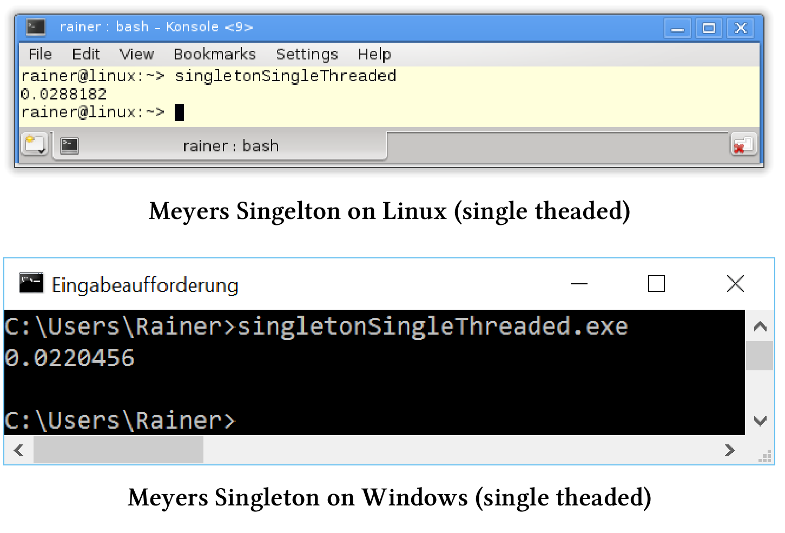

# 單例模式：線程安全的初始化

開始研究之前，說明一下：我個人並不提倡使用單例模式。

> **對於單例模式的看法**
>
> 我只在案例研究中使用單例模式，因為它是以線程安全的方式，初始化變量的典型例子。先來了解一下單例模式的幾個嚴重缺點：
>
> *  單例是一個經過喬裝打扮的全局變量。因此，測試起來非常困難，因為它依賴於全局的狀態。
>* 通過`MySingleton::getInstance()`可以在函數中使用單例，不過函數接口不會說明內部使用了單例，並隱式依賴於對單例。
> * 若將靜態對象`x`和`y`放在單獨的源文件中，並且這些對象的構造方式相互依賴，因為無法保證先初始化哪個靜態對象，將陷入[靜態初始化混亂順序]( https://isocpp.org/wiki/faq/ctors)的情況。這裡要注意的是，單例對象是**靜態對象**。
> * 單例模式是惰性創建對象，但不管理對象的銷燬。如果不銷燬不需要的東西，那就會造成內存洩漏。
> *  試想一下，當子類化單例化，可能實現嗎？這意味著什麼?
> * 想要實現一個線程安全且快速的單例，非常具有挑戰性。
> 
> 關於單例模式的詳細討論，請參閱Wikipedia中有關[單例模式](https://en.wikipedia.org/wiki/Singleton_pattern)的文章。

我想在開始討論單例的線程安全初始化前，先說點別的。

##雙重檢查的鎖定模式

[雙重檢查鎖定](http://www.cs.wustl.edu/~schmidt/PDF/DC-Locking.pdf)模式是用線程安全的方式，初始化單例的經典方法。聽起來像是最佳實踐或模式之類的方法，但更像是一種[反模式](https://en.wikipedia.org/wiki/Anti-pattern)。它假設傳統實現中有相關的保障機制，而Java、C#或C++內存模型不再提供這種保障。這樣，創建單例是原子操作就是一個錯誤的假設，這樣看起來是線程安全的解決方案並不安全。

什麼是雙重檢查鎖定模式？實現線程安全單例的，首先會想到用鎖來保護單例的初始化過程。

```c++
std::mutex myMutex;

class MySingleton {
public:
  static MySingleton& getInstance() {
    std::lock_guard<mutex> myLock(myMutex);
    if (!instance) instance = new MySingleton();
    return *instance;
  }
private:
  MySingleton() = default;
  ~MySingleton() = default;
  MySingleton(const MySingleton&) = delete;
  MySingleton& operator= (const MySingleton&) = delete;
  static MySingleton* instance;
};

MySingleton* MySingleton::instance = nullptr;
```

程序有毛病麼？有毛病：是因為性能損失太大；沒毛病：是因為實現的確線程安全。第7行的鎖會對單例的每次訪問進行保護，這也適用於讀取。不過，構造`MySingleton`之後，就沒有必要讀取了。這裡雙重檢查鎖定模式就發揮了其作用，再看一下`getInstance`函數。

```c++
static MySingleton& getInstance() {
  if (!instance) { // check
    lock_guard<mutex> myLock(myMutex); // lock
    if (!instance) instance = new MySingleton(); // check
  }
  return *instance;
}
```

第2行沒有使用鎖，而是使用指針比較。如果得到一個空指針，則申請鎖的單例(第3行)。因為，可能有另一個線程也在初始化單例，並且到達了第2行或第3行，所以需要額外的指針在第4行進行比較。顧名思義，其中兩次是檢查，一次是鎖定。

牛B不？牛。線程安全？不安全。

問題出在哪裡？第4行中的`instance= new MySingleton()`至少包含三個步驟：

1. 為`MySingleton`分配內存。
2. 初始化`MySingleton`對象。
3. 引用完全初始化的`MySingleton`對象。

能看出問在哪了麼？

C++運行時不能保證這些步驟按順序執行。例如，處理器可能會將步驟重新排序為序列1、3和2。因此，在第一步中分配內存，在第二步中實例引用一個非初始化的單例。如果此時另一個線程`t2`試圖訪問該單例對象並進行指針比較，則比較成功。其結果是線程`t2`引用了一個非初始化的單例，並且程序行為未定義。

## 性能測試

我要測試訪問單例對象的開銷。對引用測試時，使用了一個單例對象，連續訪問4000萬次。當然，第一個訪問的線程會初始化單例對象，四個線程的訪問是併發進行的。我只對性能數字感興趣，因此我彙總了這四個線程的執行時間。使用一個帶範圍(`Meyers Singleton`)的靜態變量、一個鎖`std::lock_guard`、函數`std::call_once`和`std::once_flag`以及具有順序一致和獲取-釋放語義的原子變量進行性能測試。

程序在兩臺電腦上運行。讀過上一節的朋友肯定知道，我的Linux(GCC)電腦上有四個核心，而我的Windows(cl.exe)電腦只有兩個核心，用最大級別的優化來編譯程序。相關設置的詳細信息，參見本章的開頭。

接下來，需要回答兩個問題：

1. 各種單例實現的性能具體是多少?
2. Linux (GCC)和Windows (cl.exe)之間的差別是否顯著?

最後，我會將所有數字彙總到一個表中。

展示各種多線程實現的性能數字前，先來看一下串行的代碼。C++03標準中，`getInstance`方法線程不安全。

```c++
// singletonSingleThreaded.cpp

#include <chrono>
#include <iostream>

constexpr auto tenMill = 10000000;

class MySingLeton {
public:
  static MySingLeton& getInstance() {
    static MySingLeton instance;
    volatile int dummy{};
    return instance;
  }
private:
  MySingLeton() = default;
  ~MySingLeton() = default;
  MySingLeton(const MySingLeton&) = delete;
  MySingLeton& operator=(const MySingLeton&) = delete;

};

int main() {

  constexpr auto fourtyMill = 4 * tenMill;

  const auto begin = std::chrono::system_clock::now();

  for (size_t i = 0; i <= fourtyMill; ++i) {
    MySingLeton::getInstance();
  }

  const auto end = std::chrono::system_clock::now() - begin;

  std::cout << std::chrono::duration<double>(end).count() << std::endl;

}
```

作為參考實現，我使用了以[Scott Meyers]( https://en.wikipedia.org/wiki/Scott_Meyers)命名的Meyers單例。這個實現的優雅之處在於，第11行中的`singleton`對象是一個帶有作用域的靜態變量，實例只初始化一次，而初始化發生在第一次執行靜態方法`getInstance`(第10 - 14行)時。

> 使用volatile聲明變量dummy
>
> 當我用最高級別的優化選項來編譯程序時，編譯器刪除了第30行中的`MySingleton::getInstance()`，因為調用不調用都沒有效果，我得到了非常快的執行，但結果錯誤的性能數字。通過使用`volatile`聲明變量`dummy`(第12行)，明確告訴編譯器不允許優化第30行中的`MySingleton::getInstance()`調用。

下面是單線程用例的性能結果。



C++11中，Meyers單例已經線程安全了。

## 線程安全的Meyers單例

C++11標準中，保證以線程安全的方式初始化具有作用域的靜態變量。Meyers單例使用就是有作用域的靜態變量，這樣就成了！剩下要做的工作，就是為多線程用例重寫Meyers單例。

多線程中的Meyers單例

```c++
// singletonMeyers.cpp

#include <chrono>
#include <iostream>
#include <future>

constexpr auto tenMill = 10000000;

class MySingLeton {
public:
  static MySingLeton& getInstance() {
    static MySingLeton instance;
    volatile int dummy{};
    return instance;
  }
private:
  MySingLeton() = default;
  ~MySingLeton() = default;
  MySingLeton(const MySingLeton&) = delete;
  MySingLeton& operator=(const MySingLeton&) = delete;

};

std::chrono::duration<double> getTime() {

  auto begin = std::chrono::system_clock::now();
  for (size_t i = 0; i <= tenMill; ++i) {
    MySingLeton::getInstance();
  }
  return std::chrono::system_clock::now() - begin;

}

int main() {

  auto fut1 = std::async(std::launch::async, getTime);
  auto fut2 = std::async(std::launch::async, getTime);
  auto fut3 = std::async(std::launch::async, getTime);
  auto fut4 = std::async(std::launch::async, getTime);

  const auto total = fut1.get() + fut2.get() + fut3.get() + fut4.get();

  std::cout << total.count() << std::endl;

}
```

函數`getTime`中使用單例對象(第24 - 32行)，函數由第36 - 39行中的四個promise來執行，相關future的結果彙總在第41行。


我們來看看最直觀的方式——鎖。

## std::lock_guard

`std::lock_guard`中的互斥量，保證了能以線程安全的方式初始化單例對象。

```c++
// singletonLock.cpp

#include <chrono>
#include <iostream>
#include <future>
#include <mutex>

constexpr auto tenMill = 10000000;

std::mutex myMutex;

class MySingleton {
public:
  static MySingleton& getInstance() {
    std::lock_guard<std::mutex> myLock(myMutex);
    if (!instance) {
      instance = new MySingleton();
    }
    volatile int dummy{};
    return *instance;
  }
private:
  MySingleton() = default;
  ~MySingleton() = default;
  MySingleton(const MySingleton&) = delete;
  MySingleton& operator=(const MySingleton&) = delete;

  static MySingleton* instance;
};

MySingleton* MySingleton::instance = nullptr;

std::chrono::duration<double> getTime() {

  auto begin = std::chrono::system_clock::now();
  for (size_t i = 0; i <= tenMill; ++i) {
    MySingleton::getInstance();
  }
  return std::chrono::system_clock::now() - begin;

}

int main() {

  auto fut1 = std::async(std::launch::async, getTime);
  auto fut2 = std::async(std::launch::async, getTime);
  auto fut3 = std::async(std::launch::async, getTime);
  auto fut4 = std::async(std::launch::async, getTime);

  const auto total = fut1.get() + fut2.get() + fut3.get() + fut4.get();

  std::cout << total.count() << std::endl;

}
```

這種方式非常的慢。


線程安全單例模式的下一個場景，基於多線程庫，並結合`std::call_once`和`std::once_flag`。

## 使用std::once_flag的std::call_once

`std::call_once`和`std::once_flag`可以一起使用，以線程安全的方式執行可調用對象。

```c++
// singletonCallOnce.cpp

#include <chrono>
#include <iostream>
#include <future>
#include <mutex>
#include <thread>

constexpr auto tenMill = 10000000;

class MySingleton {
public:
  static MySingleton& getInstance() {
    std::call_once(initInstanceFlag, &MySingleton::initSingleton);
    volatile int dummy{};
    return *instance;
  }
private:
  MySingleton() = default;
  ~MySingleton() = default;
  MySingleton(const MySingleton&) = delete;
  MySingleton& operator=(const MySingleton&) = delete;

  static MySingleton* instance;
  static std::once_flag initInstanceFlag;

  static void initSingleton() {
    instance = new MySingleton;
  }
};

MySingleton* MySingleton::instance = nullptr;
std::once_flag MySingleton::initInstanceFlag;

std::chrono::duration<double> getTime() {

  auto begin = std::chrono::system_clock::now();
  for (size_t i = 0; i <= tenMill; ++i) {
    MySingleton::getInstance();
  }
  return std::chrono::system_clock::now() - begin;

}

int main() {

  auto fut1 = std::async(std::launch::async, getTime);
  auto fut2 = std::async(std::launch::async, getTime);
  auto fut3 = std::async(std::launch::async, getTime);
  auto fut4 = std::async(std::launch::async, getTime);

  const auto total = fut1.get() + fut2.get() + fut3.get() + fut4.get();

  std::cout << total.count() << std::endl;

}
```

下面是具體的性能數字：


繼續使用原子變量來實現線程安全的單例。

## 原子變量

使用原子變量，讓實現變得更具有挑戰性，我甚至可以為原子操作指定內存序。基於前面提到的雙重檢查鎖定模式，實現了以下兩個線程安全的單例。

**順序一致語義**

第一個實現中，使用了原子操作，但沒有顯式地指定內存序，所以默認是順序一致的。

```c++
// singletonSequentialConsistency.cpp

#include <chrono>
#include <iostream>
#include <future>
#include <mutex>
#include <thread>

constexpr auto tenMill = 10000000;

class MySingleton {
public:
  static MySingleton& getInstance() {
    MySingleton* sin = instance.load(); 
    if (!sin) {
      std::lock_guard<std::mutex>myLock(myMutex);
      sin = instance.load(std::memory_order_relaxed);
      if (!sin) {
        sin = new MySingleton();
        instance.store(sin);
      }
    }
    volatile int dummy{};
    return *instance;
  }
private:
  MySingleton() = default;
  ~MySingleton() = default;
  MySingleton(const MySingleton&) = delete;
  MySingleton& operator=(const MySingleton&) = delete;

  static std::atomic<MySingleton*> instance;
  static std::mutex myMutex;
};


std::atomic<MySingleton*> MySingleton::instance;
std::mutex MySingleton::myMutex;

std::chrono::duration<double> getTime() {

  auto begin = std::chrono::system_clock::now();
  for (size_t i = 0; i <= tenMill; ++i) {
    MySingleton::getInstance();
  }
  return std::chrono::system_clock::now() - begin;

}

int main() {

  auto fut1 = std::async(std::launch::async, getTime);
  auto fut2 = std::async(std::launch::async, getTime);
  auto fut3 = std::async(std::launch::async, getTime);
  auto fut4 = std::async(std::launch::async, getTime);

  const auto total = fut1.get() + fut2.get() + fut3.get() + fut4.get();

  std::cout << total.count() << std::endl;

}
```

與雙重檢查鎖定模式不同，由於原子操作的默認是順序一致的，現在可以保證第19行中的`sin = new MySingleton()`出現在第20行`instance.store(sin)`之前。看一下第17行：`sin = instance.load(std::memory_order_relax)`，因為另一個線程可能會在第14行第一個load和第16行鎖的使用之間，介入並更改instance的值，所以這裡的load是必要的。


我們進一步的對程序進行優化。

**獲取-釋放語義**

仔細看看之前使用原子實現單例模式的線程安全實現。第14行中單例的加載(或讀取)是一個獲取操作，第20行中存儲(或寫入)是一個釋放操作。這兩種操作都發生在同一個原子上，所以不需要順序一致。C++11標準保證釋放與獲取操作在同一原子上同步，並建立順序約束。也就是，釋放操作之後，不能移動之前的所有讀和寫操作，並且在獲取操作之前不能移動之後的所有讀和寫操作。

這些都是實現線程安全單例的最低保證。

```c++
// singletonAcquireRelease.cpp

#include <chrono>
#include <iostream>
#include <future>
#include <mutex>
#include <thread>

constexpr auto tenMill = 10000000;

class MySingleton {
public:
  static MySingleton& getInstance() {
    MySingleton* sin = instance.load(std::memory_order_acquire);
    if (!sin) {
      std::lock_guard<std::mutex>myLock(myMutex);
      sin = instance.load(std::memory_order_release);
      if (!sin) {
        sin = new MySingleton();
        instance.store(sin);
      }
    }
    volatile int dummy{};
    return *instance;
  }
private:
  MySingleton() = default;
  ~MySingleton() = default;
  MySingleton(const MySingleton&) = delete;
  MySingleton& operator=(const MySingleton&) = delete;

  static std::atomic<MySingleton*> instance;
  static std::mutex myMutex;
};


std::atomic<MySingleton*> MySingleton::instance;
std::mutex MySingleton::myMutex;

std::chrono::duration<double> getTime() {

  auto begin = std::chrono::system_clock::now();
  for (size_t i = 0; i <= tenMill; ++i) {
    MySingleton::getInstance();
  }
  return std::chrono::system_clock::now() - begin;

}

int main() {

  auto fut1 = std::async(std::launch::async, getTime);
  auto fut2 = std::async(std::launch::async, getTime);
  auto fut3 = std::async(std::launch::async, getTime);
  auto fut4 = std::async(std::launch::async, getTime);

  const auto total = fut1.get() + fut2.get() + fut3.get() + fut4.get();

  std::cout << total.count() << std::endl;

}
```

獲取-釋放語義與順序一致內存序有相似的性能。


x86體系結構中這並不奇怪，這兩個內存順序非常相似。我們可能會在[ARMv7](https://en.wikipedia.org/wiki/ARM_architecture)或[PowerPC架構](https://en.wikipedia.org/wiki/PowerPC)上的看到性能數字上的明顯差異。對這方面比較感興趣的話，可以閱讀Jeff Preshings的博客[Preshing on Programming](http://preshing.com)，那裡有更詳細的內容。

##各種線程安全單例實現的性能表現總結

數字很明確，Meyers 單例模式是最快的。它不僅是最快的，也是最容易實現的。如預期的那樣，Meyers單例模式比原子模式快兩倍。鎖的量級最重，所以最慢。`std::call_once`在Windows上比在Linux上慢得多。

| 操作系統(編譯器) | 單線程 | Meyers單例 | `std::lock_guard` | `std::call_once` | 順序一致 | 獲取-釋放語義 |
| :--------------: | :----: | :--------: | :---------------: | :--------------: | :------: | :-----------: |
|    Linux(GCC)    |  0.03  |    0.04    |       12.48       |       0.22       |   0.09   |     0.07      |
| Windows(cl.exe)  |  0.02  |    0.03    |       15.48       |       1.74       |   0.07   |     0.07      |

關於這些數字，我想強調一點：這是四個線程的性能總和。因為Meyers單例模式幾乎與單線程實現一樣快，所以併發Meyers單例模式具有最佳的性能。